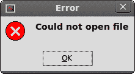
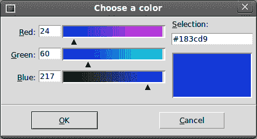
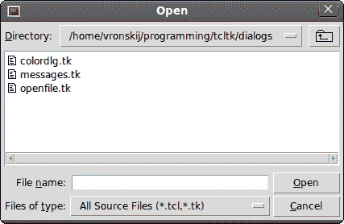

# Tcl / Tk 中的对话框

> 原文： [http://zetcode.com/gui/tcltktutorial/dialogs/](http://zetcode.com/gui/tcltktutorial/dialogs/)

在 Tcl / Tk 教程的这一部分中，我们将使用对话框。

对话框窗口或对话框是大多数现代 GUI 应用程序必不可少的部分。 对话被定义为两个或更多人之间的对话。 在计算机应用程序中，对话框是一个窗口，用于与应用程序“对话”。 对话框用于输入数据，修改数据，更改应用程序设置等。对话框是用户与计算机程序之间进行通信的重要手段。

## 消息框

消息框是方便的对话框，可向应用程序的用户提供消息。 该消息由文本和图像数据组成。 用`tk_messageBox`命令创建 Tk 中的消息框。

```
#!/usr/bin/wish

# ZetCode Tcl/Tk tutorial
#
# In this program, we show various
# message boxes.
#
# author: Jan Bodnar
# last modified: March 2011
# website: www.zetcode.com

frame .fr
pack .fr 

ttk::button .fr.erButton -text Error -command onError
grid .fr.erButton 
ttk::button .fr.wButton -text Warning -command onWarn
grid .fr.wButton -row 1 -column 0 
ttk::button .fr.queButton -text Question -command onQuest
grid .fr.queButton -row 0 -column 1 -sticky we -columnspan 6
ttk::button .fr.infButton -text Information -command onInfo
grid .fr.infButton -row 1 -column 1

proc onError {} {
    tk_messageBox -type ok -icon error -title Error \
    -message "Could not open file"
}

proc onWarn {} {
    tk_messageBox -type ok -icon warning -title Warning \
    -message "Deprecated function call"
}

proc onQuest {} {
    tk_messageBox -type ok -icon question -title Question \
    -message "Are you sure to quit?"
}

proc onInfo {} {
    tk_messageBox -type ok -icon info -title Information \
    -message "Download completed"
}

wm title . "message boxes" 
wm geometry . 300x150+300+300

```

我们使用网格管理器来设置四个按钮的网格。 每个按钮显示一个不同的消息框。

```
ttk::button .fr.erButton -text Error -command onError
grid .fr.erButton 

```

我们创建一个错误按钮，它调用 onError 过程。 在方法内部，我们显示错误消息对话框。 该按钮将放置在网格的第一个单元格中。 `ttk`名称空间内的小部件为主题。 就功能而言，`button`和`ttk::button`是相同的按钮。 不同之处在于我们可以将主题应用于后者。

```
proc onError {} {
    tk_messageBox -type ok -icon error -title Error \
    -message "Could not open file"
}

```

如果按下错误按钮，则会显示错误对话框。 我们使用`tk_messageBox`命令创建消息框。 `-type`选项指定对话框中显示哪些按钮。 在我们的情况下，这是一个确定按钮。 `-icon`指定要显示的图标的类型。 `-title`提供对话框的标题，`-message`提供消息。



Figure: Warning message dialog

## 颜色选择器

颜色选择器是用于选择颜色的对话框。 我们使用`tk_chooseColor`命令显示对话框。

```
#!/usr/bin/wish

# ZetCode Tcl/Tk tutorial
#
# In this script, we use tk_chooseColor
# dialog to change the colour of the text.
#
# author: Jan Bodnar
# last modified: March 2011
# website: www.zetcode.com

label .l -text ZetCode
place .l -x 20 -y 90

button .b -text "Choose a color..." \
        -command "onSelect .l" 
place .b -x 20 -y 30

wm title . "color dialog" 
wm geometry . 350x200+300+300

proc onSelect {widget} {
    set col \
        [tk_chooseColor -title "Choose a color" -parent .]
    $widget configure -foreground $col
}

```

我们有一个按钮和一个标签。 单击按钮，我们显示一个颜色选择器对话框。 我们将通过从对话框中选择一种颜色来更改标签文本的颜色。

```
label .l -text ZetCode
place .l -x 20 -y 90

```

我们创建一个`label`小部件并将其放在窗口中。

```
button .b -text "Choose a color..." \
        -command "onSelect .l" 
place .b -x 20 -y 30

```

我们创建一个`button`小部件并将其放在窗口中。 我们将标签的窗口小部件路径传递给`onSelect`过程，该过程显示对话框并更改标签的颜色。

```
proc onSelect {widget} {
    set col \
        [tk_chooseColor -title "Choose a color" -parent .]
    $widget configure -foreground $col
}

```

在`onSelect`程序内部，我们显示对话框并更改标签颜色。 首先，我们显示对话框并将所选的颜色值存储在`col`变量中。 稍后，我们使用`configure`命令更改标签的前景。 该命令在小部件的路径名上执行。 标签的路径名已传递给过程。



Figure: Color chooser

## 文件对话框

`tk_getOpenFile`对话框允许用户从文件系统中选择文件。

```
#!/usr/bin/wish

# ZetCode Tcl/Tk tutorial
#
# In this program, we use the
# tk_getOpenFile dialog to select a file from
# a filesystem.
#
# author: Jan Bodnar
# last modified: March 2011
# website: www.zetcode.com

set types {
    {"All Source Files"     {.tcl .tk } }
    {"Image Files"          {.gif .png .jpg} }
    {"All files"            *}
}

proc onSelect { label } {
    global types   
    set file [tk_getOpenFile -filetypes $types -parent .]
    $label configure -text $file
}

label .l -text "..."
place .l -x 20 -y 90

button .b -text "Select a file" \
        -command "onSelect .l"
place .b -x 20 -y 30

wm title . "openfile" 
wm geometry . 350x200+300+300

```

在我们的代码示例中，我们使用`tk_getOpenFile`对话框选择一个文件，并在`label`小部件中显示其名称。

```
set types {
    {"All Source Files"     {.tcl .tk } }
    {"Image Files"          {.gif .png .jpg} }
    {"All files"            *}
}

```

这些是文件过滤器。 这些过滤器可用于仅显示对话框中的特定文件。

```
proc onSelect { label } {
    global types   
    set file [tk_getOpenFile -filetypes $types -parent .]
    $label configure -text $file
}

```

我们使用`tk_getOpenFile`命令显示对话框。 我们使用`-filetypes`选项应用文件过滤器。 所选文件名存储在 file 变量中。 `configure`命令用于更改标签的文本。



Figure: tk_getOpenFile

在 Tcl / Tk 教程的这一部分中，我们使用了对话框窗口。