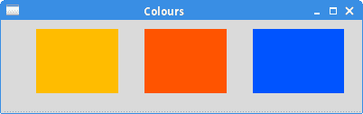
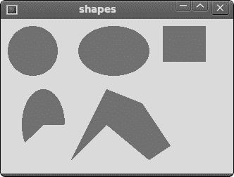
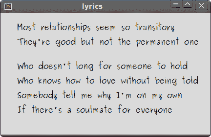

# 以 Tcl / Tk 绘图

> 原文： [http://zetcode.com/gui/tcltktutorial/drawing/](http://zetcode.com/gui/tcltktutorial/drawing/)

在 Tcl / Tk 教程的这一部分中，我们将做一些绘图。 在`canvas`小部件上完成 Tk 的绘制。 画布是 Tk 中图形的高级工具。

它可以用于创建图表，自定义窗口小部件或创建游戏。

## 色彩

颜色是代表红色，绿色和蓝色（RGB）强度值的组合的对象。

```
#!/usr/bin/wish

# ZetCode Tcl Tk tutorial
#
# This program draws three
# rectangles filled with different
# colours.
#
# author: Jan Bodnar
# last modified: March 2011
# website: www.zetcode.com

canvas .can
.can create rect 30 10 120 80 \
    -outline #fb0 -fill #fb0
.can create rect 150 10 240 80 \
    -outline #f50 -fill #f50
.can create rect 270 10 370 80 \
    -outline #05f -fill #05f       
pack .can 

wm title . "Colours" 
wm geometry . 400x100+300+300

```

在代码示例中，我们绘制了三个矩形，并用不同的颜色值填充了它们。

```
canvas .can

```

我们创建`canvas`小部件。

```
.can create rect 30 10 120 80 \
    -outline #fb0 -fill #fb0

```

使用`create`命令，我们在画布上创建一个新的矩形项目。 前四个参数是两个边界点的 x，y 坐标：左上角和右下角。 使用`-outline`选项，我们可以控制矩形轮廓的颜色。 同样，`-fill`选项为矩形的内部提供颜色。



Figure: Colours

## 形状

我们可以在画布上绘制各种形状。 以下代码示例将显示其中的一些。

```
#!/usr/bin/wish

# ZetCode Tcl/Tk tutorial
#
# In this script, we draw basic 
# shapes on the canvas.
#
# author: Jan Bodnar
# last modified: March 2011
# website: www.zetcode.com

canvas .can
.can create oval 10 10 80 80 -outline #777 \
    -fill #777 
.can create oval 110 10 210 80 -outline #777 \
    -fill #777 
.can create rect 230 10 290 60 -outline #777 \
    -fill #777 
.can create arc 30 200 90 100 -start 0 -extent 210 \
    -outline #777 -fill #777 

set points  [ list 150 100 200 120 240 180 210 \
    200 150 150 100 200 ]
.can create polygon $points -outline #777 \
    -fill #777 
pack .can

wm title . "shapes" 
wm geometry . 330x220+300+300

```

我们在窗口上绘制五个不同的形状：一个圆形，一个椭圆形，一个矩形，一个弧形和一个多边形。 轮廓和内部以相同的灰色绘制。

```
.can create oval 10 10 80 80 -outline #777 \
    -fill #777 

```

`create oval`创建一个圆。 前四个参数是圆的边界框坐标。 换句话说，它们是在其中绘制圆的框的左上和右下点的 x，y 坐标。

```
.can create rect 230 10 290 60 -outline #777 \
    -fill #777

```

我们创建一个矩形项目。 坐标还是要绘制的矩形的边界框。

```
.can create arc 30 200 90 100 -start 0 -extent 210 \
    -outline #777 -fill #777 

```

该代码行创建了一条弧。 圆弧是圆的圆周的一部分。 我们提供边界框。 `-start`选项是圆弧的起始角度。 `-extent`是角度大小。

```
set points  [ list 150 100 200 120 240 180 210 \
    200 150 150 100 200 ]
.can create polygon $points -outline #777 \
    -fill #777 

```

创建一个多边形。 它是具有多个角的形状。 要在 Tk 中创建多边形，我们向`create polygon`命令提供了多边形坐标列表。



Figure: shapes

## 绘图图像

在以下示例中，我们将在画布上创建一个图像项。

```
#!/usr/bin/wish

# ZetCode Tcl/Tk tutorial
#
# This program draws an image
# on the canvas widget.
#
# author: Jan Bodnar
# last modified: March 2011
# website: www.zetcode.com

package require Img

image create photo img -file "tatras.jpg"
set height [image height img]
set width [image width img]

canvas .can -height $height -width $width
.can create image 0 0 -anchor nw -image img
pack .can

wm title . "High Tatras" 
wm geometry . +300+300

```

我们在画布上显示图像。

```
image create photo img -file "tatras.jpg"

```

我们从位于当前工作目录中的 JPG 图像创建照片图像。

```
set height [image height img]
set width [image width img]

```

我们得到图像的高度和宽度。

```
canvas .can -height $height -width $width

```

我们创建`canvas`小部件。 它考虑了图像的大小。

```
.can create image 0 0 -anchor nw -image img

```

我们使用`create image`命令在画布上创建一个图像项。 为了显示整个图像，它固定在北部和西部。 `-image`选项提供要显示的照片图像。

## 绘图文字

在最后一个示例中，我们将在窗口上绘制文本。

```
#!/usr/bin/wish

# ZetCode Tcl/Tk tutorial
#
# In this script, we draw text
# on the window.
#
# author: Jan Bodnar
# last modified: March 2011
# website: www.zetcode.com

canvas .can
.can create text 10 30 -anchor w -font Purisa \
    -text "Most relationships seem so transitory"
.can create text 10 60 -anchor w -font Purisa \
    -text "They're good but not the permanent one"
.can create text 10 110 -anchor w -font Purisa \
    -text "Who doesn't long for someone to hold"
.can create text 10 140 -anchor w -font Purisa \
    -text "Who knows how to love without being told"
.can create text 10 170 -anchor w -font Purisa \
    -text "Somebody tell me why I'm on my own"
.can create text 10 200 -anchor w -font Purisa \
     -text "If there's a soulmate for everyone"        
pack .can

wm title . "lyrics" 
wm geometry . 430x250+300+300

```

我们在窗口上画一首歌的歌词。

```
.can create text 10 30 -anchor w -font Purisa \
    -text "Most relationships seem so transitory"

```

前两个参数是文本中心点的 x，y 坐标。 如果我们将文本项锚定在西方，则文本将从该位置开始。 `-font`选项提供文本的字体，而-text 选项是要显示的文本。



Figure: Drawing text

在 Tcl / Tk 教程的这一部分中，我们做了一些绘图。