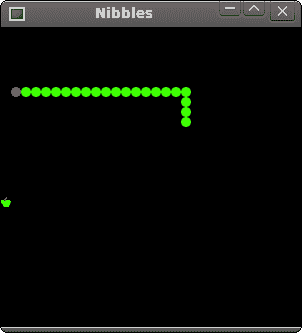

# 贪食蛇

> 原文： [http://zetcode.com/gui/tcltktutorial/nibbles/](http://zetcode.com/gui/tcltktutorial/nibbles/)

在 Tcl/Tk 教程的这一部分中，我们将创建一个贪食蛇游戏克隆。

贪食蛇是较旧的经典视频游戏。 它最初是在 70 年代后期创建的。 后来它被带到 PC 上。 在这个游戏中，玩家控制蛇。 目的是尽可能多地吃苹果。 蛇每次吃一个苹果，它的身体就会长大。 蛇必须避开墙壁和自己的身体。

## 开发

蛇的每个关节的大小为 10px。 蛇由光标键控制。 最初，蛇具有三个关节。 游戏立即开始。 游戏结束后，我们在窗口中心显示“`Game Over`”消息。

我们使用`canvas`小部件来创建游戏。 游戏中的对象是图像。 我们使用画布命令创建图像项。 我们使用画布命令使用标签在画布上查找项目并进行碰撞检测。

```tcl
#!/usr/bin/wish

# ZetCode Tcl/Tk tutorial
#
# This is simple Nibbles game clone.
#
# author: Jan Bodnar
# last modified: March 2011
# website: www.zetcode.com

package require Img

set WIDTH 300
set HEIGHT 300
set DELAY 100
set DOT_SIZE 10
set ALL_DOTS [expr $WIDTH * $HEIGHT / ($DOT_SIZE * $DOT_SIZE)]
set RAND_POS 27

canvas .c -width $WIDTH -height $HEIGHT -background black
pack .c 

proc initGame {} {

    set ::left false        
    set ::right true
    set ::up false
    set ::down false
    set ::inGame true
    set dots 3
    set ::apple_x 100
    set ::apple_y 190

    for {set i 0} {$i<$dots} {incr i} {
        set x($i) [expr 50 - $i * 10]
        set y($i) 50
    }

    set ::idot [image create photo img1 -file "dot.png"]
    set ::ihead [image create photo img2  -file "head.png"]
    set ::iapple [image create photo img3 -file "apple.png"]

    createObjects
    locateApple

    bind . "<Key>" "onKeyPressed %K"        

    after $::DELAY onTimer
}

proc createObjects {} {

    .c create image $::apple_x $::apple_y \
        -image $::iapple -tag apple -anchor nw
    .c create image 50 50 -image $::ihead -tag head -anchor nw
    .c create image 30 50 -image $::idot -tag dot -anchor nw
    .c create image 40 50 -image $::idot -tag dot -anchor nw
}

proc checkApple {} {

    set apple [.c find withtag apple]
    set head [.c find withtag head]

    set l [.c bbox head]
    set overlap [eval .c find overlapping $l]

    foreach over $overlap {

        if {$over == $apple} {
            set crd [.c coords $apple]
            set x [lindex $crd 0]
            set y [lindex $crd 1]
            .c create image $x $y -image $::idot -anchor nw -tag dot
            locateApple
        }
    }
}

proc doMove {} {

    set dots [.c find withtag dot]      
    set head [.c find withtag head]
    set items [concat $dots $head]                

    set z 0    

    while {$z < [expr [llength $items] - 1]} {

        set c1 [.c coords [lindex $items $z]]
        set c2 [.c coords [lindex $items [expr $z+1]]]

        .c move [lindex $items $z] [expr [lindex $c2 0]  - [lindex $c1 0] ] \
            [expr [lindex $c2 1]  - [lindex $c1 1] ]
        incr z 
    }

    if { [string compare $::left true] == 0} {
        .c move head -$::DOT_SIZE 0
    }

    if {[string compare $::right true] == 0} {
        .c move head $::DOT_SIZE 0
    }

    if {[string compare $::up true] == 0} {
        .c move head 0 -$::DOT_SIZE
    }

    if {[string compare $::down true] == 0} {
        .c move head 0 $::DOT_SIZE 
    }      
}

proc checkCollisions {} {

    set dots [.c find withtag dot]      
    set head [.c find withtag head]

    set l [.c bbox head]
    set overlap [eval .c find overlapping $l]    

    foreach dot $dots {

        foreach over $overlap {
            if {$over == $dot} {
                 set ::inGame false
            }
        }
    }

    set x1 [lindex $l 0]
    set y1 [lindex $l 1]

    if {$x1 < 0} {
         set ::inGame false
    }

    if {$x1 > [expr $::WIDTH - $::DOT_SIZE]} {
         set ::inGame false
    }

    if {$y1 < 0} {
        set ::inGame false
    }

    if {$y1 > [expr $::HEIGHT - $::DOT_SIZE]} {
        set ::inGame false
    }
}

proc locateApple {} {

    set apple [.c find withtag apple]
    .c delete lindex apple 0     

    set r [expr round(rand() * $::RAND_POS)]
    set ::apple_x [expr $r * $::DOT_SIZE]
    set r [expr round(rand() * $::RAND_POS)]
    set ::apple_y [expr $r * $::DOT_SIZE]

    .c create image $::apple_x $::apple_y -anchor nw \
        -image $::iapple -tag apple     
}

proc onKeyPressed {key} {

    set a1 [ expr [string compare $key Left] == 0]
    set a2 [ expr [string compare $::right true] != 0]

    if { $a1 && $a2 } {

        set ::left true
        set ::up false
        set ::down false
    }

    set b1 [ expr [string compare $key Right] == 0]
    set b2 [ expr [string compare $::left true] != 0]

    if {  $b1 && $b2 } {

        set ::right true
        set ::up false
        set ::down false
    }

    set c1 [ expr [string compare $key Up] == 0]
    set c2 [ expr [string compare $::down true] != 0]

    if { $c1 && $c2 } {

        set ::up true
        set ::left false
        set ::right false
    }

    set d1 [ expr [string compare $key Down] == 0]
    set d2 [ expr [string compare $::up true] != 0]

    if { $d1 && $d2 }  {

        set ::down true
        set ::left false
        set ::right false
    }
}

proc onTimer {} {

    if {$::inGame} {
        checkCollisions
        checkApple
        doMove
        after $::DELAY onTimer    
    } else {
        gameOver
    }
}

proc gameOver {} {

   .c delete all

   set x [ expr [winfo width .] / 2 ]
   set y [ expr [winfo height .] / 2]

   .c create text $x $y  -text "Game over" -fill white
}

initGame

wm title . "Nibbles" 
wm geometry . +150+150

```

首先，我们将定义一些在游戏中使用的常量。

`WIDTH`和`HEIGHT`常数确定电路板的大小。 `DELAY`常数确定游戏的速度。 `DOT_SIZE`是苹果的大小和蛇的点。 `ALL_DOTS`常数定义了板上可能的最大点数。 `RAND_POS`常数用于计算苹果的随机位置。

`initGame`过程初始化变量，加载图像并启动超时过程。

```tcl
set ::idot [image create photo img1 -file "dot.png"]
set ::ihead [image create photo img2  -file "head.png"]
set ::iapple [image create photo img3 -file "apple.png"]

```

在这些行中，我们加载图像。 “半字节”游戏中有三个图像。 头，圆点和苹果。

```tcl
createObjects
locateApple

```

`createObjects`过程在画布上创建项目。 `locateApple`在画布上随机放置一个苹果。

```tcl
bind . "<Key>" "onKeyPressed %K"

```

我们将键盘事件绑定到`onKeyPressed`过程。 游戏由键盘光标键控制。 `%K`是所按下键的 Tk 符号名称。 它被传递到`onKeyPressed`过程。

```tcl
proc createObjects {} {

    .c create image $::apple_x $::apple_y \
        -image $::iapple -tag apple -anchor nw
    .c create image 50 50 -image $::ihead -tag head -anchor nw
    .c create image 30 50 -image $::idot -tag dot -anchor nw
    .c create image 40 50 -image $::idot -tag dot -anchor nw
}

```

在`createObjects`过程中，我们在画布上创建游戏对象。 这些是帆布物品。 它们被赋予初始的 x，y 坐标。 `-image`选项提供要显示的图像。 `-anchor`选项设置为`nw`； 这样，画布项目的坐标就是项目的左上角。 如果我们希望能够在根窗口的边框旁边显示图像，这很重要。 如果您不理解我们的意思，请尝试删除锚点选项。 `-tag`选项用于识别画布上的项目。 一个标签可用于多个画布项目。

`checkApple`过程检查蛇是否击中了苹果对象。 如果是这样，我们添加另一个蛇形接头并称为`locateApple`。

```tcl
set apple [.c find withtag apple]
set head [.c find withtag head]

```

`find withtag`命令使用其标签在画布上找到一个项目。 我们需要两个项目。 蛇和苹果的头。

```tcl
set l [.c bbox head]
set overlap [eval .c find overlapping $l]

```

`bbox`命令返回项目的边界框点。 `find overlapping`命令查找给定坐标的冲突项。

```tcl
foreach over $overlap {

    if {$over == $apple} {
        set crd [.c coords $apple]
        set x [lindex $crd 0]
        set y [lindex $crd 1]
        .c create image $x $y -image $::idot -anchor nw -tag dot
        locateApple
    }
}

```

如果苹果与头部碰撞，我们将在苹果对象的坐标处创建一个新的点项目。 我们调用`locateApple`过程，该过程将从画布上删除旧的苹果项目，然后创建并随机放置一个新的项目。

在`doMove`过程中，我们有了游戏的密钥算法。 要了解它，请看一下蛇是如何运动的。 您控制蛇的头。 您可以使用光标键更改其方向。 其余关节在链上向上移动一个位置。 第二关节移动到第一个关节的位置，第三关节移动到第二个关节的位置，依此类推。

```tcl
set z 0    

while {$z < [expr [llength $items] - 1]} {

    set c1 [.c coords [lindex $items $z]]
    set c2 [.c coords [lindex $items [expr $z+1]]]

    .c move [lindex $items $z] [expr [lindex $c2 0]  - [lindex $c1 0] ] \
        [expr [lindex $c2 1]  - [lindex $c1 1] ]
    incr z 
}

```

该代码将关节向上移动。

```tcl
if { [string compare $::left true] == 0} {
    .c move head -$::DOT_SIZE 0
}

```

将头向左移动。

在`checkCollisions`程序中，我们确定蛇是否击中了自己或撞墙之一。

```tcl
set l [.c bbox head]
set overlap [eval .c find overlapping $l]    

foreach dot $dots {

    foreach over $overlap {
        if {$over == $dot} {
              set ::inGame false
        }
    }
}

```

如果蛇用头撞到关节之一，我们就结束游戏。

```tcl
if {$y1 > [expr $::HEIGHT - $::DOT_SIZE]} {
    set ::inGame false
}

```

如果蛇击中了棋盘的底部，我们将结束游戏。

`locateApple`过程会在板上随机找到一个新苹果，然后删除旧的苹果。

```tcl
set apple [.c find withtag apple]
.c delete lindex apple 0  

```

在这里，我们找到并删除了被蛇吃掉的苹果。

```tcl
set r [expr round(rand() * $::RAND_POS)]

```

我们得到一个从 0 到`RAND_POS-1`的随机数。

```tcl
set ::apple_x [expr $r * $::DOT_SIZE]
...
set ::apple_y [expr $r * $::DOT_SIZE]

```

这些行设置了`apple`对象的 x，y 坐标。

在`onKeyPressed`程序中，我们确定所按下的键。

```tcl
set a1 [ expr [string compare $key Left] == 0]
set a2 [ expr [string compare $::right true] != 0]

if { $a1 && $a2 } {

    set ::left true
    set ::up false
    set ::down false
    }

```

如果按左光标键，则将`left`变量设置为`true`。 在`doMove`过程中使用此变量来更改蛇对象的坐标。 还要注意，当蛇向右行驶时，我们不能立即向左转。

```tcl
proc onTimer {} {

    if {$::inGame} {
        checkCollisions
        checkApple
        doMove
        after $::DELAY onTimer    
    } else {
        gameOver
    }
}

```

每`DELAY` ms，将调用`onTimer`过程。 如果我们参与了游戏，我们将调用三个构建游戏逻辑的过程。 否则，游戏结束。 计时器基于`after`命令，该命令仅在`DELAY` ms 之后调用一次过程。 要重复调用计时器，我们递归调用`onTimer`过程。

```tcl
proc gameOver {} {

   .c delete all

   set x [ expr [winfo width .] / 2 ]
   set y [ expr [winfo height .] / 2]

   .c create text $x $y  -text "Game over" -fill white
}

```

如果游戏结束，我们将删除画布上的所有项目。 然后，在屏幕中央绘制“游戏结束”。



图：贪食蛇

这是用 Tcl/Tk 创建的贪食蛇电脑游戏。