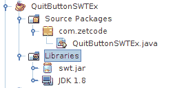
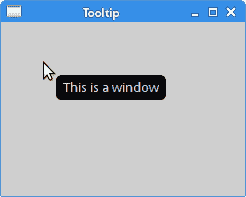
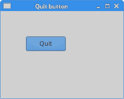

# Java SWT 简介

> 原文： [http://zetcode.com/gui/javaswt/introduction/](http://zetcode.com/gui/javaswt/introduction/)

在 Java SWT 编程教程的这一部分中，我们介绍 Java SWT 库并创建我们的第一个程序。

本教程的目的是帮助您开始使用 Java SWT 工具包。 可以在此处下载本教程中使用的图像。 我使用了 Gnome 项目的探戈图标包中的一些图标。

## 关于

标准窗口小部件工具箱（SWT）是用于 Java 编程语言的图形窗口小部件工具箱。 它最初是由 IBM 开发的。 它是 Swing 和 JavaFX 的替代方法。 SWT 使用 Winapi 和 GTK+ 等本机 GUI API 通过 Java 本机接口（JNI）创建其小部件。

## 构建 SWT 应用

在 NetBeans 下，我们从官方网站下载了 SWT 程序包，并将`swt.jar`添加到项目库中。



Figure: Adding swt.jar to the NetBeans project

对于 Eclipse，我们右键单击项目，然后选择“构建路径”，“配置构建路径”。 我们单击添加外部 JAR ...按钮，然后选择平台特定的 JAR 文件。

## 使窗口居中

在第一个示例中，我们创建一个简单的窗口。 窗口在屏幕上居中。

`CenterWindowEx.java`

```
package com.zetcode;

import org.eclipse.swt.graphics.Point;
import org.eclipse.swt.graphics.Rectangle;
import org.eclipse.swt.widgets.Display;
import org.eclipse.swt.widgets.Shell;

/**
 * ZetCode Java SWT tutorial
 *
 * In this program, we show a window in
 * the center of the screen
 *
 * Author: Jan Bodnar
 * Website: zetcode.com
 * Last modified: May 2015
 */

public class CenterWindowEx {

    public CenterWindowEx(Display display) {

        Shell shell = new Shell(display);
        shell.setText("Center");
        shell.setSize(250, 200);

        centerWindow(shell);

        shell.open();

        while (!shell.isDisposed()) {
          if (!display.readAndDispatch()) {
            display.sleep();
          }
        }
    }

    private void centerWindow(Shell shell) {

        Rectangle bds = shell.getDisplay().getBounds();

        Point p = shell.getSize();

        int nLeft = (bds.width - p.x) / 2;
        int nTop = (bds.height - p.y) / 2;

        shell.setBounds(nLeft, nTop, p.x, p.y);
    }

    @SuppressWarnings("unused")
    public static void main(String[] args) {

        Display display = new Display();
        CenterWindowEx ex = new CenterWindowEx(display);
        display.dispose();
    }
}

```

本示例在屏幕中央显示一个 250x200 像素的窗口。 在每个 SWT 应用中，都有两个重要的类：`Display`和`Shell`。 `Display`是 SWT 与基础 OS 之间的连接。 它实现了事件循环并提供了有关操作系统的信息。 `Shell`代表一个窗口。 有顶级的外壳； 这些将`Display`作为父项。 其他外壳称为辅助外壳。

```
Shell shell = new Shell(display);

```

创建一个顶层窗口。

```
shell.setText("Center");

```

我们使用`setText()`方法为窗口设置标题。

```
shell.setSize(250, 200);

```

在这里，我们为外壳设置大小。

```
shell.open();

```

窗口显示在屏幕上。

```
while (!shell.isDisposed()) {
  if (!display.readAndDispatch()) {
    display.sleep();
  }
}

```

这些行启动事件 mainloop。

```
Rectangle bds = shell.getDisplay().getBounds();

```

我们得到屏幕的分辨率。 如果使用多个显示器，则可能需要调用`getMonitor()`方法而不是`getDisplay()`。

```
int nLeft = (bds.width - p.x) / 2;
int nTop = (bds.height - p.y) / 2;

```

我们计算窗口的左坐标和顶坐标。

```
shell.setBounds(nLeft, nTop, p.x, p.y);

```

我们使用`setBounds()`方法设置壳的边界。

```
Display display = new Display();

```

创建了`Display`。

```
CenterWindowEx ex = new CenterWindowEx(display);

```

我们实例化示例程序。

```
display.dispose();

```

应用终止后，我们释放操作系统资源。

## 创建工具提示

第二个示例显示了一个工具提示。 工具提示是一个小的矩形窗口，它提供有关对象的简短信息。 它通常是一个 GUI 组件。 它是应用帮助系统的一部分。

`TooltipEx.java`

```
package com.zetcode;

import org.eclipse.swt.SWT;
import org.eclipse.swt.widgets.Display;
import org.eclipse.swt.widgets.Shell;

/**
 * ZetCode Java SWT tutorial
 *
 * In this program, we show a tooltip.
 * 
 * Author: Jan Bodnar
 * Website: zetcode.com
 * Last modified: May 2015
 */

public class TooltipEx {

    public TooltipEx(Display display) {

        initUI(display);
    }

    private void initUI(Display display) {

        Shell shell = new Shell(display, SWT.SHELL_TRIM | SWT.CENTER);

        shell.setText("Tooltip");
        shell.setToolTipText("This is a window");
        shell.setSize(250, 200);

        shell.open();

        while (!shell.isDisposed()) {
          if (!display.readAndDispatch()) {
            display.sleep();
          }
        }               
    }

    @SuppressWarnings("unused")
    public static void main(String[] args) {

        Display display = new Display();
        TooltipEx ex = new TooltipEx(display);
        display.dispose();
    }
}

```

该示例创建一个窗口。 如果将鼠标指针悬停在窗口区域上方，则会弹出一个工具提示。

```
Shell shell = new Shell(display, SWT.SHELL_TRIM | SWT.CENTER);

```

style 参数指定外壳的行为。 传递`SWT.CENTER`选项可使外壳位于窗口的中心。 `SWT.SHELL_TRIM`在窗口上装饰。 它启用标题和标题栏按钮，并使窗口可调整大小。 这是外壳的默认样式。

```
shell.setToolTipText("This is a window");

```

此行为窗口创建工具提示。



Figure: Tooltip

## 退出按钮

在本节的最后一个示例中，我们将创建一个退出按钮。 当我们按下此按钮时，应用终止。

`QuitButtonEx.java`

```
package com.zetcode;

import org.eclipse.swt.SWT;
import org.eclipse.swt.events.SelectionAdapter;
import org.eclipse.swt.events.SelectionEvent;
import org.eclipse.swt.layout.RowData;
import org.eclipse.swt.layout.RowLayout;
import org.eclipse.swt.widgets.Button;
import org.eclipse.swt.widgets.Display;
import org.eclipse.swt.widgets.Shell;

/**
 * ZetCode Java SWT tutorial
 *
 * This example shows a button on a window. 
 * Clicking on the button, we terminate
 * the application.
 *
 * Author: Jan Bodnar 
 * Website: zetcode.com 
 * Last modified: May 2015
 */

public class QuitButtonEx {

    public QuitButtonEx(Display display) {

        initUI(display);
    }

    private void initUI(Display display) {

        Shell shell = new Shell(display, SWT.SHELL_TRIM | SWT.CENTER);

        RowLayout layout = new RowLayout();
        layout.marginLeft = 50;
        layout.marginTop = 50;
        shell.setLayout(layout);

        Button quitBtn = new Button(shell, SWT.PUSH);
        quitBtn.setText("Quit");
        quitBtn.setLayoutData(new RowData(80, 30));

        quitBtn.addSelectionListener(new SelectionAdapter() {
            @Override
            public void widgetSelected(SelectionEvent e) {
                shell.getDisplay().dispose();
                System.exit(0);
            }
        });

        shell.setText("Quit button");
        shell.setSize(250, 200);
        shell.open();

        while (!shell.isDisposed()) {
            if (!display.readAndDispatch()) {
                display.sleep();
            }
        }
    }

    @SuppressWarnings("unused")
    public static void main(String[] args) {

        Display display = new Display();
        QuitButtonEx ex = new QuitButtonEx(display);
        display.dispose();
    }
}

```

该示例中有一个`Button`小部件； 单击该按钮可终止该应用。

```
RowLayout layout = new RowLayout();
layout.marginLeft = 50;
layout.marginTop = 50;
shell.setLayout(layout);

```

`RowLayout`用于将按钮定位在窗口上。 该布局类将小部件放入简单的行或列中。

```
Button quitBtn = new Button(shell, SWT.PUSH);

```

`Button`小部件已创建。 它的父级是外壳。 `SWT.PUSH`指定按钮的类型。

```
quitBtn.setText("Quit");

```

我们使用`setText()`方法为按钮设置标签。

```
quitBtn.setLayoutData(new RowData(80, 30));

```

`setLayoutData()`方法指定退出按钮的布局数据。 在这种情况下，这些是按钮的大小。

```
quitBtn.addSelectionListener(new SelectionAdapter() {
    @Override
    public void widgetSelected(SelectionEvent e) {
        shell.getDisplay().dispose();
        System.exit(0);
    }
});

```

我们为按钮添加一个选择侦听器。 当我们单击按钮时，将调用`widgetSelected()`方法。 在此方法内部，我们释放 OS 资源并退出应用。



Figure: Quit button

## 助记符

助记符是用于激活支持助记符的窗口小部件的快捷键。 例如，它们可以与标签，按钮或菜单项一起使用。

助记符是通过在小部件的标签上添加&字符来创建的。 它使下一个字符成为助记符。 字符与无鼠标修饰符（通常为 `Alt` ）结合在一起。 选择的字符带有下划线，但是可以以平台特定的方式强调。 在某些平台上，仅在按下无鼠标修饰符后才对字符加下划线。

`MnemonicEx.java`

```
package com.zetcode;

import org.eclipse.swt.SWT;
import org.eclipse.swt.layout.RowData;
import org.eclipse.swt.layout.RowLayout;
import org.eclipse.swt.widgets.Button;
import org.eclipse.swt.widgets.Display;
import org.eclipse.swt.widgets.Shell;

/**
 * ZetCode SWT tutorial
 *
 * This program creates a mnemonic for 
 * a button widget.
 *
 * Author: Jan Bodnar
 * Website: zetcode.com
 * Last modified: June 2015
 */

public class MnemonicEx {

    public MnemonicEx(Display display) {

        initUI(display);
    }

    private void initUI(Display display) {

        Shell shell = new Shell(display, SWT.SHELL_TRIM | SWT.CENTER);
        RowLayout layout = new RowLayout();
        layout.marginLeft = 30;
        layout.marginTop = 30;
        layout.marginBottom = 150;
        layout.marginRight = 150;

        shell.setLayout(layout);

        Button btn = new Button(shell, SWT.PUSH);
        btn.setText("&Button");
        btn.setLayoutData(new RowData(80, 30));
        btn.addListener(SWT.Selection, event -> System.out.println("Button clicked"));

        shell.setText("Mnemonic");
        shell.pack();
        shell.open();

        while (!shell.isDisposed()) {
            if (!display.readAndDispatch())
                display.sleep();
        }        
    }

    @SuppressWarnings("unused")
    public static void main(String[] args) {

        Display display = new Display();
        MnemonicEx ex = new MnemonicEx(display);
        display.dispose();
    }
}

```

我们为按钮小部件设置了助记符。 可以使用 `Alt` + `B` 键盘快捷键激活。

```
Button btn = new Button(shell, SWT.PUSH);
btn.setText("&Button");

```

通过在按钮的标签上添加&字符来创建助记符。 `Alt` + `B` 快捷键现在激活该按钮。

```
btn.addListener(SWT.Selection, event -> System.out.println("Button clicked"));

```

激活后，该按钮会将消息打印到控制台。 lambda 表达式用于向按钮添加侦听器。

目前，有三种激活按钮的方式：单击鼠标左键， `Alt` + `B` 快捷方式以及`空格键` 按钮具有焦点）。

本章是 Java SWT 库的简介。