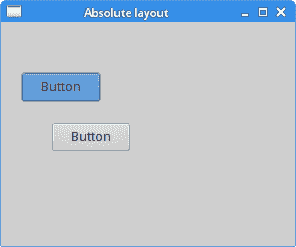
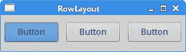
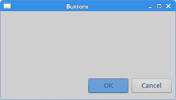
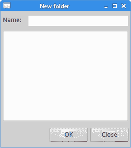
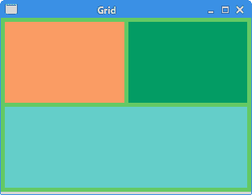
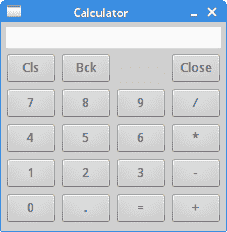

# Java SWT 中的布局管理

> 原文： [http://zetcode.com/gui/javaswt/layout/](http://zetcode.com/gui/javaswt/layout/)

在本章中，我们将展示如何在窗口或对话框中布置窗口小部件。

在设计应用的 GUI 时，我们决定使用哪些小部件以及如何在应用中组织这些小部件。 为了组织小部件，我们使用称为布局容器的专用非可见小部件。

`Composite`是用于放置子窗口小部件的容器。 `Composite`的布局管理器是通过`setLayout()`方法设置的。 `Shell`也是`Composite`。 它没有默认的布局管理器，在这种情况下，将使用绝对定位来放置小部件。

SWT 具有以下标准布局类：

*   FillLayout
*   行布局
*   表格布局
*   网格布局

`FillLayout`在单个行或列中布置大小相等的小部件。 `RowLayout`在行或列中布置小部件，并具有填充，环绕和间距选项。 `FormLayout`通过为小部件的每一侧创建附件来布局小部件。 `GridLayout`将小部件布置在网格中。

布局类可以具有对应的布局数据类，其中包含特定子项的布局数据。 例如，`RowLayout`具有名为`RowData`的布局数据类，`GridLayout`具有`GridData`，而`FormLayout`具有`FormData`。

## 绝对定位

在大多数情况下，程序员应使用布局管理器。 在某些情况下，我们也可以使用绝对定位。 在绝对定位中，程序员以像素为单位指定每个小部件的位置和大小。 如果我们调整窗口大小，则小部件的大小和位置不会改变。 在各种平台上，应用看起来都不同，在 Linux 上看起来不错，在 Mac OS 上看起来不太正常。 在应用中更改字体可能会破坏布局。 如果我们将应用翻译成另一种语言，则必须重做布局。 对于所有这些问题，仅在有理由的情况下才使用绝对定位，或者您的应用是简单的测试。

绝对定位是通过`setSize()`，`setLocation()`和`setBounds()`方法完成的。

`AbsoluteLayoutEx.java`

```
package com.zetcode;

import org.eclipse.swt.SWT;
import org.eclipse.swt.widgets.Button;
import org.eclipse.swt.widgets.Display;
import org.eclipse.swt.widgets.Shell;

/**
 * ZetCode Java SWT tutorial
 *
 * In this program, we position two
 * buttons using absolute coordinates.
 *
 * Author: Jan Bodnar
 * Website: zetcode.com
 * Last modified: June 2015
 */

public class AbsoluteLayoutEx {

    public AbsoluteLayoutEx(Display display) {

        initUI(display);
    }

    private void initUI(Display display) {

        Shell shell = new Shell(display, SWT.SHELL_TRIM | SWT.CENTER);

        Button btn1 = new Button(shell, SWT.PUSH);
        btn1.setText("Button");
        btn1.setBounds(20, 50, 80, 30);

        Button btn2 = new Button(shell, SWT.PUSH);
        btn2.setText("Button");
        btn2.setSize(80, 30);
        btn2.setLocation(50, 100);

        shell.setText("Absolute layout");
        shell.setSize(300, 250);
        shell.open();

        while (!shell.isDisposed()) {
          if (!display.readAndDispatch()) {
            display.sleep();
          }
        }        
    }

    @SuppressWarnings("unused")
    public static void main(String[] args) {

        Display display = new Display();
        AbsoluteLayoutEx ex = new AbsoluteLayoutEx(display);
        display.dispose();
    }
}

```

在我们的示例中，我们使用绝对定位在窗口上放置了两个按钮。

```
btn1.setBounds(20, 50, 80, 30);

```

`setBounds()`方法有两件事：将按钮定位在 x = 20 和 y = 50，并将按钮的大小设置为 width = 80 和 height = 30。

```
button2.setSize(80, 30);
button2.setLocation(50, 100);

```

在这里，我们分两个步骤进行相同的操作。 首先，我们使用`setSize()`方法调整按钮的大小。 然后，我们使用`setLocation()`方法将其定位在窗口上。



Figure: Absolute layout

## `FillLayout`管理器

`FillLayout`是最简单的布局类。 它将小部件布置在一行或一列中，迫使它们具有相同的大小。

`FillLayoutEx.java`

```
package com.zetcode;

import org.eclipse.swt.SWT;
import org.eclipse.swt.graphics.Device;
import org.eclipse.swt.graphics.Image;
import org.eclipse.swt.graphics.Rectangle;
import org.eclipse.swt.layout.FillLayout;
import org.eclipse.swt.widgets.Display;
import org.eclipse.swt.widgets.Label;
import org.eclipse.swt.widgets.Shell;

/**
 * ZetCode Java SWT tutorial
 *
 * This program demonstrates the FillLayout
 * manager
 *
 * Author: Jan Bodnar
 * Website: zetcode.com
 * Last modified: May 2015
 */

public class FillLayoutEx {

    private Image castle;

    public FillLayoutEx(Display display) {

        initUI(display);
    }

    private void initUI(Display display) {

        Shell shell = new Shell(display, SWT.SHELL_TRIM | SWT.CENTER);
        shell.setLayout(new FillLayout());

        loadImage(shell);

        Label label = new Label(shell, SWT.IMAGE_PNG);
        label.setImage(castle);

        shell.setText("FillLayout");        
        Rectangle rect = castle.getBounds();
        shell.setSize(rect.width, rect.height);
        shell.open();

        while (!shell.isDisposed()) {
          if (!display.readAndDispatch()) {
            display.sleep();
          }
        }        
    }

    private void loadImage(Shell shell) {

        Device dev = shell.getDisplay();

        try {
            castle = new Image(dev, "redrock.png");

        } catch(Exception e) {

            System.out.println("Cannot load image");
            System.out.println(e.getMessage());
            System.exit(1);
        }        
    }

    @Override
    public void finalize() {

        castle.dispose();
    }

    public static void main(String[] args) {

        Display display = new Display();
        FillLayoutEx app = new FillLayoutEx(display);
        app.finalize();
        display.dispose();
    }
}

```

在我们的示例中，我们使用此管理器显示图像。

```
shell.setLayout(new FillLayout());

```

我们将`FillLayout`设置为外壳的布局类。 使用`setLayout()`方法设置布局。

```
Rectangle rect = castle.getBounds();
shell.setSize(rect.width, rect.height);

```

我们找出图片的大小来调整外壳的大小，以完全适合图像的大小。

```
Label label = new Label(shell, SWT.IMAGE_PNG);
label.setImage(castle);

```

我们将图像设置为标签小部件。

```
private void loadImage(Shell shell) {

    Device dev = shell.getDisplay();

    try {
        castle = new Image(dev, "redrock.png");

    } catch(Exception e) {

        System.out.println("Cannot load image");
        System.out.println(e.getMessage());
        System.exit(1);
    }        
}

```

`loadImage()`方法从磁盘加载图像。


Figure: FillLayout

## `RowLayout`

`RowLayout`管理器将所有小部件放置在一行或一列中。

`RowLayoutEx.java`

```
package com.zetcode;

import org.eclipse.swt.SWT;
import org.eclipse.swt.layout.RowData;
import org.eclipse.swt.layout.RowLayout;
import org.eclipse.swt.widgets.Button;
import org.eclipse.swt.widgets.Display;
import org.eclipse.swt.widgets.Shell;

/**
 * ZetCode Java SWT tutorial
 *
 * This program demonstrates the RowLayout
 * manager.
 *
 * Author: Jan Bodnar
 * Website: zetcode.com
 * Last modified: June 2015
 */

public class RowLayoutEx {

    public RowLayoutEx(Display display) {

        initUI(display);
    }

    private void initUI(Display display) {

        Shell shell = new Shell(display, SWT.SHELL_TRIM | SWT.CENTER);

        RowLayout rowLayout = new RowLayout(SWT.HORIZONTAL);
        rowLayout.marginTop = 10;
        rowLayout.marginBottom = 10;
        rowLayout.marginLeft = 5;
        rowLayout.marginRight = 5;
        rowLayout.spacing = 10;
        shell.setLayout(rowLayout);

        Button btn1 = new Button(shell, SWT.PUSH);
        btn1.setText("Button");
        btn1.setLayoutData(new RowData(80, 30));

        Button btn2 = new Button(shell, SWT.PUSH);
        btn2.setText("Button");
        btn2.setLayoutData(new RowData(80, 30));

        Button btn3 = new Button(shell, SWT.PUSH);
        btn3.setText("Button");
        btn3.setLayoutData(new RowData(80, 30));

        shell.setText("RowLayout");
        shell.pack();
        shell.open();

        while (!shell.isDisposed()) {
          if (!display.readAndDispatch()) {
            display.sleep();
          }
        }        
    }

    @SuppressWarnings("unused")
    public static void main(String[] args) {

        Display display = new Display();
        RowLayoutEx ex = new RowLayoutEx(display);
        display.dispose();
    }
}

```

在我们的示例中，我们创建了三个按钮的行。

```
RowLayout rowLayout = new RowLayout(SWT.HORIZONTAL);

```

将创建水平`RowLayout`。 这些小部件将放置在一行中。

```
rowLayout.marginTop = 10;
rowLayout.marginBottom = 10;
rowLayout.marginLeft = 5;
rowLayout.marginRight = 5;

```

边距指定沿容器边缘的空间。

```
rowLayout.spacing = 10;

```

`spacing`属性指定按钮之间的间距。

```
shell.setLayout(rowLayout);

```

我们将行布局指定为外壳布局。

```
Button btn1 = new Button(shell, SWT.PUSH);
btn1.setText("Button");
btn1.setLayoutData(new RowData(80, 30));

```

创建了`Button`。 `setLayoutData()`指定按钮的尺寸。



Figure: RowLayout manager

## 按钮

在最后一个示例中，我们使用`FormLayout`管理器创建一个示例。 该管理器使用两个对象`FormData`和`FormAttachment`控制孩子的位置和大小。

`ButtonsEx.java`

```
package com.zetcode;

import org.eclipse.swt.SWT;
import org.eclipse.swt.layout.FormAttachment;
import org.eclipse.swt.layout.FormData;
import org.eclipse.swt.layout.FormLayout;
import org.eclipse.swt.widgets.Button;
import org.eclipse.swt.widgets.Display;
import org.eclipse.swt.widgets.Shell;

/**
 * ZetCode Java SWT tutorial
 *
 * In this program, we position two buttons
 * in the bottom right corner of the window.
 *
 * Author: Jan Bodnar
 * Website: zetcode.com
 * Last modified: May 2015
 */

public class ButtonsEx {

    public ButtonsEx(Display display) {

        initUI(display);
    }

    private void initUI(Display display) {

        Shell shell = new Shell(display, SWT.SHELL_TRIM | SWT.CENTER);

        FormLayout layout = new FormLayout();
        shell.setLayout(layout);

        Button okBtn = new Button(shell, SWT.PUSH);
        okBtn.setText("OK");

        Button cancBtn = new Button(shell, SWT.PUSH);
        cancBtn.setText("Cancel");

        FormData cancelData = new FormData(80, 30);
        cancelData.right = new FormAttachment(98);
        cancelData.bottom = new FormAttachment(95);
        cancBtn.setLayoutData(cancelData);

        FormData okData = new FormData(80, 30);
        okData.right = new FormAttachment(cancBtn, -5, SWT.LEFT);
        okData.bottom = new FormAttachment(cancBtn, 0, SWT.BOTTOM);
        okBtn.setLayoutData(okData);

        shell.setText("Buttons");
        shell.setSize(350, 200);
        shell.open();

        while (!shell.isDisposed()) {
          if (!display.readAndDispatch()) {
            display.sleep();
          }
        }        
    }

    @SuppressWarnings("unused")
    public static void main(String[] args) {

        Display display = new Display();
        ButtonsEx ex = new ButtonsEx(display);
        display.dispose();
    }
}

```

在此代码示例中，我们在窗口的右下角放置了两个按钮。

```
FormLayout layout = new FormLayout();
shell.setLayout(layout);

```

`FormLayout`管理器已创建。

```
Button okBtn = new Button(shell, SWT.PUSH);
okBtn.setText("OK");

Button cancBtn = new Button(shell, SWT.PUSH);
cancBtn.setText("Cancel");

```

创建两个按钮并将其设置到外壳。

```
FormData cancelData = new FormData(80, 30);

```

取消按钮的大小为 80x30。

```
cancelData.right = new FormAttachment(98);
cancelData.bottom = new FormAttachment(95);

```

按钮的右侧附着在窗口宽度的 98% 处。 按钮的底部固定在窗口高度的 95% 处。

```
okData.right = new FormAttachment(cancelButton, -5, SWT.LEFT);
okData.bottom = new FormAttachment(cancelButton, 0, SWT.BOTTOM);

```

“确定”按钮的右侧位于“取消”按钮的左侧 5 像素处。 “确定”按钮的底部与“取消”按钮的底部对齐。



Figure: Buttons

## 新建文件夹

在下面的示例中，我们使用`FormLayout`和`RowLayout`管理器创建窗口布局。

`NewFolderEx.java`

```
package com.zetcode;

import org.eclipse.swt.SWT;
import org.eclipse.swt.layout.FormAttachment;
import org.eclipse.swt.layout.FormData;
import org.eclipse.swt.layout.FormLayout;
import org.eclipse.swt.layout.RowData;
import org.eclipse.swt.layout.RowLayout;
import org.eclipse.swt.widgets.Button;
import org.eclipse.swt.widgets.Composite;
import org.eclipse.swt.widgets.Display;
import org.eclipse.swt.widgets.Label;
import org.eclipse.swt.widgets.Shell;
import org.eclipse.swt.widgets.Text;

/**
 * ZetCode Java SWT tutorial
 *
 * This program creates a layout using a
 * FormLayout and a RowLayout. 
 *
 * Author: Jan Bodnar 
 * Website: zetcode.com 
 * Last modified: June 2015
 */

public class NewFolderEx {

    public NewFolderEx(Display display) {

        initUI(display);
    }

    private void initUI(Display display) {

        Shell shell = new Shell(display, SWT.SHELL_TRIM | SWT.CENTER);  
        shell.setLayout(new FormLayout());

        Label lbl = new Label(shell, SWT.LEFT);
        lbl.setText("Name:");

        FormData data1 = new FormData();
        data1.left = new FormAttachment(0, 5);
        data1.top = new FormAttachment(0, 10);
        lbl.setLayoutData(data1);        

        Text text = new Text(shell, SWT.SINGLE);
        FormData data2 = new FormData();
        data2.left = new FormAttachment(lbl, 15);
        data2.top = new FormAttachment(0, 10);
        data2.right = new FormAttachment(100, -5);
        text.setLayoutData(data2);      

        Composite com = new Composite(shell, SWT.NONE);      
        RowLayout rowLayout = new RowLayout();
        com.setLayout(rowLayout);

        Button okBtn = new Button(com, SWT.PUSH);
        okBtn.setText("OK");
        okBtn.setLayoutData(new RowData(80, 30));
        Button closeBtn = new Button(com, SWT.PUSH);
        closeBtn.setText("Close");
        closeBtn.setLayoutData(new RowData(80, 30));

        FormData data3 = new FormData();
        data3.bottom = new FormAttachment(100, -5);
        data3.right = new FormAttachment(100, 0);
        com.setLayoutData(data3);         

        Text mainText = new Text(shell, SWT.MULTI | SWT.BORDER);
        FormData data4 = new FormData();
        data4.width = 250;
        data4.height = 180;
        data4.top = new FormAttachment(text, 10);
        data4.left = new FormAttachment(0, 5);
        data4.right = new FormAttachment(100, -5);
        data4.bottom = new FormAttachment(com, -10);
        mainText.setLayoutData(data4);           

        shell.setText("New folder");
        shell.pack();
        shell.open();

        while (!shell.isDisposed()) {
            if (!display.readAndDispatch())
                display.sleep();
        }        
    }

    @SuppressWarnings("unused")
    public static void main(String[] args) {

        Display display = new Display();
        NewFolderEx ex = new NewFolderEx(display);
        display.dispose();    
    }
}

```

在示例中，有标签，文本和按钮小部件。

```
Shell shell = new Shell(display, SWT.SHELL_TRIM | SWT.CENTER);  
shell.setLayout(new FormLayout());

```

`FormLayout`设置为外壳的主布局管理器。

```
Label lbl = new Label(shell, SWT.LEFT);
lbl.setText("Name:");

FormData data1 = new FormData();
data1.left = new FormAttachment(0, 5);
data1.top = new FormAttachment(0, 10);
lbl.setLayoutData(data1);

```

标签窗口小部件附在窗口的左上角。

```
Text text = new Text(shell, SWT.SINGLE);
FormData data2 = new FormData();
data2.left = new FormAttachment(lbl, 15);
data2.top = new FormAttachment(0, 10);
data2.right = new FormAttachment(100, -5);
text.setLayoutData(data2);  

```

在标签旁边，我们放置一个`Text`控件。 文本控件的左侧相对于标签放置。

```
Composite com = new Composite(shell, SWT.NONE);      
RowLayout rowLayout = new RowLayout();
com.setLayout(rowLayout);

```

创建一个`Composite`并将其设置为`RowLayout`管理器。 这两个按钮进入该容器。 将`RowLayout`用于按钮要比直接通过`FormLayout`进行组织要容易一些。

```
Button okBtn = new Button(com, SWT.PUSH);
okBtn.setText("OK");
okBtn.setLayoutData(new RowData(80, 30));
Button closeBtn = new Button(com, SWT.PUSH);
closeBtn.setText("Close");
closeBtn.setLayoutData(new RowData(80, 30));

```

创建两个按钮。 他们的父部件是`Composite`。

```
FormData data3 = new FormData();
data3.bottom = new FormAttachment(100, -5);
data3.right = new FormAttachment(100, 0);
com.setLayoutData(data3);      

```

`Composite`本身与`FormLayout`一起放置在窗口的底部。 负值是与相邻小部件或窗口边界的偏移量。

```
Text mainText = new Text(shell, SWT.MULTI | SWT.BORDER);
FormData data4 = new FormData();
data4.width = 250;
data4.height = 180;
data4.top = new FormAttachment(text, 10);
data4.left = new FormAttachment(0, 5);
data4.right = new FormAttachment(100, -5);
data4.bottom = new FormAttachment(com, -10);
mainText.setLayoutData(data4);

```

最后，创建了`Text`主窗口小部件。 它占用了大部分窗口区域。 `width`和`height`属性指定控件的初始首选大小。



Figure: New folder

## `GridLayout`

`GridLayout`管理器将其子窗口小部件放入网格中。

`GridLayoutEx.java`

```
package com.zetcode;

import org.eclipse.swt.SWT;
import org.eclipse.swt.graphics.Color;
import org.eclipse.swt.layout.GridData;
import org.eclipse.swt.layout.GridLayout;
import org.eclipse.swt.widgets.Display;
import org.eclipse.swt.widgets.Label;
import org.eclipse.swt.widgets.Shell;

/**
 * ZetCode Java SWT tutorial
 *
 * This example presents the GridLayout.
 *
 * Author: Jan Bodnar 
 * Website: zetcode.com 
 * Last modified: June 2015
 */

public class GridLayoutEx {

    public GridLayoutEx(Display display) {

        initUI(display);
    }

    private void initUI(Display display) {

        Shell shell = new Shell(display, SWT.SHELL_TRIM | SWT.CENTER);

        Color col = new Color(display, 100, 200, 100);
        shell.setBackground(col);
        col.dispose();

        GridLayout layout = new GridLayout(2, false);
        shell.setLayout(layout);

        Label lbl1 = new Label(shell, SWT.NONE);
        GridData gd1 = new GridData(SWT.FILL, SWT.FILL, true, true);
        lbl1.setLayoutData(gd1);

        Color col1 = new Color(display, 250, 155, 100);
        lbl1.setBackground(col1);
        col1.dispose();        

        Label lbl2 = new Label(shell, SWT.NONE);
        GridData gd2 = new GridData(SWT.FILL, SWT.FILL, true, true);
        gd2.heightHint = 100;
        lbl2.setLayoutData(gd2);      

        Color col2 = new Color(display, 10, 155, 100);
        lbl2.setBackground(col2);
        col2.dispose();        

        Label lbl3 = new Label(shell, SWT.NONE);
        GridData gd3 = new GridData(SWT.FILL, SWT.FILL, true, true);
        gd3.widthHint = 300;
        gd3.heightHint = 100;
        gd3.horizontalSpan = 2;
        lbl3.setLayoutData(gd3);           

        Color col3 = new Color(display, 100, 205, 200);
        lbl3.setBackground(col3);
        col3.dispose();        

        shell.setText("Grid");
        shell.pack();
        shell.open();

        while (!shell.isDisposed()) {
            if (!display.readAndDispatch())
                display.sleep();
        }
    }

    @SuppressWarnings("unused")
    public static void main(String[] args) {

        Display display = new Display();
        GridLayoutEx ex = new GridLayoutEx(display);
        display.dispose();
    }
}

```

在示例中，我们在网格中放置了三个标签。 每个标签具有不同的背景色。

```
Color col = new Color(display, 100, 200, 100);
shell.setBackground(col);
col.dispose();

```

`setBackground()`方法为外壳设置背景色。

```
GridLayout layout = new GridLayout(2, false);
shell.setLayout(layout);

```

实例化`GridLayout`管理器并将其设置为外壳的布局管理器。 网格由 2 列组成。

```
Label lbl1 = new Label(shell, SWT.NONE);
GridData gd1 = new GridData(SWT.FILL, SWT.FILL, true, true);
lbl1.setLayoutData(gd1);

```

第一个标签进入网格的左上角单元格。 `GridData`类的四个参数使标签组件填充​​其单元格并在两个方向上扩展。

```
Label lbl2 = new Label(shell, SWT.NONE);
GridData gd2 = new GridData(SWT.FILL, SWT.FILL, true, true);
gd2.heightHint = 100;
lbl2.setLayoutData(gd2);    

```

第二个标签转到相邻的单元格。 `heightHint`属性指定标签的首选高度。 请注意，它也会影响先前的窗口小部件，因为该属性有效地设置了行的首选高度。

```
Label lbl3 = new Label(shell, SWT.NONE);
GridData gd3 = new GridData(SWT.FILL, SWT.FILL, true, true);
gd3.widthHint = 300;
gd3.heightHint = 100;
gd3.horizontalSpan = 2;
lbl3.setLayoutData(gd3);     

```

第三个标签进入第二行。 `horizontalSpan`属性使标签跨越两列。



Figure: Simple GridLayout

## 计算器

在下面的示例中，我们使用`GridLayout`管理器创建计算器的框架。

`CalculatorEx.java`

```
package com.zetcode;

import org.eclipse.swt.SWT;
import org.eclipse.swt.layout.GridData;
import org.eclipse.swt.layout.GridLayout;
import org.eclipse.swt.widgets.Button;
import org.eclipse.swt.widgets.Display;
import org.eclipse.swt.widgets.Label;
import org.eclipse.swt.widgets.Shell;
import org.eclipse.swt.widgets.Text;

/**
 * ZetCode Java SWT tutorial
 *
 * In this program, we use the GridLayout to
 * create a calculator skeleton.
 *
 * Author: Jan Bodnar
 * Website: zetcode.com
 * Last modified: June 2015
 */

public class CalculatorEx {

    public CalculatorEx(Display display) {

        initUI(display);
    }

    private void initUI(Display display) {

        Shell shell = new Shell(display, SWT.DIALOG_TRIM | SWT.CENTER);

        GridLayout gl = new GridLayout(4, true);
        gl.marginHeight = 5;
        shell.setLayout(gl);

        String[] buttons = {
            "Cls", "Bck", "", "Close", "7", "8", "9", "/", "4",
            "5", "6", "*", "1", "2", "3", "-", "0", ".", "=", "+"
        };

        Text text = new Text(shell, SWT.SINGLE);
        GridData gridData = new GridData();
        gridData.horizontalSpan = 4;
        gridData.horizontalAlignment = GridData.FILL;
        text.setLayoutData(gridData);

        for (int i = 0; i < buttons.length; i++) {

            if (i == 2) {

                Label lbl = new Label(shell, SWT.CENTER);
                GridData gd = new GridData(SWT.FILL, SWT.FILL, false, false);
                lbl.setLayoutData(gd);
            } else {

               Button btn = new Button(shell, SWT.PUSH);
               btn.setText(buttons[i]);
               GridData gd = new GridData(SWT.FILL, SWT.FILL, false, false);
               gd.widthHint = 50;
               gd.heightHint = 30;
               btn.setLayoutData(gd);
            }
        }

        shell.setText("Calculator");
        shell.pack();
        shell.open();

        while (!shell.isDisposed()) {
          if (!display.readAndDispatch()) {
            display.sleep();
          }
        }        
    }

    @SuppressWarnings("unused")
    public static void main(String[] args) {

        Display display = new Display();
        CalculatorEx ex = new CalculatorEx(display);
        display.dispose();
    }
}

```

我们使用`GridLayout`管理器创建计算器的框架。 我们使用三种类型的小部件：文本小部件，标签小部件和几个按钮。

```
Shell shell = new Shell(display, SWT.DIALOG_TRIM | SWT.CENTER);

```

使用`SWT.DIALOG_TRIM`标志，使窗口不可调整大小。

```
GridLayout gl = new GridLayout(4, true);
gl.marginHeight = 5;
shell.setLayout(gl);

```

我们创建一个具有 4 列的`GridLayout`，并提供顶部和底部页边距。

```
Text text = new Text(shell, SWT.SINGLE);
GridData gridData = new GridData();
gridData.horizontalSpan = 4;
gridData.horizontalAlignment = GridData.FILL;
text.setLayoutData(gridData);

```

`GridData`是与`GridLayout`关联的布局数据对象。 使用`horizontalSpan`属性，我们使文本小部件跨越所有四列。 设置为`GridData.FILL`的`horizontalAlignment`使文本窗口小部件填充布局管理器分配给它的整个区域。

```
Button btn = new Button(shell, SWT.PUSH);
btn.setText(buttons[i]);
GridData gd = new GridData(SWT.FILL, SWT.FILL, false, false);
gd.widthHint = 50;
gd.heightHint = 30;
btn.setLayoutData(gd);

```

在 for 循环内，我们创建按钮并将其放入网格中。 通过`widthHint`和`heightHint`属性，我们可以设置按钮的首选大小。



Figure: Calculator skeleton

在 Java SWT 教程的这一部分中，我们讨论了小部件的布局管理。