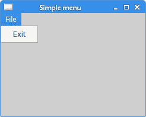
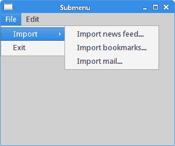
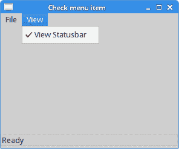
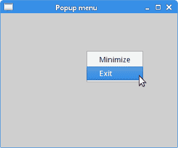
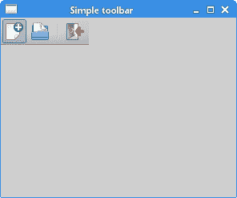

# Java SWT 中的菜单和工具栏

> 原文： [http://zetcode.com/gui/javaswt/menustoolbars/](http://zetcode.com/gui/javaswt/menustoolbars/)

在 Java SWT 教程的这一部分中，我们使用菜单和工具栏。

菜单栏是 GUI 应用的常见部分。 它是位于各个菜单中的一组命令。

## 简单菜单

在第一个示例中，我们创建一个带有一个文件菜单的菜单栏。 该菜单只有一个菜单项。 通过选择项目，应用结束。

`SimpleMenuEx.java`

```java
package com.zetcode;

import org.eclipse.swt.SWT;
import org.eclipse.swt.widgets.Display;
import org.eclipse.swt.widgets.Menu;
import org.eclipse.swt.widgets.MenuItem;
import org.eclipse.swt.widgets.Shell;

/**
 * ZetCode Java SWT tutorial
 *
 * This program creates a simple menu.
 * 
 * Author: Jan Bodnar
 * Website: zetcode.com
 * Last modified: June 2015
 */

public class SimpleMenuEx {

    public SimpleMenuEx(Display display) {

        initUI(display);
    }

    private void initUI(Display display) {

        Shell shell = new Shell(display, SWT.SHELL_TRIM | SWT.CENTER);

        Menu menuBar = new Menu(shell, SWT.BAR);
        MenuItem cascadeFileMenu = new MenuItem(menuBar, SWT.CASCADE);
        cascadeFileMenu.setText("&File");

        Menu fileMenu = new Menu(shell, SWT.DROP_DOWN);
        cascadeFileMenu.setMenu(fileMenu);

        MenuItem exitItem = new MenuItem(fileMenu, SWT.PUSH);
        exitItem.setText("&Exit");
        shell.setMenuBar(menuBar);

        exitItem.addListener(SWT.Selection, event-> {
            shell.getDisplay().dispose();
            System.exit(0);
        });

        shell.setText("Simple menu");
        shell.setSize(300, 200);
        shell.open();

        while (!shell.isDisposed()) {
          if (!display.readAndDispatch()) {
            display.sleep();
          }
        }
    }

    @SuppressWarnings("unused")
    public static void main(String[] args) {

        Display display = new Display();
        SimpleMenuEx ex = new SimpleMenuEx(display);
        display.dispose();
    }
}

```

这是一个最小的菜单栏功能示例。

```java
Menu menuBar = new Menu(shell, SWT.BAR);

```

将`SWT.BAR`选项传递给`Menu`将创建一个菜单栏。

```java
MenuItem cascadeFileMenu = new MenuItem(menuBar, SWT.CASCADE);
cascadeFileMenu.setText("&File");

```

顶级菜单项是级联菜单项。 他们收到`SWT.CASCADE`选项。

```java
Menu fileMenu = new Menu(shell, SWT.DROP_DOWN);
cascadeFileMenu.setMenu(fileMenu);

```

下拉菜单是使用`SWT.DROP_DOWN`选项创建的。

```java
MenuItem exitItem = new MenuItem(fileMenu, SWT.PUSH);
exitItem.setText("&Exit");

```

推菜单项已插入下拉菜单中。 它是使用`SWT.PUSH`选项创建的。

```java
shell.setMenuBar(menuBar);

```

`setMenuBar()`在外壳上设置菜单栏。

```java
exitItem.addListener(SWT.Selection, event-> {
    shell.getDisplay().dispose();
    System.exit(0);
});

```

当我们选择退出推送菜单项时，应用终止。



图：简单菜单

## 子菜单

下一个示例演示如何创建子菜单。

`SubMenuEx.java`

```java
package com.zetcode;

import org.eclipse.swt.SWT;
import org.eclipse.swt.widgets.Display;
import org.eclipse.swt.widgets.Menu;
import org.eclipse.swt.widgets.MenuItem;
import org.eclipse.swt.widgets.Shell;

/**
 * ZetCode Java SWT tutorial
 *
 * This program creates a submenu.
 *
 * Author: Jan Bodnar
 * Website: zetcode.com
 * Last modified: June 2015
 */

public class SubMenuEx {

    public SubMenuEx(Display display) {

        initUI(display);
    }

    private void initUI(Display display) {

        Shell shell = new Shell(display, SWT.SHELL_TRIM | SWT.CENTER);

        Menu menuBar = new Menu(shell, SWT.BAR);
        MenuItem cascadeFileMenu = new MenuItem(menuBar, SWT.CASCADE);
        cascadeFileMenu.setText("&File");

        Menu fileMenu = new Menu(shell, SWT.DROP_DOWN);
        cascadeFileMenu.setMenu(fileMenu);

        MenuItem cascadeEditMenu = new MenuItem(menuBar, SWT.CASCADE);
        cascadeEditMenu.setText("&Edit");

        MenuItem subMenuItem = new MenuItem(fileMenu, SWT.CASCADE);
        subMenuItem.setText("Import");

        Menu submenu = new Menu(shell, SWT.DROP_DOWN);
        subMenuItem.setMenu(submenu);

        MenuItem feedItem = new MenuItem(submenu, SWT.PUSH);
        feedItem.setText("&Import news feed...");

        MenuItem bmarks = new MenuItem(submenu, SWT.PUSH);
        bmarks.setText("&Import bookmarks...");

        MenuItem mailItem = new MenuItem(submenu, SWT.PUSH);
        mailItem.setText("&Import mail...");

        MenuItem exitItem = new MenuItem(fileMenu, SWT.PUSH);
        exitItem.setText("&Exit");
        shell.setMenuBar(menuBar);

        exitItem.addListener(SWT.Selection, event-> {
            shell.getDisplay().dispose();
            System.exit(0);
        });

        shell.setText("Submenu");
        shell.setSize(300, 250);
        shell.open();

        while (!shell.isDisposed()) {
            if (!display.readAndDispatch()) {
                display.sleep();
            }
        }        
    }

    @SuppressWarnings("unused")
    public static void main(String[] args) {

        Display display = new Display();
        SubMenuEx ex = new SubMenuEx(display);
        display.dispose();
    }
}

```

该示例在另一个菜单内创建一个菜单。

```java
MenuItem subMenuItem = new MenuItem(fileMenu, SWT.CASCADE);
subMenuItem.setText("Import");

```

子菜单的创建类似于创建普通菜单。 首先，我们创建一个层叠菜单项。 唯一的区别是父窗口小部件。 这次，父级是子菜单所属的菜单对象。

```java
MenuItem feedItem = new MenuItem(submenu, SWT.PUSH);
feedItem.setText("&Import news feed...");

```

我们创建一个推菜单项。 父窗口小部件是子菜单对象。



图：子菜单

## `CheckMenuItem`

`CheckMenuItem`是带有复选框的菜单项。 它可以用于布尔属性。

`CheckMenuItemEx.java`

```java
package com.zetcode;

import org.eclipse.swt.SWT;
import org.eclipse.swt.events.SelectionAdapter;
import org.eclipse.swt.events.SelectionEvent;
import org.eclipse.swt.layout.FormAttachment;
import org.eclipse.swt.layout.FormData;
import org.eclipse.swt.layout.FormLayout;
import org.eclipse.swt.widgets.Display;
import org.eclipse.swt.widgets.Event;
import org.eclipse.swt.widgets.Label;
import org.eclipse.swt.widgets.Listener;
import org.eclipse.swt.widgets.Menu;
import org.eclipse.swt.widgets.MenuItem;
import org.eclipse.swt.widgets.Shell;

/**
 * ZetCode Java SWT tutorial
 *
 * This program creates a check menu item.
 * It will show or hide a statusbar.
 *
 * Author: Jan Bodnar
 * Website: zetcode.com
 * Last modified: June 2015
 */

public class CheckMenuItemEx {

    private Shell shell;
    private Label status;
    private MenuItem statItem;

    public CheckMenuItemEx(Display display) {

        initUI(display);
    }

    public void initUI(Display display) {

        shell = new Shell(display, SWT.SHELL_TRIM | SWT.CENTER);

        Menu menuBar = new Menu(shell, SWT.BAR);
        shell.setMenuBar(menuBar);

        MenuItem cascadeFileMenu = new MenuItem(menuBar, SWT.CASCADE);
        cascadeFileMenu.setText("&File");

        Menu fileMenu = new Menu(shell, SWT.DROP_DOWN);
        cascadeFileMenu.setMenu(fileMenu);

        MenuItem exitItem = new MenuItem(fileMenu, SWT.PUSH);
        exitItem.setText("&Exit");

        MenuItem cascadeViewMenu = new MenuItem(menuBar, SWT.CASCADE);
        cascadeViewMenu.setText("&View");

        Menu viewMenu = new Menu(shell, SWT.DROP_DOWN);
        cascadeViewMenu.setMenu(viewMenu);

        statItem = new MenuItem(viewMenu, SWT.CHECK);
        statItem.setSelection(true);
        statItem.setText("&View Statusbar");

        statItem.addListener(SWT.Selection, new MyStatusListener());

        exitItem.addSelectionListener(new MySelectionAdapter());

        status = new Label(shell, SWT.BORDER);
        status.setText("Ready");
        FormLayout layout = new FormLayout();
        shell.setLayout(layout);

        FormData labelData = new FormData();
        labelData.left = new FormAttachment(0);
        labelData.right = new FormAttachment(100);
        labelData.bottom = new FormAttachment(100);
        status.setLayoutData(labelData);

        shell.setText("Check menu item");
        shell.setSize(300, 250);
        shell.open();

        while (!shell.isDisposed()) {
            if (!display.readAndDispatch()) {
                display.sleep();
            }
        }        
    }

    private class MyStatusListener implements Listener {

        @Override
        public void handleEvent(Event event) {

            if (statItem.getSelection()) {
                status.setVisible(true);
            } else {
                status.setVisible(false);
            }
        }
    }    

    private class MySelectionAdapter extends SelectionAdapter {

        @Override
        public void widgetSelected(SelectionEvent e) {
            shell.getDisplay().dispose();
            System.exit(0);
        }        
    }

    @SuppressWarnings("unused")
    public static void main(String[] args) {

        Display display = new Display();
        CheckMenuItemEx ex = new CheckMenuItemEx(display);
        display.dispose();
    }
}

```

在我们的代码示例中，我们显示一个检查菜单项。 如果该复选框已激活，则会显示状态栏。 如果不是，状态栏将被隐藏。

```java
statItem = new MenuItem(viewMenu, SWT.CHECK);

```

`SWT.CHECK`标志将创建一个检查菜单项。

```java
statItem.setSelection(true);

```

`setSelection()`方法选中或取消选中检查菜单项。

```java
if (statItem.getSelection()) {
    status.setVisible(true);
} else {
    status.setVisible(false);
}

```

根据检查菜单项的状态，我们显示或隐藏标签小部件。



图：选中菜单项

## 弹出菜单

在下一个示例中，我们创建一个弹出菜单。 弹出菜单也称为上下文菜单。 当我们右键单击一个对象时，将显示此类型的菜单。

`PopupMenuEx.java`

```java
package com.zetcode;

import org.eclipse.swt.SWT;
import org.eclipse.swt.widgets.Display;
import org.eclipse.swt.widgets.Menu;
import org.eclipse.swt.widgets.MenuItem;
import org.eclipse.swt.widgets.Shell;

/**
 * ZetCode Java SWT tutorial
 *
 * This program creates a popup menu.
 *
 * Author: Jan Bodnar
 * Website: zetcode.com
 * Last modified: June 2015
 */

public class PopupMenuEx {

    public PopupMenuEx(Display display) {

        initUI(display);
    }

    private void initUI(Display display) {

        Shell shell = new Shell(display, SWT.SHELL_TRIM | SWT.CENTER);

        Menu menu = new Menu(shell, SWT.POP_UP);
        MenuItem minItem = new MenuItem(menu, SWT.PUSH);
        minItem.setText("Minimize");

        minItem.addListener(SWT.Selection, event -> {
            shell.setMinimized(true);
        });

        MenuItem exitItem = new MenuItem(menu, SWT.PUSH);
        exitItem.setText("Exit");

        exitItem.addListener(SWT.Selection, event -> {
            shell.getDisplay().dispose();
            System.exit(0);
        });

        shell.setText("Popup menu");
        shell.setMenu(menu);
        shell.setSize(300, 250);
        shell.open();

        while (!shell.isDisposed()) {
            if (!display.readAndDispatch()) {
                display.sleep();
            }
        }        
    }

    @SuppressWarnings("unused")
    public static void main(String[] args) {

        Display display = new Display();
        PopupMenuEx ex = new PopupMenuEx(display);
        display.dispose();
    }
}

```

在我们的代码示例中，我们创建一个带有两个菜单项的弹出菜单。 第一个最小化窗口，第二个终止应用。

```java
Menu menu = new Menu(shell, SWT.POP_UP);

```

使用`SWT.POP_UP`标志创建弹出菜单。

```java
MenuItem minItem = new MenuItem(menu, SWT.PUSH);
minItem.setText("Minimize");

```

弹出菜单中的菜单项是普通的推菜单项。

```java
minItem.addListener(SWT.Selection, event -> {
    shell.setMinimized(true);
});

```

`setMinimized()`方法将窗口最小化。

```java
shell.setMenu(menu);

```

我们为外壳设置一个弹出菜单。



图：弹出菜单

## 简单的工具栏

菜单将我们可以在应用中使用的命令分组。 使用工具栏可以快速访问最常用的命令。 在下面的示例中，我们创建一个简单的工具栏。

`SimpleToolBarEx.java`

```java
package com.zetcode;

import org.eclipse.swt.SWT;
import org.eclipse.swt.graphics.Device;
import org.eclipse.swt.graphics.Image;
import org.eclipse.swt.widgets.Display;
import org.eclipse.swt.widgets.Shell;
import org.eclipse.swt.widgets.ToolBar;
import org.eclipse.swt.widgets.ToolItem;

/**
 * ZetCode Java SWT tutorial
 *
 * This program creates a simple toolbar.
 *
 * Author: Jan Bodnar
 * Website: zetcode.com
 * Last modified: June 2015
 */

public class SimpleToolBarEx {

    private Image newi;
    private Image opei;
    private Image quii;

    public SimpleToolBarEx(Display display) {

        initUI(display);
    }

    @SuppressWarnings("unused")
    public void initUI(Display display) {

        Shell shell = new Shell(display, SWT.SHELL_TRIM | SWT.CENTER);

        Device dev = shell.getDisplay();

        try {
            newi = new Image(dev, "new.png");
            opei = new Image(dev, "open.png");
            quii = new Image(dev, "quit.png");

        } catch (Exception e) {

            System.out.println("Cannot load images");
            System.out.println(e.getMessage());
            System.exit(1);
        }

        ToolBar toolBar = new ToolBar(shell, SWT.BORDER);

        ToolItem item1 = new ToolItem(toolBar, SWT.PUSH);
        item1.setImage(newi);

        ToolItem item2 = new ToolItem(toolBar, SWT.PUSH);
        item2.setImage(opei);

        ToolItem separator = new ToolItem(toolBar, SWT.SEPARATOR);

        ToolItem item3 = new ToolItem(toolBar, SWT.PUSH);
        item3.setImage(quii);

        toolBar.pack();

        item3.addListener(SWT.Selection, event -> {
            shell.getDisplay().dispose();
            System.exit(0);
        });

        shell.setText("Simple toolbar");
        shell.setSize(300, 250);
        shell.open();

        while (!shell.isDisposed()) {
            if (!display.readAndDispatch()) {
                display.sleep();
            }
        }
    }

    @Override
    public void finalize() {

        newi.dispose();
        opei.dispose();
        quii.dispose();
    }

    public static void main(String[] args) {

        Display display = new Display();
        SimpleToolBarEx ex = new SimpleToolBarEx(display);
        ex.finalize();
        display.dispose();
    }
}

```

该示例显示了一个工具栏和三个工具项。

```java
ToolBar toolBar = new ToolBar(shell, SWT.BORDER);

```

工具栏已创建。

```java
ToolItem item1 = new ToolItem(toolBar, SWT.PUSH);
item1.setImage(newi);

```

我们创建一个带有图像的工具项。

```java
ToolItem separator = new ToolItem(toolBar, SWT.SEPARATOR);

```

在这里，我们创建一个垂直分隔符。



图：工具栏

在 Java SWT 教程的这一章中，我们展示了如何使用菜单和工具栏。