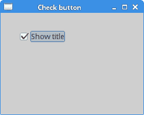
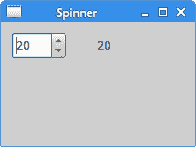
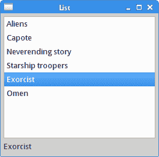
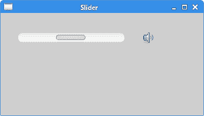
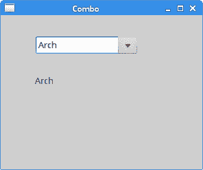

# Java SWT 中的小部件

> 原文： [http://zetcode.com/gui/javaswt/widgets/](http://zetcode.com/gui/javaswt/widgets/)

在 Java SWT 编程教程的这一部分中，我们将介绍一些 SWT 小部件。

小部件是 GUI 应用的基本构建块。 将小部件视为乐高玩具的一部分。 多年来，几个小部件已成为所有 OS 平台上所有工具包中的标准。 例如，按钮，复选框或滚动条。

## `Label`

`Label`是显示字符串或图像的不可选择的用户界面对象。 此外，它可以显示水平或垂直线。

`LabelEx.java`

```java
package com.zetcode;

import org.eclipse.swt.SWT;
import org.eclipse.swt.graphics.Point;
import org.eclipse.swt.widgets.Display;
import org.eclipse.swt.widgets.Label;
import org.eclipse.swt.widgets.Shell;

/**
 * ZetCode Java SWT tutorial
 *
 * This program uses the Label widget to
 * show lyrics of a song.
 *
 * Author: Jan Bodnar
 * Website: zetcode.com
 * Last modified: June 2015
 */

public class LabelEx {

    final String lyrics =
"And I know that he knows I'm unfaithful\n"+
"And it kills him inside\n"+
"To know that I am happy with some other guy\n"+
"I can see him dyin'\n"+
"\n"+
"I don't wanna do this anymore\n"+
"I don't wanna be the reason why\n"+
"Every time I walk out the door\n"+
"I see him die a little more inside\n"+
"I don't wanna hurt him anymore\n"+
"I don't wanna take away his life\n"+
"I don't wanna be... A murderer";

    public LabelEx(Display display) {

        initUI(display);
    }

    private void initUI(Display display) {

        Shell shell = new Shell(display, SWT.SHELL_TRIM | SWT.CENTER);

        Label label = new Label(shell, SWT.LEFT);
        label.setText(lyrics);

        Point p = label.computeSize(SWT.DEFAULT, SWT.DEFAULT);
        label.setBounds(5, 5, p.x+5, p.y+5);

        shell.setText("Unfaithful");
        shell.pack();
        shell.open();

        while (!shell.isDisposed()) {
            if (!display.readAndDispatch()) {
                display.sleep();
            }
        }
    }

    @SuppressWarnings("unused")
    public static void main(String[] args) {

        Display display = new Display();
        LabelEx ex = new LabelEx(display);
        display.dispose();
    }
}

```

该代码示例在窗口上显示了一些歌词。

```java
    String lyrics =
"And I know that he knows I'm unfaithful\n"+
"And it kills him inside\n"+
...

```

我们构建多行文本。

```java
Label label = new Label(shell, SWT.LEFT);
label.setText(lyrics);

```

`Label`小部件已创建； `SWT.LEFT`选项使其文本保持左对齐。

```java
Point p = label.computeSize(SWT.DEFAULT, SWT.DEFAULT);
label.setBounds(5, 5, p.x+5, p.y+5);

```

我们计算文本的大小，以便在文本周围放置一些空间。

```java
shell.pack();

```

`pack()`方法将窗口调整为首选大小。 足够大以显示标签小部件。

## `CheckBox`

在 SWT 中，复选按钮是`Button`的特例。 它是具有两种状态的窗口小部件：打开和关闭。 接通状态通过复选标记显示。 它用来表示一些布尔属性。

`CheckButtonEx.java`

```java
package com.zetcode;

import org.eclipse.swt.SWT;
import org.eclipse.swt.layout.RowLayout;
import org.eclipse.swt.widgets.Button;
import org.eclipse.swt.widgets.Display;
import org.eclipse.swt.widgets.Shell;

/**
 * ZetCode Java SWT tutorial
 *
 * This program uses a check button
 * widget to show/hide the title
 * of the window.
 *
 * Author: Jan Bodnar
 * Website: zetcode.com
 * Last modified: June 2015
 */

public class CheckButtonEx {

    private Shell shell;

    public CheckButtonEx(Display display) {

        initUI(display);
    }

    private void initUI(Display display) {

        shell = new Shell(display);

        RowLayout layout = new RowLayout();
        layout.marginLeft = 30;
        layout.marginTop = 30;
        shell.setLayout(layout);

        Button cb = new Button(shell, SWT.CHECK);
        cb.setText("Show title");
        cb.setSelection(true);

        cb.addListener(SWT.Selection, event -> onButtonSelect(cb));

        shell.setText("Check button");
        shell.setSize(250, 200);
        shell.open();

        while (!shell.isDisposed()) {
            if (!display.readAndDispatch()) {
                display.sleep();
            }
        }
    }

    private void onButtonSelect(Button cb) {

        if (cb.getSelection()) {
            shell.setText("Check button");
        } else {
            shell.setText("");
        }        
    }

    @SuppressWarnings("unused")
    public static void main(String[] args) {

        Display display = new Display();
        CheckButtonEx ex = new CheckButtonEx(display);
        display.dispose();
    }
}

```

窗口标题的显示取决于检查按钮的状态。

```java
Button cb = new Button(shell, SWT.CHECK);
cb.setText("Show title");

```

通过将`SWT.CHECK`传递给`Button`构造器来创建复选按钮小部件。 `setText()`方法设置按钮的标签。

```java
cb.setSelection(true);

```

默认情况下标题是可见的，因此我们默认使用`setSelection()`方法选择复选按钮。

```java
cb.addListener(SWT.Selection, event -> onButtonSelect(cb));

```

我们向按钮的`SWT.Selection`事件类型添加一个监听器对象。

```java
private void onButtonSelect(Button cb) {

    if (cb.getSelection()) {
        shell.setText("Check button");
    } else {
        shell.setText("");
    }        
}

```

在`onButtonSelect()`方法内部，我们根据选中按钮的状态显示或隐藏窗口的标题。 确认按钮的状态通过`getSelection()`方法确定。



图：复选按钮

## `Spinner`

`Spinner`控件允许从一系列值中选择一个数字。 可以通过单击向上和向下箭头或通过按下和`向上键`或`向上键`和`来选择该值。 向下翻页`键。

`SpinnerEx.java`

```java
package com.zetcode;

import org.eclipse.swt.SWT;
import org.eclipse.swt.layout.RowData;
import org.eclipse.swt.layout.RowLayout;
import org.eclipse.swt.widgets.Display;
import org.eclipse.swt.widgets.Label;
import org.eclipse.swt.widgets.Shell;
import org.eclipse.swt.widgets.Spinner;

public class SpinnerEx {

    private Label label;

    public SpinnerEx(Display display) {

        initUI(display);
    }

    private void initUI(Display display) {    

        Shell shell = new Shell(display, SWT.SHELL_TRIM | SWT.CENTER);

        RowLayout layout = new RowLayout();
        layout.marginLeft = 10;
        layout.marginTop = 10;
        layout.spacing = 30;
        layout.center = true;
        shell.setLayout(layout);

        Spinner spinner = new Spinner(shell, SWT.BORDER);
        spinner.setMinimum(0);
        spinner.setMaximum(100);
        spinner.setSelection(0);
        spinner.setIncrement(1);
        spinner.setPageIncrement(10);       
        spinner.setLayoutData(new RowData(30, -1));

        spinner.addListener(SWT.Selection, event -> onSelected(spinner));

        label = new Label(shell, SWT.NONE);
        label.setText("0");

        shell.setText("Spinner");
        shell.setSize(200, 150);
        shell.open();

        while (!shell.isDisposed()) {
            if (!display.readAndDispatch()) {
                display.sleep();
            }
        }        
    }

    private void onSelected(Spinner spinner) {

        String val = spinner.getText();
        label.setText(val);
        label.pack();
    }

    @SuppressWarnings("unused")
    public static void main(String[] args) {

        Display display = new Display();
        SpinnerEx ex = new SpinnerEx(display);
        display.dispose();
    }    
}

```

该示例具有`Spinner`和`Label`。 从微调器中选择的值显示在标签中。

```java
Spinner spinner = new Spinner(shell, SWT.BORDER);

```

创建`Spinner`控件的实例。

```java
spinner.setMinimum(0);
spinner.setMaximum(100);
spinner.setSelection(0);
spinner.setIncrement(1);
spinner.setPageIncrement(10);  

```

我们使用微调器 API 指定最小，最大，当前，增量和页面增量值。

```java
spinner.addListener(SWT.Selection, event -> onSelected(spinner));

```

等待微调器选择事件的监听器已添加到控件中。 触发事件时，将调用`onSelected()`方法。

```java
private void onSelected(Spinner spinner) {

    String val = spinner.getText();
    label.setText(val);
    label.pack();
}

```

我们获得微调器的当前值，并将其设置为标签组件。



图：旋钮

## `List`小部件

`List`小部件使用户可以从项目列表中选择一个选项。 列表可以是单选或多选。

`ListWidgetEx.java`

```java
package com.zetcode;

import org.eclipse.swt.SWT;
import org.eclipse.swt.layout.FormAttachment;
import org.eclipse.swt.layout.FormData;
import org.eclipse.swt.layout.FormLayout;
import org.eclipse.swt.widgets.Display;
import org.eclipse.swt.widgets.Label;
import org.eclipse.swt.widgets.List;
import org.eclipse.swt.widgets.Shell;

/**
 * ZetCode Java SWT tutorial
 *
 * This program shows the List widget.
 *
 * Author: Jan Bodnar
 * Website: zetcode.com
 * Last modified: June 2015
 */

public class ListWidgetEx {

    private Label status;

    public ListWidgetEx(Display display) {

        initUI(display);
    }

    private void initUI(Display display) {

        Shell shell = new Shell(display);

        status = new Label(shell, SWT.NONE);
        status.setText("Ready");

        FormLayout layout = new FormLayout();
        layout.marginHeight = 5;
        layout.marginWidth = 5;
        layout.spacing = 5;
        shell.setLayout(layout);

        FormData labelData = new FormData();
        labelData.left = new FormAttachment(0);
        labelData.right = new FormAttachment(100);
        labelData.bottom = new FormAttachment(100);
        status.setLayoutData(labelData);

        List list = new List(shell, SWT.BORDER);

        list.add("Aliens");
        list.add("Capote");
        list.add("Neverending story");
        list.add("Starship troopers");
        list.add("Exorcist");
        list.add("Omen");

        list.addListener(SWT.Selection, event -> onListItemSelect(list));

        FormData listData = new FormData();
        listData.width = 250;
        listData.height = 200;
        listData.left = new FormAttachment(shell, 0);
        listData.top = new FormAttachment(shell, 0);
        listData.right = new FormAttachment(100, 0);
        listData.bottom = new FormAttachment(status, 0);
        list.setLayoutData(listData);

        shell.setText("List");
        shell.pack();
        shell.open();

        while (!shell.isDisposed()) {
            if (!display.readAndDispatch()) {
                display.sleep();
            }
        }
    }

    private void onListItemSelect(List list) {

        String[] items = list.getSelection();
        status.setText(items[0]);        
    }

    @SuppressWarnings("unused")
    public static void main(String[] args) {

        Display display = new Display();
        ListWidgetEx ex = new ListWidgetEx(display);
        display.dispose();
    }
}

```

在此示例中，从列表小部件中选择的项目显示在状态栏中。

```java
status = new Label(shell, SWT.NONE);
status.setText("Ready");

```

标签小部件用于状态栏。 SWT 不将本机窗口小部件用于状态栏。

```java
FormLayout layout = new FormLayout();
layout.marginHeight = 5;
layout.marginWidth = 5;
layout.spacing = 5;
shell.setLayout(layout);

```

我们使用`FormLayout`小部件在窗口上排列小部件。 设置了一些边距和间距。

```java
FormData labelData = new FormData();
labelData.left = new FormAttachment(0);
labelData.right = new FormAttachment(100);
labelData.bottom = new FormAttachment(100);
status.setLayoutData(labelData);

```

此代码将状态标签粘贴在窗口底部； 状态栏的通常位置。

```java
List list = new List(shell, SWT.BORDER);

```

`List`小部件已创建。 默认选择模式是单选。

```java
list.add("Aliens");
list.add("Capote");
list.add("Neverending story");
list.add("Starship troopers");
list.add("Exorcist");
list.add("Omen");

```

它充满了数据。

```java
list.addListener(SWT.Selection, event -> onListItemSelect(list));

```

我们将选择监听器添加到`List`小部件。 在列表选择事件中，将调用`onListItemSelect()`方法。

```java
FormData listData = new FormData();
listData.width = 250;
listData.height = 200;
listData.left = new FormAttachment(shell, 0);
listData.top = new FormAttachment(shell, 0);
listData.right = new FormAttachment(100, 0);
listData.bottom = new FormAttachment(status, 0);
list.setLayoutData(listData);

```

此代码使`List`小部件占据了窗口区域的大部分。 `width`和`height`属性指定列表的首选大小。

```java
private void onListItemSelect(List list) {

    String[] items = list.getSelection();
    status.setText(items[0]);        
}

```

在`onListItemSelect()`内部，我们确定列表中的选定项目并将其设置为状态栏。



图：`List`小部件

## `Slider`

`Slider`是一个小部件，可让用户通过在有限间隔内滑动旋钮以图形方式选择一个值。 我们的示例将显示音量控制。

`SliderEx.java`

```java
package com.zetcode;

import org.eclipse.swt.SWT;
import org.eclipse.swt.graphics.Device;
import org.eclipse.swt.graphics.Image;
import org.eclipse.swt.layout.RowData;
import org.eclipse.swt.layout.RowLayout;
import org.eclipse.swt.widgets.Display;
import org.eclipse.swt.widgets.Label;
import org.eclipse.swt.widgets.Shell;
import org.eclipse.swt.widgets.Slider;

/**
 * ZetCode Java SWT tutorial
 *
 * In this program, we use the slider
 * widget to create a volume control
 *
 * Author: Jan Bodnar
 * Website: zetcode.com
 * Last modified: June 2015
 */

public class SliderEx {

    private Shell shell;
    private Label label;
    private Image mute;
    private Image min;
    private Image med;
    private Image max;

    public SliderEx(Display display) {

        initUI(display);
    }

    private void loadImages() {

        Device dev = shell.getDisplay();

        try {

            mute = new Image(dev, "mute.png");
            min = new Image(dev, "min.png");
            med = new Image(dev, "med.png");
            max = new Image(dev, "max.png");

        } catch(Exception e) {

            System.out.println("Cannot load images");
            System.out.println(e.getMessage());
            System.exit(1);
        }       
    }

    private void initUI(Display display) {

        shell = new Shell(display, SWT.SHELL_TRIM | SWT.CENTER);

        loadImages();

        RowLayout layout = new RowLayout();
        layout.marginLeft = 30;
        layout.marginTop = 30;
        layout.spacing = 30;
        layout.fill = true;
        shell.setLayout(layout);

        Slider slider = new Slider(shell, SWT.HORIZONTAL);
        slider.setMaximum(100);
        slider.setLayoutData(new RowData(180, -1));

        label = new Label(shell, SWT.IMAGE_PNG);
        label.setImage(mute);

        slider.addListener(SWT.Selection, event -> onSelection(slider));

        shell.setText("Slider");
        shell.setSize(350, 200);
        shell.open();

        while (!shell.isDisposed()) {
            if (!display.readAndDispatch()) {
                display.sleep();
            }
        }
    }

    private void onSelection(Slider slider) {

        int value = slider.getSelection();

        if (value == 0) {
            label.setImage(mute);
            label.pack();
        } else if (value > 0 && value <= 30) {
            label.setImage(min);
        } else if (value > 30 && value < 80) {
            label.setImage(med);
        } else {
            label.setImage(max);
        }               
    }

    @Override
    public void finalize() {

        mute.dispose();
        med.dispose();
        min.dispose();
        max.dispose();
    }

    public static void main(String[] args) {

        Display display = new Display();
        SliderEx ex = new SliderEx(display);
        ex.finalize();
        display.dispose();
    }
}

```

在上面的示例中，我们有一个`Slider`和一个`Label`小部件。 通过拖动滑块的旋钮，我们可以更改标签中显示的`Image`。

```java
try {

    mute = new Image(dev, "mute.png");
    min = new Image(dev, "min.png");
    med = new Image(dev, "med.png");
    max = new Image(dev, "max.png");

} catch(Exception e) {

    System.out.println("Cannot load images");
    System.out.println(e.getMessage());
    System.exit(1);
} 

```

图像从磁盘加载。

```java
Slider slider = new Slider(shell, SWT.HORIZONTAL);
slider.setMaximum(100);

```

`Slider`小部件已创建。 最大值为 100。

```java
label = new Label(shell, SWT.IMAGE_PNG);
label.setImage(mute);

```

使用`SWT.IMAGE_PNG`参数，标签窗口小部件显示 PNG 图像。 `setImage()`方法将图像设置为标签。

```java
slider.addListener(SWT.Selection, event -> onSelection(slider));

```

监听器已添加到滑块小部件。

```java
int value = slider.getSelection();

```

在`onSelection()`方法内部，我们使用`getSelection()`方法获得滑块控件的值。

```java
if (value == 0) {
    label.setImage(mute);
    label.pack();
} else if (value > 0 && value <= 30) {
    label.setImage(min);
} else if (value > 30 && value < 80) {
    label.setImage(med);
} else {
    label.setImage(max);
}

```

根据获得的值，我们在标签小部件中更改图片。

```java
@Override
public void finalize() {

    mute.dispose();
    med.dispose();
    min.dispose();
    max.dispose();
}

```

最后，资源被释放。



图：`Slider`小部件

## `Combo`小部件

`Combo`是一个小部件，允许用户从选项的下拉列表中进行选择。

`ComboEx.java`

```java
package com.zetcode;

import org.eclipse.swt.SWT;
import org.eclipse.swt.layout.RowData;
import org.eclipse.swt.layout.RowLayout;
import org.eclipse.swt.widgets.Combo;
import org.eclipse.swt.widgets.Display;
import org.eclipse.swt.widgets.Label;
import org.eclipse.swt.widgets.Shell;

/**
 * ZetCode Java SWT tutorial
 *
 * In this program, we use the Combo
 * widget to select an option. 
 * The selected option is shown in the
 * Label widget.
 *
 * Author: Jan Bodnar
 * Website: zetcode.com
 * Last modified: June 2015
 */

public class ComboEx {

    private Label label;

    public ComboEx(Display display) {

        initUI(display);
    }

    private void initUI(Display display) {

        Shell shell = new Shell(display, SWT.SHELL_TRIM | SWT.CENTER);

        RowLayout layout = new RowLayout(SWT.VERTICAL);
        layout.marginLeft = 50;
        layout.marginTop = 30;
        layout.spacing = 30;
        shell.setLayout(layout);

        Combo combo = new Combo(shell, SWT.DROP_DOWN);
        combo.add("Ubuntu");
        combo.add("Fedora");
        combo.add("Arch");
        combo.add("Red Hat");
        combo.add("Mint");
        combo.setLayoutData(new RowData(150, -1));

        label = new Label(shell, SWT.LEFT);
        label.setText("...");   

        combo.addListener(SWT.Selection, event -> onSelected(combo));

        shell.setText("Combo");
        shell.setSize(300, 250);
        shell.open();

        while (!shell.isDisposed()) {
            if (!display.readAndDispatch()) {
                display.sleep();
            }
        }
    }

    private void onSelected(Combo combo) {

        label.setText(combo.getText());
        label.pack();        
    }

    @SuppressWarnings("unused")
    public static void main(String[] args) {

        Display display = new Display();
        ComboEx ex = new ComboEx(display);
        display.dispose();
    }
}

```

该示例显示了一个组合和一个标签。 该组合具有六个选项的列表。 这些是 Linux 发行版的名称。 标签窗口小部件显示了从组合框中选择的选项。

```java
Combo combo = new Combo(shell, SWT.DROP_DOWN);

```

`Combo`小部件已创建。

```java
combo.add("Ubuntu");
combo.add("Fedora");
combo.add("Mandriva");
combo.add("Red Hat");
combo.add("Mint");

```

组合框小部件充满了数据。

```java
private void onSelected(Combo combo) {

    label.setText(combo.getText());
    label.pack();        
}

```

我们将所选文本设置为标签小部件。 `pack()`方法使标签适合组合中新字符串的大小。



图：`Combo`小部件

在 Java SWT 教程的这一部分中，我们描述了 SWT 库的一些小部件。