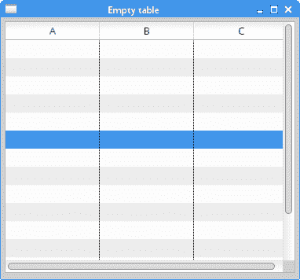
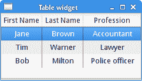
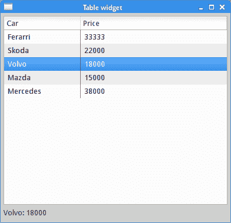
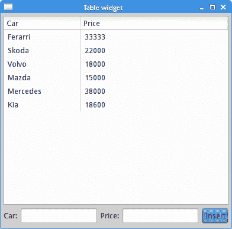

# `Table`小部件

> 原文： [http://zetcode.com/gui/javaswt/table/](http://zetcode.com/gui/javaswt/table/)

在 Java SWT 教程的这一部分中，我们介绍`Table`小部件。 `Table`是细胞的二维网格。 可以将数据写入这些单元中的每一个中。 该小部件由电子表格应用引入。

`Table`可以显示列标题，并且当单元格很多时，`Table`可以显示滚动条。

## 空表

第一个示例创建一个简单的空表。

`TableEx.java`

```java
package com.zetcode;

import org.eclipse.swt.SWT;
import org.eclipse.swt.layout.GridData;
import org.eclipse.swt.layout.GridLayout;
import org.eclipse.swt.widgets.Display;
import org.eclipse.swt.widgets.Shell;
import org.eclipse.swt.widgets.Table;
import org.eclipse.swt.widgets.TableColumn;
import org.eclipse.swt.widgets.TableItem;

/**
 * ZetCode Java SWT tutorial
 *
 * In this program, we create a simple, empty
 * table widget.
 *
 * Author: Jan Bodnar
 * Website: zetcode.com
 * Last modified: June 2015
 */

public class TableEx {

    public TableEx(Display display) {

        initUI(display);
    }

    @SuppressWarnings("unused")
    private void initUI(Display display) {

        Shell shell = new Shell(display);
        shell.setLayout(new GridLayout());

        Table table = new Table(shell, SWT.BORDER);
        table.setHeaderVisible(true);
        table.setLinesVisible(true);

        GridData data = new GridData(SWT.FILL, SWT.FILL, true, true);
        data.heightHint = 300;
        data.widthHint = 350;
        table.setLayoutData(data);

        String[] titles = { "A", "B", "C" };

        for (int i = 0; i < titles.length; i++) {
            TableColumn column = new TableColumn(table, SWT.CENTER);
            column.setWidth(120);
            column.setText(titles[i]);
        }

        for (int i = 0; i < 15; i++) {
            TableItem item = new TableItem(table, SWT.NONE);
        }

        shell.setText("Empty table");

        shell.pack();
        shell.open();

        while (!shell.isDisposed()) {
            if (!display.readAndDispatch())
                display.sleep();
        }
    }

    @SuppressWarnings("unused")
    public static void main(String[] args) {

        Display display = new Display();
        TableEx ex = new TableEx(display);
        display.dispose();
    }
}

```

该代码示例创建一个具有三列和十五行的表小部件。 表单元为空。

```java
Table table = new Table(shell, SWT.BORDER);

```

创建`Table`小部件的实例。

```java
table.setHeaderVisible(true);

```

`setHeaderVisible()`使表格标题可见。 标题由表列名称组成。

```java
table.setLinesVisible(true);

```

`setLinesVisible()`显示表格单元格的边框。 默认情况下，单元格不可见。

```java
String[] titles = { "A", "B", "C" };

```

这些是列标题。

```java
for (int i = 0; i < titles.length; i++) {
    TableColumn column = new TableColumn(table, SWT.CENTER);
    column.setWidth(120);
    column.setText(titles[i]);
}

```

在此`for`循环中，我们创建表列。 `TableColumn`的实例表示表窗口小部件中的一列。 `setWidth()`设置列的宽度，`setText()`方法设置列的名称。

```java
for (int i = 0; i < 15; i++) {
    TableItem item = new TableItem(table, SWT.NONE);
}

```

`TableItem`代表表中的一行。 这段代码创建了十五个空单元格。



Figure: Empty table

## 用数据填充单元格

在第二个示例中，表格单元格显示一些数据。

`TableEx2.java`

```java
package com.zetcode;

import org.eclipse.swt.SWT;
import org.eclipse.swt.layout.FillLayout;
import org.eclipse.swt.widgets.Display;
import org.eclipse.swt.widgets.Shell;
import org.eclipse.swt.widgets.Table;
import org.eclipse.swt.widgets.TableColumn;
import org.eclipse.swt.widgets.TableItem;

/**
 * ZetCode Java SWT tutorial
 *
 * In this program, we fill table cells
 * with data.
 *
 * Author: Jan Bodnar
 * Website: zetcode.com
 * Last modified: June 2015
 */

public class TableEx2 {

    public TableEx2(Display display) {

        initUI(display);
    }

    private void initUI(Display display) {

        Shell shell = new Shell(display, SWT.SHELL_TRIM | SWT.CENTER);
        shell.setLayout(new FillLayout());

        Table table = new Table(shell, SWT.BORDER);
        table.setHeaderVisible(true);
        table.setLinesVisible(true);

        TableColumn tc1 = new TableColumn(table, SWT.CENTER);
        TableColumn tc2 = new TableColumn(table, SWT.CENTER);
        TableColumn tc3 = new TableColumn(table, SWT.CENTER);

        tc1.setText("First Name");
        tc2.setText("Last Name");
        tc3.setText("Profession");

        tc1.setWidth(70);
        tc2.setWidth(70);
        tc3.setWidth(80);

        TableItem item1 = new TableItem(table, SWT.NONE);
        item1.setText(new String[] { "Jane", "Brown", "Accountant" });
        TableItem item2 = new TableItem(table, SWT.NONE);
        item2.setText(new String[] { "Tim", "Warner", "Lawyer" });
        TableItem item3 = new TableItem(table, SWT.NONE);
        item3.setText(new String[] { "Bob", "Milton", "Police officer" });

        shell.setText("Table widget");
        shell.pack();
        shell.open();

        while (!shell.isDisposed()) {
            if (!display.readAndDispatch())
                display.sleep();
        }
    }

    @SuppressWarnings("unused")
    public static void main(String[] args) {

        Display display = new Display();
        TableEx2 ex = new TableEx2(display);
        display.dispose();
    }
}

```

该示例显示了具有三列三行的表格小部件。 单元格充满数据。

```java
TableItem item1 = new TableItem(table, SWT.NONE);
item1.setText(new String[] { "Jane", "Brown", "Accountant" });

```

`setText()`方法用数据填充一行的所有三个单元格。



Figure: Table cells with data

## 选择表格行

以下示例介绍了表格项目的选择。

`TableEx3.java`

```java
package com.zetcode;

import org.eclipse.swt.SWT;
import org.eclipse.swt.layout.GridData;
import org.eclipse.swt.layout.GridLayout;
import org.eclipse.swt.widgets.Display;
import org.eclipse.swt.widgets.Label;
import org.eclipse.swt.widgets.Shell;
import org.eclipse.swt.widgets.Table;
import org.eclipse.swt.widgets.TableColumn;
import org.eclipse.swt.widgets.TableItem;

/**
 * ZetCode Java SWT tutorial
 *
 * In this program, we show the data from 
 * the selected row in the statusbar.
 *
 * Author: Jan Bodnar
 * Website: zetcode.com
 * Last modified: June 2015
 */

public class TableEx3 {

    private Label label;
    private final String data[][] = { { "Ferarri", "33333" },
            { "Skoda", "22000" }, { "Volvo", "18000" }, { "Mazda", "15000" },
            { "Mercedes", "38000" } };

    public TableEx3(Display display) {

        initUI(display);
    }

    private void initUI(Display display) {

        Shell shell = new Shell(display, SWT.SHELL_TRIM | SWT.CENTER);
        shell.setLayout(new GridLayout(1, true));

        Table table = new Table(shell, SWT.BORDER);
        table.setHeaderVisible(true);
         table.setLinesVisible(true);

        String[] titles = { "Car", "Price" };

        for (int i = 0; i & titles.length; i++) {
            TableColumn column = new TableColumn(table, SWT.NULL);
            column.setText(titles[i]);
            column.setWidth(130);
        }

        for (int i = 0; i & data.length; i++) {

            TableItem item = new TableItem(table, SWT.NULL);
            item.setText(0, data[i][0]);
            item.setText(1, data[i][1]);
        }

        label = new Label(shell, SWT.NONE);

        table.addListener(SWT.Selection, event -> onTableItemSelected(table));
        GridData gd = new GridData(SWT.FILL, SWT.FILL, true, true);
        gd.widthHint = 360;
        gd.heightHint = 300;
        table.setLayoutData(gd);

        label.setLayoutData(new GridData(SWT.FILL, SWT.CENTER, true, false));

        shell.setText("Table widget");
        shell.pack();
        shell.open();

        while (!shell.isDisposed()) {
            if (!display.readAndDispatch())
                display.sleep();
        }
    }

    private void onTableItemSelected(Table table) {

        TableItem[] sel = table.getSelection();
        String msg = String.format("%s: %s", sel[0].getText(0), 
                sel[0].getText(1));

        label.setText(msg);
    }

    @SuppressWarnings("unused")
    public static void main(String[] args) {

        Display display = new Display();
        TableEx3 ex = new TableEx3(display);
        display.dispose();
    }
}

```

在示例中，所选行中的数据显示在状态栏中。

```java
table.addListener(SWT.Selection, event -> onTableItemSelected(table));

```

选择监听器将添加到表中。 每当选择表格项目时，都会调用`onTableItemSelected()`。

```java
private void onTableItemSelected(Table table) {

    TableItem[] sel = table.getSelection();
    String msg = String.format("%s: %s", sel[0].getText(0), 
            sel[0].getText(1));

    label.setText(msg);
}

```

`getSelection()`方法返回一个选定表项的数组。 （由于我们使用默认选择模式（即单选模式），因此仅返回一个表项。）我们使用`getText()`方法从该行的单元格中检索数据。 我们构建消息并使用其`setText()`方法将其显示在标签中。



Figure: Selecting table items

## 添加新表项

在以下示例中，新表项被动态添加到表中。

`TableEx4.java`

```java
package com.zetcode;

import org.eclipse.swt.SWT;
import org.eclipse.swt.layout.GridData;
import org.eclipse.swt.layout.GridLayout;
import org.eclipse.swt.widgets.Button;
import org.eclipse.swt.widgets.Display;
import org.eclipse.swt.widgets.Event;
import org.eclipse.swt.widgets.Label;
import org.eclipse.swt.widgets.Shell;
import org.eclipse.swt.widgets.Table;
import org.eclipse.swt.widgets.TableColumn;
import org.eclipse.swt.widgets.TableItem;
import org.eclipse.swt.widgets.Text;

/**
 * ZetCode Java SWT tutorial
 *
 * In this program, we add new table items
 * to the table.
 *
 * Author: Jan Bodnar
 * Website: zetcode.com
 * Last modified: June 2015
 */

public class TableEx4 {

    private Text text1;
    private Text text2;
    private Table table;

    private final String data[][] = { { "Ferarri", "33333" },
            { "Skoda", "22000" }, { "Volvo", "18000" }, { "Mazda", "15000" },
            { "Mercedes", "38000" } };

    public TableEx4(Display display) {

        initUI(display);
    }

    private void initUI(Display display) {

        Shell shell = new Shell(display, SWT.SHELL_TRIM | SWT.CENTER);
        shell.setLayout(new GridLayout(5, false));

        table = new Table(shell, SWT.BORDER | SWT.MULTI);
        table.setHeaderVisible(true);
        // table.setLinesVisible(true);

        String[] titles = { "Car", "Price" };

        for (int i = 0; i < titles.length; i++) {
            TableColumn column = new TableColumn(table, SWT.NULL);
            column.setText(titles[i]);
            column.setWidth(130);
        }

        for (int i = 0; i < data.length; i++) {

            TableItem item = new TableItem(table, SWT.NULL);
            item.setText(0, data[i][0]);
            item.setText(1, data[i][1]);
        }

        GridData gd = new GridData(SWT.FILL, SWT.FILL, true, true);
        gd.horizontalSpan = 5;
        gd.widthHint = 360;
        gd.heightHint = 300;
        table.setLayoutData(gd);

        Label carName = new Label(shell, SWT.NONE);
        carName.setText("Car:");
        text1 = new Text(shell, SWT.BORDER);

        Label priceOfCar = new Label(shell, SWT.NONE);
        priceOfCar.setText("Price:");
        text2 = new Text(shell, SWT.BORDER);      

        text1.setLayoutData(new GridData(SWT.FILL, SWT.CENTER, true, false));
        text2.setLayoutData(new GridData(SWT.FILL, SWT.CENTER, true, false));

        Button addBtn = new Button(shell, SWT.PUSH);
        addBtn.setText("Insert");
        addBtn.addListener(SWT.Selection, event -> onInsertButtonSelected(event));

        shell.setText("Table widget");
        shell.pack();
        shell.open();

        while (!shell.isDisposed()) {
            if (!display.readAndDispatch())
                display.sleep();
        }
    }

    private void onInsertButtonSelected(Event event) {

        String val1 = text1.getText();
        String val2 = text2.getText();

        if (val1.isEmpty() || val2.isEmpty()) {
            return;
        }

        TableItem item = new TableItem(table, SWT.NULL);
        item.setText(0, val1);
        item.setText(1, val2);  

        text1.setText("");
        text2.setText("");
    }

    @SuppressWarnings("unused")
    public static void main(String[] args) {

        Display display = new Display();
        TableEx4 ex = new TableEx4(display);
        display.dispose();
    }
}

```

在底部，有两个文本小部件和一个按钮。 插入到文本小部件中的数据将插入到新表项的单元格中。

```java
private void onInsertButtonSelected(Event event) {

    String val1 = text1.getText();
    String val2 = text2.getText();

...
}

```

在`onInsertButtonSelected()`方法中，我们从文本小部件中获取插入的文本。

```java
if (val1.isEmpty() || val2.isEmpty()) {
    return;
}

```

我们确保文本小部件不为空。

```java
TableItem item = new TableItem(table, SWT.NULL);
item.setText(0, val1);
item.setText(1, val2);  

```

构造新表项，并获取插入的数据。

```java
text1.setText("");
text2.setText("");

```

最后，将清除文本小部件。



Figure: Adding new table items

在 Java SWT 教程的这一部分中，我们介绍了`Table`小部件。