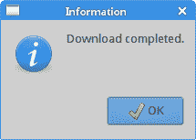
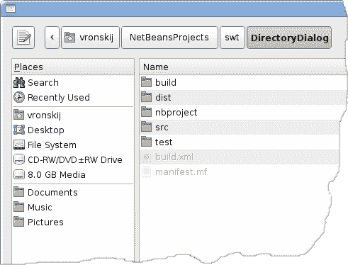
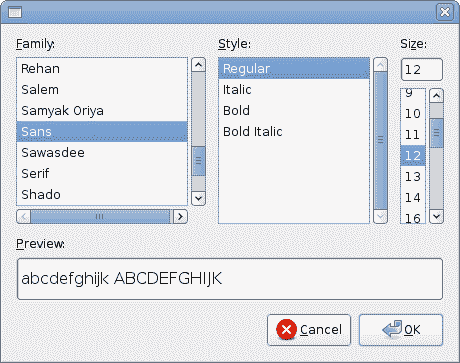
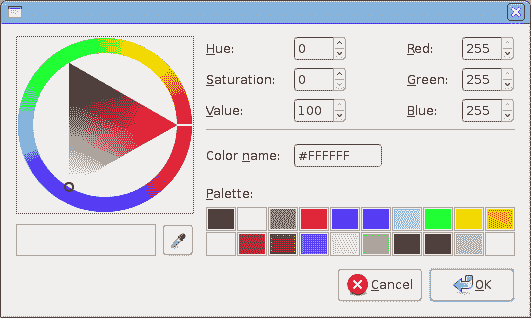

# Java SWT 中的对话框

> 原文： [http://zetcode.com/gui/javaswt/dialogs/](http://zetcode.com/gui/javaswt/dialogs/)

在 Java SWT 教程的这一部分中，我们介绍对话框。

对话框窗口或对话框是大多数现代 GUI 应用必不可少的部分。 对话被定义为两个或更多人之间的对话。 在计算机应用中，对话框是一个窗口，用于与应用“对话”。 对话框用于输入数据，修改数据，更改应用设置等。对话框是用户与计算机程序之间进行通信的重要手段。

## `MessageDialog`

`MessageBox`是一个简单的对话框，向用户提供一些信息。 它可以包含消息，图标和各种按钮。 以可用的`MessageBox`样式选择图标和按钮。 例如，`SWT.ICON_ERROR`标志在对话框上放置一个错误图标。

`MessageBoxEx.java`

```
package com.zetcode;

import org.eclipse.swt.SWT;
import org.eclipse.swt.layout.RowLayout;
import org.eclipse.swt.widgets.Button;
import org.eclipse.swt.widgets.Display;
import org.eclipse.swt.widgets.MessageBox;
import org.eclipse.swt.widgets.Shell;

/**
 * ZetCode Java SWT tutorial
 *
 * This example shows a simple MessageBox.
 *
 * Author: Jan Bodnar
 * Website: zetcode.com
 * Last modified: June 2015
 */

public class MessageBoxEx {

    private Shell shell;

    public MessageBoxEx(Display display) {

        initUI(display);
    }

    private void initUI(Display display) {

        shell = new Shell(display, SWT.SHELL_TRIM | SWT.CENTER);

        RowLayout layout = new RowLayout();
        layout.marginTop = 50;
        layout.marginBottom = 150;
        layout.marginLeft = 50;
        layout.marginRight = 150;
        shell.setLayout(layout);

        Button msgBtn = new Button(shell, SWT.PUSH);
        msgBtn.setText("Show message");
        msgBtn.addListener(SWT.Selection, event -> doShowMessageBox());

        shell.setText("Message box");
        shell.pack();
        shell.open();

        while (!shell.isDisposed()) {
          if (!display.readAndDispatch()) {
            display.sleep();
          }
        }      
    }

    private void doShowMessageBox() {

        int style = SWT.ICON_INFORMATION | SWT.OK;

        MessageBox dia = new MessageBox(shell, style);
        dia.setText("Information");
        dia.setMessage("Download completed."); 
        dia.open();
    }    

    @SuppressWarnings("unused")
    public static void main(String[] args) {

        Display display = new Display();
        MessageBoxEx ex = new MessageBoxEx(display);
        display.dispose();
    }    
}

```

窗口上有一个按钮。 单击该按钮将显示一个信息消息对话框。

```
int style = SWT.ICON_INFORMATION | SWT.OK;

```

该对话框包含一个信息图标和一个确定按钮。

```
MessageBox dia = new MessageBox(shell, style);

```

创建`MessageBox`的实例，将样式作为第二个参数。

```
dia.setText("Information");

```

对话框的标题通过`setText()`方法设置。

```
dia.setMessage("Download completed."); 

```

该消息通过`setMessage()`方法设置。



Figure: MessageBox

## 请求终止

为了防止数据丢失，以数据为中心的应用在关闭时通常会显示一个确认对话框。 仅在确认对话框后，应用才会终止。

`MessageBoxEx2.java`

```
package com.zetcode;

import org.eclipse.swt.SWT;
import org.eclipse.swt.widgets.Display;
import org.eclipse.swt.widgets.Event;
import org.eclipse.swt.widgets.MessageBox;
import org.eclipse.swt.widgets.Shell;

/**
 * ZetCode Java SWT tutorial
 *
 * This example shows a confirmation dialog
 * when its closing is initiated.
 *
 * Author: Jan Bodnar
 * Website: zetcode.com
 * Last modified: June 2015
 */

public class MessageBoxEx2 {

    private Shell shell;

    public MessageBoxEx2(Display display) {

        initUI(display);
    }

    private void initUI(Display display) {

        shell = new Shell(display, SWT.SHELL_TRIM | SWT.CENTER);

        shell.addListener(SWT.Close, event -> doShowMessageBox(event));

        shell.setText("Message box");
        shell.setSize(350, 300);
        shell.open();

        while (!shell.isDisposed()) {
            if (!display.readAndDispatch()) {
                display.sleep();
            }
        }
    }

    private void doShowMessageBox(Event event) {

        int style = SWT.APPLICATION_MODAL | SWT.ICON_QUESTION | SWT.YES
                | SWT.NO;

        MessageBox messageBox = new MessageBox(shell, style);
        messageBox.setText("Information");
        messageBox.setMessage("Really close application?");
        event.doit = messageBox.open() == SWT.YES;
    }

    @SuppressWarnings("unused")
    public static void main(String[] args) {

        Display display = new Display();
        MessageBoxEx2 ex = new MessageBoxEx2(display);
        display.dispose();
    }
}

```

此示例显示启动关闭对话框时的确认对话框。

```
shell.addListener(SWT.Close, event -> doShowMessageBox(event));

```

我们将侦听器挂钩到`SWT.Close`事件类型。

```
int style = SWT.APPLICATION_MODAL | SWT.ICON_QUESTION | SWT.YES
        | SWT.NO;

```

确认对话框是模式对话框，包含一个“问题”图标以及“是”和“否”按钮。 （模式对话框将阻止主应用，直到将其关闭。）

```
event.doit = messageBox.open() == SWT.YES;

```

将`doit`事件设置为 false 会取消该事件； 设置为 true 允许它。

## 目录对话框

`DirectoryDialog`是一个对话框，用于选择特定目录的路径。

`DirectoryDialogEx.java`

```
package com.zetcode;

import org.eclipse.swt.SWT;
import org.eclipse.swt.layout.FormAttachment;
import org.eclipse.swt.layout.FormData;
import org.eclipse.swt.layout.FormLayout;
import org.eclipse.swt.widgets.DirectoryDialog;
import org.eclipse.swt.widgets.Display;
import org.eclipse.swt.widgets.Label;
import org.eclipse.swt.widgets.Shell;

/**
 * ZetCode Java SWT tutorial
 *
 * This example shows a directory dialog.
 *
 * Author: Jan Bodnar 
 * Website: zetcode.com 
 * Last modified: June 2015
 */

public class DirectoryDialogEx {

    private Shell shell;
    private Label status;

    public DirectoryDialogEx(Display display) {

        initUI(display);
    }

    private void initUI(Display display) {

        shell = new Shell(display, SWT.SHELL_TRIM | SWT.CENTER);

        status = new Label(shell, SWT.BORDER);
        status.setText("Ready");

        FormLayout layout = new FormLayout();
        shell.setLayout(layout);

        FormData labelData = new FormData();
        labelData.left = new FormAttachment(0);
        labelData.right = new FormAttachment(100);
        labelData.bottom = new FormAttachment(100);
        status.setLayoutData(labelData);

        shell.addListener(SWT.MouseDown, event -> onMouseDown());

        shell.setText("DirectoryDialog");
        shell.setSize(350, 250);
        shell.open();

        while (!shell.isDisposed()) {
            if (!display.readAndDispatch()) {
                display.sleep();
            }
        }
    }

    private void onMouseDown() {

        DirectoryDialog dialog = new DirectoryDialog(shell);
        String path = dialog.open();

        if (path != null) {
            status.setText(path);
        }
    }

    @SuppressWarnings("unused")
    public static void main(String[] args) {

        Display display = new Display();
        DirectoryDialogEx ex = new DirectoryDialogEx(display);
        display.dispose();
    }
}

```

在我们的示例中，我们选择带有`DirectoryDialog`的目录，并在状态栏中显示其路径。 通过单击窗口区域可以显示该对话框。

```
shell.addListener(SWT.MouseDown, event -> onMouseDown());

```

将`SWT.MouseDown`事件的鼠标侦听器添加到外壳中。 当我们在窗口上按下鼠标按钮时，将调用`onMouseDown()`方法。

```
DirectoryDialog dialog = new DirectoryDialog(shell);

```

创建了`DirectoryDialog`。

```
String path = dialog.open();

```

我们获得所选目录的路径。

```
if (path != null) {
    status.setText(path);
}

```

如果路径不为空，则在状态标签中显示该路径。



Figure: Directory dialog

## `FontDialog`

`FontDialog`是用于选择字体的对话框。 它通常用于进行一些文本编辑或格式化的应用中。

`FontDialogEx.java`

```
package com.zetcode;

import org.eclipse.swt.SWT;
import org.eclipse.swt.graphics.Font;
import org.eclipse.swt.graphics.FontData;
import org.eclipse.swt.layout.RowLayout;
import org.eclipse.swt.widgets.Display;
import org.eclipse.swt.widgets.FontDialog;
import org.eclipse.swt.widgets.Label;
import org.eclipse.swt.widgets.Shell;

/**
 * ZetCode Java SWT tutorial
 *
 * This example shows a font dialog.
 *
 * Author: Jan Bodnar
 * Website: zetcode.com
 * Last modified: June 2015
 */

public class FontDialogEx {

    private Shell shell;
    private Label label;

    public FontDialogEx(Display display) {

        initUI(display);
    }

    private void initUI(Display display) {

        shell = new Shell(display, SWT.SHELL_TRIM | SWT.CENTER);

        RowLayout layout = new RowLayout();
        layout.marginHeight = 100;
        layout.marginWidth = 100;
        shell.setLayout(layout);          

        label = new Label(shell, SWT.NONE);
        label.setText("ZetCode Java SWT tutorial");

        shell.addListener(SWT.MouseDown, event -> onMouseDown());        
        shell.setText("FontDialog");
        shell.pack();
        shell.open();

        while (!shell.isDisposed()) {
            if (!display.readAndDispatch()) {
                display.sleep();
            }
        }        
    }

    private void onMouseDown() {

        FontDialog dialog = new FontDialog(shell);
        FontData fdata = dialog.open();

        if (fdata != null) {

            Font font = new Font(shell.getDisplay(), fdata);

            label.setFont(font);
            label.pack();
            shell.pack();
            font.dispose();
        }   
    }    

    @SuppressWarnings("unused")
    public static void main(String[] args) {

        Display display = new Display();
        FontDialogEx ex = new FontDialogEx(display);
        display.dispose();
    }
}

```

在代码示例中，我们使用`FontDialog`更改标签的字体。

```
FontDialog dialog = new FontDialog(shell);

```

`FontDialog`已创建。

```
Font font = new Font(shell.getDisplay(), fdata);

```

根据字体数据创建`Font`对象，由字体对话框返回。

```
label.setFont(font);

```

字体通过`setFont()`方法应用于标签。

```
label.pack();
shell.pack();

```

`pack()`方法使标签和外壳适应新的字体类型。

```
font.dispose();

```

字体是操作系统资源。 因此，必须在不再需要时将其丢弃。



Figure: FontDialog

## `ColorDialog`

`ColorDialog`是用于选择颜色的对话框。

`ColorDialogEx.java`

```
package com.zetcode;

import org.eclipse.swt.SWT;
import org.eclipse.swt.graphics.Color;
import org.eclipse.swt.graphics.RGB;
import org.eclipse.swt.layout.RowLayout;
import org.eclipse.swt.widgets.ColorDialog;
import org.eclipse.swt.widgets.Display;
import org.eclipse.swt.widgets.Label;
import org.eclipse.swt.widgets.Shell;

/**
 * ZetCode Java SWT tutorial
 *
 * This example shows a color dialog.
 *
 * Author: Jan Bodnar
 * Website: zetcode.com
 * Last modified: June 2015
 */

public class ColorDialogEx {

    private Shell shell;
    private Label label;

    public ColorDialogEx(Display display) {

        initUI(display);
    }

    private void initUI(Display display) {

        shell = new Shell(display, SWT.SHELL_TRIM | SWT.CENTER);

        RowLayout layout = new RowLayout();
        layout.marginHeight = 100;
        layout.marginWidth = 100;
        shell.setLayout(layout);             

        label = new Label(shell, SWT.NONE);
        label.setText("ZetCode Java SWT tutorial");

        shell.addListener(SWT.MouseDown, event -> onMouseDown());

        shell.setText("ColorDialog");
        shell.pack();
        shell.open();

        while (!shell.isDisposed()) {
          if (!display.readAndDispatch()) {
            display.sleep();
          }
        }        
    }

    private void onMouseDown() {

        ColorDialog dialog = new ColorDialog(shell);
        RGB rgb = dialog.open();

        if (rgb != null) {
            Color col = new Color(shell.getDisplay(), rgb);
            label.setForeground(col);
            col.dispose();
        }            
    }    

    @SuppressWarnings("unused")
    public static void main(String[] args) {

        Display display = new Display();
        ColorDialogEx ex = new ColorDialogEx(display);
        display.dispose();
    }
}

```

该示例与上一个示例非常相似。 这次我们更改标签的颜色。 单击窗口区域显示`ColorDialog`。

```
ColorDialog dialog = new ColorDialog(shell);

```

我们创建`ColorDialog`。

```
RGB rgb = dialog.open();

```

使用`ColorDialog`的`open()`方法，我们可以获得 RGB 值。

```
Color col = new Color(shell.getDisplay(), rgb);
label.setForeground(col);

```

我们获得颜色值并修改标签的颜色。

```
col.dispose();

```

`Color`是 OS 资源，因此我们在不再需要它时将其处理。



Figure: ColorDialog

## 文件对话框

`FileDialog`用于选择文件名。

`FileDialogEx.java`

```
package com.zetcode;

import org.eclipse.swt.SWT;
import org.eclipse.swt.layout.RowLayout;
import org.eclipse.swt.widgets.Display;
import org.eclipse.swt.widgets.FileDialog;
import org.eclipse.swt.widgets.Label;
import org.eclipse.swt.widgets.Shell;

/**
 * ZetCode Java SWT tutorial
 *
 * This example shows a file dialog.
 *
 * Author: Jan Bodnar
 * Website: zetcode.com
 * Last modified: June 2015
 */

public class FileDialogEx {

    private Shell shell;
    private Label label;

    public FileDialogEx(Display display) {

        initUI(display);
    }

    private void initUI(Display display) {

        shell = new Shell(display, SWT.SHELL_TRIM | SWT.CENTER);

        RowLayout layout = new RowLayout();
        layout.marginHeight = 50;
        layout.marginWidth = 50;
        shell.setLayout(layout);

        label = new Label(shell, SWT.NONE);
        String homeDir = System.getProperty("user.home"); 
        label.setText(homeDir);
        label.pack();

        shell.addListener(SWT.MouseDown, event -> onMouseDown());

        shell.setText("FileDialog");
        shell.pack();
        shell.open();

        while (!shell.isDisposed()) {
          if (!display.readAndDispatch()) {
            display.sleep();
          }
        }
    }

    private void onMouseDown() {

        FileDialog dialog = new FileDialog(shell, SWT.OPEN);

        String[] filterNames = new String[] 
            {"Java sources", "All Files (*)"};

        String[] filterExtensions = new String[] 
            {"*.java", "*"};

        dialog.setFilterNames(filterNames);
        dialog.setFilterExtensions(filterExtensions);

        String path = dialog.open();

        if (path != null) {

            label.setText(path);
            label.pack();
            shell.pack();
        }        
    }

    @SuppressWarnings("unused")
    public static void main(String[] args) {

        Display display = new Display();
        FileDialogEx ex = new FileDialogEx(display);
        display.dispose();
    }
}

```

该代码示例使用`FileDialog`选择文件。 该对话框使用过滤器仅显示 Java 源。 所选文件的名称显示在标签中。

```
label = new Label(shell, SWT.NONE);
String homeDir = System.getProperty("user.home"); 
label.setText(homeDir);
label.pack();

```

首先，标签小部件将显示用户的主目录。

```
FileDialog dialog = new FileDialog(shell, SWT.OPEN);

```

我们用`SWT.OPEN`标志创建一个`FileDialog`。 该对话框可用于打开或保存文件。 对话框的保存行为通过`SWT.SAVE`常量启用。

```
String[] filterNames = new String[] 
{"Java sources", "All Files (*)"};

String[] filterExtensions = new String[] 
    {"*.java", "*"};

dialog.setFilterNames(filterNames);
dialog.setFilterExtensions(filterExtensions);

```

我们使用两个过滤器； 一种用于 Java 源，一种用于所有文件类型。

```
String path = dialog.open();

```

使用`FileDialog`的`open()`方法检索路径名。

```
if (path != null) {

    label.setText(path);
    label.pack();
    shell.pack();
}

```

路径名通过`setText()`方法设置为标签。 标签和外壳通过`pack()`方法适应返回路径的大小。

Java SWT 教程的这一部分是关于 SWT 中的对话框的。