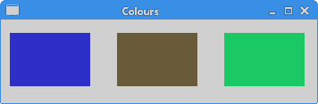
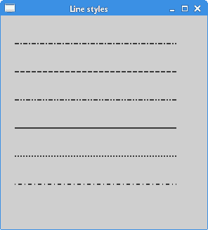
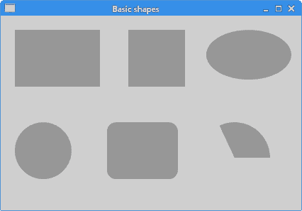
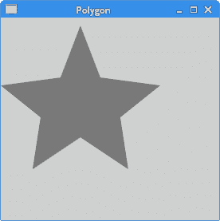
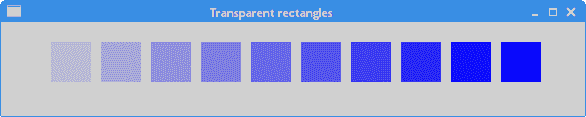
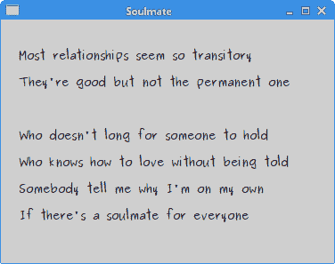

# Java SWT 绘图

> 原文： [http://zetcode.com/gui/javaswt/painting/](http://zetcode.com/gui/javaswt/painting/)

在 Java SWT 教程的这一部分中，我们进行了一些绘制。

在实现`Drawable`接口的对象上执行绘制。 这包括`Control`，`Image`，`Display`设备或`Printer`设备。

`org.eclipse.swt.graphics.GC`是一个图形上下文，其中封装了可以执行的绘制操作。 使用`GC`有两种常见方法； 通过使用`Drawable`实例作为构造函数参数创建一个，或使用作为`paintEvent`回调的一部分提供的`GC`创建一个。

## 色彩

在第一个示例中，我们处理颜色。 颜色是代表红色，绿色和蓝色（RGB）强度值的组合的对象。 在 Java SWT 中，有效的 RGB 值在 0 到 255 之间。

`ColoursEx.java`

```
package com.zetcode;

import org.eclipse.swt.SWT;
import org.eclipse.swt.graphics.Color;
import org.eclipse.swt.graphics.GC;
import org.eclipse.swt.widgets.Display;
import org.eclipse.swt.widgets.Event;
import org.eclipse.swt.widgets.Shell;

/**
 * ZetCode Java SWT tutorial
 *
 * This program draws three rectangles.
 * The interiors are filled with
 * different colors.
 * 
 * Author: Jan Bodnar
 * Website: zetcode.com
 * Last modified: June 2015
 */

public class ColoursEx {

    private Shell shell;

    public ColoursEx(Display display) {

        initUI(display);
    }

    private void initUI(Display display) {

        shell = new Shell(display, SWT.SHELL_TRIM | SWT.CENTER);

        shell.addListener(SWT.Paint, event -> drawRectangles(event));

        shell.setText("Colours");
        shell.setSize(360, 120);
        shell.open();

        while (!shell.isDisposed()) {
            if (!display.readAndDispatch()) {
                display.sleep();
            }
        }
    }

    private void drawRectangles(Event e) {

        GC gc = e.gc;

        Color c1 = new Color(e.display, 50, 50, 200);
        gc.setBackground(c1);
        gc.fillRectangle(10, 15, 90, 60);

        Color c2 = new Color(e.display, 105, 90, 60);
        gc.setBackground(c2);
        gc.fillRectangle(130, 15, 90, 60);

        Color c3 = new Color(e.display, 33, 200, 100);
        gc.setBackground(c3);
        gc.fillRectangle(250, 15, 90, 60);

        c1.dispose();
        c2.dispose();
        c3.dispose();
    }

    @SuppressWarnings("unused")
    public static void main(String[] args) {

        Display display = new Display();
        ColoursEx ex = new ColoursEx(display);
        display.dispose();
    }
}

```

在我们的示例中，我们绘制了三个矩形，并用三种不同的颜色填充它们。

```
shell.addListener(SWT.Paint, event -> drawRectangles(event));

```

我们为绘图事件添加了绘图监听器。

```
private void drawRectangles(Event e) {

    GC gc = e.gc;
...    
}        

```

生成绘图事件时将调用`drawRectangles()`方法。 我们获得了图形上下文的句柄，该上下文是我们在其上执行绘制操作的对象。

```
Color c1 = new Color(e.display, 50, 50, 200);

```

我们创建一个颜色对象。

```
gc.setBackground(c1);

```

`setBackground()`方法为绘图文本和形状的内部设置颜色。

```
gc.fillRectangle(10, 15, 90, 60);

```

`fillRectangle()`用背景色填充指定的矩形。

```
c1.dispose();
c2.dispose();
c3.dispose();

```

在绘图结束时，释放颜色资源。



Figure: Colours

## 直线

`drawLine()`方法在可绘制对象上绘制一条线。 `setLineStyle()`方法指定线条的样式。 以下是内置的 SWT 线型：

*   `SWT.LINE_DOT`
*   `SWT.LINE_DASH`
*   `SWT.LINE_DASHDOT`
*   `SWT.LINE_DASHDOTDOT`
*   `SWT.LINE_SOLID`

也可以使用`SWT.LINE_CUSTOM`选项创建自定义线条样式。

`LineStylesEx.java`

```
package com.zetcode;

import org.eclipse.swt.SWT;
import org.eclipse.swt.graphics.GC;
import org.eclipse.swt.widgets.Display;
import org.eclipse.swt.widgets.Event;
import org.eclipse.swt.widgets.Shell;

/**
 * ZetCode Java SWT tutorial
 *
 * This program draws text on the window.
 *
 * Author: Jan Bodnar
 * Website: zetcode.com
 * Last modified: June 2015
 */

public class LineStylesEx {

    public LineStylesEx(Display display) {

        initUI(display);
    }

    private void initUI(Display display) {

        Shell shell = new Shell(display);

        shell.addListener(SWT.Paint, event -> drawLyrics(event));

        shell.setText("Line styles");
        shell.setSize(300, 330);
        shell.open();

        while (!shell.isDisposed()) {
            if (!display.readAndDispatch()) {
                display.sleep();
            }
        }
    }

    private void drawLyrics(Event e) {

        GC gc = e.gc;

        gc.setLineWidth(2);

        gc.setLineStyle(SWT.LINE_DASHDOT);
        gc.drawLine(20, 40, 250, 40);

        gc.setLineStyle(SWT.LINE_DASH);
        gc.drawLine(20, 80, 250, 80);

        gc.setLineStyle(SWT.LINE_DASHDOTDOT);
        gc.drawLine(20, 120, 250, 120);        

        gc.setLineStyle(SWT.LINE_SOLID);
        gc.drawLine(20, 160, 250, 160);

        gc.setLineStyle(SWT.LINE_DOT);
        gc.drawLine(20, 200, 250, 200);       

        gc.setLineStyle(SWT.LINE_CUSTOM);
        gc.setLineDash(new int[] {1, 4, 5, 4});
        gc.drawLine(20, 240, 250, 240);
    }

    @SuppressWarnings("unused")
    public static void main(String[] args) {

        Display display = new Display();
        LineStylesEx ex = new LineStylesEx(display);
        display.dispose();
    }
}

```

该示例绘制了五条标准样式线和一种自定义样式。

```
gc.setLineWidth(2);

```

`setLineWidth()`设置绘制线时使用的宽度。

```
gc.setLineStyle(SWT.LINE_DASHDOT);

```

`setLineStyle()`将线条样式设置为`SWT.LINE_DASHDOT`。 该线由点划线组成。

```
gc.drawLine(20, 40, 250, 40);

```

`drawLine()`画一条线。 参数是起点和终点的 x 和 y 坐标。

```
gc.setLineStyle(SWT.LINE_CUSTOM);
gc.setLineDash(new int[] {1, 4, 5, 4});
gc.drawLine(20, 240, 250, 240);

```

这些线创建自定义线型样式。 整数数组指定行间距和破折号的宽度。 在我们的示例中，图案为 1 像素破折号，4 像素间隔，5 像素破折号和 4 像素间隔。 对整个行重复此模式。



Figure: Line styles

## 基本形状

下一个示例将一些基本形状绘制到窗口上。

`BasicShapesEx.java`

```
package com.zetcode;

import org.eclipse.swt.SWT;
import org.eclipse.swt.graphics.Color;
import org.eclipse.swt.graphics.GC;
import org.eclipse.swt.widgets.Display;
import org.eclipse.swt.widgets.Event;
import org.eclipse.swt.widgets.Shell;

/**
 * ZetCode Java SWT tutorial
 *
 * In this program, we draw some
 * basic shapes.
 *
 * Author: Jan Bodnar
 * Website: zetcode.com
 * Last modified: June 2015
 */

public class BasicShapesEx {

    private Shell shell;

    public BasicShapesEx(Display display) {

        initUI(display);
    }

    private void initUI(Display display) {

        shell = new Shell(display, SWT.SHELL_TRIM | SWT.CENTER);

        shell.addListener(SWT.Paint, event -> drawShapes(event));

        shell.setText("Basic shapes");
        shell.setSize(430, 300);
        shell.open();

        while (!shell.isDisposed()) {
            if (!display.readAndDispatch()) {
                display.sleep();
            }
        }        
    }

    private void drawShapes(Event e) {

        GC gc = e.gc;

        gc.setAntialias(SWT.ON);

        Color col = new Color(e.display, 150, 150, 150);
        gc.setBackground(col);

        gc.fillRectangle(20, 20, 120, 80);
        gc.fillRectangle(180, 20, 80, 80);
        gc.fillOval(290, 20, 120, 70);

        gc.fillOval(20, 150, 80, 80);
        gc.fillRoundRectangle(150, 150, 100, 80, 25, 25);
        gc.fillArc(280, 150, 100, 100, 0, 115);

        col.dispose();
    }

    @SuppressWarnings("unused")
    public static void main(String[] args) {

        Display display = new Display();
        BasicShapesEx ex = new BasicShapesEx(display);
        display.dispose();
    }
}

```

在此示例中，我们将创建一个矩形，一个正方形，一个椭圆形，一个圆形，一个圆角矩形和一个圆弧。

```
gc.fillRectangle(20, 20, 120, 80);
gc.fillRectangle(180, 20, 80, 80);
gc.fillOval(290, 20, 120, 70);

```

这些线绘制一个矩形，一个正方形和一个椭圆形。

```
gc.fillOval(20, 150, 80, 80);

```

在这里`fillOval()`方法画一个圆。

```
gc.fillRoundRectangle(150, 150, 100, 80, 25, 25);
gc.fillArc(280, 150, 100, 100, 0, 115);

```

这两条线绘制了一个圆角的矩形和一个圆弧。



Figure: Basic shapes

## 多边形

多边形是具有直边的二维平面形状。

`PolygonEx.java`

```
package com.zetcode;

import org.eclipse.swt.SWT;
import org.eclipse.swt.graphics.Color;
import org.eclipse.swt.graphics.GC;
import org.eclipse.swt.widgets.Display;
import org.eclipse.swt.widgets.Event;
import org.eclipse.swt.widgets.Shell;

/**
 * ZetCode Java SWT tutorial
 *
 * This program draws a star.
 *
 * Author: Jan Bodnar
 * Website: zetcode.com
 * Last modified: June 2015
 */

public class PolygonEx {

    private final int points[] = { 0, 85, 75, 75, 100, 10, 
            125, 75, 200, 85, 150, 125, 160, 190, 100, 150, 
            40, 190, 50, 125, 0, 85 };

    public PolygonEx(Display display) {

        initUI(display);
    }

    private void initUI(Display display) {

        Shell shell = new Shell(display);

        shell.addListener(SWT.Paint, event -> drawPolygon(event));

        shell.setText("Polygon");
        shell.setSize(280, 280);
        shell.open();

        while (!shell.isDisposed()) {
            if (!display.readAndDispatch()) {
                display.sleep();
            }
        }
    }

    private void drawPolygon(Event e) {

        GC gc = e.gc;

        Color grayCol = new Color(e.display, 120, 120, 120);

        gc.setBackground(grayCol);
        gc.fillPolygon(points);

        grayCol.dispose();
    }

    @SuppressWarnings("unused")
    public static void main(String[] args) {

        Display display = new Display();
        PolygonEx ex = new PolygonEx(display);
        display.dispose();
    }
}

```

该示例绘制了一个起始对象。

```
private final int points[] = { 0, 85, 75, 75, 100, 10, 
        125, 75, 200, 85, 150, 125, 160, 190, 100, 150, 
        40, 190, 50, 125, 0, 85 };

```

这些是多边形的坐标。 该数组由成对的 x 和 y 坐标组成。

```
Color grayCol = new Color(e.display, 120, 120, 120);

```

多边形以某种灰色绘制。

```
gc.fillPolygon(points);

```

`fillPolygon()`填充封闭多边形的内部，该多边形由指定的整数坐标数组定义。



Figure: Polygon

## 透明矩形

透明性是指能够透视材料的质量。 了解透明度的最简单方法是想象一块玻璃或水。 从技术上讲，光线可以穿过玻璃，这样我们就可以看到玻璃后面的物体。

在计算机图形学中，我们可以使用 alpha 合成来实现透明效果。 Alpha 合成是将图像与背景组合以创建部分透明外观的过程。 合成过程使用 Alpha 通道。 （wikipedia.org，answers.com）

`TransparentRectanglesEx.java`

```
package com.zetcode;

import org.eclipse.swt.SWT;
import org.eclipse.swt.graphics.Color;
import org.eclipse.swt.graphics.GC;
import org.eclipse.swt.widgets.Display;
import org.eclipse.swt.widgets.Event;
import org.eclipse.swt.widgets.Shell;

/**
 * ZetCode Java SWT tutorial
 *
 * This program draws ten rectangles with different
 * levels of transparency.
 *
 * Author: Jan Bodnar
 * Website: zetcode.com
 * Last modified: June 2015
 */

public class TrasparentRectanglesEx {

    public TrasparentRectanglesEx(Display display) {

        initUI(display);
    }

    private void initUI(Display display) {

        Shell shell = new Shell(display, SWT.SHELL_TRIM | SWT.CENTER);

        shell.addListener(SWT.Paint, event -> drawRectangles(event));

        shell.setText("Transparent rectangles");
        shell.setSize(590, 120);
        shell.open();

        while (!shell.isDisposed()) {
            if (!display.readAndDispatch()) {
                display.sleep();
            }
        }
    }

    private void drawRectangles(Event e) {

        GC gc = e.gc;

        Color blueCol = new Color(e.display, 0, 0, 255);
        gc.setBackground(blueCol);

        for (int i = 1; i < 11; i++) {
            gc.setAlpha(i * 25);
            gc.fillRectangle(50 * i, 20, 40, 40);
        }

        blueCol.dispose();
    }

    @SuppressWarnings("unused")
    public static void main(String[] args) {
        Display display = new Display();
        TrasparentRectanglesEx ex = new TrasparentRectanglesEx(display);
        display.dispose();
    }
}

```

在该示例中，我们绘制了十个透明度不同的矩形。

```
gc.setAlpha(i * 25);

```

`setAlpha()`方法设置 aplha 透明度值。



Figure: Transparent rectangles

## 甜甜圈

在下面的示例中，我们通过旋转一堆椭圆来创建复杂的形状。

`DonutEx.java`

```
package com.zetcode;

import org.eclipse.swt.SWT;
import org.eclipse.swt.graphics.GC;
import org.eclipse.swt.graphics.Transform;
import org.eclipse.swt.widgets.Display;
import org.eclipse.swt.widgets.Event;
import org.eclipse.swt.widgets.Shell;

/**
 * ZetCode Java SWT tutorial
 *
 * This program creates a donut shape.
 *
 * Author: Jan Bodnar
 * Website: zetcode.com
 * Last modified: June 2015
 */

public class DonutEx {

    public DonutEx(Display display) {

        initUI(display);
    }

    private void initUI(Display display) {

        Shell shell = new Shell(display, SWT.SHELL_TRIM | SWT.CENTER);

        shell.addListener(SWT.Paint, event -> drawDonut(event));

        shell.setText("Donut");
        shell.setSize(430, 300);
        shell.open();

        while (!shell.isDisposed()) {
            if (!display.readAndDispatch()) {
                display.sleep();
            }
        }
    }

    private void drawDonut(Event e) {

        GC gc = e.gc;

        int w = e.width;
        int h = e.height;

        gc.setAntialias(SWT.ON);

        Transform tr = new Transform(e.display);
        tr.translate(w / 2, h / 2);
        gc.setTransform(tr);

        for (int rot = 0; rot < 36; rot++) {

            tr.rotate(5f);
            gc.setTransform(tr);
            gc.drawOval(-125, -40, 250, 80);
        }

        tr.dispose();
    }

    @SuppressWarnings("unused")
    public static void main(String[] args) {

        Display display = new Display();
        DonutEx ex = new DonutEx(display);
        display.dispose();
    }
}

```

在此示例中，我们创建一个甜甜圈。 形状类似于 Cookie，因此称为甜甜圈。

```
gc.setAntialias(SWT.ON);

```

我们使用`setAntialias()`方法打开抗锯齿功能，这可以使绘图更平滑。

```
Transform tr = new Transform(e.display);
tr.translate(w / 2, h / 2);
gc.setTransform(tr);

```

我们将轴的中心移到窗口的中心。

```
for (int rot = 0; rot < 36; rot++) {

    tr.rotate(5f);
    gc.setTransform(tr);
    gc.drawOval(-125, -40, 250, 80);
}

```

在 for 循环中，我们进行旋转操作并绘制椭圆。

## 绘制文字

在下一个示例中，我们在窗口上绘制一些文本。

`SoulmateEx.java`

```
package com.zetcode;

import org.eclipse.swt.SWT;
import org.eclipse.swt.graphics.Color;
import org.eclipse.swt.graphics.Font;
import org.eclipse.swt.graphics.GC;
import org.eclipse.swt.widgets.Display;
import org.eclipse.swt.widgets.Event;
import org.eclipse.swt.widgets.Shell;

/**
 * ZetCode Java SWT tutorial
 *
 * This program draws text
 * on the window.
 *
 * Author: Jan Bodnar
 * Website: zetcode.com
 * Last modified: June 2015
 */

public class LyricsEx {

    public LyricsEx(Display display) {

        initUI(display);
    }

    private void initUI(Display display) {

        Shell shell = new Shell(display);

        shell.addListener(SWT.Paint, event -> drawLyrics(event));

        shell.setText("Soulmate");
        shell.setSize(380, 300);
        shell.open();

        while (!shell.isDisposed()) {
            if (!display.readAndDispatch()) {
                display.sleep();
            }
        }
    }

    private void drawLyrics(Event e) {

        GC gc = e.gc;

        gc.setAntialias(SWT.ON);

        Font font = new Font(e.display, "Purisa", 10, SWT.NORMAL);
        Color col = new Color(e.display, 25, 25, 25);

        gc.setForeground(col);
        gc.setFont(font);

        gc.drawText("Most relationships seem so transitory", 20, 30);
        gc.drawText("They're good but not the permanent one", 20, 60);
        gc.drawText("Who doesn't long for someone to hold", 20, 120);
        gc.drawText("Who knows how to love without being told", 20, 150);
        gc.drawText("Somebody tell me why I'm on my own", 20, 180);
        gc.drawText("If there's a soulmate for everyone", 20, 210);

        col.dispose();
        font.dispose();
    }

    @SuppressWarnings("unused")
    public static void main(String[] args) {

        Display display = new Display();
        LyricsEx ex = new LyricsEx(display);
        display.dispose();
    }
}

```

我们显示 Natasha Bedingfields Soulmate 歌曲的部分歌词。

```
Font font = new Font(e.display, "Purisa", 10, SWT.NORMAL);

```

在这里，我们指定使用的字体。

```
gc.drawText("Most relationships seem so transitory", 20, 30);

```

`drawText()`方法将文本绘制到窗口上。



Figure: Soulmate

在 Java SWT 教程的这一章中，我们做了一些绘图。