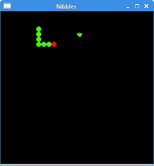

# Java SWT 中的贪食蛇

> 原文： [http://zetcode.com/gui/javaswt/nibbles/](http://zetcode.com/gui/javaswt/nibbles/)

在 Java SWT 教程的这一部分中，我们创建了贪食蛇游戏克隆。

贪食蛇是较旧的经典视频游戏。 它最初是在 70 年代后期创建的； 后来它被带到 PC 上。 在此游戏中，玩家控制蛇。 目的是尽可能多地吃苹果。 蛇每次吃一个苹果，它的身体就会长大。 蛇必须避开墙壁和自己的身体。

## 开发

蛇的每个关节的大小为 10 像素。 蛇由光标键控制。 最初，蛇具有三个关节。 游戏立即开始。 游戏结束后，窗口中央将显示“游戏结束”消息。

`Board.java`

```java
package com.zetcode;

import org.eclipse.swt.SWT;
import org.eclipse.swt.graphics.Color;
import org.eclipse.swt.graphics.Font;
import org.eclipse.swt.graphics.GC;
import org.eclipse.swt.graphics.Image;
import org.eclipse.swt.graphics.ImageData;
import org.eclipse.swt.graphics.Point;
import org.eclipse.swt.widgets.Canvas;
import org.eclipse.swt.widgets.Display;
import org.eclipse.swt.widgets.Event;
import org.eclipse.swt.widgets.Shell;

public class Board extends Canvas {

    private final int WIDTH = 300;
    private final int HEIGHT = 300;
    private final int DOT_SIZE = 10;
    private final int ALL_DOTS = 900;
    private final int RAND_POS = 29;
    private final int DELAY = 140;

    private int x[] = new int[ALL_DOTS];
    private int y[] = new int[ALL_DOTS];

    private int dots;
    private int apple_x;
    private int apple_y;

    private boolean left = false;
    private boolean right = true;
    private boolean up = false;
    private boolean down = false;
    private boolean inGame = true;

    private Image ball;
    private Image apple;
    private Image head;

    private Display display;
    private Shell shell;
    private Runnable runnable;

    public Board(Shell shell) {
        super(shell, SWT.NULL);

        this.shell = shell;

        initBoard();
    }

    private void initBoard() {

        display = shell.getDisplay();

        addListener(SWT.Paint, event -> doPainting(event));
        addListener(SWT.KeyDown, event -> onKeyDown(event));

        addListener(SWT.Dispose, event -> {

            ball.dispose();
            apple.dispose();
            head.dispose();
        });

        Color col = new Color(shell.getDisplay(), 0, 0, 0);

        setBackground(col);
        col.dispose();

        loadImages();

        initGame();
    }

    private void loadImages() {

        ImageData iib = new ImageData("dot.png");
        ball = new Image(display, iib);

        ImageData iia = new ImageData("apple.png");
        apple = new Image(display, iia);

        ImageData iih = new ImageData("head.png");
        head = new Image(display, iih);
    }

    private void initGame() {

        dots = 3;

        for (int z = 0; z < dots; z++) {
            x[z] = 50 - z * 10;
            y[z] = 50;
        }

        locateApple();

        runnable = new Runnable() {
            @Override
            public void run() {

                if (inGame) {
                    checkApple();
                    checkCollision();
                    move();

                }

                display.timerExec(DELAY, this);
                redraw();
            }
        };

        display.timerExec(DELAY, runnable);
    };

    private void doPainting(Event e) {

        GC gc = e.gc;

        Color col = new Color(shell.getDisplay(), 0, 0, 0);
        gc.setBackground(col);
        col.dispose();

        gc.setAntialias(SWT.ON);

        if (inGame) {
            drawObjects(e);
        } else {
            gameOver(e);
        }
    }

    private void drawObjects(Event e) {

        GC gc = e.gc;

        gc.drawImage(apple, apple_x, apple_y);

        for (int z = 0; z < dots; z++) {
            if (z == 0) {
                gc.drawImage(head, x[z], y[z]);
            } else {
                gc.drawImage(ball, x[z], y[z]);
            }
        }
    }

    private void gameOver(Event e) {

        GC gc = e.gc;

        String msg = "Game Over";

        Font font = new Font(e.display, "Helvetica", 12, SWT.NORMAL);
        Color whiteCol = new Color(e.display, 255, 255, 255);

        gc.setForeground(whiteCol);
        gc.setFont(font);

        Point size = gc.textExtent(msg);

        gc.drawText(msg, (WIDTH - size.x) / 2, (HEIGHT - size.y) / 2);

        font.dispose();
        whiteCol.dispose();

        display.timerExec(-1, runnable);
    }

    private void checkApple() {

        if ((x[0] == apple_x) && (y[0] == apple_y)) {
            dots++;
            locateApple();
        }
    }

    private void move() {

        for (int z = dots; z > 0; z--) {
            x[z] = x[(z - 1)];
            y[z] = y[(z - 1)];
        }

        if (left) {
            x[0] -= DOT_SIZE;
        }

        if (right) {
            x[0] += DOT_SIZE;
        }

        if (up) {
            y[0] -= DOT_SIZE;
        }

        if (down) {
            y[0] += DOT_SIZE;
        }
    }

    public void checkCollision() {

        for (int z = dots; z > 0; z--) {

            if ((z > 4) && (x[0] == x[z]) && (y[0] == y[z])) {
                inGame = false;
            }
        }

        if (y[0] > HEIGHT - DOT_SIZE) {
            inGame = false;
        }

        if (y[0] < 0) {
            inGame = false;
        }

        if (x[0] > WIDTH - DOT_SIZE) {
            inGame = false;
        }

        if (x[0] < 0) {
            inGame = false;
        }
    }

    public void locateApple() {

        int r = (int) (Math.random() * RAND_POS);
        apple_x = ((r * DOT_SIZE));
        r = (int) (Math.random() * RAND_POS);
        apple_y = ((r * DOT_SIZE));
    }

    private void onKeyDown(Event e) {

        int key = e.keyCode;

        if ((key == SWT.ARROW_LEFT) && (!right)) {
            left = true;
            up = false;
            down = false;
        }

        if ((key == SWT.ARROW_RIGHT) && (!left)) {
            right = true;
            up = false;
            down = false;
        }

        if ((key == SWT.ARROW_UP) && (!down)) {
            up = true;
            right = false;
            left = false;
        }

        if ((key == SWT.ARROW_DOWN) && (!up)) {
            down = true;
            right = false;
            left = false;
        }
    }
}

```

首先，我们将定义一些在游戏中使用的全局变量。

`WIDTH`和`HEIGHT`常数确定电路板的大小。 `DOT_SIZE`是苹果的大小和蛇的点。 `ALL_DOTS`常数定义了板上可能的最大点数。 `RAND_POS`常数用于计算苹果的随机位置。 `DELAY`常数确定游戏的速度。

```java
private int x[] = new int[ALL_DOTS];
private int y[] = new int[ALL_DOTS];

```

这两个数组存储蛇的所有可能关节的 x 和 y 坐标。

`initGame()`方法初始化变量，加载图像并启动超时功能。

```java
runnable = new Runnable() {
    @Override
    public void run() {

        if (inGame) {
            checkApple();
            checkCollision();
            move();

        }

        display.timerExec(DELAY, this);
        redraw();
    }
};

```

每隔`DELAY` ms，将调用`run()`方法。 如果我们参与了游戏，我们将调用三种构建游戏逻辑的方法。

```java
if (inGame) {
    drawObjects(e);
} else {
    gameOver(e);
}

```

在`doPainting()`方法内部，我们检查`inGame`变量。 如果是真的，我们将绘制对象-苹果和蛇关节。 否则，我们显示“游戏结束”文本。

```java
private void drawObjects(Event e) {

    GC gc = e.gc;

    gc.drawImage(apple, apple_x, apple_y);

    for (int z = 0; z < dots; z++) {
        if (z == 0) {
            gc.drawImage(head, x[z], y[z]);
        } else {
            gc.drawImage(ball, x[z], y[z]);
        }
    }
}

```

`drawObjects()`方法绘制苹果和蛇的关节。 蛇的第一个关节是其头部，用红色圆圈表示。

```java
public void checkApple() {

    if ((x[0] == apple_x) && (y[0] == apple_y)) {
        dots++;
        locateApple();
    }
}

```

`checkApple()`方法检查蛇是否击中了苹果对象。 如果是这样，我们添加另一个蛇形关节并调用`locateApple()`方法，该方法将随机放置一个新的`Apple`对象。

在`move()`方法中，我们有游戏的密钥算法。 要了解它，请看一下蛇是如何运动的。 您控制蛇的头。 您可以使用光标键更改其方向。 其余关节在链上向上移动一个位置。 第二关节移动到第一个关节的位置，第三关节移动到第二个关节的位置，依此类推。

```java
for (int z = dots; z > 0; z--) {
    x[z] = x[(z - 1)];
    y[z] = y[(z - 1)];
}

```

该代码将关节向上移动。

```java
if (left) {
    x[0] -= DOT_SIZE;
}

```

将头向左移动。

在`checkCollision()`方法中，我们确定蛇是否击中了自己或撞墙之一。

```java
for (int z = dots; z > 0; z--) {

    if ((z > 4) && (x[0] == x[z]) && (y[0] == y[z])) {
    inGame = false;
    }
}

```

如果蛇用头撞到关节之一，我们就结束游戏。

```java
if (y[0] > HEIGHT - DOT_SIZE) {
    inGame = false;
}

```

如果蛇击中了棋盘的底部，我们就结束了游戏。

`locateApple()`方法在板上随机放置一个苹果。

```java
int r = (int) (Math.random() * RAND_POS);

```

我们得到一个从 0 到`RAND_POS-1`的随机数。

```java
apple_x = ((r * DOT_SIZE));
...
apple_y = ((r * DOT_SIZE));

```

这些行设置了`apple`对象的 x 和 y 坐标。

在`onKeyDown()`方法中，我们确定按下的键。

```java
if ((key == SWT.ARROW_LEFT) && (!right)) {
    left = true;
    up = false;
    down = false;
}

```

如果按左光标键，则将`left`变量设置为`true`。 在`move()`方法中使用此变量来更改蛇对象的坐标。 还要注意，当蛇向右行驶时，我们不能立即向左转。

`Nibbles.java`

```java
package com.zetcode;

import org.eclipse.swt.SWT;
import org.eclipse.swt.layout.FillLayout;
import org.eclipse.swt.widgets.Display;
import org.eclipse.swt.widgets.Shell;

/**
 * ZetCode Java SWT tutorial
 *
 * In this code example, we create
 * a Nibbles game clone
 *
 * Author: Jan Bodnar
 * Website: zetcode.com
 * Last modified: June 2015
 */

public class Nibbles {

    private final int WIDTH = 300;
    private final int HEIGHT = 300;

    public Nibbles(Display display) {

        initUI(display);
    }

    @SuppressWarnings("unused")
    private void initUI(Display display) {

        Shell shell = new Shell(display, SWT.SHELL_TRIM | SWT.CENTER);

        FillLayout layout = new FillLayout();
        shell.setLayout(layout);

        Board board = new Board(shell);        

        shell.setText("Nibbles");
        int borW = shell.getSize().x - shell.getClientArea().width;
        int borH = shell.getSize().y - shell.getClientArea().height;
        shell.setSize(WIDTH + borW, HEIGHT + borH);

        shell.open();

        while (!shell.isDisposed()) {
          if (!display.readAndDispatch()) {
            display.sleep();
          }
        }
    }

    @SuppressWarnings("unused")
    public static void main(String[] args) {

        Display display = new Display();
        Nibbles ex = new Nibbles(display);
        display.dispose();
    }
}

```

在本课程中，我们设置了半字节游戏。

```java
int borW = shell.getSize().x - shell.getClientArea().width;
int borH = shell.getSize().y - shell.getClientArea().height;
shell.setSize(WIDTH + borW, HEIGHT + borH);

```

在设置外壳大小时，我们还需要考虑窗口装饰。



图：贪食蛇

这是使用 SWT 库和 Java 编程语言编程的贪食蛇电脑游戏。