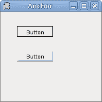
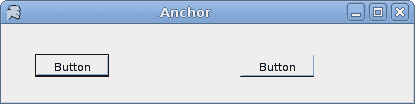
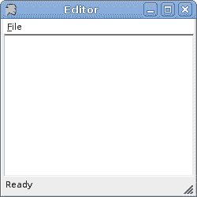

# Mono Winforms 中的布局管理

> 原文： [http://zetcode.com/gui/csharpwinforms/layout/](http://zetcode.com/gui/csharpwinforms/layout/)

Mono Winforms 教程继续进行控件的布局管理。 在将控件放置在其父容器上之后，我们必须确保其布局正确。

## `Anchor`

控件的`Anchor`属性确定如何使用其父控件调整其大小。 锚是海洋世界中的一个术语。 当船锚掉入水中时，船就固定在某个地方。 Winforms 控件也是如此。

Winforms 中的每个控件都可以具有以下`AnchorStyles`值之一：

*   最佳
*   剩下
*   对
*   底部

注意，控件不限于一个值。 他们可以使用|组合这些值。 操作员。

## `Anchor`基本示例

下面的示例显示一个非常基本的示例，演示`Anchor`属性。

`anchor.cs`

```
using System;
using System.Drawing;
using System.Windows.Forms;

class MForm : Form {

    public MForm() {
        Text = "Anchor";
        Size = new Size(210, 210);

        Button btn1 = new Button();
        btn1.Text = "Button";
        btn1.Parent = this;
        btn1.Location = new Point(30, 30);

        Button btn2 = new Button();
        btn2.Text = "Button";
        btn2.Parent = this;
        btn2.Location = new Point(30, 80);
        btn2.Anchor = AnchorStyles.Right;

        CenterToScreen();
    }
}

class MApplication {
    public static void Main() {
        MForm mf = new MForm();
        Application.Run(mf);
    }
}

```

这是一个非常基本的代码示例，清楚地显示了`Anchor`属性的含义。 我们在表单上有两个按钮。 第一个按钮具有默认的`AnchorStyles`值，即 AnchorStyles。 AnchorStyles.Left。 第二个按钮明确设置了 AnchorStyles.Right。

```
btn2.Anchor = AnchorStyles.Right;

```

我们将第二个按钮的`Anchor`属性明确设置为 AnchorStyles.Right 值。

现在看看以下两个图像。 左边的是开始时显示的应用。 调整大小后，右侧显示相同的应用。 第一个按钮与表单的左边界和上边界保持距离。 第二个按钮与表单的右边框保持距离。 但是它在垂直方向上没有保持任何距离。





Figure: Before and after resizing

## `Dock`

`Dock`属性允许我们将控件粘贴到父窗体或控件的特定边缘。

以下是可能的`DockStyle`值。

*   最佳
*   剩下
*   对
*   底部
*   填
*   没有

## 编辑器骨架

以下代码示例演示了正在使用的`Dock`属性。

`editor.cs`

```
using System;
using System.Drawing;
using System.Windows.Forms;

class MForm : Form {

    public MForm() {
        Text = "Editor";
        Size = new Size(210, 180);

        MainMenu mainMenu = new MainMenu();
        MenuItem file = mainMenu.MenuItems.Add("&File");
        file.MenuItems.Add(new MenuItem("E&xit",
                 new EventHandler(this.OnExit), Shortcut.CtrlX));

        Menu = mainMenu;

        TextBox tb = new TextBox();
        tb.Parent = this;
        tb.Dock = DockStyle.Fill;
        tb.Multiline = true;

        StatusBar sb = new StatusBar();
        sb.Parent = this;
        sb.Text = "Ready";

        CenterToScreen();
    }

    void OnExit(object sender, EventArgs e) {
        Close();
    }
}

class MApplication {
    public static void Main() {
        Application.Run(new MForm());
    }
}

```

我们显示一个菜单栏和一个状态栏。 其余区域由`TextBox`控件占用。

```
TextBox tb = new TextBox();
tb.Parent = this;

```

在这里，我们创建`TextBox`控件。 `Form`容器被设置为文本框的父级。

```
tb.Dock = DockStyle.Fill;

```

此代码行使`TextBox`控件占用了表单容器内的剩余空间。



Figure: Editor skeleton

## 固定按钮

下一个示例显示了位于窗体右下角的两个按钮。

`anchoredbuttons.cs`

```
using System;
using System.Drawing;
using System.Windows.Forms;

class MForm : Form {

    private int WIDTH = 250;
    private int HEIGHT = 150;
    private int BUTTONS_SPACE = 15;
    private int PANEL_SPACE = 8;
    private int CLOSE_SPACE = 10;

    public MForm() {
        Text = "Anchor";
        Size = new Size(WIDTH, HEIGHT);

        Button ok = new Button();

        int PANEL_HEIGHT = ok.Height + PANEL_SPACE;

        Panel panel = new Panel();
        panel.Height = PANEL_HEIGHT;
        panel.Dock = DockStyle.Bottom;
        panel.Parent = this;     

        int x = ok.Width * 2 + BUTTONS_SPACE;
        int y = (PANEL_HEIGHT - ok.Height) / 2;

        ok.Text = "Ok";
        ok.Parent = panel;
        ok.Location = new Point(WIDTH-x, y);
        ok.Anchor = AnchorStyles.Right;

        Button close = new Button();

        x = close.Width;

        close.Text = "Close";
        close.Parent = panel;
        close.Location = new Point(WIDTH-x-CLOSE_SPACE, y);
        close.Anchor = AnchorStyles.Right;

        CenterToScreen();
    }
}

class MApplication {
    public static void Main() {
        Application.Run(new MForm());
    }
}

```

该示例在对话框的右下角显示确定，关闭按钮，这在对话框窗口中很常见。

```
private int WIDTH = 250;
private int HEIGHT = 150;

```

`WIDTH`和`HEIGHT`变量确定应用窗口的宽度和高度。

```
private int BUTTONS_SPACE = 15;
private int PANEL_SPACE = 8;
private int CLOSE_SPACE = 10;

```

`BUTTONS_SPACE`是“确定”和“关闭”按钮之间的空间。 `PANEL_SPACE`是面板和表单底部之间的空间。 最后，`CLOSE_SPACE`变量设置“关闭”按钮和表单右边框之间的间隔。

```
int PANEL_HEIGHT = ok.Height + PANEL_SPACE;

```

在这里，我们计算面板的高度。 面板的高度基于“确定”按钮的高度。 并且我们添加了一些额外的空间，以使按钮不会太靠近边框。

```
Panel panel = new Panel();
panel.Height = PANEL_HEIGHT;
panel.Dock = DockStyle.Bottom;
panel.Parent = this

```

在这里，我们创建和管理`Panel`控件。 在此示例中，它用作按钮的容器。 它被粘贴到表单的底部边框。 然后将按钮放置在面板内。

```
ok.Text = "Ok";
ok.Parent = panel;
ok.Location = new Point(WIDTH-x, y);
ok.Anchor = AnchorStyles.Right;

```

“确定”按钮的父级设置为面板小部件。 计算位置。 并且`Anchor`属性设置为右侧。 另一个按钮的创建类似。


Figure: Anchored buttons

## 播放器骨架

Mono Winforms 教程这一部分的最后一个示例显示了一个更复杂的示例。 它是音乐播放器的骨架。

`player.cs`

```
using System;
using System.Drawing;
using System.Windows.Forms;

class MForm : Form {

    public MForm() {
        Text = "Player";
        Size = new Size(350, 280);

        MainMenu mainMenu = new MainMenu();
        MenuItem file = mainMenu.MenuItems.Add("&File");
        MenuItem playm = mainMenu.MenuItems.Add("&Play");
        MenuItem view = mainMenu.MenuItems.Add("&View");

        MenuItem tools = mainMenu.MenuItems.Add("&Tools");
        MenuItem favourites = mainMenu.MenuItems.Add("&Favourites");
        MenuItem help = mainMenu.MenuItems.Add("&Help");
        file.MenuItems.Add(new MenuItem("E&xit",
                 new EventHandler(this.OnExit), Shortcut.CtrlX));

        Menu = mainMenu;

        Panel panel = new Panel();
        panel.Parent = this;
        panel.BackColor = Color.Black;
        panel.Dock = DockStyle.Fill;

        Panel buttonPanel = new Panel();
        buttonPanel.Parent = this;
        buttonPanel.Height = 40;
        buttonPanel.Dock = DockStyle.Bottom;

        Button pause = new Button();
        pause.FlatStyle = FlatStyle.Popup;
        pause.Parent = buttonPanel;
        pause.Location = new Point(5, 10);
        pause.Size = new Size(25, 25);
        pause.Image = new Bitmap("pause.png");

        Button play = new Button();
        play.FlatStyle = FlatStyle.Popup;
        play.Parent = buttonPanel;
        play.Location = new Point(35, 10);
        play.Size = new Size(25, 25);
        play.Image = new Bitmap("play.png");

        Button forward  = new Button();
        forward.FlatStyle = FlatStyle.Popup;
        forward.Parent = buttonPanel;
        forward.Location = new Point(80, 10);
        forward.Size = new Size(25, 25);
        forward.Image = new Bitmap("forward.png");

        Button backward  = new Button();
        backward.FlatStyle = FlatStyle.Popup;
        backward.Parent = buttonPanel;
        backward.Location = new Point(110, 10);
        backward.Size = new Size(25, 25);
        backward.Image = new Bitmap("backward.png");

        TrackBar tb = new TrackBar();
        tb.Parent = buttonPanel;
        tb.TickStyle = TickStyle.None;
        tb.Size = new Size(150, 25);
        tb.Location = new Point(200, 10);
        tb.Anchor = AnchorStyles.Right;

        Button audio = new Button();
        audio.FlatStyle = FlatStyle.Popup;
        audio.Parent = buttonPanel;
        audio.Size = new Size(25, 25);
        audio.Image = new Bitmap("audio.png");
        audio.Location = new Point(170, 10);
        audio.Anchor = AnchorStyles.Right;

        StatusBar sb = new StatusBar();
        sb.Parent = this;
        sb.Text = "Ready";

        CenterToScreen();
    }

    void OnExit(object sender, EventArgs e) {
        Close();
    }
}

class MApplication {
    public static void Main() {
        Application.Run(new MForm());
    }
}

```

这是一个更复杂的示例，它同时显示了`Dock`和`Anchor`属性。

```
MainMenu mainMenu = new MainMenu();
MenuItem file = mainMenu.MenuItems.Add("&File");
...
Menu = mainMenu;

```

在这里，我们创建菜单栏。

```
Panel panel = new Panel();
panel.Parent = this;
panel.BackColor = Color.Black;
panel.Dock = DockStyle.Fill;

```

这是黑色的面板，占据了菜单栏，状态栏和控制面板剩余的所有剩余空间。

```
Panel buttonPanel = new Panel();
buttonPanel.Parent = this;
buttonPanel.Height = 40;
buttonPanel.Dock = DockStyle.Bottom;

```

这是控制面板。 它的父级是表单容器。 它被粘贴到表格的底部。 高度为 40 像素。 在此控制面板内部，我们放置了所有按钮和轨迹仪。

```
Button pause = new Button();
pause.FlatStyle = FlatStyle.Popup;
pause.Parent = buttonPanel;
pause.Location = new Point(5, 10);
pause.Size = new Size(25, 25);
pause.Image = new Bitmap("pause.png");

```

暂停按钮是具有默认`Anchor`属性值的四个按钮之一。 该按钮的样式设置为平面，因为它看起来更好。 我们在按钮上放置一个位图。

```
tb.Anchor = AnchorStyles.Right;
... 
audio.Anchor = AnchorStyles.Right;

```

最后两个控件固定在右侧。


Figure: Player skeleton

Mono Winforms 教程的这一部分是关于控件的布局管理的。 我们实践了 Winforms 库提供的各种可能性。