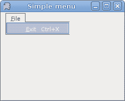
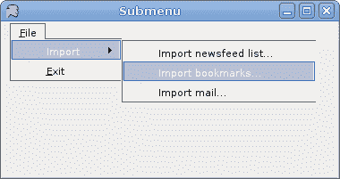
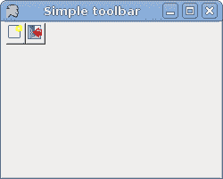

# Mono Winforms 中的菜单和工具栏

> 原文： [http://zetcode.com/gui/csharpwinforms/menustoolbars/](http://zetcode.com/gui/csharpwinforms/menustoolbars/)

在 Mono Winforms 教程的这一部分中，我们将讨论菜单和工具栏。

菜单栏是 GUI 应用中最可见的部分之一。 它是位于各个菜单中的一组命令。 在控制台应用中，您必须记住所有这些神秘命令，在这里，我们将大多数命令分组为逻辑部分。 有公认的标准可以进一步减少学习新应用的时间。

## 简单菜单

在第一个示例中，我们创建一个简单的菜单。

`simplemenu.cs`

```
using System;
using System.Drawing;
using System.Windows.Forms;

class MForm : Form {
    public MForm() {
        Text = "Simple menu";

        MenuStrip ms = new MenuStrip();
        ms.Parent = this;

        ToolStripMenuItem file = new ToolStripMenuItem("&File");          
        ToolStripMenuItem exit = new ToolStripMenuItem("&Exit", null,
            new EventHandler(OnExit));          
        exit.ShortcutKeys = Keys.Control | Keys.X;
        file.DropDownItems.Add(exit);

        ms.Items.Add(file);
        MainMenuStrip = ms;
        Size = new Size(250, 200);

        CenterToScreen();
    }

    void OnExit(object sender, EventArgs e) {
       Close();
    }
}

class MApplication {
    public static void Main() {
        Application.Run(new MForm());
    }
}

```

在我们的示例中，我们有一个菜单栏和一个菜单。 菜单内有一个菜单项。 如果选择菜单项，则应用关闭。

注意如何关闭应用。 我们可以使用 `Ctrl + X` 快捷方式或按 `Alt` ， `F` ， `E` 键关闭它 。

```
MenuStrip ms = new MenuStrip();

```

`MenuStrip`为我们的表单创建一个菜单系统。 我们将`ToolStripMenuItem`对象添加到 MenuStrip 中，这些对象代表菜单结构中的各个菜单命令。 每个`ToolStripMenuItem`可以是您的应用的命令，也可以是其他子菜单项的父菜单。

```
ToolStripMenuItem file = new ToolStripMenuItem("&File");          

```

在这里，我们创建一个菜单。

```
ToolStripMenuItem exit = new ToolStripMenuItem("&Exit", null,
    new EventHandler(OnExit));   

```

此行创建退出菜单项。

```
exit.ShortcutKeys = Keys.Control | Keys.X;

```

我们提供了退出菜单项的快捷方式。

```
file.DropDownItems.Add(exit);

```

退出菜单项将添加到菜单对象的下拉项中。

```
ms.Items.Add(file);          

```

在这里，我们将菜单对象添加到菜单栏中。

```
MainMenuStrip = ms;

```

`MenuStrip`已插入表格。



Figure: Simple menu

## 子菜单

每个菜单项也可以有一个子菜单。 这样，我们可以将类似的命令分组。 例如，我们可以将隐藏/显示各种工具栏（例如个人栏，地址栏，状态栏或导航栏）的命令放置在称为工具栏的子菜单中。

`submenu.cs`

```
using System;
using System.Drawing;
using System.Windows.Forms;

class MForm : Form {

    public MForm() {
        Text = "Submenu";

        MenuStrip ms = new MenuStrip();
        ms.Parent = this;

        ToolStripMenuItem file = new ToolStripMenuItem("&File");   
        ToolStripMenuItem exit = new ToolStripMenuItem("&Exit", null,
            new EventHandler(OnExit));       

        ToolStripMenuItem import = new ToolStripMenuItem();
        import.Text = "Import";

        file.DropDownItems.Add(import);

        ToolStripMenuItem temp = new ToolStripMenuItem();
        temp.Text = "Import newsfeed list...";
        import.DropDownItems.Add(temp);

        temp = new ToolStripMenuItem();
        temp.Text = "Import bookmarks...";
        import.DropDownItems.Add(temp);

        temp = new ToolStripMenuItem();
        temp.Text = "Import mail...";
        import.DropDownItems.Add(temp);

        file.DropDownItems.Add(exit);

        ms.Items.Add(file);
        MainMenuStrip = ms;
        Size = new Size(380, 200);

        CenterToScreen();
    }

    void OnExit(object sender, EventArgs e) {
       Close();
    }
}

class MApplication {
    public static void Main() {
        Application.Run(new MForm());
    }
}

```

在此示例中，我们创建一个子菜单。 子菜单导入具有三个菜单项。

```
ToolStripMenuItem import = new ToolStripMenuItem();
import.Text = "Import";

```

`ToolStripMenuItem`可以是菜单或菜单项。 在这里它将作为子菜单。

```
ToolStripMenuItem temp = new ToolStripMenuItem();
temp.Text = "Import newsfeed list...";
import.DropDownItems.Add(temp);

```

在这里，我们创建一个菜单项并将其添加到“导入”子菜单。



Figure: Submenu

## 复选菜单项

下一个代码示例演示如何创建复选菜单项。

`checkmenuitem.cs`

```
using System;
using System.Drawing;
using System.Windows.Forms;

class MForm : Form {

    private StatusBar sb;
    private MenuItem viewStatusBar;

    public MForm() {
        Text = "Check menu item";

        sb = new StatusBar();
        sb.Parent = this;
        sb.Text = "Ready";

        MainMenu mainMenu = new MainMenu();

        MenuItem file = mainMenu.MenuItems.Add("&File");          
        file.MenuItems.Add(new MenuItem("E&xit", 
            new EventHandler(OnExit), Shortcut.CtrlX));

        MenuItem view = mainMenu.MenuItems.Add("&View");
        viewStatusBar = new MenuItem("View StatusBar");
        viewStatusBar.Checked = true;
        viewStatusBar.Click += new EventHandler(ToggleStatusBar);
        view.MenuItems.Add(viewStatusBar);

        Menu = mainMenu;
        Size = new Size(250, 200);

        CenterToScreen();
    }

    void OnExit(object sender, EventArgs e) {
       Close();
    }

    void ToggleStatusBar(object sender, EventArgs e) {
        bool check = viewStatusBar.Checked;
        if (check) {
            sb.Visible = false;
            viewStatusBar.Checked = false;
        } else {
            sb.Visible = true;
            viewStatusBar.Checked = true;
        }
    }

}

class MApplication {
    public static void Main() {
        Application.Run(new MForm());
    }
}

```

我们有两个菜单。 文件和查看。 “查看”菜单具有一个菜单项，用于切换状态栏的可见性。

```
MainMenu mainMenu = new MainMenu();

```

在此示例中，我们使用`MainMenu`控件。 要创建菜单栏，我们可以使用`MainMenu`或`MenuStrip`控件。 后者具有一些附加功能。

```
viewStatusBar.Checked = true;

```

默认情况下会选中此菜单项，因为状态栏从应用的开始就可见。

```
bool check = viewStatusBar.Checked;
if (check) {
    sb.Visible = false;
    viewStatusBar.Checked = false;
} else {
    sb.Visible = true;
    viewStatusBar.Checked = true;
}

```

我们确定菜单项是否被选中。 我们根据`check`值显示和隐藏状态栏和复选标记。


Figure: Check menu item

## 图像，分隔符

我们将进一步增强对`MenuStrip`控件的了解。 我们将创建一个带有图像的菜单项，并显示如何使用分隔符将其分开。

`menustrip.cs`

```
using System;  
using System.Drawing;
using System.Windows.Forms;  

class MForm : Form { 

  public MForm() {  
    Text = "MenuStrip";  
    Size = new Size(250, 200);

    MenuStrip menuStrip = new MenuStrip();  

    ToolStripMenuItem titem1 = new ToolStripMenuItem("File");  
    menuStrip.Items.Add(titem1);  

    ToolStripMenuItem titem2 = new ToolStripMenuItem("Tools");  
    menuStrip.Items.Add(titem2);  

    ToolStripMenuItem subm1 = new ToolStripMenuItem("New");  
    subm1.Image = Image.FromFile("new.png");
    titem1.DropDownItems.Add(subm1);  

    ToolStripMenuItem subm2 = new ToolStripMenuItem("Open");  
    subm2.Image = Image.FromFile("open.png");
    titem1.DropDownItems.Add(subm2);  

    titem1.DropDownItems.Add(new ToolStripSeparator());

    ToolStripMenuItem subm3 = new ToolStripMenuItem("Exit");  
    subm3.Image = Image.FromFile("exit.png");
    titem1.DropDownItems.Add(subm3);  

    subm3.Click += OnExit;  
    Controls.Add(menuStrip); 

    MainMenuStrip = menuStrip;  

    CenterToScreen();
  }    

  public static void Main() {  
    Application.Run(new MForm());  
  }  

    void OnExit(object sender, EventArgs e) {
       Close();
    } 
}

```

我们的代码示例中有两个菜单。 文件和工具。 在文件中，我们有三个带有图像的菜单项。 我们还有一个分隔符。 在此示例中，PNG 图像必须位于当前工作目录中。

```
ToolStripMenuItem subm1 = new ToolStripMenuItem("New");  
subm1.Image = Image.FromFile("new.png");
titem1.DropDownItems.Add(subm1); 

```

在这里，我们创建第一个菜单项。 要将图像添加到项目，我们将`Image`属性设置为图像。 我们使用静态`FromFile()`方法从指定的文件创建一个`Image`。

```
titem1.DropDownItems.Add(new ToolStripSeparator());

```

在这里，我们向“文件”菜单添加分隔符。


Figure: Images and separator

## 工具栏

菜单将我们可以在应用中使用的所有命令分组。 使用工具栏可以快速访问最常用的命令。 `ToolBar`控件用于显示`ToolBarButton`控件。 我们可以通过创建`ImageList`将图像分配给按钮。 然后，我们将图像列表分配给工具栏的`ImageList`属性，并为每个`ToolBarButton`将图像索引值分配给`ImageIndex`属性。

`toolbar.cs`

```
using System;
using System.Drawing;
using System.Windows.Forms;

public class MForm : Form
{
  private ImageList toolBarIcons;
  private ToolBarButton save;
  private ToolBarButton exit;
  private ToolBar toolBar;

  public MForm()
  {
    Size = new Size(250, 200);
    Text = "Simple toolbar";

    toolBar = new ToolBar();
    toolBar.Parent = this;
    toolBarIcons = new ImageList();
    save = new ToolBarButton();
    exit = new ToolBarButton();

    save.ImageIndex = 0;
    save.Tag = "Save";
    exit.ImageIndex = 1;
    exit.Tag = "Exit";

    toolBar.ImageList = toolBarIcons;
    toolBar.ShowToolTips = true;
    toolBar.Buttons.AddRange(new ToolBarButton[] {save, exit});
    toolBar.ButtonClick += new ToolBarButtonClickEventHandler(OnClicked);

    toolBarIcons.Images.Add(new Icon("new.ico"));
    toolBarIcons.Images.Add(new Icon("exit.ico"));

    CenterToScreen();
  }

  static void Main() 
  {
    Application.Run(new MForm());
  }

  void OnClicked(object sender, ToolBarButtonClickEventArgs e) 
  {
      if (e.Button.Tag.Equals("Exit"))
          Close();
  }
}

```

在我们的示例中，我们在工具栏上显示了两个按钮。

```
toolBar = new ToolBar();

```

在这里，我们创建`ToolBar`控件。

```
toolBarIcons = new ImageList();

```

创建图像列表。

```
save = new ToolBarButton();
exit = new ToolBarButton();

```

这是两个工具栏按钮。

```
save.ImageIndex = 0;

```

我们确定图像列表中的哪个图标将用于保存工具栏按钮。

```
toolBar.Buttons.AddRange(new ToolBarButton[] {save, exit});

```

`ToolBarButton`控件已添加到工具栏。

```
toolBarIcons.Images.Add(new Icon("new.ico"));
toolBarIcons.Images.Add(new Icon("exit.ico"));

```

图标将添加到图像列表。

```
if (e.Button.Tag.Equals("Exit"))
    Close();

```

如果按钮的标签等于“退出”，我们将关闭该应用。



Figure: ToolBar

Winforms 教程的这一部分是关于菜单和工具栏的。