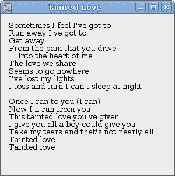
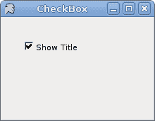
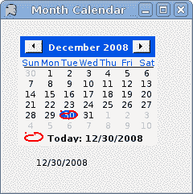
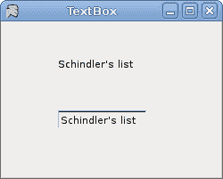

# Mono Winforms 中的基本控件

> 原文： [http://zetcode.com/gui/csharpwinforms/controls/](http://zetcode.com/gui/csharpwinforms/controls/)

Mono Winforms 编程教程的这一部分将介绍基本控件。

Winforms 控件是应用的基本构建块。 Winforms 具有各种各样的控件。按钮，复选框，滑块，列表框等。程序员完成工作所需的一切。 在本教程的这一部分中，我们将描述几个有用的控件。

## `Label`控件

`Label`是用于显示文本或图像的简单控件。 它没有得到关注。

`label.cs`

```cs
using System;
using System.Drawing;
using System.Windows.Forms;

class MForm : Form {

   string text = @"Sometimes I feel I've got to
Run away I've got to
Get away
From the pain that you drive
    into the heart of me
The love we share
Seems to go nowhere
I've lost my lights
I toss and turn I can't sleep at night

Once I ran to you (I ran)
Now I'll run from you
This tainted love you've given
I give you all a boy could give you
Take my tears and that's not nearly all
Tainted love
Tainted love";

    public MForm() {
        Text = "Tainted Love";

        Font font = new Font("Serif", 10);

        Label lyrics = new Label();
        lyrics.Parent = this;
        lyrics.Text = text;
        lyrics.Font = font;
        lyrics.Location = new Point(10, 10);
        lyrics.Size = new Size (290, 290);

        CenterToScreen();

    }
}

class MApplication {
    public static void Main() {
        Application.Run(new MForm());
    }
}

```

在我们的示例中，我们显示了 Tainted Love 歌曲的歌词。

```cs
Label lyrics = new Label();

```

`Label`控件已创建。

```cs
string text = @"Sometimes I feel I've got ... 

```

@字符用于表示多行字符串。

```cs
Font font = new Font("Serif", 10);
...
lyrics.Font = font;

```

标签文本的字体设置为 Serif，10px。



图：`Label`

## `CheckBox`

`CheckBox`是具有两个状态的控件：开和关。 它是带有标签或图像的盒子。 如果选中了`CheckBox`，则在方框中用勾号表示。 `CheckBox`可用于在启动时显示/隐藏启动屏幕，切换工具栏的可见性等。

`checkbox.cs`

```cs
using System;
using System.Drawing;
using System.Windows.Forms;

class MForm : Form {

    private CheckBox cb;

    public MForm() {
        Text = "CheckBox";
        Size = new Size(220, 170);

        cb = new CheckBox();
        cb.Parent = this;
        cb.Location = new Point(30, 30);
        cb.Text = "Show Title";
        cb.Checked = true;

        cb.CheckedChanged += new EventHandler(OnChanged);

        CenterToScreen();
    }

    void OnChanged(object sender, EventArgs e) {
        if (cb.Checked) {
            Text = "CheckBox";
        } else {
            Text = "";
        }
    }
}

class MApplication {
    public static void Main() {
        Application.Run(new MForm());
    }
}

```

我们的代码示例根据窗口的状态显示或隐藏窗口的标题。

```cs
cb = new CheckBox();

```

`CheckBox`控件已创建。

```cs
cb.Text = "Show Title";
cb.Checked = true;

```

当应用启动时，我们显示标题。 然后将`CheckBox`控件设置为选中状态。

```cs
cb.CheckedChanged += new EventHandler(OnChanged);

```

当我们单击`CheckBox`控件时，将触发`CheckedChanged`事件。

```cs
if (cb.Checked) {
    Text = "CheckBox";
} else {
    Text = "";
}

```

在这里，我们切换窗口的标题。



图：`CheckBox`

## `TrackBar`

`TrackBar`是一个组件，使用户可以通过在有限的间隔内滑动旋钮来以图形方式选择一个值。 我们的示例将显示音量控制。

`trackbar.cs`

```cs
using System;
using System.Drawing;
using System.Windows.Forms;

class MForm : Form {

    PictureBox pb;
    TrackBar tb;
    Bitmap mute, min, med, max;

    public MForm() {
        Text = "TrackBar";
        Size = new Size(260, 190);

        tb = new TrackBar();
        tb.Parent = this;
        tb.Size = new Size(160, 30);
        tb.Location = new Point(20, 40);
        tb.TickStyle = TickStyle.None;

        tb.ValueChanged += new EventHandler(OnChanged);

        LoadImages();

        pb = new PictureBox();
        pb.Parent = this;
        pb.Location = new Point(210, 50);
        pb.Image = mute;

        CenterToScreen();

    }

    void LoadImages() {
        mute = new Bitmap("mute.png");
        min = new Bitmap("min.png");
        med = new Bitmap("med.png");
        max = new Bitmap("max.png");
    }

    void OnChanged(object sender, EventArgs e) {
        int val = tb.Value;

        if (val == 0) {
            pb.Image = mute;
        } else if (val > 0 && val <= 3) {
            pb.Image = min;
        } else if (val > 3 && val < 8) {
            pb.Image = med;
        } else {
            pb.Image = max;
        }
    }
}

class MApplication {
    public static void Main() {
        Application.Run(new MForm());
    }
}

```

在代码示例中，我们显示了`TrackBar`和`PictureBox`。 通过拖动轨迹栏，我们可以在`PictureBox`控件上更改图像。

```cs
tb = new TrackBar();

```

`TrackBar`控件已创建。

```cs
tb.TickStyle = TickStyle.None;

```

我们对此`TrackBar`没有显示任何报价。

```cs
pb = new PictureBox();
...
pb.Image = mute;

```

`PictureBox`控件已创建。 它用于显示图像。 开始时，它会显示静音图像。

```cs
void LoadImages() {
    mute = new Bitmap("mute.png");
    min = new Bitmap("min.png");
    med = new Bitmap("med.png");
    max = new Bitmap("max.png");
}

```

在这里，我们将加载四个将要使用的图像。

```cs
int val = tb.Value;

if (val == 0) {
    pb.Image = mute;
} else if (val > 0 && val <= 3) {
    pb.Image = min;
} else if (val > 3 && val < 8) {
    pb.Image = med;
} else {
    pb.Image = max;
}

```

我们确定`TrackBar`的值。 根据其值，我们更新`PictureBox`控件。


图：`TrackBar`

## `ComboBox`

`ComboBox`是一个组合了按钮或可编辑字段和下拉列表的控件。 用户可以从下拉列表中选择一个值，该列表应用户的要求出现。 如果使组合框可编辑，则组合框将包含一个可编辑字段，用户可以在其中输入值。

`combobox.cs`

```cs
using System;
using System.Drawing;
using System.Windows.Forms;

class MForm : Form {

    private ComboBox cb;
    private Label label;

    public MForm() {
        Text = "ComboBox";
        Size = new Size(240, 240);

        cb = new ComboBox();
        cb.Parent = this;
        cb.Location = new Point(50, 30);

        cb.Items.AddRange(new object[] {"Ubuntu",
            "Mandriva",
            "Red Hat",
            "Fedora",
            "Gentoo"});

        cb.SelectionChangeCommitted += new EventHandler(OnChanged);

        label = new Label();
        label.Location = new Point(50, 140);
        label.Parent = this;
        label.Text = "...";

        CenterToScreen();
    }

    void OnChanged(object sender, EventArgs e) {
         ComboBox combo = (ComboBox) sender;
         label.Text = combo.Text;
    }
}

class MApplication {
    public static void Main() {
        Application.Run(new MForm());
    }
}

```

我们的代码编程示例显示了一个包含五个项目的组合框。 所选项目显示在标签控件中。

```cs
cb = new ComboBox();

```

`ComboBox`控件已创建。

```cs
cb.Items.AddRange(new object[] {"Ubuntu",
    "Mandriva",
    "Red Hat",
    "Fedora",
    "Gentoo"});

```

`ComboBox`控件中充满了项目。

```cs
cb.SelectionChangeCommitted += new EventHandler(OnChanged);

```

如果我们从组合框中选择一个项目，则会触发`SelectionChangeCommitted`事件。

```cs
void OnChanged(object sender, EventArgs e) {
    ComboBox combo = (ComboBox) sender;
    label.Text = combo.Text;
}

```

在这里，将从组合框中选择的文本复制到标签。


图：`ComboBox`

## `MonthCalendar`

在下一个示例中，我们将显示`MonthCalendar`控件。 `MonthCalendar`控件允许用户使用视觉显示选择日期。

`monthcalendar.cs`

```cs
using System;
using System.Drawing;
using System.Windows.Forms;

class MForm : Form {

   private MonthCalendar calendar;
   private Label date;

    public MForm() {
        Text = "Month Calendar";
        Size = new Size(240, 240);

        calendar = new MonthCalendar();
        calendar.Parent = this;
        calendar.Location = new Point(20, 20);
        calendar.DateSelected += new DateRangeEventHandler(OnSelected);

        date = new Label();
        date.Location = new Point(40, 170);
        date.Parent = this;
        DateTime dt = calendar.SelectionStart;
        date.Text = dt.Month + "/" + dt.Day + "/" + dt.Year;

        CenterToScreen();
    }

    void OnSelected(object sender, EventArgs e) {
        DateTime dt = calendar.SelectionStart;
        date.Text = dt.Month + "/" + dt.Day + "/" + dt.Year;
    }
}

class MApplication {
    public static void Main() {
        Application.Run(new MForm());
    }
}

```

在示例中，我们显示了`MonthCalendar`和`Label`。

```cs
private MonthCalendar calendar;
private Label date;

```

我们有两个控件。 一个`MonthCalendar`和一个`Label`。 后者显示当前选择的日期。

```cs
void OnSelected(object sender, EventArgs e) {
    DateTime dt = calendar.SelectionStart;
    date.Text = dt.Month + "/" + dt.Day + "/" + dt.Year;
 }

```

当我们从`MonthCalendar`中选择一个日期时，就会调用`OnSelected()`方法。 `SelectionStart`属性获取所选日期范围的开始日期。



图：`MonthCalendar`

## `TextBox`

`TextBox`控件用于显示或接受某些文本。 文本可以是单行或多行。 此控件还可以进行密码屏蔽。

`textbox.cs`

```cs
using System;
using System.Drawing;
using System.Windows.Forms;

class MForm : Form {

    private Label text;

    public MForm() {
        Text = "TextBox";
        Size = new Size(250, 200);
        CenterToScreen();

        text = new Label();
        text.Parent = this;
        text.Text = "...";
        text.Location = new Point(60, 40);
        text.AutoSize = true;

        TextBox tbox = new TextBox();
        tbox.Parent = this;
        tbox.Location = new Point(60, 100);
        tbox.KeyUp += new KeyEventHandler(OnKeyUp);

    }

    void OnKeyUp(object sender, KeyEventArgs e) {
        TextBox tb = (TextBox) sender;
        this.text.Text = tb.Text;
    }
}

class MApplication {
    public static void Main() {
        Application.Run(new MForm());
    }
}

```

本示例显示一个文本框和一个标签。 我们在文本框中键入的文本将立即显示在标签控件中。

```cs
text = new Label();
...
text.AutoSize = true;

```

`Label`控件已创建。 `AutoSize`属性可确保`Label`增长以显示文本。

```cs
TextBox tbox = new TextBox();
...
tbox.KeyUp += new KeyEventHandler(OnKeyUp);

```

我们插入`KeyUp`事件。 释放按键时，将调用`OnKeyUp()`方法。

```cs
void OnKeyUp(object sender, KeyEventArgs e) {
    TextBox tb = (TextBox) sender;
    this.text.Text = tb.Text;
}

```

在`OnKeyUp()`方法中，我们使用文本框控件中的文本更新了标签控件。



图：`TextBox`

我们已经完成了 Mono Winforms 教程的这一章，专门介绍基本控件。