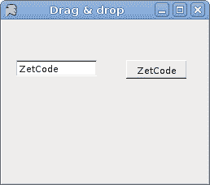

# Mono Winforms 中的拖放

> 原文： [http://zetcode.com/gui/csharpwinforms/dragdrop/](http://zetcode.com/gui/csharpwinforms/dragdrop/)

Mono Winforms 教程的这一部分将专门用于拖放操作。

在计算机图形用户界面中，拖放是单击虚拟对象并将其拖动到其他位置或另一个虚拟对象上的动作（或支持以下动作）。 通常，它可用于调用多种动作，或在两个抽象对象之间创建各种类型的关联。 （维基百科）

拖放功能是图形用户界面最明显的方面之一。 拖放操作使您可以直观地完成复杂的事情。

## 拖动按钮

在第一个示例中，我们将在按钮控件上执行拖放操作。 该示例在拖放&放置协议之外执行作业。

`dragbutton.cs`

```cs
using System;
using System.Drawing;
using System.Windows.Forms;

public class MForm : Form
{
  private bool isDragging = false;
  private int oldX, oldY;
  private Button button;

  public MForm()
  {
    Text = "Drag & drop button";
    Size = new Size(270, 180);

    button = new Button();
    button.Parent = this;
    button.Cursor = Cursors.Hand;
    button.Text = "Button";
    button.Location = new Point(20, 20);

    button.MouseDown += new MouseEventHandler(OnMouseDown);
    button.MouseUp += new MouseEventHandler(OnMouseUp);
    button.MouseMove += new MouseEventHandler(OnMouseMove);

    CenterToScreen();
  }

  public static void Main() 
  {
    Application.Run(new MForm());
  }

  private void OnMouseDown(object sender, MouseEventArgs e) 
  {
    isDragging = true;
    oldX = e.X;
    oldY = e.Y;
  }

  private void OnMouseMove(object sender, MouseEventArgs e) 
  {
    if (isDragging) 
    {
        button.Top = button.Top + (e.Y - oldY); 
        button.Left = button.Left + (e.X - oldX); 
    }
  }

  private void OnMouseUp(object sender, MouseEventArgs e) 
  {
    isDragging = false;
  }
}

```

该代码示例将一个常规按钮控件放在表单容器上。 通过单击按钮表面并同时用鼠标拖动它，我们可以重新放置按钮。

```cs
private bool isDragging = false;
private int oldX, oldY;

```

这些是我们示例的支持变量。 `isDragging`变量告诉我们是否正在拖动对象。 `oldX`和`oldY`变量在拖动过程开始之前存储 x，y 坐标。

```cs
button.MouseDown += new MouseEventHandler(OnMouseDown);
button.MouseUp += new MouseEventHandler(OnMouseUp);
button.MouseMove += new MouseEventHandler(OnMouseMove);

```

我们为按钮插入了三种不同的鼠标处理程序。 它们实现了拖放过程的三个不同阶段。 当我们单击按钮时，过程开始。 这由`OnMouseDown()`方法处理。 第二部分是机芯。 这是当我们将对象移动到新位置时。 它以`OnMouseMove()`方法处理。 最后一部分是过程停止的时间。 当我们释放鼠标按钮时会发生这种情况。 适当的任务委托给`OnMouseUp()`方法。

```cs
private void OnMouseDown(object sender, MouseEventArgs e) 
{
  isDragging = true;
  oldX = e.X;
  oldY = e.Y;
}

```

`OnMouseDown()`方法实现了过程的第一部分。 它设置了三个必要的变量。

```cs
private void OnMouseMove(object sender, MouseEventArgs e) 
{
  if (isDragging) 
  {
      button.Top = button.Top + (e.Y - oldY); 
      button.Left = button.Left + (e.X - oldX); 
  }
}

```

在`OnMouseMove()`方法中，我们重新定位按钮。 我们计算存储的 x，y 坐标与鼠标指针的新坐标之间的差。 差异将添加到按钮的`Top`和`Left`属性中，从而将其移动到新位置。


Figure: Dragging a button

## 拖动文字

在前面的示例中，我们确实拖放了控件。 接下来，我们将对文本数据进行拖放操作。 在这里，我们将使用 Winforms 库提供的拖放协议。

拖放操作是 Winforms 中的标准通信协议。 我们有两个基本对象。 拖动源和放置目标。

`dragtext.cs`

```cs
using System;
using System.Drawing;
using System.Windows.Forms;

public class MForm : Form
{

    private TextBox textBox;
    private Button button;

    public MForm()
    {
        InitForm();
        CenterToScreen();
    }

    private void OnMouseDown(object sender, MouseEventArgs e)
    {
        TextBox txt = (TextBox) sender;
        txt.DoDragDrop(txt.Text, DragDropEffects.Copy);
    }

    private void OnDragEnter(object sender, DragEventArgs e)
    {
        e.Effect = DragDropEffects.Copy;
    }

    private void OnDragDrop(object sender, DragEventArgs e)
    {
        Button button = (Button) sender;
        button.Text = (string) e.Data.GetData(DataFormats.Text);
    }

    private void InitForm()
    {
        Text = "Drag & drop";
        button = new Button();
        textBox = new TextBox();
        SuspendLayout();

        button.AllowDrop = true;
        button.Location = new Point(150, 50);
        textBox.Location = new Point(15, 50);

        button.DragDrop += new DragEventHandler(OnDragDrop);
        button.DragEnter += new DragEventHandler(OnDragEnter);
        textBox.MouseDown += new MouseEventHandler(OnMouseDown);

        ClientSize = new Size(250, 200);
        Controls.Add(button);
        Controls.Add(textBox);
        ResumeLayout();
    }

    public static void Main(string[] args)
    {
        Application.Run(new MForm());
    }

}

```

我们在表单上有两个控件。 一个按钮和一个文本框。 我们将文本从文本框中拖放到按钮上。

```cs
InitForm();

```

表单的设置委托给`InitForm()`方法。 这通常在较大的应用中完成。

```cs
SuspendLayout();
...
ResumeLayout();

```

我们在这两个方法调用之间布置控件。 这是一个优化。 它应该消除闪烁。

```cs
button.AllowDrop = true;

```

我们将`AllowDrop`属性设置为`true`。 默认情况下不启用删除。

```cs
button.DragDrop += new DragEventHandler(OnDragDrop);
button.DragEnter += new DragEventHandler(OnDragEnter);
textBox.MouseDown += new MouseEventHandler(OnMouseDown);

```

同样，拖放过程分为三个步骤。 对于每个特定步骤，我们有三种方法。

```cs
private void OnMouseDown(object sender, MouseEventArgs e)
{
    TextBox txt = (TextBox) sender;
    txt.DoDragDrop(txt.Text, DragDropEffects.Copy);
}

```

在`OnMouseDown()`方法中，我们初始化了拖放过程。 我们使用`DoDragDrop()`方法启动该过程。 `DragDropEffects.Copy`参数指定操作的类型。 实质上，我们可以在拖放操作期间复制文本或移动文本。

```cs
private void OnDragEnter(object sender, DragEventArgs e)
{
    e.Effect = DragDropEffects.Copy;
}

```

当鼠标指针进入放置目标控件的区域时，将启动`DragEnter`事件。 必须设置`Effect`属性。 拖动源和放置目标的`DragDropEffects`必须相等。 否则，该操作将无法进行。

```cs
private void OnDragDrop(object sender, DragEventArgs e)
{
    Button button = (Button) sender;
    button.Text = (string) e.Data.GetData(DataFormats.Text);
}

```

最后，我们有`OnDragDrop()`方法。 在这里，我们从事件对象获取数据并将其设置为按钮`Text`属性。



Figure: Drag & drop of text

## 拖动图像

在最后一个示例中，我们将拖放图像拖到窗体上。

`dragimage.cs`

```cs
using System;
using System.Drawing;
using System.Windows.Forms;

public class ImageDragDrop : Form
{
  private bool isDragging;
  private int oldX, oldY;

  private Rectangle dropRect;
  private PictureBox picBox;
  private Bitmap image;
  private Brush brush;

  public ImageDragDrop()
  {
    ClientSize = new Size(350, 250);
    Text = "Dragging Image";
    Paint += new PaintEventHandler(OnPaint);

    isDragging = false;
    dropRect = new Rectangle(10, 10, 200, 160);
    brush = Brushes.Gray;
    picBox = new PictureBox();
    loadImage();

    picBox.Parent = this;
    picBox.Location = new Point(100, 50);
    picBox.Size = new Size(image.Width, image.Height);
    picBox.Image = image;
    picBox.Cursor = Cursors.Hand;

    picBox.MouseDown += new MouseEventHandler(OnMouseDown);
    picBox.MouseUp += new MouseEventHandler(OnMouseUp);
    picBox.MouseMove += new MouseEventHandler(OnMouseMove);

    CenterToScreen();
  }

  void loadImage() {
      try {
          image = new Bitmap("image.jpg");
      } catch {
          Console.WriteLine("Error reading image");
          Environment.Exit(1);
      }
  }

  public static void Main() 
  {
    Application.Run(new ImageDragDrop());
  }

  private void OnMouseDown(object sender, MouseEventArgs e) 
  {
    isDragging = true;
    oldX = e.X;
    oldY = e.Y;
  }

  private void OnMouseMove(object sender, MouseEventArgs e) 
  {
    if (isDragging) 
    {
      picBox.Top = picBox.Top + (e.Y - oldY);
      picBox.Left = picBox.Left + (e.X - oldX);
    }
  }

  private void OnMouseUp(object sender, MouseEventArgs e) 
  {
    isDragging = false;

    if(dropRect.Contains(picBox.Bounds)) {
        brush = Brushes.Gold;
    } else {
        brush = Brushes.Gray;
    }

    Refresh();
  }

  private void OnPaint(object sender, PaintEventArgs e)
  {
    Graphics g = e.Graphics;
    g.FillRectangle(brush, dropRect);
  }
}

```

在我们的示例中，我们有一个`PictureBox`，并绘制了一个灰色矩形。 如果将图片放在矩形内，则矩形的颜色变为金色。

```cs
brush = Brushes.Gray;

```

`brush`变量保存矩形的笔刷。 默认情况下为灰色。

```cs
void loadImage() {
    try {
        image = new Bitmap("image.jpg");
    } catch {
        Console.WriteLine("Error reading image");
        Environment.Exit(1);
    }
}

```

`loadImage()`加载`PictureBox`控件的位图。

```cs
if (dropRect.Contains(picBox.Bounds)) {
    brush = Brushes.Gold;
} else {
    brush = Brushes.Gray;
}

```

在`OnMouseUp()`方法中，我们确定矩形的笔刷。 如果图片框的边界在矩形内，则画笔为金色；否则，画笔为金色。 否则为灰色。

```cs
Refresh();

```

我们必须调用`Refresh()`方法来激活新的画笔颜色。

本章专门使用 Mono Winforms 库拖放操作。