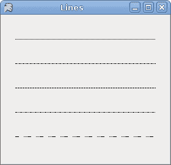
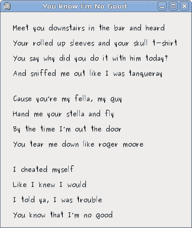

# 在 Mono Winforms 中绘画

> 原文： [http://zetcode.com/gui/csharpwinforms/painting/](http://zetcode.com/gui/csharpwinforms/painting/)

在 Mono Winforms 教程的这一部分中，我们将进行绘画。 当我们想要更改或增强现有控件时，将使用绘画。 或者，如果我们要从头开始创建自定义控件。 要进行绘画，我们使用 Winforms 库提供的绘画 API。 绘画是在一种方法中完成的，我们将其插入`Paint`事件。

`System.Drawing`名称空间提供对`GDI+`基本图形功能的访问。 System.Drawing.Drawing2D，System.Drawing.Imaging 和 System.Drawing.Text 命名空间中提供了更高级的功能。 `Graphics`类提供了在表单上绘图的方法。

## 线数

我们的第一个示例将在`Form`控件上绘制线条。

`lines.cs`

```
using System;
using System.Drawing;
using System.Drawing.Drawing2D;
using System.Windows.Forms;

class MForm : Form {

    public MForm() {
        Text = "Lines";
        Size = new Size(280, 270);
        ResizeRedraw = true;

        Paint += new PaintEventHandler(OnPaint);
        CenterToScreen();
    }

    void OnPaint(object sender, PaintEventArgs e)
    {      
        Graphics g = e.Graphics;
        Pen pen = new Pen(Color.Black, 1);

        pen.DashStyle = DashStyle.Dot;
        g.DrawLine(pen, 20, 40, 250, 40);

        pen.DashStyle = DashStyle.DashDot;
        g.DrawLine(pen, 20, 80, 250, 80);

        pen.DashStyle = DashStyle.Dash;
        g.DrawLine(pen, 20, 120, 250, 120);

        pen.DashStyle = DashStyle.DashDotDot;
        g.DrawLine(pen, 20, 160, 250, 160);

        pen.DashPattern = new float[] {6f, 8f, 1f, 1f, 1f, 1f, 1f, 1f };
        g.DrawLine(pen, 20, 200, 250, 200);

        g.Dispose();
    }
}

class MApplication {
    public static void Main() {
        Application.Run(new MForm());
    }
}

```

我们在表格上画了五行。 每行具有不同的`DashStyle`。

```
ResizeRedraw = true;

```

调整表单大小时，它会自动重绘。 这不是默认行为。

```
Paint += new PaintEventHandler(OnPaint);

```

绘画事件将传递给`OnPaint()`方法。

```
void OnPaint(object sender, PaintEventArgs e)
{
    ... 
}

```

这是`OnPaint()`方法的签名。

```
Graphics g = e.Graphics;

```

为了在表单上绘画，我们必须获取`Graphics`对象。 在窗体上绘画实际上是在调用`Graphics`对象的各种方法。

```
Pen pen = new Pen(Color.Black, 1);

pen.DashStyle = DashStyle.Dot;
g.DrawLine(pen, 20, 40, 250, 40);

```

我们创建一个`Pen`对象。 该对象用于绘制形状的轮廓。 比我们设置点划线`DashStyle`。 最后，我们用`DrawLine()`方法画线。 第一个参数是钢笔对象。 接下来的四个值是线的起点和终点的 x 和 y 值。

```
pen.DashPattern = new float[] {6f, 8f, 1f, 1f, 1f, 1f, 1f, 1f };

```

有几个内置的`DashStyle`值。 我们可以使用`DashPattern`属性来创建自己的样式。 乍一看可能很难。 但是模式只是填充和空值的数组。

```
g.Dispose();

```

我们知道 C＃语言使用垃圾回收。 那么，为什么我们要明确释放资源？ 这是为了提高效率。 我们正在帮助垃圾收集器。



Figure: Lines

## 色彩

Winforms 库中的颜色表示 ARGB（alpha，红色，绿色，蓝色）颜色。 它是 Alpha，红色，绿色和蓝色（RGB）强度值的组合。 还有一些可以在绘画中使用的预定义颜色名称。

`colors.cs`

```
using System;
using System.Drawing;
using System.Drawing.Drawing2D;
using System.Windows.Forms;

class MForm : Form {

    public MForm() {
        Text = "Colors";
        Size = new Size(360, 300);

        Paint += new PaintEventHandler(OnPaint);

        CenterToScreen();
    }

    void OnPaint(object sender, PaintEventArgs e)
    {      
        Graphics g = e.Graphics;

        g.FillRectangle(Brushes.Sienna, 10, 15, 90, 60);
        g.FillRectangle(Brushes.Green, 130, 15, 90, 60);
        g.FillRectangle(Brushes.Maroon, 250, 15, 90, 60);
        g.FillRectangle(Brushes.Chocolate, 10, 105, 90, 60);
        g.FillRectangle(Brushes.Gray, 130, 105, 90, 60);
        g.FillRectangle(Brushes.Coral, 250, 105, 90, 60);
        g.FillRectangle(Brushes.Brown, 10, 195, 90, 60);
        g.FillRectangle(Brushes.Teal, 130, 195, 90, 60);
        g.FillRectangle(Brushes.Goldenrod, 250, 195, 90, 60);

        g.Dispose();

    }
}

class MApplication {
    public static void Main() {
        Application.Run(new MForm());
    }
}

```

我们用 9 种不同的颜色绘制 9 个矩形。

```
g.FillRectangle(Brushes.Sienna, 10, 15, 90, 60);

```

`FillRectagle()`方法用画笔填充指定的矩形。 画笔可以是颜色或图案。 有一些预定义的颜色可用。 我们可以从`Brushes`枚举中获取它们。 最后四个值是左上角点的 x，y 值以及矩形的宽度和高度。


Figure: Colors

## 舱口

`HatchBrush`对象用于填充形状的内部。 我们可以使用几种内置模式。

`hatches.cs`

```
using System;
using System.Drawing;
using System.Drawing.Drawing2D;
using System.Windows.Forms;

class MForm : Form {

    public MForm() {
        Text = "Hatches";
        Size = new Size(360, 300);

        Paint += new PaintEventHandler(OnPaint);

        CenterToScreen();
    }

    void OnPaint(object sender, PaintEventArgs e)
    {      
        Graphics g = e.Graphics;

        HatchBrush hb = new HatchBrush(HatchStyle.Cross, Color.Black, this.BackColor);
        g.FillRectangle(hb, 10, 15, 90, 60);

        hb = new HatchBrush(HatchStyle.Percent05, Color.Black, this.BackColor);
        g.FillRectangle(hb, 130, 15, 90, 60);

        hb = new HatchBrush(HatchStyle.SolidDiamond, Color.Black, this.BackColor);
        g.FillRectangle(hb, 250, 15, 90, 60);

        hb = new HatchBrush(HatchStyle.DiagonalBrick, Color.Black, this.BackColor);
        g.FillRectangle(hb, 10, 105, 90, 60);

        hb = new HatchBrush(HatchStyle.Divot, Color.Black, this.BackColor);
        g.FillRectangle(hb, 130, 105, 90, 60);

        hb = new HatchBrush(HatchStyle.Wave, Color.Black, this.BackColor);
        g.FillRectangle(hb, 250, 105, 90, 60);

        hb = new HatchBrush(HatchStyle.ZigZag, Color.Black, this.BackColor);
        g.FillRectangle(hb, 10, 195, 90, 60);

        hb = new HatchBrush(HatchStyle.Sphere, Color.Black, this.BackColor);
        g.FillRectangle(hb, 130, 195, 90, 60);

        hb = new HatchBrush(HatchStyle.Shingle, Color.Black, this.BackColor);
        g.FillRectangle(hb, 250, 195, 90, 60);

        hb.Dispose();
        g.Dispose();
    }
}

class MApplication {
    public static void Main() {
        Application.Run(new MForm());
    }
}

```

这次，我们用九种不同的图案（称为剖面线）填充了九个矩形。

```
HatchBrush hb = new HatchBrush(HatchStyle.Cross, Color.Black, this.BackColor);

```

在这里，我们创建一个`HatchBrush`对象。 参数是图案填充样式以及前景色和背景色。 背景颜色设置为表单的颜色，因此看起来就像我们在表单上绘制的一样。

```
g.FillRectangle(hb, 10, 15, 90, 60);

```

我们使用指定的阴影刷填充矩形。


Figure: Hatches

## 渐变色

在计算机图形学中，渐变是从浅到深或从一种颜色到另一种颜色的阴影的平滑混合。 在 2D 绘图程序和绘画程序中，渐变用于创建彩色背景和特殊效果以及模拟灯光和阴影。 （answers.com）

`gradients.cs`

```
using System;
using System.Drawing;
using System.Drawing.Drawing2D;
using System.Windows.Forms;

class MForm : Form {

    public MForm() {
        Text = "Gradients";
        Size = new Size(350, 350);

        Paint += new PaintEventHandler(OnPaint);

        CenterToScreen();
    }

    void OnPaint(object sender, PaintEventArgs e)
    {      
        Graphics g = e.Graphics;

        Point pt1 = new Point(5, 5);
        Point pt2 = new Point(25, 25);
        Brush lg = new LinearGradientBrush(pt1, pt2, Color.Red, Color.Black);
        g.FillRectangle(lg, 20, 20, 300, 40);

        pt1 = new Point(5, 25);
        pt2 = new Point(20, 2);
        lg = new LinearGradientBrush(pt1, pt2, Color.Yellow, Color.Black);
        g.FillRectangle(lg, 20, 80, 300, 40);

        pt1 = new Point(5, 25);
        pt2 = new Point(2, 2);
        lg = new LinearGradientBrush(pt1, pt2, Color.Green, Color.Black);
        g.FillRectangle(lg, 20, 140, 300, 40);

        pt1 = new Point(25, 25);
        pt2 = new Point(15, 25);
        lg = new LinearGradientBrush(pt1, pt2, Color.Blue, Color.Black);
        g.FillRectangle(lg, 20, 200, 300, 40);

        pt1 = new Point(0, 10);
        pt2 = new Point(0, 20);
        lg = new LinearGradientBrush(pt1, pt2, Color.Orange, Color.Black);
        g.FillRectangle(lg, 20, 260, 300, 40);            

        lg.Dispose();
        g.Dispose();
    }
}

class MApplication {
    public static void Main() {
        Application.Run(new MForm());
    }
}

```

我们绘制五个矩形，这些矩形填充有不同的线性渐变。

```
Point pt1 = new Point(5, 5);
Point pt2 = new Point(25, 25);

```

这两个是线性渐变画笔的控制点。

```
Brush lg = new LinearGradientBrush(pt1, pt2, Color.Red, Color.Black);

```

我们创建`LinearGradientBrush`对象。 我们使用两个控制点和两种混合颜色。


Figure: Gradients

## 画线

要在 Winforms `Form`上绘制字符串，我们使用`DrawString()`方法。

`lyrics.cs`

```
using System;
using System.Drawing;
using System.Drawing.Drawing2D;
using System.Windows.Forms;

class MForm : Form {

    public MForm() {

        Text = "You know I'm No Good";
        Size = new Size(380, 450);

        Paint += new PaintEventHandler(OnPaint);
        CenterToScreen();
    }

    void OnPaint(object sender, PaintEventArgs e)
    {      
        Graphics g = e.Graphics;

        Font ft = new Font("Purisa", 10);
        SolidBrush br = new SolidBrush(Color.Black);

        PointF pt = new PointF(20.0f, 20.0f);             
        g.DrawString("Meet you downstairs in the bar and heard", ft, br, pt);

        pt = new PointF(20.0f, 50.0f);             
        g.DrawString("Your rolled up sleeves and your skull t-shirt", ft, br, pt);

        pt = new PointF(20.0f, 80.0f);             
        g.DrawString("You say why did you do it with him today?", ft, br, pt);

        pt = new PointF(20.0f, 110.0f);             
        g.DrawString("And sniffed me out like I was tanqueray", ft, br, pt);

        pt = new PointF(20.0f, 160.0f);             
        g.DrawString("Cause you’re my fella, my guy", ft, br, pt);

        pt = new PointF(20.0f, 190.0f);             
        g.DrawString("Hand me your stella and fly", ft, br, pt);

        pt = new PointF(20.0f, 220.0f);             
        g.DrawString("By the time I’m out the door", ft, br, pt);

        pt = new PointF(20.0f, 250.0f);             
        g.DrawString("You tear me down like roger moore", ft, br, pt);

        pt = new PointF(20.0f, 300.0f);             
        g.DrawString("I cheated myself", ft, br, pt);

        pt = new PointF(20.0f, 330.0f);             
        g.DrawString("Like I knew I would", ft, br, pt);

        pt = new PointF(20.0f, 360.0f);             
        g.DrawString("I told ya, I was trouble", ft, br, pt);

        pt = new PointF(20.0f, 390.0f);             
        g.DrawString("You know that I’m no good", ft, br, pt);

        g.Dispose();
    }
}

class MApplication {
    public static void Main() {
        Application.Run(new MForm());
    }
}

```

在我们的示例中，我们在 Winforms 窗体上绘制歌曲的歌词。

```
Font ft = new Font("Purisa", 10);

```

我们使用 10 磅高的 Purisa 字体。

```
PointF pt = new PointF(20.0f, 20.0f);   

```

要在表单上绘制字符串，我们必须使用浮点值。

```
g.DrawString("Meet you downstairs in the bar and heard", ft, br, pt);

```

`DrawString()`方法采用以下参数：要绘制的文本，字体，笔刷和`PointF`对象。



Figure: Lyrics

## 绘图图像

在最后一个示例中，我们将在`Form`控件上绘制图像。

`redrock.cs`

```
 using System;
 using System.Drawing;
 using System.Windows.Forms;

class MForm : Form {

    private Bitmap castle;

    public MForm() {
        Text = "Red Rock";
        loadImage();
        ClientSize = new Size(castle.Width, castle.Height);

        Paint += new PaintEventHandler(OnPaint);

        CenterToScreen();
    }

    void loadImage() {
        try {    
            castle = new Bitmap("redrock.png");
        } catch (Exception e) {
            Console.WriteLine(e.Message);
            Environment.Exit(1);
        }
    }

    void OnPaint(object sender, PaintEventArgs e)
    {      
      Graphics g = e.Graphics;

      Rectangle r = new Rectangle(1, 1, castle.Width, castle.Height);
      g.DrawImage(castle, r);
    }
}

class MApplication {
    public static void Main() {
        Application.Run(new MForm());
    }
}

```

此代码示例在窗体上绘制城堡的图像。

```
try {    
    castle = new Bitmap("redrock.png");
} catch (Exception e) {
    Console.WriteLine(e.Message);
    Environment.Exit(1);
}

```

我们加载城堡的图像。

```
Rectangle r = new Rectangle(1, 1, castle.Width, castle.Height);

```

我们确定将要绘制的矩形。

```
g.DrawImage(castle, r);

```

这条线实际上绘制图像。


Figure: Image

在本章中，我们在 Mono Winforms 库中做了一些绘画。