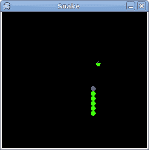

# Snake in Mono Winforms

> 原文： [http://zetcode.com/gui/csharpwinforms/snake/](http://zetcode.com/gui/csharpwinforms/snake/)

在 Mono Winforms 编程教程的这一部分中，我们将创建一个 Snake 游戏克隆。

## 蛇游戏

Snake 是较旧的经典视频游戏。 它最初是在 70 年代后期创建的。 后来它被带到 PC 上。 在这个游戏中，玩家控制蛇。 目的是尽可能多地吃苹果。 蛇每次吃一个苹果，它的身体就会长大。 蛇必须避开墙壁和自己的身体。 该游戏有时称为 Nibbles 。

## 发展历程

蛇的每个关节的大小为 10px。 蛇由光标键控制。 最初，蛇具有三个关节。 通过按下光标键之一开始游戏。 如果游戏结束，我们将在棋盘中间显示“ Game Over”消息。

`Board.cs`

```
using System;
using System.Collections;
using System.ComponentModel;
using System.Drawing;
using System.Data;
using System.Windows.Forms;

public class Board : UserControl {

    private const int WIDTH = 300;
    private const int HEIGHT = 300;
    private const int DOT_SIZE = 10;
    private const int ALL_DOTS = 900;
    private const int RAND_POS = 27;

    private int[] x = new int[ALL_DOTS];
    private int[] y = new int[ALL_DOTS];

    private int dots;
    private int apple_x;
    private int apple_y;

    private bool left = false;
    private bool right = true;
    private bool up = false;
    private bool down = false;
    private bool inGame = true;

    private Timer timer;

    private Bitmap dot;
    private Bitmap apple;
    private Bitmap head;

    private IContainer components;

    public int BORDER_WIDTH;
    public int TITLEBAR_HEIGHT;

    public Board() {

        components = new Container();
        BackColor = Color.Black;
        DoubleBuffered = true;
        this.ClientSize = new Size(WIDTH, HEIGHT);

        try {
            dot = new Bitmap("dot.png");
            apple = new Bitmap("apple.png");
            head = new Bitmap("head.png");

        } catch (Exception e) {
            Console.WriteLine(e.Message);
            Environment.Exit(1);
        } 

        initGame();
    }

    private void OnTick(object sender, EventArgs e) {

        if (inGame) {
            checkApple();
            checkCollision();
            move();
        }
        this.Refresh();
    }

    private void initGame() {

        dots = 3;

        for (int z = 0; z < dots; z++) {
            x[z] = 50 - z * 10;
            y[z] = 50;
        }

        locateApple();
        KeyUp += new KeyEventHandler(OnKeyUp);

        timer = new Timer(this.components);
        timer.Enabled = true;
        timer.Interval = 100;
        timer.Tick += new System.EventHandler(this.OnTick);

        Paint += new PaintEventHandler(this.OnPaint);

    }

    private void OnPaint(object sender, PaintEventArgs e) {

        Graphics g = e.Graphics;

        if (inGame) {

            g.DrawImage(apple, apple_x, apple_y);

            for (int z = 0; z < dots; z++) {
                if (z == 0) {
                    g.DrawImage(head, x[z], y[z]);
                } else {
                    g.DrawImage(dot, x[z], y[z]);    
                }
            }

        } else {
            gameOver(g);
        }
    }

    private void gameOver(Graphics g) {

        String msg = "Game Over";
        StringFormat format = new StringFormat();
        format.Alignment = StringAlignment.Center;
        format.LineAlignment = StringAlignment.Center;

        g.DrawString(msg, Font, Brushes.White, ClientRectangle, format);
        timer.Stop();
    }

    private void checkApple() {

        if ((x[0] == apple_x) && (y[0] == apple_y)) {
            dots++;
            locateApple();
        }
    }

    private void move() {

        for (int z = dots; z > 0; z--) {
            x[z] = x[(z - 1)];
            y[z] = y[(z - 1)];
        }

        if (left) {
            x[0] -= DOT_SIZE;
        }

        if (right) {
            x[0] += DOT_SIZE;
        }

        if (up) {
            y[0] -= DOT_SIZE;
        }

        if (down) {
            y[0] += DOT_SIZE;
        }
    }

    private void checkCollision() {

        for (int z = dots; z > 0; z--) {
            if ((z > 4) && (x[0] == x[z]) && (y[0] == y[z])) {
                inGame = false;
            }
        }

        if (y[0] > HEIGHT - DOT_SIZE - TITLEBAR_HEIGHT - BORDER_WIDTH) {
            inGame = false;
        }

        if (y[0] < 0) {
            inGame = false;
        }

        if (x[0] > WIDTH - DOT_SIZE - 2 * BORDER_WIDTH) {
            inGame = false;
        }

        if (x[0] < 0) {
            inGame = false;
        }
    }

    private void locateApple() {
        Random rand = new Random();
        int r = (int)(rand.Next(RAND_POS));
        apple_x = ((r * DOT_SIZE));
        r = (int)(rand.Next(RAND_POS));
        apple_y = ((r * DOT_SIZE));
    }

    private void OnKeyUp(object sender, KeyEventArgs e) {

        int key = (int) e.KeyCode;

        if ((key == (int) Keys.Left) && (!right)) {
            left = true;
            up = false;
            down = false;
        }

        if ((key == (int) Keys.Right) && (!left)) {
            right = true;
            up = false;
            down = false;
        }

        if ((key == (int) Keys.Up) && (!down)) {
            up = true;
            right = false;
            left = false;
        }

        if ((key == (int) Keys.Down) && (!up)) {
            down = true;
            right = false;
            left = false;
        }
    }
}

```

首先，我们将定义游戏中使用的常量。

`WIDTH`和`HEIGHT`常数确定电路板的大小。 `DOT_SIZE`是苹果的大小和蛇的点。 `ALL_DOTS`常数定义了板上可能的最大点数。 （900 = 300 * 300/10 * 10）`RAND_POS`常数用于计算苹果的随机位置。 `DELAY`常数确定游戏的速度。

```
private int[] x = new int[ALL_DOTS];
private int[] y = new int[ALL_DOTS];

```

这两个数组存储蛇的所有关节的 x，y 坐标。

在`move()`方法中，我们有游戏的密钥算法。 要了解它，请看一下蛇是如何运动的。 您控制蛇的头。 您可以使用光标键更改其方向。 其余关节在链上向上移动一个位置。 第二关节移动到第一个关节的位置，第三关节移动到第二个关节的位置，依此类推。

```
for (int z = dots; z > 0; z--) {
    x[z] = x[(z - 1)];
    y[z] = y[(z - 1)];
}

```

该代码将关节向上移动。

```
if (left) {
    x[0] -= DOT_SIZE;
}

```

将头向左移动。

在`checkCollision()`方法中，我们确定蛇是否击中了自己或撞墙之一。

```
for (int z = dots; z > 0; z--) {

    if ((z > 4) && (x[0] == x[z]) && (y[0] == y[z])) {
        inGame = false;
    }
}

```

如果蛇用头撞到关节之一，我们就结束游戏。

```
if (y[0] > HEIGHT - DOT_SIZE - TITLEBAR_HEIGHT - BORDER_WIDTH) {
    inGame = false;
}

```

如果蛇击中了棋盘的底部，我们就结束了游戏。

`Snake.cs`

```
using System;
using System.Drawing;
using System.Windows.Forms;

class Snake : Form {

    public Snake() {

        Text = "Snake";
        DoubleBuffered = true;
        FormBorderStyle = FormBorderStyle.FixedSingle;

        int borderWidth = (this.Width - this.ClientSize.Width) / 2;
        int titleBarHeight = this.Height - this.ClientSize.Height - borderWidth;

        Board board = new Board();
        board.BORDER_WIDTH = borderWidth;
        board.TITLEBAR_HEIGHT = titleBarHeight;

        Controls.Add(board);
        CenterToScreen();

    }
}

class MApplication {
    public static void Main() {
        Application.Run(new Snake());
    }
}

```

这是主要的类。



Figure: Snake

这是使用 Mono Winforms 库编程的 Snake 游戏。