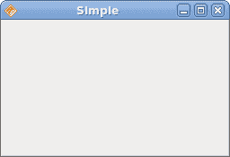
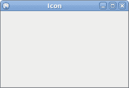
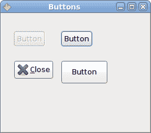

# Java Gnome 的第一步

> 原文： [http://zetcode.com/gui/javagnome/firststeps/](http://zetcode.com/gui/javagnome/firststeps/)

在 Java Gnome 编程教程的这一部分中，我们将进行编程的第一步。 我们将创建简单的程序。

## 简单的例子

第一个代码示例是一个简单的示例，它显示了居中的窗口。

`simple.java`

```
package com.zetcode;

import org.gnome.gdk.Event;
import org.gnome.gtk.Gtk;
import org.gnome.gtk.Widget;
import org.gnome.gtk.Window;
import org.gnome.gtk.WindowPosition;

/**
 * ZetCode Java Gnome tutorial
 *
 * This program is a simple Java Gnome
 * application.
 *
 * @author jan bodnar
 * website zetcode.com
 * last modified March 2009
 */

public class GSimple extends Window  {

    public GSimple() {

        setTitle("Simple");

        connect(new Window.DeleteEvent() {
            public boolean onDeleteEvent(Widget source, Event event) {
                Gtk.mainQuit();
                return false;
            }
        });

        setDefaultSize(250, 150);
        setPosition(WindowPosition.CENTER);
        show();
    }

    public static void main(String[] args) {
        Gtk.init(args);
        new GSimple();
        Gtk.main();
    }
}

```

该代码示例在屏幕中央显示一个小窗口。

```
import org.gnome.gdk.Event;
import org.gnome.gtk.Gtk;
import org.gnome.gtk.Widget;
import org.gnome.gtk.Window;
import org.gnome.gtk.WindowPosition;

```

我们导入所有必要的对象。

```
public class GSimple extends Window  {

```

我们的应用程序基于`Window`类。 窗口是顶级小部件，用作其他小部件的容器。

```
setTitle("Simple");

```

在这里，我们设置窗口的标题。

```
connect(new Window.DeleteEvent() {
    public boolean onDeleteEvent(Widget source, Event event) {
        Gtk.mainQuit();
        return false;
    }
});

```

如果关闭窗口，此代码将完全退出 Java Gnome 应用程序。

```
setDefaultSize(250, 150);

```

此行设置窗口的默认大小。

```
setPosition(WindowPosition.CENTER);

```

这条线使窗口在屏幕上居中。

```
show();

```

现在我们显示窗口。 在调用`show()`方法之前，该窗口不可见。

```
public static void main(String[] args) {
    Gtk.init(args);
    new GSimple();
    Gtk.main();
}

```

`main()`方法是应用程序的入口点。 它启动并运行程序。



Figure: Simple

## 图标

在下一个示例中，我们显示应用程序图标。 大多数窗口管理器在标题栏的左上角以及任务栏上都显示图标。

`icon.java`

```
package com.zetcode;

import java.io.FileNotFoundException;

import org.gnome.gdk.Event;
import org.gnome.gdk.Pixbuf;
import org.gnome.gtk.Gtk;
import org.gnome.gtk.Widget;
import org.gnome.gtk.Window;
import org.gnome.gtk.WindowPosition;

/**
 * ZetCode Java Gnome tutorial
 *
 * This program shows a small icon
 * in the top left corner of the window. 
 *
 * @author jan bodnar
 * website zetcode.com
 * last modified March 2009
 */

public class GIcon extends Window implements Window.DeleteEvent {

    Pixbuf icon;

    public GIcon() {

        setTitle("Icon");

        initUI();

        connect(this);

        setDefaultSize(250, 150);
        setPosition(WindowPosition.CENTER);
        show();
    }

    public void initUI() {

        try {
            icon = new Pixbuf("web.png");
        } catch (FileNotFoundException e) {
            e.printStackTrace();
        }

        setIcon(icon);
    }

    public boolean onDeleteEvent(Widget widget, Event event) {
        Gtk.mainQuit();
        return false;
    }

    public static void main(String[] args) {

        Gtk.init(args);
        new GIcon();
        Gtk.main();
    }
}

```

该代码示例显示了应用程序图标。

```
initUI();

```

我们将用户界面的设置委托给`initUI()`方法。

```
try {
    icon = new Pixbuf("web.png");
} catch (FileNotFoundException e) {
    e.printStackTrace();
}

```

我们从磁盘上的文件加载 pixbuf。

```
setIcon(icon);

```

`setIcon()`方法为窗口设置图标。



Figure: Icon

## 纽扣

在下一个示例中，我们将使用 Java Gnome 库进一步增强我们的编程技能。

`buttons.java`

```
package com.zetcode;

import org.gnome.gdk.Event;
import org.gnome.gtk.Button;
import org.gnome.gtk.Fixed;
import org.gnome.gtk.Gtk;
import org.gnome.gtk.Stock;
import org.gnome.gtk.Widget;
import org.gnome.gtk.Window;
import org.gnome.gtk.WindowPosition;

/**
 * ZetCode Java Gnome tutorial
 *
 * This program shows four buttons
 * with different characteristics.
 *
 * @author jan bodnar
 * website zetcode.com
 * last modified March 2009
 */

public class GButtons extends Window {

    public GButtons() {
        setTitle("Buttons");

        initUI();

        connect(new Window.DeleteEvent() {
            public boolean onDeleteEvent(Widget source, Event event) {
                Gtk.mainQuit();
                return false;
            }
        });

        setDefaultSize(250, 200);
        setPosition(WindowPosition.CENTER);
        showAll();
    }

    public void initUI() {
        Fixed fix = new Fixed();

        Button btn1 = new Button("Button");
        btn1.setSensitive(false);
        Button btn2 = new Button("Button");
        Button btn3 = new Button(Stock.CLOSE);
        Button btn4 = new Button("Button");
        btn4.setSizeRequest(80, 40);

        fix.put(btn1, 20, 30);
        fix.put(btn2, 100, 30);
        fix.put(btn3, 20, 80);
        fix.put(btn4, 100, 80);

        add(fix);
    }

    public static void main(String[] args) {
        Gtk.init(args);
        new GButtons();
        Gtk.main();
    }
}

```

我们在窗口上显示四个不同的按钮。 我们将看到容器窗口小部件和子窗口小部件之间的区别，并将更改子窗口小部件的某些属性。

```
Fixed fix = new Fixed();

```

`Fixed`小部件是不可见的容器小部件。 其目的是包含其他子窗口小部件。

```
Button btn1 = new Button("Button");

```

`Button`是子窗口小部件。 子窗口小部件放置在容器内。

```
btn1.setSensitive(false);

```

我们使此按钮不敏感。 这意味着我们无法单击它。 图形化的小部件为灰色。

```
Button btn3 = new Button(Stock.CLOSE);

```

第三个按钮在其区域内显示图像。 Java Gnome 库具有我们可以使用的内置图像库。

```
btn4.setSizeRequest(80, 40);

```

在这里，我们更改按钮的大小。

```
fix.put(btn1, 20, 30);
fix.put(btn2, 100, 30);
...

```

在这里，我们将按钮小部件放置在固定容器小部件内。

```
add(fix);

```

我们将`Fixed`容器设置为`Window`小部件的主要容器。

```
showAll();

```

我们可以调用`showAll()`方法（它一次显示所有窗口小部件），也可以在每个窗口小部件上调用`show()`方法。 包括容器。



Figure: Buttons

在本章中，我们在 Java Gnome 编程库中创建了第一个程序。