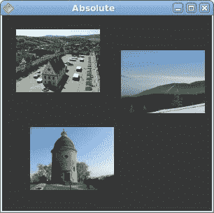
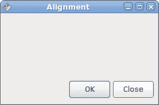
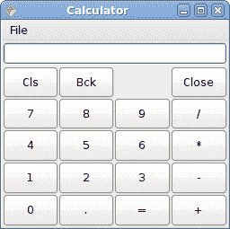
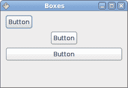

# Java Gnome 中的布局管理

> 原文： [http://zetcode.com/gui/javagnome/layout/](http://zetcode.com/gui/javagnome/layout/)

在本章中，我们将展示如何在窗口或对话框中布置窗口小部件。

在设计应用的 GUI 时，我们决定要使用哪些小部件以及如何在应用中组织这些小部件。 为了组织小部件，我们使用专门的不可见小部件，称为布局容器。 在本章中，我们将提到`Alignment`，`Fixed`，`VBox`，`HBox`和`Table`。

## `Fixed`

`Fixed`容器将子窗口小部件放置在固定位置并具有固定大小。 此容器不执行自动布局管理。 在大多数应用中，我们不使用此容器。 我们在某些专业领域使用它。 例如游戏，使用图表的专用应用，可以移动的可调整大小的组件（如电子表格应用中的图表），小型教育示例。

`fixed.java`

```java
package com.zetcode;

import java.io.FileNotFoundException;

import org.gnome.gdk.Color;
import org.gnome.gdk.Event;
import org.gnome.gdk.Pixbuf;
import org.gnome.gtk.Fixed;
import org.gnome.gtk.Gtk;
import org.gnome.gtk.Image;
import org.gnome.gtk.StateType;
import org.gnome.gtk.Widget;
import org.gnome.gtk.Window;
import org.gnome.gtk.WindowPosition;

/**
 * ZetCode Java Gnome tutorial
 *
 * This program shows how to use
 * the Fixed container. 
 *
 * @author jan bodnar
 * website zetcode.com
 * last modified March 2009
 */

public class GAbsolute extends Window {

    private Pixbuf rotunda;
    private Pixbuf bardejov;
    private Pixbuf mincol;

    public GAbsolute() {

        setTitle("Absolute");

        initUI();

        connect(new Window.DeleteEvent() {
            public boolean onDeleteEvent(Widget source, Event event) {
                Gtk.mainQuit();
                return false;
            }
        });

        setDefaultSize(300, 280);
        setPosition(WindowPosition.CENTER);
        showAll();
    }

    public void initUI() {

        modifyBackground(StateType.NORMAL, new Color(15000, 15000, 15000));

        try {
            bardejov = new Pixbuf("bardejov.jpg");
            rotunda = new Pixbuf("rotunda.jpg");
            mincol = new Pixbuf("mincol.jpg");
        } catch (FileNotFoundException e) {
            System.out.println("Could not load images.");
            System.out.println(e.getMessage());
        }

        Image image1 = new Image(bardejov);
        Image image2 = new Image(rotunda);
        Image image3 = new Image(mincol);

        Fixed fix = new Fixed();

        fix.put(image1, 20, 20);
        fix.put(image2, 40, 160);
        fix.put(image3, 170, 50);

        add(fix);
    }

    public static void main(String[] args) {
        Gtk.init(args);
        new GAbsolute();
        Gtk.main();
    }
}

```

在我们的示例中，我们在窗口上显示了三个小图像。 我们明确指定放置这些图像的 x，y 坐标。

```java
modifyBackground(StateType.NORMAL, new Color(15000, 15000, 15000));

```

为了获得更好的视觉体验，我们将背景色更改为深灰色。

```java
bardejov = new Pixbuf("bardejov.jpg");

```

我们将图像从磁盘加载到`Pixbuf`对象。

```java
Image image1 = new Image(bardejov);
Image image2 = new Image(rotunda);
Image image3 = new Image(mincol);

```

`Image`是用于显示图像的小部件。 它在构造器中使用`Pixbuf`对象。

```java
Fixed fix = new Fixed();

```

我们创建`Fixed`容器。

```java
fix.put(image1, 20, 20);

```

我们将第一个图像放置在`x = 20`，`y = 20`坐标处。

```java
add(fix);

```

最后，我们将`Fixed`容器添加到窗口中。



图：固定

## `Alignment`

`Alignment`容器控制其子窗口小部件的对齐方式和大小。

`alignment.java`

```java
package com.zetcode;

import org.gnome.gdk.Event;
import org.gnome.gtk.Alignment;
import org.gnome.gtk.Button;
import org.gnome.gtk.Gtk;
import org.gnome.gtk.HBox;
import org.gnome.gtk.Label;
import org.gnome.gtk.VBox;
import org.gnome.gtk.Widget;
import org.gnome.gtk.Window;
import org.gnome.gtk.WindowPosition;

/**
 * ZetCode Java Gnome tutorial
 *
 * This program places two buttons
 * in the right bottom corner of
 * the window. 
 *
 * @author jan bodnar
 * website zetcode.com
 * last modified March 2009
 */

public class GAlignment extends Window {

    public GAlignment() {

        setTitle("Alignment");

        initUI();

        connect(new Window.DeleteEvent() {
            public boolean onDeleteEvent(Widget source, Event event) {
                Gtk.mainQuit();
                return false;
            }
        });

        setDefaultSize(260, 150);
        setPosition(WindowPosition.CENTER);
        showAll();
    }

    public void initUI() {
        VBox vbox = new VBox(false, 5);
        HBox hbox = new HBox(true, 3);

        vbox.packStart(new Label(""));

        Button ok = new Button("OK");
        ok.setSizeRequest(70, 30);
        Button close = new Button("Close");

        hbox.add(ok);
        hbox.add(close);

        Alignment halign = new Alignment(1, 0, 0, 0);
        halign.add(hbox);

        vbox.packStart(halign, false, false, 3);

        add(vbox);
        setBorderWidth(5);
    }

    public static void main(String[] args) {
        Gtk.init(args);
        new GAlignment();
        Gtk.main();
    }
}

```

在代码示例中，我们在窗口的右下角放置了两个按钮。 为此，我们使用一个水平框和一个垂直框以及一个对齐容器。

```java
vbox.packStart(new Label(""));

```

该行将在垂直框中放置一个空标签。 标签水平和垂直扩展。 这将使附加到垂直框的下一个小部件出现在窗口底部。

```java
Button ok = new Button("OK");
ok.setSizeRequest(70, 30);
Button close = new Button("Close");

hbox.add(ok);
hbox.add(close);

```

这两个按钮将添加到水平框中。

```java
Alignment halign = new Alignment(1, 0, 0, 0);
halign.add(hbox);

```

水平框将添加到对齐小部件。 对齐小部件将使按钮向右对齐。 我们必须记住，对齐容器仅包含一个子窗口小部件。 这就是为什么我们必须使用盒子。

```java
vbox.packStart(halign, false, false, 3);

```

对齐小部件包装在垂直框中。



图：对齐

## `Table`

`Table`小部件按行和列排列小部件。

`calculator.java`

```java
package com.zetcode;

import org.gnome.gdk.Event;
import org.gnome.gtk.Button;
import org.gnome.gtk.Entry;
import org.gnome.gtk.Gtk;
import org.gnome.gtk.Label;
import org.gnome.gtk.Menu;
import org.gnome.gtk.MenuBar;
import org.gnome.gtk.MenuItem;
import org.gnome.gtk.Table;
import org.gnome.gtk.VBox;
import org.gnome.gtk.Widget;
import org.gnome.gtk.Window;
import org.gnome.gtk.WindowPosition;

/**
 * Java Gnome tutorial
 *
 * This program creates a calculator skeleton
 * with the Table container widget.
 *
 * @author jan bodnar
 * website zetcode.com
 * last modified March 2009
 */

public class GCalculator extends Window {

    public GCalculator() {

        setTitle("Calculator");

        initUI();

        connect(new Window.DeleteEvent() {
            public boolean onDeleteEvent(Widget source, Event event) {
                Gtk.mainQuit();
                return false;
            }
        });

        setDefaultSize(250, 230);
        setPosition(WindowPosition.CENTER);
        showAll();
    }

    public void initUI() {

        VBox vbox = new VBox(false, 2);

        MenuBar mb = new MenuBar();
        Menu filemenu = new Menu();
        MenuItem file = new MenuItem("File");
        file.setSubmenu(filemenu);
        mb.append(file);

        vbox.packStart(mb, false, false, 0);

        Table table = new Table(5, 4, true);

        table.attach(new Button("Cls"), 0, 1, 0, 1);
        table.attach(new Button("Bck"), 1, 2, 0, 1);
        table.attach(new Label(""), 2, 3, 0, 1);
        table.attach(new Button("Close"), 3, 4, 0, 1);

        table.attach(new Button("7"), 0, 1, 1, 2);
        table.attach(new Button("8"), 1, 2, 1, 2);
        table.attach(new Button("9"), 2, 3, 1, 2);
        table.attach(new Button("/"), 3, 4, 1, 2);

        table.attach(new Button("4"), 0, 1, 2, 3);
        table.attach(new Button("5"), 1, 2, 2, 3);
        table.attach(new Button("6"), 2, 3, 2, 3);
        table.attach(new Button("*"), 3, 4, 2, 3);

        table.attach(new Button("1"), 0, 1, 3, 4);
        table.attach(new Button("2"), 1, 2, 3, 4);
        table.attach(new Button("3"), 2, 3, 3, 4);
        table.attach(new Button("-"), 3, 4, 3, 4);

        table.attach(new Button("0"), 0, 1, 4, 5);
        table.attach(new Button("."), 1, 2, 4, 5);
        table.attach(new Button("="), 2, 3, 4, 5);
        table.attach(new Button("+"), 3, 4, 4, 5);

        vbox.packStart(new Entry(), false, false, 0);
        vbox.packStart(table, true, true, 0);

        add(vbox);
    }

    public static void main(String[] args) {
        Gtk.init(args);
        new GCalculator();
        Gtk.main();
    }
}

```

我们使用`Table`小部件创建一个计算器框架。

```java
Table table = new Table(5, 4, true);

```

我们创建一个具有 5 行 4 列的表小部件。 第三个参数是同质参数。 如果设置为`true`，则表中的所有小部件都具有相同的大小。 所有窗口小部件的大小等于表容器中最大的窗口小部件。

```java
table.attach(new Button("Cls"), 0, 1, 0, 1);

```

我们在表格容器上附加一个按钮。 到表格的左上方单元格。 前两个参数是单元格的左侧和右侧，后两个参数是单元格的顶部和左侧。 换句话说，它到达表容器的第一个单元格。 在`0, 0`。

```java
vbox.packStart(new Entry(), false, false, 0);

```

我们首先打包`Entry`小部件。

```java
vbox.packStart(table, true, true, 0);

```

然后，我们添加表格小部件。 我们使其扩展所有剩余空间。



图：计算机骨架

## `fill`和`expand`

下面的示例说明`Box`容器的`fill`和`expand`参数之间的关系。

`boxes.java`

```java
package com.zetcode;

import org.gnome.gdk.Event;
import org.gnome.gtk.Button;
import org.gnome.gtk.Gtk;
import org.gnome.gtk.HBox;
import org.gnome.gtk.VBox;
import org.gnome.gtk.Widget;
import org.gnome.gtk.Window;
import org.gnome.gtk.WindowPosition;

/**
 * ZetCode Java Gnome tutorial
 *
 * This program explains the 
 * relationship between the fill
 * and expand parameters of the Box
 * container.
 *
 * @author jan bodnar
 * website zetcode.com
 * last modified March 2009
 */

public class GBoxes extends Window {

    public GBoxes() {

        setTitle("Boxes");

        initUI();

        connect(new Window.DeleteEvent() {
            public boolean onDeleteEvent(Widget source, Event event) {
                Gtk.mainQuit();
                return false;
            }
        });

        setDefaultSize(250, 150);
        setPosition(WindowPosition.CENTER);
        showAll();
    }

    public void initUI() {

        VBox vbox = new VBox(false, 5);

        HBox hbox1 = new HBox(false, 0);
        HBox hbox2 = new HBox(false, 0);
        HBox hbox3 = new HBox(false, 0);

        Button button1 = new Button("Button");
        Button button2 = new Button("Button");
        Button button3 = new Button("Button");

        hbox1.packStart(button1, false, false, 0);
        hbox2.packStart(button2, true, false, 0);
        hbox3.packStart(button3, true, true, 0);

        vbox.packStart(hbox1, false, false, 0);
        vbox.packStart(hbox2, false, false, 0);
        vbox.packStart(hbox3, false, false, 0);

        add(vbox); 

        setBorderWidth(8);
    }

    public static void main(String[] args) {
        Gtk.init(args);
        new GBoxes();
        Gtk.main();
    }
}

```

在我们的代码示例中，我们有一个垂直的基本框和另外三个水平的框。 我们有三个按钮。 我们将看到`expand`和`fill`参数的组合将如何影响布局。

我们在垂直框内放置三个按钮。 `packStart()`方法的第一个参数是小部件，我们将其放入容器中。 第二个参数是扩展，第三个参数是填充，最后一个参数是填充。

```java
hbox1.packStart(button1, false, false, 0);

```

在这种情况下，`expand`和`fill`均为假。 该按钮不会增长，并保持其初始位置。

```java
hbox2.packStart(button2, true, false, 0);

```

在这里，`expand`参数设置为`true`。 此按钮窗口小部件将获得额外的空间，但窗口小部件不会增大或缩小。 因此，在我们的例子中，按钮将水平居中并保持其初始大小。

```java
hbox3.packStart(button3, true, true, 0);

```

最后，我们将两个参数都设置为`true`。 这将导致按钮占用分配给它的所有水平空间。



图：展开和填充参数

这是 Java Gnome 中布局管理的第一部分。