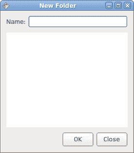
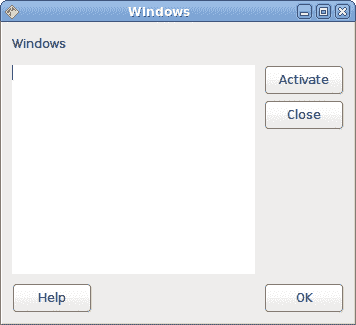
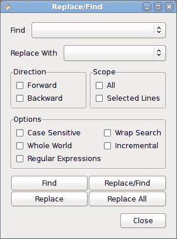

# Java Gnome 中的布局管理 II

> 原文： [http://zetcode.com/gui/javagnome/layoutII/](http://zetcode.com/gui/javagnome/layoutII/)

在本章中，我们将继续使用 Java Gnome 工具箱中的布局。

## 新建文件夹

以下代码示例将创建一个新的文件夹对话框。

`newfolder.java`

```java
package com.zetcode;

import org.gnome.gdk.Event;
import org.gnome.gtk.Alignment;
import org.gnome.gtk.Button;
import org.gnome.gtk.Entry;
import org.gnome.gtk.Gtk;
import org.gnome.gtk.HBox;
import org.gnome.gtk.Label;
import org.gnome.gtk.TextView;
import org.gnome.gtk.VBox;
import org.gnome.gtk.Widget;
import org.gnome.gtk.Window;
import org.gnome.gtk.WindowPosition;

/**
 * ZetCode Java Gnome tutorial
 *
 * This program creates a new
 * folder window. 
 *
 * @author jan bodnar
 * website zetcode.com
 * last modified March 2009
 */
public class GNewFolder extends Window {

    public GNewFolder() {

        setTitle("New Folder");

        initUI();

        connect(new Window.DeleteEvent() {
            public boolean onDeleteEvent(Widget source, Event event) {
                Gtk.mainQuit();
                return false;
            }
        });

        setDefaultSize(270, 290);
        setPosition(WindowPosition.CENTER);
        showAll();
    }

    public void initUI() {

        VBox vbox = new VBox(false, 10);

        Label label = new Label("Name:");
        Entry entry = new Entry();

        HBox hbox1 = new HBox(false, 5);
        hbox1.packStart(label, false, false, 0);
        hbox1.packStart(entry, true, true, 0);

        vbox.packStart(hbox1, false, false, 0);

        TextView tw = new TextView();
        vbox.packStart(tw);

        HBox hbox2 = new HBox(true, 5);
        Button ok = new Button("OK");
        Button close = new Button("Close");
        close.setSizeRequest(65, 30);

        hbox2.packStart(ok);
        hbox2.packStart(close);

        Alignment halign = new Alignment(1, 0, 0, 0);
        halign.add(hbox2);

        vbox.packStart(halign, false, false, 0);

        add(vbox);

        setBorderWidth(10);   
    }

    public static void main(String[] args) {
        Gtk.init(args);
        new GNewFolder();
        Gtk.main();
    }
}

```

这是 Java Gnome 中的新文件夹窗口。

```java
VBox vbox = new VBox(false, 10);

```

垂直框是基础容器。

```java
HBox hbox1 = new HBox(false, 5);
hbox1.packStart(label, false, false, 0);
hbox1.packStart(entry, true, true, 0);

vbox.packStart(hbox1, false, false, 0);

```

标签和输入小部件放置在水平框中。 标签应保留其默认大小，条目窗口小部件可水平扩展。

```java
TextView tw = new TextView();
vbox.packStart(tw);

```

文本视图占据了大部分区域。 它可以水平和垂直扩展。

```java
hbox2.packStart(ok);
hbox2.packStart(close);

```

单击确定和关闭按钮进入水平框。

```java
Alignment halign = new Alignment(1, 0, 0, 0);
halign.add(hbox2);

vbox.packStart(halign, false, false, 0);

```

上面提到的水平框已添加到对齐小部件中。 这将使按钮向右对齐，并使它们保持默认大小。



图：新文件夹

## 窗口

接下来，我们将创建一个更高级的示例。 我们显示一个窗口，可以在 JDeveloper IDE 中找到它。

`windows.java`

```java
package com.zetcode;

import org.gnome.gdk.Color;
import org.gnome.gdk.Event;
import org.gnome.gtk.Alignment;
import org.gnome.gtk.Button;
import org.gnome.gtk.Gtk;
import org.gnome.gtk.HBox;
import org.gnome.gtk.Label;
import org.gnome.gtk.StateType;
import org.gnome.gtk.TextView;
import org.gnome.gtk.VBox;
import org.gnome.gtk.Widget;
import org.gnome.gtk.Window;
import org.gnome.gtk.WindowPosition;

public class GWindows extends Window {

    public GWindows() {

        setTitle("Windows");

        initUI();

        connect(new Window.DeleteEvent() {
            public boolean onDeleteEvent(Widget source, Event event) {
                Gtk.mainQuit();
                return false;
            }
        });

        setDefaultSize(350, 300);
        setPosition(WindowPosition.CENTER);
        showAll();
    }

    public void initUI() {

        VBox vbox = new VBox(false, 9);

        // first row

        Label windows = new Label("Windows");
        windows.setAlignment(0, 0);

        vbox.packStart(windows, false, false, 5);

        // second row

        HBox hbox1 = new HBox(false, 9);

        TextView view = new TextView();
        hbox1.packStart(view);

        VBox vbox2 = new VBox(false, 5);

        Button activate = new Button("Activate");
        activate.setSizeRequest(80, 30);

        Alignment align2 = new Alignment(0, 0, 0, 0);
        align2.add(activate);

        Button close = new Button("Close");
        close.setSizeRequest(80, 30);

        Alignment align3 = new Alignment(0, 0, 0, 0);
        align3.add(close);

        vbox2.packStart(align2, false, false, 0);
        vbox2.packStart(align3, false, false, 0);

        hbox1.packStart(vbox2, false, false, 0);
        vbox.packStart(hbox1);

        // third row

        HBox hbox2 = new HBox(true, 0);

        Button help = new Button("Help");
        help.setSizeRequest(80, 30);

        Alignment alignHelp = new Alignment(0, 0, 0, 0);
        alignHelp.add(help);

        Button ok = new Button("OK");
        ok.setSizeRequest(80, 30);

        Alignment alignOk = new Alignment(1, 0, 0, 0);
        alignOk.add(ok);

        hbox2.packStart(alignHelp);
        hbox2.packStart(alignOk);

        vbox.packStart(hbox2, false, false, 0);

        add(vbox);
        setBorderWidth(9);
    }

    public static void main(String[] args) {
        Gtk.init(args);
        new GWindows();
        Gtk.main();
    }
}

```

我们将窗口布局分为几个部分。 主容器是垂直盒。 我们在此垂直框中放入三行。 第一个是简单的标签小部件。 第二个是水平框，由视图小部件和一个附加的垂直框组成。 最后，第三行是具有两个按钮的水平框。

```java
VBox vbox = new VBox(false, 9);

```

这是主要的垂直框。

```java
Button activate = new Button("Activate");
activate.setSizeRequest(80, 30);

Alignment align2 = new Alignment(0, 0, 0, 0);
align2.add(activate);

```

激活按钮的大小已调整为`80x30`像素。 它放置在`Alignment`小部件内，因此它不会缩小或增长。

```java
Button ok = new Button("OK");
ok.setSizeRequest(80, 30);

Alignment alignOk = new Alignment(1, 0, 0, 0);
alignOk.add(ok);

```

确定按钮右对齐。



图：窗口

## 查找/替换窗口

在以下示例中，我们将创建一个窗口，您可以在 Eclipse IDE 中找到该窗口。

`replace.java`

```java
package com.zetcode;

import org.gnome.gdk.Event;
import org.gnome.gtk.Alignment;
import org.gnome.gtk.AttachOptions;
import org.gnome.gtk.Button;
import org.gnome.gtk.CheckButton;
import org.gnome.gtk.Frame;
import org.gnome.gtk.Gtk;
import org.gnome.gtk.HBox;
import org.gnome.gtk.Label;
import org.gnome.gtk.Table;
import org.gnome.gtk.TextComboBox;
import org.gnome.gtk.VBox;
import org.gnome.gtk.Widget;
import org.gnome.gtk.Window;
import org.gnome.gtk.WindowPosition;

/**
 * ZetCode Java Gnome tutorial
 *
 * This program creates a complicated
 * layout. It uses both box and table
 * containers.
 *
 * @author jan bodnar
 * website zetcode.com
 * last modified March 2009
 */

public class GReplace extends Window {

    public GReplace() {

        setTitle("Replace/Find");

        initUI();

        connect(new Window.DeleteEvent() {
            public boolean onDeleteEvent(Widget source, Event event) {
                Gtk.mainQuit();
                return false;
            }
        });

        setPosition(WindowPosition.CENTER);
        showAll();
    }

    public void initUI() {

        VBox vbox = new VBox(false, 10);

        Label findLabel = new Label("Find");
        Label replaceLabel = new Label("Replace With");

        TextComboBox combo1 = new TextComboBox();
        combo1.appendText("");
        TextComboBox combo2 = new TextComboBox();
        combo2.appendText("");

        HBox hbox1 = new HBox(false, 10);
        hbox1.packStart(findLabel, false, false, 0);
        hbox1.packStart(combo1);

        HBox hbox2 = new HBox(false, 10);
        hbox2.packStart(replaceLabel, false, false, 0);
        hbox2.packStart(combo2);

        vbox.packStart(hbox1, false, false, 0);
        vbox.packStart(hbox2, false, false, 0);

        // second row

        Frame direction = new Frame("Direction");

        VBox v1 = new VBox(true, 0);

        v1.setBorderWidth(5);
        CheckButton cb1 = new CheckButton("Forward");
        CheckButton cb2 = new CheckButton("Backward");
        v1.packStart(cb1);
        v1.packStart(cb2);

        direction.add(v1);

        Frame scope = new Frame("Scope");
        VBox v2 = new VBox(true, 0);
        v2.setBorderWidth(5);
        CheckButton cb3 = new CheckButton("All");
        CheckButton cb4 = new CheckButton("Selected Lines");
        v2.packStart(cb3);
        v2.packStart(cb4);

        scope.add(v2);

        HBox framesBox = new HBox(true, 5);
        framesBox.packStart(direction);
        framesBox.packStart(scope);

        vbox.packStart(framesBox, false, false, 0);

        // third row

        Frame options = new Frame("Options");

        Table table1 = new Table(3, 2, false);

        CheckButton cb5 = new CheckButton("Case Sensitive");
        CheckButton cb6 = new CheckButton("Whole World");
        CheckButton cb7 = new CheckButton("Regular Expressions");
        CheckButton cb8 = new CheckButton("Wrap Search");
        CheckButton cb9 = new CheckButton("Incremental");

        table1.attach(cb5, 0, 1, 0, 1, AttachOptions.FILL, 
            AttachOptions.FILL, 0, 0);
        table1.attach(cb6, 0, 1, 1, 2, AttachOptions.FILL, 
            AttachOptions.FILL, 0, 0);
        table1.attach(cb7, 0, 1, 2, 3, AttachOptions.FILL, 
            AttachOptions.FILL, 0, 0);
        table1.attach(cb8, 1, 2, 0, 1, AttachOptions.FILL,
            AttachOptions.FILL, 0, 0);
        table1.attach(cb9, 1, 2, 1, 2, AttachOptions.FILL, 
            AttachOptions.FILL, 0, 0);

        table1.setBorderWidth(5);

        options.add(table1);
        vbox.packStart(options, true, true, 0);

        // fourth row

        Table table2 = new Table(2, 2, true);
        Button find = new Button("Find");
        Button replace = new Button("Replace");
        Button replaceFind = new Button("Replace/Find");
        Button replaceAll = new Button("Replace All");

        table2.attach(find, 0, 1, 0, 1);
        table2.attach(replace, 0, 1, 1, 2);
        table2.attach(replaceFind, 1, 2, 0, 1);
        table2.attach(replaceAll, 1, 2, 1, 2);

        vbox.packStart(table2, false, false, 0);

        // fifth row

        Button close = new Button("Close");
        close.setSizeRequest(80, -1);
        Alignment halign = new Alignment(1, 0, 0, 0);
        halign.add(close);

        vbox.packStart(halign);

        add(vbox);

        setBorderWidth(15);
    }

    public static void main(String[] args) {
        Gtk.init(args);
        new GReplace();
        Gtk.main();
    }    
}

```

这个例子看起来很复杂。 但是，如果将布局分为几部分，它将变得更加容易。 在本例中，我们将布局分为五行。

```java
HBox hbox1 = new HBox(false, 10);
hbox1.packStart(findLabel, false, false, 0);
hbox1.packStart(combo1);

```

在第一行中，我们创建两个标签和两个组合框。 在上面的代码中，标签保留其位置和大小。 当我们调整窗口大小时，组合框会扩展和增长。 所有这些都由`expand`和`fill`参数控制。

在第二行中，我们有两个框架。 每个框架都有两个复选框。

```java
VBox v1 = new VBox(true, 0);

v1.setBorderWidth(5);
CheckButton cb1 = new CheckButton("Forward");
CheckButton cb2 = new CheckButton("Backward");
v1.packStart(cb1);
v1.packStart(cb2);

direction.add(v1);

```

我们为框架小部件设置一个垂直框。 在此框内，我们放置复选按钮。

```java
HBox framesBox = new HBox(true, 5);
framesBox.packStart(direction);
framesBox.packStart(scope);

vbox.packStart(framesBox, false, false, 0);

```

这两个框架放在水平框内。 然后水平盒放入基本的垂直盒容器中。

第三行是框架，它在水平和垂直方向都可以扩展。 这次，我们在框架内放置了五个复选框。 为此，我们使用表容器。

第四行包含四个按钮。 它们都是相同的大小。 表格小部件非常适合这种布局。

```java
Button close = new Button("Close");
close.setSizeRequest(80, -1);
Alignment halign = new Alignment(1, 0, 0, 0);
halign.add(close);

```

最后，最后一行。 我们使用`Alignment`小部件将按钮右对齐。 `Alignment`小部件还使按钮保留其初始值。 换句话说，它不会增长或收缩。



图：查找/替换窗口

在 Java Gnome 教程的这一部分中，我们创建了一些更复杂的布局。