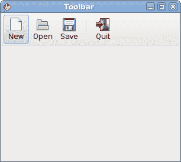
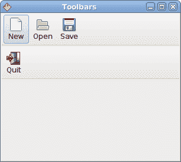
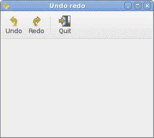

# Java Gnome 中的工具栏

> 原文： [http://zetcode.com/gui/javagnome/toolbars/](http://zetcode.com/gui/javagnome/toolbars/)

在 Java Gnome 编程教程的这一部分中，我们将使用工具栏。

菜单将我们可以在应用中使用的命令分组。 使用工具栏可以快速访问最常用的命令。

## 简单的工具栏

接下来，我们创建一个简单的工具栏。

`toolbar.java`

```java
package com.zetcode;

import org.gnome.gdk.Event;
import org.gnome.gtk.Gtk;
import org.gnome.gtk.Orientation;
import org.gnome.gtk.SeparatorToolItem;
import org.gnome.gtk.Stock;
import org.gnome.gtk.ToolButton;
import org.gnome.gtk.Toolbar;
import org.gnome.gtk.VBox;
import org.gnome.gtk.Widget;
import org.gnome.gtk.Window;
import org.gnome.gtk.WindowPosition;

/**
 * ZetCode Java Gnome tutorial
 *
 * This program creates a simple toolbar.
 *
 * @author jan bodnar
 * website zetcode.com
 * last modified March 2009
 */

public class GToolbar extends Window {

    public GToolbar() {
        setTitle("Toolbar");

        initUI();

        connect(new Window.DeleteEvent() {
            public boolean onDeleteEvent(Widget source, Event event) {
                Gtk.mainQuit();
                return false;
            }
        });

        setDefaultSize(300, 250);
        setPosition(WindowPosition.CENTER);
        showAll();
    }

    public void initUI() {

        Toolbar toolbar = new Toolbar();

        ToolButton newtb = new ToolButton(Stock.NEW);
        ToolButton opentb = new ToolButton(Stock.OPEN);
        ToolButton savetb = new ToolButton(Stock.SAVE);
        SeparatorToolItem sep = new SeparatorToolItem();
        ToolButton quittb = new ToolButton(Stock.QUIT);

        toolbar.insert(newtb, 0);
        toolbar.insert(opentb, 1);
        toolbar.insert(savetb, 2);
        toolbar.insert(sep, 3);
        toolbar.insert(quittb, 4);

        quittb.connect(new ToolButton.Clicked() {

            public void onClicked(ToolButton toolButton) {
                Gtk.mainQuit();
            }
        });

        VBox vbox = new VBox(false, 2);
        vbox.packStart(toolbar, false, false, 0);

        add(vbox);
    }

    public static void main(String[] args) {
        Gtk.init(args);
        new GToolbar();
        Gtk.main();
    }
}

```

该示例显示了一个工具栏和四个工具按钮。

```java
Toolbar toolbar = new Toolbar();

```

`Toolbar`小部件已创建。

```java
ToolButton newtb = new ToolButton(Stock.NEW);

```

创建带有库存图像的`ToolButton`。

```java
SeparatorToolItem sep = new SeparatorToolItem();

```

这是一个分隔符。 它可以用于将工具栏按钮分成逻辑组。

```java
toolbar.insert(newtb, 0);
toolbar.insert(opentb, 1);
...

```

工具栏按钮插入到工具栏小部件中。



图：工具栏

## 工具栏

在第二个示例中，我们显示了两个工具栏。 许多应用具有多个工具栏。 我们展示了如何在 Java Gnome 中做到这一点。

`toolbars.java`

```java
package com.zetcode;

import org.gnome.gdk.Event;
import org.gnome.gtk.Gtk;
import org.gnome.gtk.Stock;
import org.gnome.gtk.ToolButton;
import org.gnome.gtk.Toolbar;
import org.gnome.gtk.VBox;
import org.gnome.gtk.Widget;
import org.gnome.gtk.Window;
import org.gnome.gtk.WindowPosition;

/**
 * ZetCode Java Gnome tutorial
 *
 * This program creates two toolbar
 * instances.
 *
 * @author jan bodnar
 * website zetcode.com
 * last modified March 2009
 */

public class GToolbars extends Window {

    public GToolbars() {
        setTitle("Toolbars");

        initUI();

        connect(new Window.DeleteEvent() {
            public boolean onDeleteEvent(Widget source, Event event) {
                Gtk.mainQuit();
                return false;
            }
        });

        setDefaultSize(300, 250);
        setPosition(WindowPosition.CENTER);
        showAll();    
    }

    public void initUI() {

        Toolbar upper = new Toolbar();

        ToolButton newtb = new ToolButton(Stock.NEW);
        ToolButton opentb = new ToolButton(Stock.OPEN);
        ToolButton savetb = new ToolButton(Stock.SAVE);

        upper.insert(newtb, 0);
        upper.insert(opentb, 1);
        upper.insert(savetb, 2);

        Toolbar lower = new Toolbar();

        ToolButton quittb = new ToolButton(Stock.QUIT);

        quittb.connect(new ToolButton.Clicked() {

            public void onClicked(ToolButton toolButton) {
                Gtk.mainQuit();
            }
        });

        lower.insert(quittb, 0);

        VBox vbox = new VBox(false, 2);
        vbox.packStart(upper, false, false, 0);
        vbox.packStart(lower, false, false, 0);

        add(vbox);
    }

    public static void main(String[] args) {
        Gtk.init(args);
        new GToolbars();
        Gtk.main();
    }
}

```

该应用显示两个工具栏。

```java
Toolbar upper = new Toolbar();
...
Toolbar lower = new Toolbar();

```

我们创建两个`Toolbar`小部件。

```java
upper.insert(newtb, 0);
...       
lower.insert(quittb, 0);

```

它们每个都有自己的工具按钮。

```java
VBox vbox = new VBox(false, 2);
vbox.packStart(upper, false, false, 0);
vbox.packStart(lower, false, false, 0);

```

工具栏一个接一个地包装在垂直盒中。



图：工具栏s

## 撤销重做

以下示例演示了如何停用工具栏上的工具栏按钮。 这是 GUI 编程中的常见做法。 例如，保存按钮。 如果我们将文档的所有更改都保存到磁盘上，则在大多数文本编辑器中，“保存”按钮将被禁用。 这样，应用会向用户指示所有更改都已保存。

`undoredo.java`

```java
package com.zetcode;

import org.gnome.gdk.Event;
import org.gnome.gtk.Gtk;
import org.gnome.gtk.Label;
import org.gnome.gtk.SeparatorToolItem;
import org.gnome.gtk.Stock;
import org.gnome.gtk.ToolButton;
import org.gnome.gtk.Toolbar;
import org.gnome.gtk.VBox;
import org.gnome.gtk.Widget;
import org.gnome.gtk.Window;
import org.gnome.gtk.WindowPosition;

/**
 * ZetCode Java Gnome tutorial
 *
 * This program creates an undo redo 
 * example. It shows how to enable/disable
 * tool buttons if they cannot be used no
 * more.
 *
 * @author jan bodnar
 * website zetcode.com
 * last modified March 2009
 */

public class GUndoRedo extends Window {

    private int count = 2;
    private ToolButton undo;
    private ToolButton redo;

    public GUndoRedo() {

        setTitle("Undo redo");

        initUI();

        connect(new Window.DeleteEvent() {
            public boolean onDeleteEvent(Widget source, Event event) {
                Gtk.mainQuit();
                return false;
            }
        });

        setDefaultSize(300, 250);
        setPosition(WindowPosition.CENTER);
        showAll();    
    }

    public void initUI() {
        Toolbar toolbar = new Toolbar();

        undo = new ToolButton(Stock.UNDO);
        redo = new ToolButton(Stock.REDO);
        SeparatorToolItem sep = new SeparatorToolItem();
        ToolButton quit = new ToolButton(Stock.QUIT);

        toolbar.insert(undo, 0);
        toolbar.insert(redo, 1);
        toolbar.insert(sep, 2);
        toolbar.insert(quit, 3);

        undo.connect(new ToolButton.Clicked() {

            public void onClicked(ToolButton toolButton) {
                count -= 1;

                if (count <= 0) {
                    undo.setSensitive(false);
                    redo.setSensitive(true);
                }
            }
        });

        redo.connect(new ToolButton.Clicked() {

            public void onClicked(ToolButton toolButton) {
                count += 1;

                if (count >= 5) {
                    redo.setSensitive(false);
                    undo.setSensitive(true);
                }
            }
        });

        quit.connect(new ToolButton.Clicked() {

            public void onClicked(ToolButton toolButton) {
                Gtk.mainQuit();
            }
        });

        VBox vbox = new VBox(false, 2);
        vbox.packStart(toolbar, false, false, 0);
        vbox.packStart(new Label(""), false, false, 0);

        add(vbox);

    }

    public static void main(String[] args) {
        Gtk.init(args);
        new GUndoRedo();
        Gtk.main();
    }
}

```

我们的示例从 Java Gnome 库存资源创建撤消和重做按钮。 单击几下后，每个按钮均被禁用。 按钮显示为灰色。

```java
private int count = 2;

```

`count`变量决定哪个按钮被激活和禁用。

```java
undo = new ToolButton(Stock.UNDO);
redo = new ToolButton(Stock.REDO);

```

我们有两个工具按钮。 撤消和重做工具按钮。 图片来自库存资源。

```java
undo.connect(new ToolButton.Clicked() {
    public void onClicked(ToolButton toolButton) {
         count -= 1;
         if (count <= 0) {
             undo.setSensitive(false);
             redo.setSensitive(true);
         }
     }
 });

```

我们为撤消工具按钮插入`Clicked`事件的方法。 要激活/禁用小部件，我们使用`setSensitive()`方法。



图：撤销和重做

在 Java Gnome 编程库的这一章中，我们提到了工具栏。