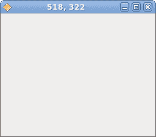

# Java Gnome 中的事件

> 原文： [http://zetcode.com/gui/javagnome/events/](http://zetcode.com/gui/javagnome/events/)

在 Java Gnome 编程教程的这一部分中，我们将讨论事件。

Java Gnome 库是事件驱动的系统。 所有 GUI 应用都是事件驱动的。 应用启动一个主循环，该循环不断检查新生成的事件。 如果没有事件，则应用将等待并且不执行任何操作。

## 简单事件示例

下一个示例显示了我们如何应对两个基本事件。

`quitbutton.java`

```
package com.zetcode;

import org.gnome.gdk.Event;
import org.gnome.gtk.Button;
import org.gnome.gtk.Fixed;
import org.gnome.gtk.Gtk;
import org.gnome.gtk.Widget;
import org.gnome.gtk.Window;
import org.gnome.gtk.WindowPosition;

/**
 * Java Gnome tutorial
 *
 * This program demonstrates two 
 * basic events. 
 *
 * @author jan bodnar
 * website zetcode.com
 * last modified March 2009
 */

public class GButton extends Window  {

    public GButton() {

        setTitle("Button");

        initUI();

        setPosition(WindowPosition.CENTER);
        showAll();
    }

    public void initUI() {

        connect(new Window.DeleteEvent() {
            public boolean onDeleteEvent(Widget source, Event event) {
                Gtk.mainQuit();
                return false;
            }
        });

        Fixed fixed = new Fixed();

        Button quit = new Button("Quit");
        quit.connect(new Button.Clicked() {

            public void onClicked(Button button) {
                Gtk.mainQuit();
            }
        });

        quit.setSizeRequest(80, 35);
        fixed.put(quit, 50, 50);
        add(fixed);        

        setSizeRequest(250, 200);
    }

    public static void main(String[] args) {

        Gtk.init(args);
        new GButton();
        Gtk.main();
    }
}

```

在我们的代码示例中，我们对两个事件做出反应。 删除事件和单击事件。 当我们关闭窗口时，将触发删除事件。 默认情况下，该窗口被销毁，但应用不退出。 我们必须明确退出该程序。

```
connect(new Window.DeleteEvent() {
    public boolean onDeleteEvent(Widget source, Event event) {
        Gtk.mainQuit();
        return false;
    }
});

```

如果单击窗口的关闭按钮，则窗口将被破坏。 但是应用并未完全销毁。 我们必须调用`Gtk.mainQuit()`结束应用。 我们使用`connect()`方法将回调方法连接到特定事件类型。 在我们的例子中是`DeleteEvent`。

```
quit.connect(new Button.Clicked() {
    public void onClicked(Button button) {
        Gtk.mainQuit();
    }
});

```

当我们单击按钮小部件时，将触发`onClicked()`方法。 我们对按钮单击做出反应，退出了应用。

## 移动窗口

下一个示例显示了我们如何对移动窗口事件做出反应。 我们在标题栏中显示窗口左上角的当前位置。

`move.java`

```
package com.zetcode;

import org.gnome.gdk.Event;
import org.gnome.gdk.EventConfigure;
import org.gnome.gtk.Gtk;
import org.gnome.gtk.Widget;
import org.gnome.gtk.Window;
import org.gnome.gtk.WindowPosition;

/**
 * ZetCode Java Gnome tutorial
 *
 * This program demonstrates the 
 * configure event.
 *
 * @author jan bodnar
 * website zetcode.com
 * last modified March 2009
 */

public class GMoveWindow extends Window 
        implements Window.ConfigureEvent {

    public GMoveWindow()  {

        connect(new Window.DeleteEvent() {
            public boolean onDeleteEvent(Widget source, Event event) {
                Gtk.mainQuit();
                return false;
            }
        });

        connect(this);

        setPosition(WindowPosition.CENTER);

        setTitle("");
        resize(250, 200);
        showAll();
    }

    public boolean onConfigureEvent(Widget widget,
        EventConfigure eventConfigure) {

        int x = eventConfigure.getX();
        int y = eventConfigure.getY();

        setTitle(x + ", " + y);
        return false;
    }

    public static void main(String[] args) {
        Gtk.init(args);
        new GMoveWindow();
        Gtk.main();
    }
}

```

调整大小和移动窗口最终导致创建`ConfigureEvent`。

```
public boolean onConfigureEvent(Widget widget,
    EventConfigure eventConfigure) {

    int x = eventConfigure.getX();
    int y = eventConfigure.getY();

    setTitle(x + ", " + y);
    return false;
}

```

我们将窗口的 x，y 坐标设置为窗口的标题栏。



Figure: Move event

## `EnterNotifyEvent`

当我们使用鼠标指针进入小部件的区域时，会发出`EnterNotifyEvent`。

`enter.java`

```
package com.zetcode;

import org.gnome.gdk.Color;
import org.gnome.gdk.Event;
import org.gnome.gdk.EventCrossing;
import org.gnome.gtk.Button;
import org.gnome.gtk.Fixed;
import org.gnome.gtk.Gtk;
import org.gnome.gtk.StateType;
import org.gnome.gtk.Widget;
import org.gnome.gtk.Window;
import org.gnome.gtk.WindowPosition;

/**
 * ZetCode Java Gnome tutorial
 *
 * This program demonstrates the 
 * EnterNotifyEvent.
 *
 * @author jan bodnar
 * website zetcode.com
 * last modified March 2009
 */

public class GEnterNotifyEvent extends Window {

    private Color lightGray = new Color(55000, 55000, 55000);

    public GEnterNotifyEvent() {

        setTitle("EnterNotifyEvent");

        initUI();

        connect(new Window.DeleteEvent() {
            public boolean onDeleteEvent(Widget source, Event event) {
                Gtk.mainQuit();
                return false;
            }
        });

        setDefaultSize(250, 150);
        setPosition(WindowPosition.CENTER);
        showAll();
    }

    public void initUI() {

        Button button = new Button("Button");
        button.setSizeRequest(80, 30);

        button.connect(new Button.EnterNotifyEvent() {
            public boolean onEnterNotifyEvent(Widget widget,
                        EventCrossing eventCrossing) {

                widget.modifyBackground(StateType.PRELIGHT, lightGray);

                return false;
            }
        });

        Fixed fix = new Fixed();
        fix.put(button, 20, 20);
        add(fix);
    }

    public static void main(String[] args) {
        Gtk.init(args);
        new GEnterNotifyEvent();
        Gtk.main();
    }
}

```

一旦将鼠标指针悬停在按钮小部件上，我们将更改其背景颜色。

```
button.connect(new Button.EnterNotifyEvent() {
    public boolean onEnterNotifyEvent(Widget widget,
        EventCrossing eventCrossing) {
        widget.modifyBackground(StateType.PRELIGHT, lightGray);
        return false;
    }
});

```

在这里，我们对`EnterNotifyEvent`做出反应。

```
widget.modifyBackground(StateType.PRELIGHT, lightGray);

```

我们修改按钮背景的颜色。

本章介绍 Java Gnome 中的事件。