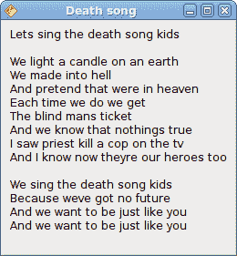
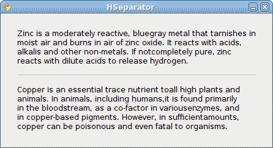
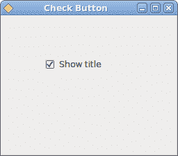
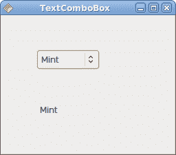
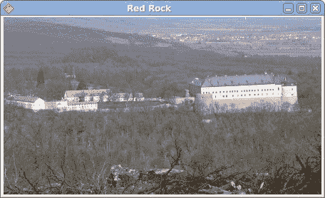

# Java Gnome 中的小部件

> 原文： [http://zetcode.com/gui/javagnome/widgets/](http://zetcode.com/gui/javagnome/widgets/)

在 Java Gnome 编程教程的这一部分中，我们将介绍一些小部件。

小部件是 GUI 应用程序的基本构建块。 多年来，几个小部件已成为所有 OS 平台上所有工具包中的标准。 例如，按钮，复选框或滚动条。 GTK+ 工具箱的理念是将小部件的数量保持在最低水平。 将创建更多专门的小部件作为自定义小部件。

## `Label`

`Label`小部件显示文本。

`label.java`

```
package com.zetcode;

import org.gnome.gdk.Event;
import org.gnome.gtk.Gtk;
import org.gnome.gtk.Label;
import org.gnome.gtk.Widget;
import org.gnome.gtk.Window;
import org.gnome.gtk.WindowPosition;

/**
 * ZetCode Java Gnome tutorial
 *
 * This program uses Label widget
 * to display text. 
 *
 * @author jan bodnar
 * website zetcode.com
 * last modified March 2009
 */

public class GLabel extends Window {

    public GLabel() {

        setTitle("Death song");

        initUI();

        connect(new Window.DeleteEvent() {
            public boolean onDeleteEvent(Widget source, Event event) {
                Gtk.mainQuit();
                return false;
            }
        });

        setPosition(WindowPosition.CENTER);
        showAll();
    }

    public void initUI() {

        Label lyrics = new Label("Lets sing the death song kids\n\n" +
        "We light a candle on an earth\n" +
        "We made into hell\n" +
        "And pretend that were in heaven\n" +
        "Each time we do we get\n" +
        "The blind mans ticket\n" +
        "And we know that nothings true\n" +
        "I saw priest kill a cop on the tv\n" +
        "And I know now theyre our heroes too\n\n" +

        "We sing the death song kids\n" +
        "Because weve got no future\n" +
        "And we want to be just like you\n" +
        "And we want to be just like you\n");

        add(lyrics);  

        setBorderWidth(8);
    }

    public static void main(String[] args) {
        Gtk.init(args);
        new GLabel();
        Gtk.main();
    }
}

```

该代码示例在窗口上显示了一些歌词。

```
Label lyrics = new Label("Lets sing the death song kids\n\n" +
"We light a candle on an earth\n" +
...

```

这是我们将在“标签”小部件中显示的文本。

```
setBorderWidth(8);

```

`Label`周围有一些空白。



Figure: Label Widget

## `HSeparator`

`HSeparator`是一个装饰小部件，可用于分隔窗口上的项目。

`separator.java`

```
package com.zetcode;

import org.gnome.gdk.Event;
import org.gnome.gtk.Gtk;
import org.gnome.gtk.HSeparator;
import org.gnome.gtk.Label;
import org.gnome.gtk.VBox;
import org.gnome.gtk.Widget;
import org.gnome.gtk.Window;
import org.gnome.gtk.WindowPosition;

/**
 * Java Gnome tutorial
 *
 * This program shows how to use
 * a horizontal separator.
 *
 * @author jan bodnar
 * website zetcode.com
 * last modified March 2009
 */

public class GHSeparator extends Window {

    private final int VERTICAL_SPACE = 15;
    private final int BORDER_AROUND = 25;
    private final float Y_ALIGN = 0f;
    private final float X_ALIGN = 0f;

    public GHSeparator() {

        setTitle("HSeparator");

        initUI();

        connect(new Window.DeleteEvent() {
            public boolean onDeleteEvent(Widget source, Event event) {
                Gtk.mainQuit();
                return false;
            }
        });

        setPosition(WindowPosition.CENTER);
        showAll();

    }    

    public void initUI() {

        VBox vbox = new VBox(false, VERTICAL_SPACE);

        Label zinc = new Label("Zinc is a moderately reactive, blue" +
        "gray metal that tarnishes in moist air and burns in air of zinc " +
        "oxide. It reacts with acids, alkalis and other non-metals. If not" +
        "completely pure, zinc reacts with dilute acids to release hydrogen.");

        zinc.setLineWrap(true);
        zinc.setAlignment(X_ALIGN, Y_ALIGN);

        vbox.packStart(zinc);

        HSeparator hsep = new HSeparator();
        vbox.packStart(hsep);

        Label copper = new Label("Copper is an essential trace nutrient to" +
        "all high plants and animals. In animals, including humans," +
        "it is found primarily in the bloodstream, as a co-factor in various" +
        "enzymes, and in copper-based pigments. However, in sufficient" +
        "amounts, copper can be poisonous and even fatal to organisms.");

        copper.setAlignment(X_ALIGN, Y_ALIGN);
        copper.setLineWrap(true);

        vbox.packStart(copper);
        add(vbox);

        setResizable(false);
        setBorderWidth(BORDER_AROUND);
    }

    public static void main(String[] args) {
        Gtk.init(args);
        new GHSeparator();
        Gtk.main();
    }
}

```

在我们的代码示例中，我们描述了两个化学元素，它们由水平分隔符分隔。

```
zinc.setLineWrap(true);

```

该行换行。 对于较长的文本，这是必需的。

```
zinc.setAlignment(X_ALIGN, Y_ALIGN);

```

此代码行使文本左对齐。

```
HSeparator hsep = new HSeparator();
vbox.packStart(hsep);

```

`HSeparator`小部件已创建并放置在两个标签小部件之间。



Figure: HSeparator

## `CheckButton`

`CheckButton`是具有两种状态的窗口小部件：打开和关闭。 接通状态通过复选标记显示。 它用来表示一些布尔属性。

`checkbutton.java`

```
package com.zetcode;

import org.gnome.gdk.Event;
import org.gnome.gtk.CheckButton;
import org.gnome.gtk.Fixed;
import org.gnome.gtk.Gtk;
import org.gnome.gtk.ToggleButton;
import org.gnome.gtk.Widget;
import org.gnome.gtk.Window;
import org.gnome.gtk.WindowPosition;

/**
 * ZetCode Java Gnome tutorial
 *
 * This program uses a CheckButton to 
 * toggle the visibility of a window title.
 *
 * @author jan bodnar
 * website zetcode.com
 * last modified March 2009
 */

public class GCheckButton extends Window implements ToggleButton.Toggled {

    CheckButton check;
    Window window;
    private String title = "Check Button";

    public GCheckButton() {

        setTitle(title);

        initUI();

        connect(new Window.DeleteEvent() {
            public boolean onDeleteEvent(Widget source, Event event) {
                Gtk.mainQuit();
                return false;
            }
        });

        setSizeRequest(250, 200);
        showAll();
    }

    public void initUI() {

        setBorderWidth(10);

        Fixed fixed = new Fixed();

        check = new CheckButton("Show title");
        check.setActive(true);
        check.connect(this);

        check.setCanFocus(false);

        fixed.put(check, 50, 50);

        add(fixed);
        setPosition(WindowPosition.CENTER);
    }

    public void onToggled(ToggleButton toggleButton) {
            if (check.getActive()) {
                setTitle(title);
            } else {
                setTitle("");
            }
    }

    public static void main(String[] args) {

        Gtk.init(args);
        new GCheckButton();
        Gtk.main();

    }   
}

```

根据`CheckButton`的状态，我们将在窗口的标题栏中显示标题。

```
check = new CheckButton("Show title");

```

`CheckButton`小部件已创建。

```
check.setActive(true);

```

默认情况下标题是可见的，因此我们默认情况下选中复选按钮。

```
if (check.getActive()) {
    setTitle(title);
} else {
    setTitle("");
}

```

根据`CheckButton`的状态，我们显示或隐藏窗口的标题。



Figure: CheckButton

## `TextComboBox`

`TextComboBox`是一个小部件，允许用户从文本选项列表中进行选择。

`textcombobox.java`

```
package com.zetcode;

import org.gnome.gdk.Event;
import org.gnome.gtk.ComboBox;
import org.gnome.gtk.Fixed;
import org.gnome.gtk.Gtk;
import org.gnome.gtk.Label;
import org.gnome.gtk.TextComboBox;
import org.gnome.gtk.Widget;
import org.gnome.gtk.Window;
import org.gnome.gtk.WindowPosition;

/**
 * ZetCode Java Gnome tutorial
 *
 * This program shows how to use
 * a TextComboBox.
 *
 * @author jan bodnar
 * website zetcode.com
 * last modified March 2009
 */

public class GTextComboBox extends Window implements ComboBox.Changed {

    TextComboBox cb;
    Label label;

    public GTextComboBox() {

        setTitle("TextComboBox");

        initUI();

        setSizeRequest(250, 200);
        setPosition(WindowPosition.CENTER);
        showAll();
    }

    public void initUI() {

        connect(new Window.DeleteEvent() {
            public boolean onDeleteEvent(Widget source, Event event) {
                Gtk.mainQuit();
                return false;
            }
        });

        Fixed fixed = new Fixed();

        label = new Label("");
        fixed.put(label, 55, 130);

        cb = new TextComboBox();

        cb.appendText("Ubuntu");
        cb.appendText("Mandriva");
        cb.appendText("Fedora");
        cb.appendText("Mint");
        cb.appendText("Debian");
        cb.appendText("Gentoo");

        cb.connect(this);

        fixed.put(cb, 50, 50);

        add(fixed);
    }

    public void onChanged(ComboBox comboBox) {
        String text = cb.getActiveText();
        label.setLabel(text);
    }

    public static void main(String[] args) {
        Gtk.init(args);
        new GTextComboBox();
        Gtk.main();
    }
}

```

该示例显示了一个文本组合框和一个标签。 文本组合框具有六个选项的列表。 这些是 Linux Distros 的名称。 标签窗口小部件显示了从文本组合框中选择的选项。

```
cb = new TextComboBox();

```

`TextComboBox`小部件已创建。

```
cb.appendText("Ubuntu");

```

调用`appendText()`方法来填充文本组合框。

```
public void onChanged(ComboBox comboBox) {
    String text = cb.getActiveText();
    label.setLabel(text);
}

```

当我们从文本组合框中选择一个选项时，将调用`onChanged()`方法。 我们获取选定的文本并将其设置为标签小部件。



Figure: TextComboBox

## `Image`

下一个示例介绍`Image`小部件。 此小部件显示图片。

`image.java`

```
package com.zetcode;

import org.gnome.gdk.Event;
import org.gnome.gtk.Gtk;
import org.gnome.gtk.Image;
import org.gnome.gtk.Widget;
import org.gnome.gtk.Window;
import org.gnome.gtk.WindowPosition;

/**
 * ZetCode Java Gnome tutorial
 *
 * This program shows an image of a castle
 * in the window.
 *
 * @author jan bodnar
 * website zetcode.com
 * last modified March 2009
 */

public class GImage extends Window {
    public GImage() {

        setTitle("Red Rock");

        initUI();

        setPosition(WindowPosition.CENTER);
        showAll();
    }

    public void initUI() {

        connect(new Window.DeleteEvent() {
            public boolean onDeleteEvent(Widget source, Event event) {
                Gtk.mainQuit();
                return false;
            }
        });

        Image image = new Image("redrock.png");

        int width = image.getRequisition().getWidth();
        int height = image.getRequisition().getHeight();
        setSizeRequest(width, height);

        add(image);
        setBorderWidth(2);
    }

    public static void main(String[] args) {
        Gtk.init(args);
        new GImage();
        Gtk.main();
    }
}

```

我们在窗口中显示红色岩石城堡。

```
Image image = new Image("redrock.png");

```

我们创建`Image`小部件的实例。 请注意，我们不会捕获任何异常。 图像小部件已经可以处理它们。 如果“图像”小部件找不到 redrock.png 图像，则默认情况下将显示丢失的图像。

```
Image image = new Image(castle);
Add(image);

```

`Image`小部件已创建并添加到窗口。



Figure: Image

在本章中，我们展示了 Java Gnome 编程库的第一组基本小部件。