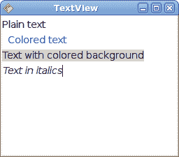
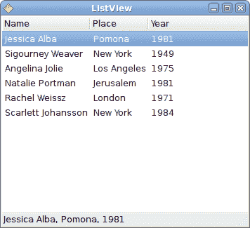
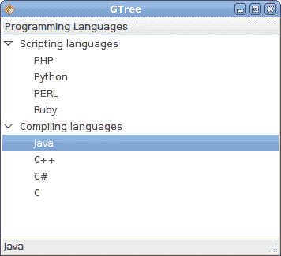

# Java Gnome 中的高级小部件

> 原文： [http://zetcode.com/gui/javagnome/advancedwidgets/](http://zetcode.com/gui/javagnome/advancedwidgets/)

在 Java Gnome 编程教程的这一部分中，我们将介绍一些更高级的小部件。

## `TexView`

`TexView`小部件用于显示和编辑多行文本。 `TextView`小部件也具有 MVC 设计。 TextView 代表视图组件，`TexBuffer`代表模型组件。 `TextBuffer`用于处理文本数据。 `TextTag`是可以应用于文本的属性。 `TextIter`表示文本中两个字符之间的位置。 所有使用文本的操作都是使用文本迭代器完成的。

`textview.java`

```java
package com.zetcode;

import org.gnome.gdk.Event;
import org.gnome.gtk.Gtk;

import org.gnome.gtk.TextBuffer;
import org.gnome.gtk.TextIter;
import org.gnome.gtk.TextTag;
import org.gnome.gtk.TextView;
import org.gnome.gtk.Widget;
import org.gnome.gtk.Window;
import org.gnome.gtk.WindowPosition;
import org.gnome.gtk.WrapMode;
import org.gnome.pango.FontDescription;
import org.gnome.pango.Style;

/**
 * ZetCode Java Gnome tutorial
 *
 * This program demonstrates the
 * TextView widget. 
 *
 * @author jan bodnar
 * website zetcode.com
 * last modified March 2009
 */

public class GTextView extends Window {

    public GTextView() {

        setTitle("TextView");

        initUI();

        connect(new Window.DeleteEvent() {
            public boolean onDeleteEvent(Widget source, Event event) {
                Gtk.mainQuit();
                return false;
            }
        });

        setDefaultSize(250, 200);
        setPosition(WindowPosition.CENTER);
        showAll();
    }

    public void initUI() {

        final TextView view;
        final FontDescription desc;
        final TextBuffer buffer;
        final TextTag colorText, italics, background, mleft;
        TextIter pointer;

        view = new TextView();

        desc = new FontDescription("Sans, 10");
        view.modifyFont(desc);

        buffer = new TextBuffer();

        colorText = new TextTag();
        colorText.setForeground("blue");

        italics = new TextTag();
        italics.setStyle(Style.ITALIC);

        background = new TextTag();
        background.setBackground("lightgray");

        mleft = new TextTag();
        mleft.setLeftMargin(8);

        pointer = buffer.getIterStart();
        buffer.insert(pointer, "Plain text \n");
        buffer.insert(pointer, "Colored text\n", new TextTag[] {colorText, mleft});
        buffer.insert(pointer, "Text with colored background\n", background);
        buffer.insert(pointer, "Text in italics", italics);

        view.setBuffer(buffer);
        view.setPaddingAboveParagraph(5);
        add(view);

    }

    public static void main(String[] args) {
        Gtk.init(args);
        new GTextView();
        Gtk.main();
    }    
}

```

该示例显示了一些应用了不同`TextTags`的文本。

```java
view = new TextView();

```

TextView 小部件已创建。

```java
desc = new FontDescription("Sans, 10");
view.modifyFont(desc);

```

我们将`TextView`的字体设置为 Sans 10。

```java
colorText = new TextTag();
colorText.setForeground("blue");

```

`TextTag`小部件已创建。 如果应用，此标签会将文本的颜色设置为蓝色。

```java
buffer.insert(pointer, "Text in italics", italics);

```

在这里，我们为指定的文本应用斜体文本标签。



图：`TextView`

## `ListView`

在下面的示例中，我们在列表视图模式下使用`TreeView`小部件。 `ListStore`用于存储数据。

`listview.java`

```java
package com.zetcode;

import org.gnome.gdk.Event;
import org.gnome.gtk.CellRendererText;
import org.gnome.gtk.DataColumn;
import org.gnome.gtk.DataColumnString;
import org.gnome.gtk.Gtk;
import org.gnome.gtk.ListStore;
import org.gnome.gtk.Statusbar;
import org.gnome.gtk.TreeIter;
import org.gnome.gtk.TreePath;
import org.gnome.gtk.TreeView;
import org.gnome.gtk.TreeViewColumn;
import org.gnome.gtk.VBox;
import org.gnome.gtk.Widget;
import org.gnome.gtk.Window;
import org.gnome.gtk.WindowPosition;

/**
 * ZetCode Java Gnome tutorial
 *
 * This program demonstrates the
 * TreeView widget in listview mode. 
 *
 * @author jan bodnar
 * website zetcode.com
 * last modified March 2009
 */

public class GListView extends Window {

    private Actress[] actresses =
    {
        new Actress("Jessica Alba", "Pomona", 1981),
        new Actress("Sigourney Weaver", "New York", 1949),
        new Actress("Angelina Jolie", "Los Angeles", 1975),
        new Actress("Natalie Portman", "Jerusalem", 1981),
        new Actress("Rachel Weissz", "London", 1971),
        new Actress("Scarlett Johansson", "New York", 1984) 
    };

    private Statusbar statusbar;

    public GListView() {

        setTitle("ListView");

        initUI();

        connect(new Window.DeleteEvent() {
            public boolean onDeleteEvent(Widget source, Event event) {
                Gtk.mainQuit();
                return false;
            }
        });

        setDefaultSize(350, 300);
        setPosition(WindowPosition.CENTER);
        showAll();
    }

    public void initUI() {

        final TreeView view;
        final ListStore model;
        TreeIter row;
        CellRendererText renderer;
        TreeViewColumn column;

        final DataColumnString nameCol;
        final DataColumnString placeCol;
        final DataColumnString yearCol;

        statusbar = new Statusbar();

        model = new ListStore(new DataColumn[] {
                nameCol = new DataColumnString(),
                placeCol = new DataColumnString(),
                yearCol = new DataColumnString(),
        });

         for (Actress act : actresses) {
             row = model.appendRow();
             model.setValue(row, nameCol, act.name);
             model.setValue(row, placeCol, act.place);
             model.setValue(row, yearCol, String.valueOf(act.year));
         }

        view = new TreeView(model);

        column = view.appendColumn();
        column.setTitle("Name");
        renderer = new CellRendererText(column);
        renderer.setText(nameCol);

        column = view.appendColumn();
        column.setTitle("Place");
        renderer = new CellRendererText(column);
        renderer.setText(placeCol);

        column = view.appendColumn();
        column.setTitle("Year");
        renderer = new CellRendererText(column);
        renderer.setText(yearCol);

        view.connect(new TreeView.RowActivated() {

            public void onRowActivated(TreeView treeView,
                        TreePath treePath,
                        TreeViewColumn treeViewColumn) {

                final TreeIter row;
                final String place;
                final String name;
                final String year;
                final String text;

                row = model.getIter(treePath);

                place = model.getValue(row, placeCol);
                name = model.getValue(row, nameCol);
                year = model.getValue(row, yearCol);

                text = name + ", " + place + ", " + year;

                statusbar.setMessage(text);
            }
        });

        VBox vbox = new VBox(false, 0);

        vbox.packStart(view);
        vbox.packStart(statusbar, false, false, 0);
        add(vbox);

    }

    class Actress {

       public String name;
       public String place;
       public int year;

       Actress(String name, String place, int year) {
           this.name = name;
           this.place = place;
           this.year = year;
       }
    }

    public static void main(String[] args) {
        Gtk.init(args);
        new GListView();
        Gtk.main();
    }
}

```

在我们的示例中，我们在`TreeView`小部件中显示了六个女演员的列表。 每行分别显示名称，出生地和出生年份。

```java
class Actress {
   public String name;
   public String place;
   public int year;
   ...
}

```

`Actress`类用于存储有关女演员的数据。

```java
model = new ListStore(new DataColumn[] {
        nameCol = new DataColumnString(),
        placeCol = new DataColumnString(),
        yearCol = new DataColumnString(),
});

```

这些行声明模型具有三个字符串数据列。

```java
for (Actress act : actresses) {
    row = model.appendRow();
    model.setValue(row, nameCol, act.name);
    model.setValue(row, placeCol, act.place);
    model.setValue(row, yearCol, String.valueOf(act.year));
}

```

该模型充满了女演员的数据。

```java
column = view.appendColumn();
column.setTitle("Name");
renderer = new CellRendererText(column);
renderer.setText(nameCol);

```

将创建一个带有`"Name"`标题的新列。 每列都有一个单元格渲染器。 单元格渲染器负责显示数据。 在我们的情况下，我们有最常用的单元格渲染器`CellRendererText`。 顾名思义，它在`TreeViewColumn`中显示文本数据。

```java
row = model.getIter(treePath);

place = model.getValue(row, placeCol);
name = model.getValue(row, nameCol);
year = model.getValue(row, yearCol);

text = name + ", " + place + ", " + year;

statusbar.setMessage(text);

```

如果双击某个项目，则会在状态栏中显示整行。



图：`ListView`

## `TreeView`

在本章的最后一个示例中，我们使用`TreeView`小部件显示分层的数据树。

`tree.java`

```java
package com.zetcode;

import org.gnome.gdk.Event;
import org.gnome.gtk.CellRendererText;
import org.gnome.gtk.DataColumn;
import org.gnome.gtk.DataColumnString;
import org.gnome.gtk.Gtk;
import org.gnome.gtk.Statusbar;
import org.gnome.gtk.TreeIter;
import org.gnome.gtk.TreePath;
import org.gnome.gtk.TreeStore;
import org.gnome.gtk.TreeView;
import org.gnome.gtk.TreeViewColumn;
import org.gnome.gtk.VBox;
import org.gnome.gtk.Widget;
import org.gnome.gtk.Window;
import org.gnome.gtk.WindowPosition;

/**
 * ZetCode Java Gnome tutorial
 *
 * This program demonstrates the
 * TreeView widget in tree view mode. 
 *
 * @author jan bodnar
 * website zetcode.com
 * last modified March 2009
 */

public class GTree extends Window {

    private DataColumnString dataCol;

    private TreeStore model;
    private TreeIter row;
    private TreeView view;
    private TreeIter rowChild;

    private TreeViewColumn column;
    private CellRendererText renderer;

    private Statusbar statusbar;

    public GTree() {

        setTitle("GTree");

        initUI();

        connect(new Window.DeleteEvent() {
            public boolean onDeleteEvent(Widget source, Event event) {
                Gtk.mainQuit();
                return false;
            }
        });

        setDefaultSize(350, 300);
        setPosition(WindowPosition.CENTER);
        showAll();
    }

    public void initUI() {

        statusbar = new Statusbar();

        model = new TreeStore(new DataColumn[] {
                dataCol = new DataColumnString(),
        });

        row = model.appendRow();
        model.setValue(row, dataCol, "Scripting languages");
        rowChild = model.appendChild( row );
        model.setValue(rowChild, dataCol, "PHP");         
        rowChild = model.appendChild( row );
        model.setValue(rowChild, dataCol, "Python");
        rowChild = model.appendChild( row );
        model.setValue(rowChild, dataCol, "PERL");
        rowChild = model.appendChild( row );
        model.setValue(rowChild, dataCol, "Ruby");

        row = model.appendRow();
        model.setValue(row, dataCol, "Compiling languages");
        rowChild = model.appendChild( row );
        model.setValue( rowChild, dataCol, "Java");         
        rowChild = model.appendChild( row );
        model.setValue( rowChild, dataCol, "C++");
        rowChild = model.appendChild( row );
        model.setValue( rowChild, dataCol, "C#");
        rowChild = model.appendChild( row );
        model.setValue( rowChild, dataCol, "C");

        view = new TreeView(model);

        column = view.appendColumn();
        column.setTitle("Programming Languages");
        renderer = new CellRendererText(column);
        renderer.setText(dataCol);  

        view.connect(new TreeView.RowActivated() {

            public void onRowActivated(TreeView treeView,
                        TreePath treePath,
                        TreeViewColumn treeViewColumn) {

                final TreeIter row;
                final String text;

                row = model.getIter(treePath);
                text = model.getValue(row, dataCol);

                statusbar.setMessage(text);
            }
        });

        VBox vbox = new VBox(false, 0);

        vbox.packStart(view);
        vbox.packStart(statusbar, false, false, 0);
        add(vbox);
    }

    public static void main(String[] args) {
        Gtk.init(args);
        new GTree();
        Gtk.main();
    }  
}

```

这次我们使用`TreeView`小部件显示分层数据。

```java
model = new TreeStore(new DataColumn[] {
        dataCol = new DataColumnString(),
});

```

在这里，我们声明`TreeStore`具有一个字符串数据列。

```java
model.setValue(row, dataCol, "Scripting languages");

```

我们附加一个顶级节点。

```java
rowChild = model.appendChild( row );
model.setValue(rowChild, dataCol, "PHP"); 

```

我们为顶层节点附加一个子行。

```java
view = new TreeView(model);

```

我们创建`TreeView`小部件的实例。

```java
column = view.appendColumn();
column.setTitle("Programming Languages");
renderer = new CellRendererText(column);
renderer.setText(dataCol); 

```

我们创建列和单元格渲染器。

```java
row = model.getIter(treePath);
text = model.getValue(row, dataCol);

statusbar.setMessage(text);

```

双击后，我们将在状态栏中显示选定的节点。



图：`Tree`

在本章中，我们讨论的是高级 Java Gnome 小部件。