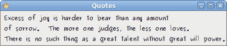
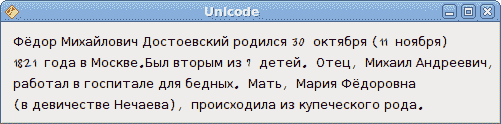

# Java Gnome 中的 Pango

> 原文： [http://zetcode.com/gui/javagnome/pango/](http://zetcode.com/gui/javagnome/pango/)

在 Java Gnome 编程教程的这一部分中，我们将探索 Pango 库。

Pango 是一个免费的开源计算库，可高质量呈现国际化文本。 可以使用不同的字体后端，从而允许跨平台支持。 （维基百科）

Pango 提供了用于`Gdk`和`Gtk`的高级字体和文本处理。

## 引用

在我们的第一个示例中，我们展示了如何更改`Label`小部件的字体。

`quotes.java`

```
package com.zetcode;

import org.gnome.gdk.Event;
import org.gnome.gtk.Fixed;
import org.gnome.gtk.Gtk;
import org.gnome.gtk.Label;
import org.gnome.gtk.Widget;
import org.gnome.gtk.Window;
import org.gnome.gtk.WindowPosition;
import org.gnome.pango.FontDescription;

/**
 * ZetCode Java Gnome tutorial
 *
 * This program uses the pango library to 
 * display text. 
 *
 * @author jan bodnar
 * website zetcode.com
 * last modified March 2009
 */

public class GQuotes extends Window {

    public GQuotes() {

        setTitle("Quotes");

        initUI();

        connect(new Window.DeleteEvent() {
            public boolean onDeleteEvent(Widget source, Event event) {
                Gtk.mainQuit();
                return false;
            }
        });

        setPosition(WindowPosition.CENTER);
        showAll();
    }

    public void initUI() {
        String text = "Excess of joy is harder to bear than any amount\n" +
        "of sorrow.  The more one judges, the less one loves.\n" +
        "There is no such thing as a great talent without great will power.";

        Label label = new Label(text);

        FontDescription fontdesc = new FontDescription("Purisa 9");
        label.modifyFont(fontdesc);

        Fixed fix = new Fixed();

        fix.put(label, 5, 5);
        add(fix);
    }

    public static void main(String[] args) {
        Gtk.init(args);
        new GQuotes();
        Gtk.main();
    }
}

```

在上面的代码示例中，我们有一个带有三个引号的标签小部件。 我们将其字体更改为 Purisa 9。

```
String text = "Excess of joy is harder to bear than any amount\n" +
"of sorrow.  The more one judges, the less one loves.\n" +
"There is no such thing as a great talent without great will power.";

```

这是要在标签中显示的文本。

```
FontDescription fontdesc = new FontDescription("Purisa 9");

```

`FontDescription`用于指定要加载的字体的特征。

```
label.modifyFont(fontdesc);

```

我们将标签小部件的字体更改为 Purisa 9。



Figure: Quotations

## Pango 标记

在下面的示例中，我们将使用 Pango 标记语言来修改`ExposeEvent`事件中的字体。

`markup.java`

```
package com.zetcode;

import org.freedesktop.cairo.Context;

import org.gnome.gdk.Event;
import org.gnome.gdk.EventExpose;
import org.gnome.gtk.DrawingArea;
import org.gnome.gtk.Gtk;
import org.gnome.gtk.Widget;
import org.gnome.gtk.Window;
import org.gnome.pango.FontDescription;
import org.gnome.pango.Layout;

/**
 * ZetCode Java Gnome tutorial
 *
 * This program uses Pango markup language
 * to modify the text.
 *
 * @author jan bodnar
 * website zetcode.com
 * last modified March 2009
 */

public class GPangoMarkup extends Window implements Widget.ExposeEvent {

    String quote = "<span foreground='blue' size='19000'>The only " +
        "victory over love is flight</span>";

    public GPangoMarkup() {

        setTitle("Pango Markup");

        initUI();

        connect(new Window.DeleteEvent() {
            public boolean onDeleteEvent(Widget source, Event event) {
                Gtk.mainQuit();
                return false;
            }
        });

        move(150, 150);
        showAll();
    }

    public void initUI() {

        DrawingArea darea = new DrawingArea();
        darea.connect(this);
        darea.queueDraw();
        add(darea);
        setBorderWidth(5);

    }

    public boolean onExposeEvent(Widget widget, EventExpose eventExpose) {

        final Context cr;
        final Layout layout;
        final FontDescription desc;

        cr = new Context(widget.getWindow());
        layout = new Layout(cr);

        desc = new FontDescription("Sans 12");
        layout.setFontDescription(desc);
        layout.setMarkup(quote);

        widget.setSizeRequest(layout.getPixelWidth(), layout.getPixelHeight());
        cr.showLayout(layout);

        return false;
    }

    public static void main(String[] args) {
        Gtk.init(args);
        new GPangoMarkup();
        Gtk.main();
    }
}

```

使用 Cario 库进行绘制。 我们通过传递 Cario 绘图上下文来获得布局。

```
cr = new Context(widget.getWindow());

```

此代码行创建一个`Context`对象。

```
layout = new Layout(cr);

```

`Layout`代表文本的一段及其属性。

```
layout.setMarkup(quote);

```

这行设置布局的标记。

```
widget.setSizeRequest(layout.getPixelWidth(), layout.getPixelHeight());

```

这是为了显示窗口中的所有文本。

```
cr.showLayout(layout);

```

最后，绘制文本。


Figure: Pango markup

## Unicode

Pango 用于处理国际化文本。

`unicode.java`

```
package com.zetcode;

import org.gnome.gdk.Event;
import org.gnome.gtk.Fixed;
import org.gnome.gtk.Gtk;
import org.gnome.gtk.Label;
import org.gnome.gtk.Widget;
import org.gnome.gtk.Window;
import org.gnome.gtk.WindowPosition;
import org.gnome.pango.FontDescription;

/**
 * ZetCode Java Gnome tutorial
 *
 * This program shows text in 
 * azbuka.
 *
 * @author jan bodnar
 * website zetcode.com
 * last modified March 2009
 */

public class GUnicode extends Window {

    public GUnicode() {

        setTitle("Unicode");

        initUI();

        connect(new Window.DeleteEvent() {
            public boolean onDeleteEvent(Widget source, Event event) {
                Gtk.mainQuit();
                return false;
            }
        });

        setPosition(WindowPosition.CENTER);
        showAll();
    }

    public void initUI() {

        String text = 
        "Фёдор Михайлович Достоевский родился 30 октября (11 ноября)\n" +
        "1821 года в Москве.Был вторым из 7 детей. Отец, Михаил Андреевич,\n" +
        "работал в госпитале для бедных. Мать, Мария Фёдоровна\n" +
        "(в девичестве Нечаева), происходила из купеческого рода.";

        Label label = new Label(text);

        FontDescription fontdesc = new FontDescription("Purisa 9");
        label.modifyFont(fontdesc);

        Fixed fix = new Fixed();

        fix.put(label, 5, 5);
        add(fix);

        setBorderWidth(5);
    }

    public static void main(String[] args) {
        Gtk.init(args);
        new GUnicode();
        Gtk.main();
    }   
}

```

我们在西里尔字母中显示一些文本。

```
String text = 
       "Фёдор Михайлович Достоевский родился 30 октября (11 ноября)\n" ...

```

我们可以直接使用 unicode 文本。 但是，文本永远不会放在源代码中。 在实际的文字应用中，我们将文本放在外部文件中。 在 Java 中，这些通常是属性文件。

```
Label label = new Label(text);

```

我们通常在标签小部件中使用它。



Figure: Unicode

在 Java Gnome 编程教程的这一章中，我们使用了 Pango 库。