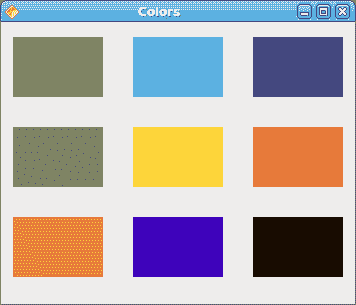
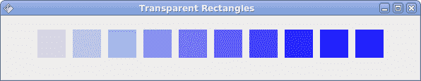

# 在 Java Gnome 中用 Cairo 绘图

> 原文： [http://zetcode.com/gui/javagnome/drawing/](http://zetcode.com/gui/javagnome/drawing/)

在 Java 编程教程的这一部分中，我们将使用 Cairo 库进行一些绘制。

Cairo 是用于创建 2D 矢量图形的库。 我们可以使用它来绘制自己的小部件，图表或各种效果或动画。

## 简单绘图

笔划操作绘制形状的轮廓，填充操作填充形状的内部。 接下来，我们将演示这两个操作。

`simpledrawing.java`

```
package com.zetcode;

import org.freedesktop.cairo.Context;

import org.gnome.gdk.Event;
import org.gnome.gdk.EventExpose;
import org.gnome.gtk.Allocation;
import org.gnome.gtk.DrawingArea;
import org.gnome.gtk.Gtk;
import org.gnome.gtk.Widget;
import org.gnome.gtk.Window;
import org.gnome.gtk.WindowPosition;

/**
 * Java Gnome tutorial
 *
 * This program draws a simple
 * drawing with the Cairo library.
 *
 * @author jan bodnar
 * website zetcode.com
 * last modified March 2009
 */

public class GSimpleDrawing extends Window implements Widget.ExposeEvent {

    public GSimpleDrawing() {

        setTitle("Simple drawing");

        initUI();

        connect(new Window.DeleteEvent() {
            public boolean onDeleteEvent(Widget source, Event event) {
                Gtk.mainQuit();
                return false;
            }
        });

        setDefaultSize(250, 200);
        setPosition(WindowPosition.CENTER);
        showAll();
    }

    public void initUI() {
        DrawingArea darea = new DrawingArea();
        darea.connect(this);
        add(darea);
    }

    public boolean onExposeEvent(Widget widget, EventExpose eventExpose) {
        final Context cr;

        cr = new Context(widget.getWindow());    
        drawShape(cr);

        return false;
    }

    public void drawShape(Context cr) {

        cr.setLineWidth(9);
        cr.setSource(0.7, 0.2, 0.0);

        int width, height;
        width = getAllocation().getWidth();
        height = getAllocation().getHeight();

        cr.translate(width/2, height/2);
        cr.arc(0, 0, (width < height ? width : height) / 2 - 10, 0, 2*Math.PI);
        cr.strokePreserve();

        cr.setSource(0.3, 0.4, 0.6);
        cr.fill();
    }    

    public static void main(String[] args) {
        Gtk.init(args);
        new GSimpleDrawing();
        Gtk.main();
    }
}

```

在我们的示例中，我们将绘制一个圆并用纯色填充它。

```
DrawingArea darea = new DrawingArea();

```

我们将在`DrawingArea`小部件上进行绘制操作。

```
public boolean onExposeEvent(Widget widget, EventExpose eventExpose) {
   final Context cr;

   cr = new Context(widget.getWindow());    
   drawShape(cr);

   return false;
}

```

当需要重绘窗口时，将创建`ExposeEvent`。 实际图形委托给`drawShape()`方法。

```
cr = new Context(widget.getWindow());

```

我们从绘图区域的 gdk 窗口创建`Context`对象。 上下文是我们绘制所有图纸的对象。

```
cr.setLineWidth(9);

```

我们将线条的宽度设置为 9 像素。

```
cr.setSource(0.7, 0.2, 0.0);

```

我们将颜色设置为深红色。

```
int width, height;
width = getAllocation().getWidth();
height = getAllocation().getHeight();

cr.translate(width/2, height/2);

```

我们得到绘图区域的宽度和高度。 我们将原点移动到窗口的中间。

```
cr.arc(0, 0, (width < height ? width : height) / 2 - 10, 0, 2*Math.PI);
cr.strokePreserve();

```

我们绘制一个圆形的外部形状。 `strokePreserve()`根据当前的线宽，线连接，线帽和破折号设置描边当前路径。 与`stroke()`不同，它在 cairo 上下文中保留路径。

```
cr.setSource(0.3, 0.4, 0.6);
cr.fill();

```

这会用一些蓝色填充圆圈的内部。


Figure: Simple drawing

## 基本形状

下一个示例将一些基本形状绘制到窗口上。

`basicshapes.java`

```
package com.zetcode;

import org.freedesktop.cairo.Context;
import org.freedesktop.cairo.Matrix;

import org.gnome.gdk.Event;
import org.gnome.gdk.EventExpose;
import org.gnome.gtk.DrawingArea;
import org.gnome.gtk.Gtk;
import org.gnome.gtk.Widget;
import org.gnome.gtk.Window;
import org.gnome.gtk.WindowPosition;

/**
 * ZetCode Java Gnome tutorial
 *
 * This program draws basic shapes
 * with the cairo library.
 *
 * @author jan bodnar
 * website zetcode.com
 * last modified March 2009
 */

public class GBasicShapes extends Window implements Window.ExposeEvent {

    public GBasicShapes() {

        setTitle("Basic Shapes");

        initUI();

        connect(new Window.DeleteEvent() {
            public boolean onDeleteEvent(Widget source, Event event) {
                Gtk.mainQuit();
                return false;
            }
        });

        setDefaultSize(390, 240);
        setPosition(WindowPosition.CENTER);
        showAll();
    }

    public void initUI() {
        DrawingArea darea = new DrawingArea();
        darea.connect(this);
        add(darea);
    }

    public boolean onExposeEvent(Widget widget, EventExpose eventExpose) {
        final Context cr;

        cr = new Context(widget.getWindow());    
        drawShapes(cr);

        return false;
    }

    public void drawShapes(Context cr) {

        cr.setSource(0.6, 0.6, 0.6);

        cr.rectangle(20, 20, 120, 80);
        cr.rectangle(180, 20, 80, 80);
        cr.fill();

        cr.arc(330, 60, 40, 0, 2*Math.PI);
        cr.fill();

        cr.arc(90, 160, 40, Math.PI/4, Math.PI);
        cr.fill();

        Matrix mat = new Matrix();
        mat.translate(220, 180);        
        mat.scale(1, 0.7);
        cr.transform(mat);

        cr.arc(0, 0, 50, 0, 2*Math.PI);
        cr.fill();  
    }

    public static void main(String[] args) {
        Gtk.init(args);
        new GBasicShapes();
        Gtk.main();
    }
}

```

在此示例中，我们将创建一个矩形，正方形，圆形，弧形和椭圆形。

```
cr.rectangle(20, 20, 120, 80);
cr.rectangle(180, 20, 80, 80);
cr.fill();

```

这些线绘制一个矩形和一个正方形。

```
cr.arc(330, 60, 40, 0, 2*Math.PI);
cr.fill();

```

此处`arc()`方法绘制一个完整的圆。

```
Matrix mat = new Matrix();
mat.translate(220, 180);        
mat.scale(1, 0.7);
cr.transform(mat);

cr.arc(0, 0, 50, 0, 2*Math.PI);
cr.fill();  

```

如果要绘制椭圆形，请先进行一些缩放。 `scale()`方法缩小 y 轴。


Figure: Basic shapes

## 色彩

颜色是代表红色，绿色和蓝色（RGB）强度值的组合的对象。 Cario 有效 RGB 值在 0 到 1 的范围内。

`colors.java`

```
package com.zetcode;

import org.freedesktop.cairo.Context;

import org.gnome.gdk.Event;
import org.gnome.gdk.EventExpose;
import org.gnome.gtk.DrawingArea;
import org.gnome.gtk.Gtk;
import org.gnome.gtk.Widget;
import org.gnome.gtk.Window;
import org.gnome.gtk.WindowPosition;

/**
 * ZetCode Java Gnome tutorial 
 *
 * This program draws nine rectangles
 * on the drawing area. Each of them
 * has different color. 
 *
 * @author jan bodnar
 * website zetcode.com
 * last modified March 2009
 */

public class GColors extends Window
            implements Widget.ExposeEvent {

    public GColors() {

        setTitle("Colors");

        connect(new Window.DeleteEvent() {
            public boolean onDeleteEvent(Widget source, Event event) {
                Gtk.mainQuit();
                return false;
            }
        });

        initUI();

        setDefaultSize(350, 280);
        setPosition(WindowPosition.CENTER);
        showAll();
    }

    public void initUI() {
        DrawingArea darea = new DrawingArea();
        darea.connect(this);
        add(darea);
    }

    public boolean onExposeEvent(Widget widget, EventExpose eventExpose) {
        final Context cr;

        cr = new Context(widget.getWindow());
        drawRectangles(cr);       

        return false;
    }

    public void drawRectangles(Context cr) {
        cr.setSource(0.5, 0.65, 0.45);
        cr.rectangle(10, 15, 90, 60);
        cr.fill();

        cr.setSource(0.16, 0.7, 0.9);
        cr.rectangle(130, 15, 90, 60);
        cr.fill();

        cr.setSource(0.274, 0.262, 0.48);
        cr.rectangle(250, 15, 90, 60);
        cr.fill();

        cr.setSource(0.5, 0.39, 0.33);
        cr.rectangle(10, 105, 90, 60);
        cr.fill();

        cr.setSource(0.99, 0.83, 0.24);
        cr.rectangle(130, 105, 90, 60);
        cr.fill();

        cr.setSource(0.95, 0.38, 0.27);
        cr.rectangle(250, 105, 90, 60);
        cr.fill();

        cr.setSource(0.85, 0.57, 0.21);
        cr.rectangle(10, 195, 90, 60);
        cr.fill();

        cr.setSource(0.25, 0.04, 0.73);
        cr.rectangle(130, 195, 90, 60);
        cr.fill();

        cr.setSource(0.12, 0.08, 0.03);
        cr.rectangle(250, 195, 90, 60);
        cr.fill();
    }

    public static void main(String[] args)  {
        Gtk.init(args);
        new GColors();
        Gtk.main();
    }
}

```

我们用 9 种不同的颜色绘制 9 个矩形。

```
cr.setSource(0.5, 0.65, 0.45);

```

`setSource()`方法为 Cario 上下文设置颜色。 该方法的三个参数是颜色强度值。

```
cr.rectangle(10, 15, 90, 60);
cr.fill();

```

我们创建一个矩形形状，并用先前指定的颜色填充它。



Figure: Colors

## 透明矩形

透明性是指能够透视材料的质量。 了解透明度的最简单方法是想象一块玻璃或水。 从技术上讲，光线可以穿过玻璃，这样我们就可以看到玻璃后面的物体。

在计算机图形学中，我们可以使用 alpha 合成来实现透明效果。 Alpha 合成是将图像与背景组合以创建部分透明外观的过程。 合成过程使用 Alpha 通道。 （wikipedia.org，answers.com）

`transparentrectangles.java`

```
package com.zetcode;

import org.freedesktop.cairo.Context;

import org.gnome.gdk.Event;
import org.gnome.gdk.EventExpose;
import org.gnome.gtk.DrawingArea;
import org.gnome.gtk.Gtk;
import org.gnome.gtk.Widget;
import org.gnome.gtk.Window;
import org.gnome.gtk.WindowPosition;

/**
 * ZetCode Java Gnome tutorial
 *
 * This program draws ten rectangles
 * with different levels of transparency.
 *
 * @author jan bodnar
 * website zetcode.com
 * last modified March 2009
 */

public class GTransparentRectangles extends Window
    implements Widget.ExposeEvent {

    public GTransparentRectangles() {
        setTitle("Transparent Rectangles");

        connect(new Window.DeleteEvent() {
            public boolean onDeleteEvent(Widget source, Event event) {
                Gtk.mainQuit();
                return false;
            }
        });

        initUI();

        setSizeRequest(590, 90);
        setPosition(WindowPosition.CENTER);
        showAll();
    }

    public void initUI() {
        DrawingArea darea = new DrawingArea();
        add(darea);
        darea.connect(this);
    }

    public void doDrawing(Context cr) {

        for (int i = 1; i<=10; i++) {
            cr.setSource(0, 0, 1, 0.1*i);
            cr.rectangle(50*i, 20, 40, 40);
            cr.fill();
        }
    }

    public boolean onExposeEvent(Widget widget, EventExpose eventExpose) {

            Context cr = new Context(widget.getWindow());
            doDrawing(cr);

            return false;
    }

    public static void main(String[] args) {
        Gtk.init(args);
        new GTransparentRectangles();
        Gtk.main();
    }
}

```

在示例中，我们将绘制十个具有不同透明度级别的矩形。

```
cr.setSource(0, 0, 1, 0.1*i);

```

`setSource()`方法的最后一个参数是 alpha 透明度。



Figure: Transparent rectangles

在 Java Gnome 编程库的这一章中，我们使用 Cairo 库进行绘图。