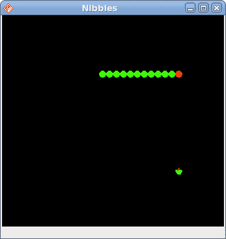

# Java Gnome 中的贪食蛇

> 原文： [http://zetcode.com/gui/javagnome/nibbles/](http://zetcode.com/gui/javagnome/nibbles/)

在 Java Gnome 编程教程的这一部分中，我们将创建一个贪食蛇游戏克隆。

## 贪食蛇

贪食蛇是较旧的经典视频游戏。 它最初是在 70 年代后期创建的。 后来它被带到 PC 上。 在这个游戏中，玩家控制蛇。 目的是尽可能多地吃苹果。 蛇每次吃一个苹果，它的身体就会长大。 蛇必须避开墙壁和自己的身体。

## 开发

蛇的每个关节的大小为 10px。 蛇由光标键控制。 最初，蛇具有三个关节。 游戏立即开始。 游戏结束后，我们在状态栏小部件中显示“游戏结束”消息。

`board.java`

```java
package com.zetcode;

import java.io.FileNotFoundException;

import java.util.Timer;
import java.util.TimerTask;

import org.freedesktop.cairo.Context;

import org.gnome.gdk.Color;
import org.gnome.gdk.EventExpose;
import org.gnome.gdk.EventKey;
import org.gnome.gdk.Keyval;
import org.gnome.gdk.ModifierType;
import org.gnome.gdk.Pixbuf;
import org.gnome.gtk.DrawingArea;
import org.gnome.gtk.Justification;
import org.gnome.gtk.Label;
import org.gnome.gtk.StateType;
import org.gnome.gtk.Widget;

public class Board extends DrawingArea implements Widget.ExposeEvent {

    private final int WIDTH = 300;
    private final int HEIGHT = 300;
    private final int DOT_SIZE = 10;
    private final int ALL_DOTS = 900;
    private final int RAND_POS = 29;
    private final int DELAY = 140;
    private final int PERIOD = 80;

    private int x[] = new int[ALL_DOTS];
    private int y[] = new int[ALL_DOTS];

    private int dots;
    private int apple_x;
    private int apple_y;

    private boolean left = false;
    private boolean right = true;
    private boolean up = false;
    private boolean down = false;
    private boolean inGame = true;

    private Timer timer;

    private Pixbuf dot;
    private Pixbuf apple;
    private Pixbuf head;

    private Label statusbar;

    public Board(Label statusbar) {

        this.statusbar = statusbar;

        connect(new SnakeKeyListener());

        modifyBackground(StateType.NORMAL, Color.BLACK);

        try {
            dot = new Pixbuf("dot.png");
            apple = new Pixbuf("apple.png");
            head = new Pixbuf("head.png");

        } catch (FileNotFoundException e) {
            e.printStackTrace();
        }

        connect(this);
        setCanFocus(true);

        initGame();
    }

    public Timer getTimer() { return timer; }

    public void initGame() {

        dots = 3;

        for (int z = 0; z < dots; z++) {
            x[z] = 50 - z * 10;
            y[z] = 50;
        }

        locateApple();

        timer = new Timer();
        timer.scheduleAtFixedRate(new ScheduleTask(), DELAY, PERIOD);

    }

    public void drawObjects(Context cr) {

        if (inGame) {

            cr.setSource(apple, apple_x, apple_y);
            cr.paint();

            for (int z = 0; z < dots; z++) {
                if (z == 0) {
                    cr.setSource(head, x[z], y[z]);
                    cr.paint();
                } else {
                    cr.setSource(dot, x[z], y[z]);
                    cr.paint();
                }
            }

        } else {
            gameOver();
        }
    }

    public void gameOver() {

        timer.cancel();

        statusbar.setJustify(Justification.LEFT);
        statusbar.setAlignment(0f, 0.5f);
        statusbar.setLabel("Game Over");
    }

    public void checkApple() {

        if ((x[0] == apple_x) && (y[0] == apple_y)) {
            dots++;
            locateApple();
        }
    }

    public void move() {

        for (int z = dots; z > 0; z--) {
            x[z] = x[(z - 1)];
            y[z] = y[(z - 1)];
        }

        if (left) {
            x[0] -= DOT_SIZE;
        }

        if (right) {
            x[0] += DOT_SIZE;
        }

        if (up) {
            y[0] -= DOT_SIZE;
        }

        if (down) {
            y[0] += DOT_SIZE;
        }
    }

    public void checkCollision() {

        for (int z = dots; z > 0; z--) {

            if ((z > 4) && (x[0] == x[z]) && (y[0] == y[z])) {
                inGame = false;
            }
        }

        if (y[0] > HEIGHT) {
            inGame = false;
        }

        if (y[0] < 0) {
            inGame = false;
        }

        if (x[0] > WIDTH) {
            inGame = false;
        }

        if (x[0] < 0) {
            inGame = false;
        }
    }

    public void locateApple() {
        int r = (int) (Math.random() * RAND_POS);
        apple_x = ((r * DOT_SIZE));
        r = (int) (Math.random() * RAND_POS);
        apple_y = ((r * DOT_SIZE));
    }

    public boolean onExposeEvent(Widget widget, EventExpose eventExpose) {

        Context cr = new Context(widget.getWindow());
        drawObjects(cr);

        return false;
    }

    class ScheduleTask extends TimerTask {

        public void run() {

            if (inGame) {
                checkApple();
                checkCollision();
                move();
            }
            queueDraw();
        }
    }

    class SnakeKeyListener implements Widget.KeyPressEvent {

        public boolean onKeyPressEvent(Widget widget, EventKey eventKey) {

            final Keyval key;
            final ModifierType mod;

            key = eventKey.getKeyval();
            mod = eventKey.getState();

            if ((key == key.Left) && (!right)) {
                left = true;
                up = false;
                down = false;
            }

            if ((key == key.Right) && (!left)) {
                right = true;
                up = false;
                down = false;
            }

            if ((key == key.Up) && (!down)) {
                up = true;
                right = false;
                left = false;
            }

            if ((key == key.Down) && (!up)) {
                down = true;
                right = false;
                left = false;
            }

            return false;
        }
    }
}

```

首先，我们将定义一些在游戏中使用的全局变量。

`WIDTH`和`HEIGHT`常数确定电路板的大小。 `DOT_SIZE`是苹果的大小和蛇的点。 `ALL_DOTS`常数定义了板上可能的最大点数。 `RAND_POS`常数用于计算苹果的随机位置。 `DELAY`常数确定游戏的速度。

```java
private int x[] = new int[ALL_DOTS];
private int y[] = new int[ALL_DOTS];

```

这两个数组存储蛇的所有可能关节的 x，y 坐标。

`initGame()`方法初始化变量，加载图像并启动超时功能。

在`move()`方法中，我们有游戏的关键算法。 要了解它，请看一下蛇是如何运动的。 您控制蛇的头。 您可以使用光标键更改其方向。 其余关节在链上向上移动一个位置。 第二关节移动到第一个关节的位置，第三关节移动到第二个关节的位置，依此类推。

```java
for (int z = dots; z > 0; z--) {
    x[z] = x[(z - 1)];
    y[z] = y[(z - 1)];
}

```

该代码将关节向上移动。

```java
if (left) {
    x[0] -= DOT_SIZE;
}

```

将头向左移动。

在`checkCollision()`方法中，我们确定蛇是否击中了自己或撞墙之一。

```java
for (int z = dots; z > 0; z--) {
    if ((z > 4) && (x[0] == x[z]) && (y[0] == y[z])) {
        inGame = false;
    }
}

```

如果蛇用头撞到关节之一，我们就结束游戏。

```java
if (y[0] > HEIGHT) {
    inGame = false;
}

```

如果蛇击中了棋盘的底部，我们就结束了游戏。

`locateApple()`方法在表格上随机定位一个苹果。

```java
int r = (int) (Math.random() * RAND_POS);

```

我们得到一个从 0 到`RAND_POS-1`的随机数。

```java
apple_x = ((r * DOT_SIZE));
...
apple_y = ((r * DOT_SIZE));

```

这些行设置了`apple`对象的 x，y 坐标。

在`Board`类的`onKeyPressEvent()`方法中，我们确定玩家按下了哪些键。

```java
if ((key == key.Left) && (!right)) {
    left = true;
    up = false;
    down = false;
}

```

如果单击左光标键，则将`left`变量设置为`true`。 在`move()`方法中使用此变量来更改蛇对象的坐标。 还要注意，当蛇向右行驶时，我们不能立即向左转。

`nibbles.java`

```java
package com.zetcode;

import java.util.Timer;

import org.gnome.gdk.Event;
import org.gnome.gtk.Gtk;
import org.gnome.gtk.Label;
import org.gnome.gtk.VBox;
import org.gnome.gtk.Widget;
import org.gnome.gtk.Window;
import org.gnome.gtk.WindowPosition;

/**
 * ZetCode Java Gnome tutorial
 *
 * This program creates a Nibbles game clone.
 *
 * @author jan bodnar
 * website zetcode.com
 * last modified March 2009
 */

public class GNibbles extends Window {

    Board board;
    Label statusbar;

    public GNibbles() {

        setTitle("Nibbles");

        initUI();

        setDefaultSize(320, 320);
        setPosition(WindowPosition.CENTER);

        showAll();
    }

    public void initUI() {

        VBox vbox = new VBox(false, 0);

        statusbar = new Label("");
        board = new Board(statusbar);

        vbox.packStart(board);
        vbox.packStart(statusbar, false, false, 0);

        add(vbox);

        connect(new Window.DeleteEvent() {
            public boolean onDeleteEvent(Widget source, Event event) {
                Timer timer = board.getTimer();
                timer.cancel();
                Gtk.mainQuit();
                return false;
            }
        });
    }

    public static void main(String[] args)  {
        Gtk.init(args);
        new GNibbles();        
        Gtk.main();
    }
}

```

在这个类中，我们设置了贪食蛇游戏。 注意，我们从板上获得了计时器对象。 这是执行干净的退出。



图：贪食蛇

这是使用 Java Gnome 编程库编程的贪食蛇电脑游戏。