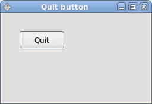

# QtJambi 简介

> 原文： [http://zetcode.com/gui/qtjambi/introduction/](http://zetcode.com/gui/qtjambi/introduction/)

在 QtJambi 编程教程的这一部分中，我们将介绍 QtJambi 工具包并创建我们的第一个 QtJambi 程序。

本教程的目的是帮助您开始使用 QtJambi 工具包。 可以在此处下载本教程中使用的图像。 我使用了 Gnome 项目的探戈图标包中的一些图标。

## 关于

`QtJambi`是用于创建图形用户界面的跨平台工具包。 它基于两种非常成功的技术。 Qt 库和 Java 编程语言。 Qt 是功能强大的跨平台应用开发框架。 它的母语是 C++ 。 Java 是非常成功的编程语言。 QtJambi 是 Qt 库的 Java 绑定。 与 Python，C# 和 Ruby 绑定不同，诺基亚公司正式支持 Java 绑定。

## 创建工具提示

第一个示例将显示一个工具提示。 工具提示是一个小的矩形窗口，它提供有关对象的简短信息。 它通常是一个 GUI 组件。 它是应用帮助系统的一部分。

```
package com.zetcode;

import com.trolltech.qt.gui.QApplication;
import com.trolltech.qt.gui.QWidget;

/**
 * ZetCode QtJambi tutorial
 *
 * This program displays a
 * tooltip
 *
 * @author jan bodnar
 * website zetcode.com
 * last modified March 2009
 */

public class JambiApp extends QWidget {

    public JambiApp() {

        setWindowTitle("Tooltip");

        setToolTip("This is QWidget");

        resize(250, 150);
        move(300, 300);
        show();
    }

    public static void main(String args[])
    {
        QApplication.initialize(args);
        new JambiApp();
        QApplication.exec();
    }
}

```

该示例创建一个窗口。 如果将鼠标指针悬停在窗口区域上方，则会弹出一个工具提示。

```
import com.trolltech.qt.gui.QApplication;
import com.trolltech.qt.gui.QWidget;

```

这些是我们在代码示例中使用的组件的必要导入。

```
public class JambiApp extends QWidget {

```

该示例继承自`QWidget`。 QWidget 类是所有用户界面对象的基类。 小部件是用户界面的原子。 它从窗口系统接收鼠标，键盘和其他事件。

```
setWindowTitle("Tooltip");

```

此方法调用为窗口创建标题。

```
setToolTip("This is QWidget");

```

`setToolTip`方法为 QWidget 对象创建一个工具提示。

```
resize(250, 150);

```

在这里，我们设置窗口的宽度和高度。

```
move(300, 300);

```

`move()`方法在屏幕上移动窗口。

```
show();

```

一切准备就绪后，我们在屏幕上显示窗口。

```
QApplication.initialize(args);
new JambiApp();
QApplication.exec();

```

这三行设置了应用。


Figure: Tooltip

## 使窗口居中

在第二个示例中，我们将窗口置于屏幕中央。

```
package com.zetcode;

import com.trolltech.qt.gui.QApplication;
import com.trolltech.qt.gui.QDesktopWidget;
import com.trolltech.qt.gui.QWidget;

/**
 * ZetCode QtJambi tutorial
 *
 * This program centers a window
 * on the screen
 * 
 * @author jan bodnar
 * website zetcode.com
 * last modified April 2009
 */

public class JambiApp extends QWidget {

    private final int WIDTH = 250;
    private final int HEIGHT = 150;

    public JambiApp() {

        QDesktopWidget qdw = new QDesktopWidget();

        int screenWidth = qdw.width();
        int screenHeight = qdw.height();

        int x = (screenWidth - WIDTH) / 2;
        int y = (screenHeight - HEIGHT) / 2;

        resize(WIDTH, HEIGHT);
        move(x, y);
        setWindowTitle("Center");
        show();
    }

    public static void main(String[] args) {
        QApplication.initialize(args);
        new JambiApp();
        QApplication.exec();
    }
}

```

QtJambi 没有使窗口居中的单一方法。

```
private final int WIDTH = 250;
private final int HEIGHT = 150;

```

这两个常数定义了应用窗口的宽度和高度。

```
QDesktopWidget qdw = new QDesktopWidget();

```

`QDesktopWidget`类提供有关屏幕的信息。

```
int screenWidth = qdw.width();
int screenHeight = qdw.height();

```

在这里，我们确定屏幕的宽度和高度。

```
int x = (screenWidth - WIDTH) / 2;
int y = (screenHeight - HEIGHT) / 2;

```

在这里，我们计算居中窗口的 x，y 坐标。 为了使窗口在屏幕上居中，我们需要知道屏幕的大小和窗口的大小。

```
move(x, y);

```

我们将窗口移至计算出的 x，y 坐标。

## 退出按钮

在本节的最后一个示例中，我们将创建一个退出按钮。 当我们按下此按钮时，应用终止。

```
package com.zetcode;

import com.trolltech.qt.gui.QApplication;
import com.trolltech.qt.gui.QPushButton;
import com.trolltech.qt.gui.QWidget;

/**
 * ZetCode QtJambi tutorial
 *
 * This program creates a quit
 * button. When we press the button,
 * the application terminates
 *
 * @author jan bodnar
 * website zetcode.com
 * last modified April 2009
 */

public class JambiApp extends QWidget
{

    public JambiApp() {

        setWindowTitle("Quit button");

        initUI();

        resize(250, 150);
        move(300, 300);

        show();
    }

    private void initUI() {

        QPushButton quit = new QPushButton("Quit", this);
        quit.setGeometry(30, 30, 75, 30);

        quit.clicked.connect(QApplication.instance(), "quit()");
    }

    public static void main(String args[])
    {
        QApplication.initialize(args);
        new JambiApp();
        QApplication.exec();
    }
}

```

我们使用`QPushButton`。这是一个非常常见的小部件。 它是一个矩形，通常显示一个文本标签。

```
initUI();

```

我们将用户界面的创建委托给`initUI()`方法。

```
QPushButton quit = new QPushButton("Quit", this);

```

我们创建按钮小部件。 构造函数的第一个参数是标签，按钮将显示该标签。 第二个参数是按钮的父窗口小部件。

```
quit.setGeometry(30, 30, 75, 30);

```

我们定位和调整按钮小部件的大小。 前两个参数是按钮的 x，y 坐标。 最后两个参数是按钮的宽度和高度。

```
quit.clicked.connect(QApplication.instance(), "quit()");

```

当我们点击按钮时，会发出`clicked`信号。 `connect()`方法将信号连接到对象的特定槽。 该方法的第一个参数是接收信号的对象。 在我们的例子中，它是应用对象。 第二个参数是方法，称为。 在我们的情况下，它是应用对象的`quit()`方法。



Figure: Quit button

本节是 QtJambi 工具包的介绍。