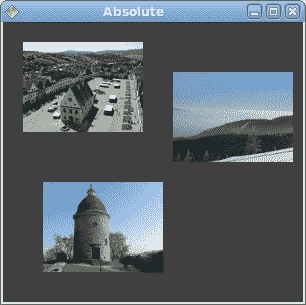
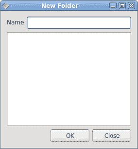

# QtJambi 中的布局管理

> 原文： [http://zetcode.com/gui/qtjambi/layoutmanagement/](http://zetcode.com/gui/qtjambi/layoutmanagement/)

在 QtJambi 编程教程的这一部分中，我们将介绍布局管理器。

在设计应用的 GUI 时，我们决定要使用哪些组件以及如何在应用中组织这些组件。 为了组织我们的组件，我们使用专门的不可见对象，称为布局管理器。 QtJambi 中有多个选项。 我们可以使用绝对定位，内置布局管理器或创建自定义布局管理器。 我们还可以使用 Qt Designer 直观地构建布局。

QtJambi 具有一些重要的内置布局管理器。 `QVBoxLayout`类垂直排列小部件。 `QHBoxLayout`水平排列小部件。 `QGridLayout`类将小部件布置在网格中。 网格布局是最灵活的布局管理器。 盒子布局相互嵌套以创建复杂的布局。

## 绝对定位

在大多数情况下，程序员应使用布局管理器。 在某些情况下，我们可以使用绝对定位。 在绝对定位中，程序员以像素为单位指定每个小部件的位置和大小。 如果我们调整窗口大小，则小部件的大小和位置不会改变。 在各种平台上，应用看起来都不同，在 Linux 上看起来不错，在 Mac OS 上看起来不太正常。 在我们的应用中更改字体可能会破坏布局。 如果我们将应用翻译成另一种语言，则必须重做布局。 对于所有这些问题，仅在有理由时才使用绝对定位。

```java
package com.zetcode;

import com.trolltech.qt.gui.QApplication;
import com.trolltech.qt.gui.QLabel;
import com.trolltech.qt.gui.QPixmap;
import com.trolltech.qt.gui.QWidget;

/**
 * ZetCode QtJambi tutorial
 *
 * In this program, we lay out widgets
 * using absolute positioning
 *
 * @author jan bodnar
 * website zetcode.com
 * last modified April 2009
 */

public class JambiApp extends QWidget {

    public JambiApp() {

        setWindowTitle("Absolute");

        initUI();

        resize(300, 280);
        move(300, 300);
        show();
    }

    private void initUI() {

        setStyleSheet("QWidget { background-color: #414141 }");

        QPixmap bardejov = new QPixmap("bardejov.jpg");
        QPixmap rotunda = new QPixmap("rotunda.jpg");
        QPixmap mincol = new QPixmap("mincol.jpg");

        QLabel barLabel = new QLabel(this);
        barLabel.setPixmap(bardejov);
        barLabel.move(20, 20);

        QLabel rotLabel = new QLabel(this);
        rotLabel.setPixmap(rotunda);
        rotLabel.move(40, 160);

        QLabel minLabel = new QLabel(this);
        minLabel.setPixmap(mincol);
        minLabel.move(170, 50);
    }

    public static void main(String[] args) {
        QApplication.initialize(args);
        new JambiApp();
        QApplication.exec();
    }
}

```

在此示例中，我们使用绝对定位显示了三幅图像。

```java
QLabel barLabel = new QLabel(this);
barLabel.setPixmap(bardejov);

```

`QLabel`小部件用于保存图像。

```java
barLabel.move(20, 20);

```

我们使用`move()`方法将标签放置在窗口上的`x = 20`，`y = 20`处。

调整窗口大小时，标签将保留其初始大小。



图：绝对定位

## 按钮示例

在下面的示例中，我们将在窗口的右下角放置两个按钮。

```java
package com.zetcode;

import com.trolltech.qt.core.Qt;
import com.trolltech.qt.gui.QApplication;
import com.trolltech.qt.gui.QHBoxLayout;
import com.trolltech.qt.gui.QPushButton;
import com.trolltech.qt.gui.QVBoxLayout;
import com.trolltech.qt.gui.QWidget;

/**
 * ZetCode QtJambi tutorial
 *
 * In this program, use box layouts
 * to position two buttons in the
 * bottom right corner of the window
 *
 * @author jan bodnar
 * website zetcode.com
 * last modified April 2009
 */

public class JambiApp extends QWidget {

    public JambiApp() {
        setWindowTitle("Buttons");

        initUI();

        resize(300, 150);
        move(300, 300);
        show();
    }

    private void initUI() {

        QVBoxLayout vbox = new QVBoxLayout(this);
        QHBoxLayout hbox = new QHBoxLayout();

        QPushButton ok = new QPushButton("OK", this);
        QPushButton apply = new QPushButton("Apply", this);

        hbox.addWidget(ok, 1, Qt.AlignmentFlag.AlignRight);
        hbox.addWidget(apply);

        vbox.addStretch(1);
        vbox.addLayout(hbox);
    }

    public static void main(String[] args) {
        QApplication.initialize(args);
        new JambiApp();
        QApplication.exec();
    }
}

```

我们使用嵌套框布局来获得我们想要的布局。

```java
QVBoxLayout vbox = new QVBoxLayout(this);
QHBoxLayout hbox = new QHBoxLayout();

```

我们使用一个垂直框和一个水平框。

```java
QPushButton ok = new QPushButton("OK", this);
QPushButton apply = new QPushButton("Apply", this);

```

这是两个将进入窗口右下角的按钮。

```java
hbox.addWidget(ok, 1, Qt.AlignmentFlag.AlignRight);

```

我们将确定按钮放入水平框中。 第二个参数是`stretch`因子。 它将扩大分配给“确定”按钮的区域。 它会占用所有可用空间。 在此区域内，按钮向右对齐。

```java
vbox.addStretch(1);

```

这条线创建了一个垂直扩展的白色空间，它将带有按钮的水平框推到底部。

```java
vbox.addLayout(hbox);

```

水平框嵌套在垂直框中。


图：按钮示例

## Windows 示例

以下是嵌套框布局更复杂的示例。

```java
package com.zetcode;

import com.trolltech.qt.core.Qt.AlignmentFlag;
import com.trolltech.qt.gui.QApplication;
import com.trolltech.qt.gui.QHBoxLayout;
import com.trolltech.qt.gui.QLabel;
import com.trolltech.qt.gui.QPushButton;
import com.trolltech.qt.gui.QTextEdit;
import com.trolltech.qt.gui.QVBoxLayout;
import com.trolltech.qt.gui.QWidget;

/**
 * ZetCode QtJambi tutorial
 *
 * In this program, use box layouts
 * to create a windows example
 *
 * @author jan bodnar
 * website zetcode.com
 * last modified April 2009
 */

public class JambiApp extends QWidget {

    public JambiApp() {

        setWindowTitle("Windows");

        initUI();

        resize(350, 300);
        move(300, 300);
        show();        
    }

    private void initUI() {

        QVBoxLayout vbox = new QVBoxLayout(this);

        QVBoxLayout vbox1 = new QVBoxLayout();
        QHBoxLayout hbox1 = new QHBoxLayout();
        QHBoxLayout hbox2 = new QHBoxLayout();

        QLabel windLabel = new QLabel("Windows", this);
        QTextEdit edit = new QTextEdit(this);
        edit.setEnabled(false);

        QPushButton activate = new QPushButton("Activate", this);
        QPushButton close = new QPushButton("Close", this);
        QPushButton help = new QPushButton("Help", this);
        QPushButton ok = new QPushButton("OK", this);

        vbox.addWidget(windLabel);

        vbox1.addWidget(activate);
        vbox1.addWidget(close, 0, AlignmentFlag.AlignTop);
        hbox1.addWidget(edit);
        hbox1.addLayout(vbox1);

        vbox.addLayout(hbox1);

        hbox2.addWidget(help);
        hbox2.addStretch(1);
        hbox2.addWidget(ok);

        vbox.addLayout(hbox2, 1);

        setLayout(vbox);
    }

    public static void main(String[] args) {
        QApplication.initialize(args);
        new JambiApp();
        QApplication.exec();
    }
}

```

在此布局中，我们使用两个垂直和水平框。

```java
QVBoxLayout vbox = new QVBoxLayout(this);

```

这是示例的基本布局。

```java
vbox.addWidget(windLabel);

```

首先是标签小部件。 它只是转到垂直框的顶部。

```java
vbox1.addWidget(activate);
vbox1.addWidget(close, 0, AlignmentFlag.AlignTop);
hbox1.addWidget(edit);
hbox1.addLayout(vbox1);

vbox.addLayout(hbox1);

```

在窗口的中心部分，我们有一个文本编辑小部件和两个垂直排列的按钮。 这些按钮进入垂直框。 在此垂直框中，按钮与顶部对齐。 垂直框和文本编辑进入水平框。 该水平框转到标签窗口小部件正下方的基本垂直框。

```java
hbox2.addWidget(help);
hbox2.addStretch(1);
hbox2.addWidget(ok);

vbox.addLayout(hbox2, 1);

```

帮助和确定按钮进入另一个水平框。 这两个按钮之间有一个扩大的空白区域。 同样，水平框转到基本垂直框。

```java
setLayout(vbox);

```

基本的垂直框设置为窗口的主要布局。


图：窗口示例

## 新文件夹示例

在最后一个示例中，我们使用`QGridLayout`管理器创建“新文件夹”布局示例。

```java
package com.zetcode;

import com.trolltech.qt.gui.QApplication;
import com.trolltech.qt.gui.QGridLayout;
import com.trolltech.qt.gui.QLabel;
import com.trolltech.qt.gui.QLineEdit;
import com.trolltech.qt.gui.QPushButton;
import com.trolltech.qt.gui.QTextEdit;
import com.trolltech.qt.gui.QWidget;

/**
 * ZetCode QtJambi tutorial
 *
 * In this program, use the QGridLayout
 * to create a New Folder example
 *
 * @author jan bodnar
 * website zetcode.com
 * last modified April 2009
 */

public class JambiApp extends QWidget {

    public JambiApp() {

        setWindowTitle("New Folder");

        initUI();

        move(300, 300);
        show();
    }

    private void initUI() {

        QGridLayout grid = new QGridLayout(this);

        QLabel nameLabel = new QLabel("Name", this);
        QLineEdit nameEdit = new QLineEdit(this);
        QTextEdit text = new QTextEdit(this);
        QPushButton okButton = new QPushButton("OK", this);
        QPushButton closeButton = new QPushButton("Close", this);

        grid.addWidget(nameLabel, 0, 0);
        grid.addWidget(nameEdit, 0, 1, 1, 3);
        grid.addWidget(text, 1, 0, 2, 4);
        grid.setColumnStretch(1, 1);
        grid.addWidget(okButton, 4, 2);
        grid.addWidget(closeButton, 4, 3);
    }

    public static void main(String[] args) {
        QApplication.initialize(args);
        new JambiApp();
        QApplication.exec();
    }
}

```

在我们的示例中，我们有一个标签，一行编辑，一个文本编辑和两个按钮。

```java
QGridLayout grid = new QGridLayout(this);

```

我们创建`QGridLayout`管理器的实例。

```java
grid.addWidget(nameLabel, 0, 0);

```

我们将标签小部件放置在网格的第一个单元格中。 单元格从 0 开始计数。最后两个参数是行号和列号。

```java
grid.addWidget(nameEdit, 0, 1, 1, 3);

```

线编辑窗口小部件位于第一行第二列。 最后两个参数是行跨度和列跨度。 在水平方向上，小部件将跨越三列。

```java
grid.setColumnStretch(1, 1);

```

该方法的参数是列号和拉伸因子。 在这里，我们将拉伸因子 1 设置到第二列。 这意味着此列将占用所有剩余空间。 之所以这样设置，是因为我们希望按钮保持其初始大小。



图：新文件夹示例

在 QtJambi 教程的这一部分中，我们提到了小部件的布局管理。