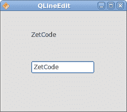

# QtJambi 中的小部件

> 原文： [http://zetcode.com/gui/qtjambi/widgets/](http://zetcode.com/gui/qtjambi/widgets/)

在 QtJambi 编程教程的这一部分中，我们将介绍 QtJambi 小部件。

小部件是 GUI 应用程序的基本构建块。 多年来，几个小部件已成为所有 OS 平台上所有工具包中的标准。 例如，按钮，复选框或滚动条。 QtJambi 有一组丰富的小部件，可以满足大多数编程需求。 可以将更多专门的窗口小部件创建为自定义窗口小部件。

## QCheckBox

`QCheckBox`是具有两种状态的窗口小部件：开和关。 接通状态通过复选标记显示。 它用来表示一些布尔属性。 QCheckBox 小部件提供一个带有文本标签的复选框。

```
package com.zetcode;

import com.trolltech.qt.core.Qt.FocusPolicy;
import com.trolltech.qt.gui.QApplication;
import com.trolltech.qt.gui.QCheckBox;
import com.trolltech.qt.gui.QWidget;

/**
 * ZetCode QtJambi tutorial
 *
 * This program uses QCheckBox
 * widget to show/hide the title
 * of the window
 *
 * @author jan bodnar
 * website zetcode.com
 * last modified March 2009
 */

public class JambiApp extends QWidget {

    public JambiApp() {

        setWindowTitle("QCheckBox");

        initUI();

        resize(250, 150);
        move(300, 300);
        show();        
    }

    public void initUI() {

        QCheckBox cb = new QCheckBox("Show Title", this);
        cb.setFocusPolicy(FocusPolicy.NoFocus);
        cb.setChecked(true);
        cb.toggled.connect(this, "onChanged(boolean)");

        cb.move(50, 50);

    }

    public void onChanged(boolean state) {
        if (state) {
            setWindowTitle("QCheckBox");
        } else {
            setWindowTitle("");
        }
    }

    public static void main(String[] args) {
        QApplication.initialize(args);
        new JambiApp();
        QApplication.exec();
    }
}

```

在我们的示例中，我们在窗口上放置了一个复选框。 复选框显示/隐藏窗口的标题。

```
setWindowTitle("QCheckBox");

```

在构建窗口期间，我们为窗口设置标题。

```
QCheckBox cb = new QCheckBox("Show Title", this);

```

`QCheckBox`小部件已创建。 构造函数的第一个参数是其文本标签。 第二个参数是父窗口小部件。

```
cb.setFocusPolicy(FocusPolicy.NoFocus);

```

我不喜欢聚焦复选框的视觉表示。 此行禁用焦点。

```
cb.setChecked(true);

```

标题在应用程序的开始处可见。 因此，也必须选中该复选框。

```
cb.toggled.connect(this, "onChanged(boolean)");

```

复选框的状态更改时，会发出`toggled()`信号。 发出信号时，我们触发`onChanged()`方法。

```
if (state) {
    setWindowTitle("QCheckBox");
} else {
    setWindowTitle("");
}

```

根据复选框的状态，我们显示或隐藏窗口的标题。


Figure: QCheckBox

## QLabel

`QLabel`小部件用于显示文本或图像。 没有用户交互。

```
package com.zetcode;

import com.trolltech.qt.gui.QApplication;
import com.trolltech.qt.gui.QFont;
import com.trolltech.qt.gui.QLabel;
import com.trolltech.qt.gui.QVBoxLayout;
import com.trolltech.qt.gui.QWidget;

/**
 * ZetCode QtJambi tutorial
 *
 * This program uses QLabel to 
 * show lyrics of a song
 *
 * @author jan bodnar
 * website zetcode.com
 * last modified March 2009
 */

public class JambiApp extends QWidget {

    public JambiApp() {

        setWindowTitle("You know I'm no Good");

        initUI();

        move(300, 300);
        show();
    }

    private void initUI() {
       String text =
           "Meet you downstairs in the bar and heard\n" +
           "your rolled up sleeves and your skull t-shirt\n" +
           "You say why did you do it with him today?\n" +
           "and sniff me out like I was Tanqueray\n\n" +
           "cause you're my fella, my guy\n" +
           "hand me your stella and fly\n" +
           "by the time I'm out the door\n" +
           "you tear men down like Roger Moore\n\n" +
           "I cheated myself\n" +
           "like I knew I would\n" +
           "I told ya, I was trouble\n" +
           "you know that I'm no good";

        QLabel label = new QLabel(text, this);
        label.setFont(new QFont("Purisa", 9));

        QVBoxLayout vbox = new QVBoxLayout();
        vbox.addWidget(label);
        setLayout(vbox);
    }

    public static void main(String[] args) {
        QApplication.initialize(args);
        new JambiApp();
        QApplication.exec();
    }
}

```

我们的示例在窗口中显示了歌曲的歌词。

```
String text =
    "Meet you downstairs in the bar and heard\n" +
...

```

我们定义了多行文字。

```
QLabel label = new QLabel(text, this);
label.setFont(new QFont("Purisa", 9));

```

我们创建标签小部件并更改其字体。

```
QVBoxLayout vbox = new QVBoxLayout();
vbox.addWidget(label);
setLayout(vbox);

```

代替手动编码标签的位置和大小，我们将标签放入盒子布局中。


Figure: QLabel

## QLineEdit

`QLineEdit`是一个小部件，允许输入和编辑单行纯文本。 QLineEdit 小部件具有撤消/重做，剪切/粘贴和拖动&放置功能。

```
package com.zetcode;

import com.trolltech.qt.gui.QApplication;
import com.trolltech.qt.gui.QLabel;
import com.trolltech.qt.gui.QLineEdit;
import com.trolltech.qt.gui.QWidget;

/**
 * ZetCode QtJambi tutorial
 *
 * This program shows text
 * which is entered in a QLineEdit
 * widget in a QLabel widget
 *
 * @author jan bodnar
 * website zetcode.com
 * last modified March 2009
 */

public class JambiApp extends QWidget {

    QLabel label;

    public JambiApp() {

        setWindowTitle("QLineEdit");

        initUI();

        resize(250, 200);
        move(300, 300);
        show();
    }

    private void initUI() {

        label = new QLabel(this);

        QLineEdit edit = new QLineEdit(this);
        edit.textChanged.connect(this, "onChanged(String)");

        edit.move(60, 100);
        label.move(60, 40);
    }

    private void onChanged(String text) {
        label.setText(text);
        label.adjustSize();
    }

    public static void main(String[] args) {
        QApplication.initialize(args);
        new JambiApp();
        QApplication.exec();
    }
}

```

在我们的示例中，我们显示了两个小部件。 行编辑和标签小部件。 输入到行编辑中的文本显示在标签窗口小部件中。

```
QLineEdit edit = new QLineEdit(this);

```

`QLineEdit`小部件已创建。

```
edit.textChanged.connect(this, "onChanged(String)");

```

当我们在行编辑中键入或删除某些文本时，将触发`onChanged()`方法。

```
private void onChanged(String text) {
    label.setText(text);
    label.adjustSize();
}

```

在`onChanged()`方法中，我们将行编辑的内容设置为标签窗口小部件。 `adjustSize()`方法确保所有文本都是可见的。



Figure: QLineEdit widget

## 切换按钮

切换按钮是设置了可检查标志的按钮。 切换按钮是具有两种状态的按钮。 已按下但未按下。 通过单击可以在这两种状态之间切换。 在某些情况下此功能非常合适。

```
package com.zetcode;

import com.trolltech.qt.gui.QApplication;
import com.trolltech.qt.gui.QColor;
import com.trolltech.qt.gui.QPushButton;
import com.trolltech.qt.gui.QWidget;
import java.util.Formatter;

/**
 * ZetCode QtJambi tutorial
 *
 * This program uses toggle buttons to
 * change the background color of
 * a widget
 *
 * @author jan bodnar
 * website zetcode.com
 * last modified March 2009
 */

public class JambiApp extends QWidget {

    private QWidget square;
    private QColor color;

    private QPushButton redb;
    private QPushButton greenb;
    private QPushButton blueb;

    public JambiApp() {

        setWindowTitle("Toggle Buttons");

        initUI();

        resize(350, 240);
        move(300, 300);
        show();
    }

    private void initUI() {

        color = new QColor();

        redb = new QPushButton("Red", this);
        redb.setCheckable(true);
        greenb = new QPushButton("Green", this);
        greenb.setCheckable(true);
        blueb = new QPushButton("Blue", this);
        blueb.setCheckable(true);

        redb.toggled.connect(this, "onToggled()");
        greenb.toggled.connect(this, "onToggled()");
        blueb.toggled.connect(this, "onToggled()");

        square = new QWidget(this);
        square.setStyleSheet("QWidget { background-color: black }");

        redb.move(30, 30);
        greenb.move(30, 80);
        blueb.move(30, 130);
        square.setGeometry(150, 25, 150, 150);

    }

    public void onToggled() {

        int red = color.red();
        int green = color.green();
        int blue = color.blue();

        if (redb.isChecked()) {
            red = 255;
        } else {
            red = 0;
        }

        if (greenb.isChecked()) {
            green = 255;
        } else {
            green = 0;
        }

        if (blueb.isChecked()) {
            blue = 255;
        } else {
            blue = 0;
        }

        color = new QColor(red, green, blue);

        Formatter fmt = new Formatter();
        fmt.format("QWidget { background-color: %s }", color.name());

        square.setStyleSheet(fmt.toString());
}

    public static void main(String[] args) {
        QApplication.initialize(args);
        new JambiApp();
        QApplication.exec();
    }
}

```

在代码示例中，我们使用三个切换按钮来更改矩形小部件的颜色。

```
private QWidget square;
private QColor color;

private QPushButton redb;
private QPushButton greenb;
private QPushButton blueb;

```

我们定义了五个对象。 正方形小部件是`QWidget`，它显示颜色。 `color`变量用于保存颜色值。 这三个按钮是切换按钮，用于混合颜色值。

```
redb = new QPushButton("Red", this);
redb.setCheckable(true);

```

我们创建一个`QPushButton`小部件。 `setCheckable()`方法将按钮更改为切换按钮。

```
redb.toggled.connect(this, "onToggled()");
greenb.toggled.connect(this, "onToggled()");
blueb.toggled.connect(this, "onToggled()");

```

所有三个按钮都插入到一个方法调用中，即`onToggled()`方法。

```
square = new QWidget(this);
square.setStyleSheet("QWidget { background-color: black }");

```

我们创建方形小部件。 一开始是黑色的。 在 QtJambi 中，我们使用样式表来自定义小部件的外观。

在`onToggled()`方法内部，我们确定颜色值并将正方形小部件更新为新颜色。

```
int red = color.red();
int green = color.green();
int blue = color.blue();

```

在这里，我们确定方形小部件的当前颜色。

```
if (redb.isChecked()) {
    red = 255;
} else {
    red = 0;
}

```

根据红色切换按钮的状态，更改颜色的红色部分。

```
color = new QColor(red, green, blue);

```

我们创建一个新的颜色值。

```
Formatter fmt = new Formatter();
fmt.format("QWidget { background-color: %s }", color.name());

```

这两行创建样式表的文本。 我们使用 Java Formatter 对象。

```
square.setStyleSheet(fmt.toString());

```

正方形的颜色已更新。


Figure: Toggle buttons

## QComboBox

`QComboBox`是一个小部件，允许用户从选项列表中进行选择。 这是一个显示当前项目的选择小部件，可以弹出可选择项目的列表。 组合框可能是可编辑的。 它以占用最少屏幕空间的方式向用户显示选项列表。

```
package com.zetcode;

import com.trolltech.qt.gui.QApplication;
import com.trolltech.qt.gui.QComboBox;
import com.trolltech.qt.gui.QLabel;
import com.trolltech.qt.gui.QWidget;

/**
 * ZetCode QtJambi tutorial
 *
 * This program uses the QComboBox widget.
 * The option selected from the combo box is
 * displayed in the label widget.
 *
 * @author jan bodnar
 * website zetcode.com
 * last modified March 2009
 */

public class JambiApp extends QWidget {

    QLabel label;

    public JambiApp() {

        setWindowTitle("QComboBox");

        initUI();

        resize(250, 200);
        move(300, 300);
        show();
    }

    private void initUI() {

        label = new QLabel("Ubuntu", this);

        QComboBox combo = new QComboBox(this);

        combo.addItem("Ubuntu");
        combo.addItem("Fedora");
        combo.addItem("Mandriva");
        combo.addItem("Red Hat");
        combo.addItem("Mint");

        combo.currentStringChanged.connect(this, "OnActivated(String)");

        combo.move(50, 30);
        label.move(50, 100);
    }

    private void OnActivated(String text) {
       label.setText(text);
       label.adjustSize();
    }

    public static void main(String[] args) {
        QApplication.initialize(args);
        new JambiApp();
        QApplication.exec();
    }
}

```

在我们的代码示例中，我们有两个小部件。 组合框和标签小部件。 从组合框中选择的选项显示在标签中。

```
label = new QLabel("Ubuntu", this);

```

这是一个标签，它将显示组合框中当前选择的选项。

```
QComboBox combo = new QComboBox(this);

```

我们创建`QComboBox`小部件的实例。

```
combo.addItem("Ubuntu");
combo.addItem("Fedora");
combo.addItem("Mandriva");
combo.addItem("Red Hat");
combo.addItem("Mint");

```

组合框将填充值。

```
combo.currentStringChanged.connect(this, "OnActivated(String)");

```

当我们从组合框中选择一个选项时，将触发`OnActivated()`方法。

```
private void OnActivated(String text) {
    label.setText(text);
    label.adjustSize();
}

```

在`OnActivated()`方法中，我们将标签小部件更新为从组合框中选择的当前字符串。


Figure: QComboBox widget

在 QtJambi 教程的这一部分中，我们介绍了几个 QtJambi 小部件。