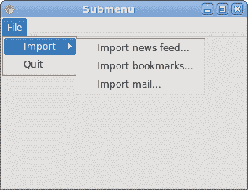
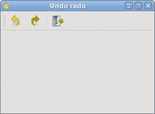

# QtJambi 中的菜单和工具栏

> 原文： [http://zetcode.com/gui/qtjambi/menustoolbars/](http://zetcode.com/gui/qtjambi/menustoolbars/)

在 QtJambi 编程教程的这一部分中，我们将使用菜单和工具栏。

菜单栏是 GUI 应用中最可见的部分之一。 它是位于各个菜单中的一组命令。 在控制台应用中，您必须记住所有这些神秘命令，在这里，我们将大多数命令分组为逻辑部分。 有公认的标准可以进一步减少学习新应用的时间。 菜单将我们可以在应用中使用的命令分组。 使用工具栏可以快速访问最常用的命令。

## 简单菜单

第一个示例将显示一个简单的菜单。

```java
package com.zetcode;

import com.trolltech.qt.gui.QAction;
import com.trolltech.qt.gui.QApplication;
import com.trolltech.qt.gui.QMainWindow;
import com.trolltech.qt.gui.QMenu;

/**
 * ZetCode QtJambi tutorial
 *
 * This program shows a simple
 * menu. It has one action, which
 * will terminate the program, when
 * selected. 
 *
 * @author jan bodnar
 * website zetcode.com
 * last modified March 2009
 */

public class JambiApp extends QMainWindow {

    public JambiApp() {

        setWindowTitle("Simple menu");

        initUI();

        resize(250, 200);
        move(300, 300);
        show();
    }

    private void initUI() {

        QAction quit = new QAction("&Quit", this);

        QMenu file = menuBar().addMenu("&File");
        file.addAction(quit);

        quit.triggered.connect(QApplication.instance(), "quit()");
    }

    public static void main(String[] args) {
        QApplication.initialize(args);
        new JambiApp();
        QApplication.exec();
    }
}

```

我们有一个菜单栏，一个菜单和一个动作。 为了使用菜单，我们必须继承`QMainWindow`小部件。

```java
QAction quit = new QAction("&Quit", this);

```

此代码行创建一个`QAction`。 每个`QMenu`具有一个或多个动作对象。 注意 AND 字符（`&`）。 它为以下项目创建快捷方式： `Alt + Q` 。 它还强调了`Q`字符。 下拉菜单中的文件时，该快捷方式处于活动状态。

```java
QMenu file = menuBar().addMenu("&File");
file.addAction(quit);

```

我们创建一个`QMenu`对象。 ＆字符创建快捷方式： `Alt + F` 。 连续的快捷键 `Alt + F` ， `Alt + Q` 退出了应用。

```java
quit.triggered.connect(QApplication.instance(), "quit()");

```

当我们从菜单中选择此选项时，应用退出。


图：简单菜单

## 创建一个子菜单

子菜单是插入另一个菜单对象的菜单。 下一个示例对此进行了演示。

```java
package com.zetcode;

import com.trolltech.qt.gui.QAction;
import com.trolltech.qt.gui.QApplication;
import com.trolltech.qt.gui.QMainWindow;
import com.trolltech.qt.gui.QMenu;

/**
 * ZetCode QtJambi tutorial
 *
 * This program creates a
 * submenu
 *
 * @author jan bodnar
 * website zetcode.com
 * last modified March 2009
 */

public class JambiApp extends QMainWindow {

    public JambiApp() {

        setWindowTitle("Submenu");

        initUI();

        resize(250, 200);
        move(300, 300);
        show();
    }

    private void initUI() {

        QAction quit = new QAction("&Quit", this);

        QMenu file = menuBar().addMenu("&File");
        QMenu impm = new QMenu("Import");

        QAction seeds = new QAction("Import news feed...", this);
        QAction marks = new QAction("Import bookmarks...", this);
        QAction mail = new QAction("Import mail...", this);
        impm.addAction(seeds);
        impm.addAction(marks);
        impm.addAction(mail);

        file.addMenu(impm);
        file.addAction(quit);

        quit.triggered.connect(QApplication.instance(), "quit()");
    }

    public static void main(String[] args) {
        QApplication.initialize(args);
        new JambiApp();
        QApplication.exec();
    }
}

```

在示例中，文件菜单的子菜单中有三个选项。

```java
QMenu file = menuBar().addMenu("&File");
QMenu impm = new QMenu("Import");

```

我们有两个`QMenu`对象。 文件菜单和导入菜单。

```java
QAction seeds = new QAction("Import news feed...", this);
QAction marks = new QAction("Import bookmarks...", this);
QAction mail = new QAction("Import mail...", this);

```

我们创建三个动作对象。

```java
impm.addAction(seeds);
impm.addAction(marks);
impm.addAction(mail);

```

我们将动作对象添加到导入菜单中。

```java
file.addMenu(impm);

```

最后，我们将导入菜单添加到文件菜单中。



图：子菜单

## 图像，菜单，分隔符

在以下示例中，我们将进一步增强以前的应用。 我们将在菜单中添加图标，使用快捷方式和分隔符。

```java
package com.zetcode;

import com.trolltech.qt.gui.QAction;
import com.trolltech.qt.gui.QApplication;
import com.trolltech.qt.gui.QIcon;
import com.trolltech.qt.gui.QMainWindow;
import com.trolltech.qt.gui.QMenu;

/**
 * ZetCode QtJambi tutorial
 *
 * This program shows image
 * menus, shortcuts and a separator
 *
 * @author jan bodnar
 * website zetcode.com
 * last modified March 2009
 */

public class JambiApp extends QMainWindow {

    public JambiApp() {

        setWindowTitle("Image menu");

        initUI();

        resize(250, 200);
        move(300, 300);
        show();
    }

    private void initUI() {

          QIcon newpix = new QIcon("new.png");
          QIcon openpix = new QIcon("open.png");
          QIcon quitpix = new QIcon("quit.png");

          QAction newa = new QAction(newpix, "&New", this);
          QAction open = new QAction(openpix, "&Open", this);
          QAction quit = new QAction(quitpix, "&Quit", this);
          quit.setShortcut("Ctrl+Q");

          QMenu file;
          file = menuBar().addMenu("&File");
          file.addAction(newa);
          file.addAction(open);
          file.addSeparator();
          file.addAction(quit);

          quit.triggered.connect(QApplication.instance(), "quit()");
    }

    public static void main(String[] args) {
        QApplication.initialize(args);
        new JambiApp();
        QApplication.exec();
    }
}

```

在我们的示例中，我们有一个包含三个动作的菜单。 如果我们选择退出操作，则实际上只有退出操作才可以执行某些操作。 我们还创建了分隔符和 `Ctrl + Q` 快捷方式，它们将终止应用。

```java
QIcon newpix = new QIcon("new.png");
QIcon openpix = new QIcon("open.png");
QIcon quitpix = new QIcon("quit.png");

```

这些是我们将在应用中使用的 PNG 图像。

```java
QAction newa = new QAction(newpix, "&New", this);
QAction open = new QAction(openpix, "&Open", this);
QAction quit = new QAction(quitpix, "&Quit", this);

```

在这里，我们创建三个动作对象。 第一个参数是`QIcon`。

```java
quit.setShortcut("Ctrl+Q");

```

这行创建一个快捷方式。 通过按下此快捷方式，我们将运行退出操作，这将退出应用。

```java
file.addSeparator();

```

我们创建一个分隔符。 分隔符是一条水平线，它使我们能够将菜单操作分组为一些逻辑部分。


图：图像s, shortcut and a separator

## 工具栏

`QToolBar`类提供了一个可移动面板，其中包含一组控件，这些控件提供对应用操作的快速访问。

```java
package com.zetcode;

import com.trolltech.qt.gui.QAction;
import com.trolltech.qt.gui.QApplication;
import com.trolltech.qt.gui.QIcon;
import com.trolltech.qt.gui.QMainWindow;
import com.trolltech.qt.gui.QToolBar;

/**
 * ZetCode QtJambi tutorial
 *
 * This program creates a 
 * toolbar
 *
 * @author jan bodnar
 * website zetcode.com
 * last modified April 2009
 */

public class JambiApp extends QMainWindow {

    public JambiApp() {

        setWindowTitle("Toolbar");

        initUI();

        resize(250, 200);
        move(300, 300);
        show();
    }

    private void initUI() {

        QIcon newpi = new QIcon("new.png");
        QIcon openpi = new QIcon("open.png");
        QIcon quitpi = new QIcon("quit.png");

        QToolBar toolbar = addToolBar("main toolbar");
        toolbar.addAction(newpi, "New File");
        toolbar.addAction(openpi, "Open File");
        toolbar.addSeparator();
        QAction quit = toolbar.addAction(quitpi,
            "Quit Application");

        quit.triggered.connect(QApplication.instance(), "quit()");

    }

    public static void main(String[] args) {
        QApplication.initialize(args);
        new JambiApp();
        QApplication.exec();
    }
}

```

我们创建一个带有三个动作对象和一个分隔符的工具栏。

```java
QIcon newpi = new QIcon("new.png");
QIcon openpi = new QIcon("open.png");
QIcon quitpi = new QIcon("quit.png");

```

工具栏动作对象将显示这些图标。

```java
QToolBar toolbar = addToolBar("main toolbar");

```

`QMainWindow`的`addToolBar()`方法为应用创建一个工具栏。 文本字符串为工具栏命名。 此名称用于引用此工具栏，因为一个应用中可以有多个工具栏。 如果右键单击窗口区域，我们将看到一个可检查的选项，该选项显示/隐藏工具栏。

```java
toolbar.addSeparator();

```

我们创建一个垂直分隔符。

```java
quit.triggered.connect(QApplication.instance(), "quit()");

```

当我们单击退出操作对象时，应用终止。


图：工具栏

## 撤销重做

以下示例演示了如何停用工具栏上的工具栏按钮。 这是 GUI 编程中的常见做法。 例如，保存按钮。 如果我们将文档的所有更改都保存到磁盘上，则在大多数文本编辑器中，“保存”按钮将被停用。 这样，应用会向用户指示所有更改都已保存。

```java
package com.zetcode;

import com.trolltech.qt.QSignalEmitter;
import com.trolltech.qt.gui.QAction;
import com.trolltech.qt.gui.QApplication;
import com.trolltech.qt.gui.QIcon;
import com.trolltech.qt.gui.QMainWindow;
import com.trolltech.qt.gui.QToolBar;

/**
 * ZetCode QtJambi tutorial
 *
 * This program disables/enables
 * actions on a toolbar
 *
 * @author jan bodnar
 * website zetcode.com
 * last modified March 2009
 */

public class JambiApp extends QMainWindow {

    private int count = 0;
    private QAction undo;
    private QAction redo;

    public JambiApp() {

        setWindowTitle("Undo redo");

        initUI();

        resize(300, 200);
        move(400, 300);
        show();
    }

    private void initUI() {

        QIcon undoi = new QIcon("undo.png");
        QIcon redoi = new QIcon("redo.png");
        QIcon quitpi = new QIcon("quit.png");

        QToolBar toolbar = addToolBar("first toolbar");

        undo = toolbar.addAction(undoi, "Undo");
        redo = toolbar.addAction(redoi, "Redo");

        undo.triggered.connect(this, "count()");
        redo.triggered.connect(this, "count()");

        toolbar.addSeparator();

        QAction quit = toolbar.addAction(quitpi, "Quit Application");
        quit.triggered.connect(QApplication.instance(), "quit()");

    }

    private void count() {

        QAction action = (QAction) QSignalEmitter.signalSender();

        if ("Undo".equals(action.text())) {
            count += -1;
        } else {
            count += 1;
        }

        if (count <= 0) {
            undo.setDisabled(true);
            redo.setDisabled(false);
        }

        if (count >= 5) {
            undo.setDisabled(false);
            redo.setDisabled(true);
        }
    }

    public static void main(String[] args) {
        QApplication.initialize(args);
        new JambiApp();
        QApplication.exec();
    }
}

```

在我们的示例中，我们有三个`QAction`对象和一个分隔符。 在撤消或重做按钮上单击几下后，它们将被停用。 外观上，按钮显示为灰色。

```java
private int count = 0;

```

计数变量确定哪个按钮被激活和停用。

```java
undo.triggered.connect(this, "count()");
redo.triggered.connect(this, "count()");

```

单击工具栏按钮，将发射`triggered`信号。 我们将此信号连接到`count()`方法。

```java
QAction action = (QAction) QSignalEmitter.signalSender();

```

工具栏上的两个按钮都调用`count()`方法。 我们需要在它们之间说出来。 这条线确定哪个动作对象实际发出信号。

```java
if ("Undo".equals(action.text())) {
    count += -1;
} else {
    count += 1;
}

```

撤消工具栏按钮从计数变量中减去 1。 重做添加 1.根据计数变量的值，我们启用/禁用工具栏按钮。

```java
if (count <= 0) {
    undo.setDisabled(true);
    redo.setDisabled(false);
}

```

`setDisabled()`方法激活或停用工具栏按钮。



图：撤销和重做

在 QtJambi 教程的这一部分中，我们提到了菜单和工具栏。