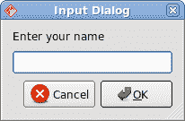

# QtJambi 对话框

> 原文： [http://zetcode.com/gui/qtjambi/dialogs/](http://zetcode.com/gui/qtjambi/dialogs/)

在 QtJambi 编程教程的这一部分中，我们将使用对话框。

对话框窗口或对话框是大多数现代 GUI 应用必不可少的部分。 对话被定义为两个或更多人之间的对话。 在计算机应用中，对话框是一个窗口，用于与应用“对话”。 对话框用于输入数据，修改数据，更改应用设置等。对话框是用户与计算机程序之间进行通信的重要手段。

## `MessageDialog`

消息框是方便的对话框，可向用户提供应用消息。 该消息由文本和图像数据组成。

```java
package com.zetcode;

import com.trolltech.qt.QSignalEmitter;
import com.trolltech.qt.gui.QApplication;
import com.trolltech.qt.gui.QGridLayout;
import com.trolltech.qt.gui.QMessageBox;
import com.trolltech.qt.gui.QPushButton;
import com.trolltech.qt.gui.QWidget;

/**
 * ZetCode QtJambi tutorial
 *
 * This program demonstrates
 * QMessageBox dialogs
 *
 * @author jan bodnar
 * website zetcode.com
 * last modified March 2009
 */

public class JambiApp extends QWidget {

    public JambiApp() {

        setWindowTitle("Message Dialogs");

        initUI();

        resize(220, 90);
        move(400, 300);
        show();
    }

    private void initUI() {

        QGridLayout grid = new QGridLayout(this);
        grid.setSpacing(2);

        QPushButton error = new QPushButton("Error", this);
        QPushButton warning = new QPushButton("Warning", this);
        QPushButton question = new QPushButton("Question", this);
        QPushButton information = new QPushButton("Information", this);
        QPushButton about = new QPushButton("About", this);

        grid.addWidget(error, 0, 0);
        grid.addWidget(warning, 0, 1);
        grid.addWidget(question, 1, 0);
        grid.addWidget(information, 1, 1);
        grid.addWidget(about, 2, 0);

        error.clicked.connect(this, "showDialog()");
        warning.clicked.connect(this, "showDialog()");
        question.clicked.connect(this, "showDialog()");
        information.clicked.connect(this, "showDialog()");
        about.clicked.connect(this, "showDialog()");
    }

    private void showDialog() {

        QPushButton button = (QPushButton) QSignalEmitter.signalSender();

        if ("Error".equals(button.text())) {
            QMessageBox.critical(this, "Error", "Error loading file!");
        } else if ("Warning".equals(button.text())) {
            QMessageBox.warning(this, "Warning", "Operation not permitted!");
        } else if ("Question".equals(button.text())) {
            QMessageBox.question(this, "Question", "Are you sure to quit?");
        } else if ("Information".equals(button.text())) {
            QMessageBox.information(this, "Information", "Download completed.");
        } else if ("About".equals(button.text())) {
            QMessageBox.about(this, "About", "ZetCode QtJambi tutorial.");
        }
    }

    public static void main(String[] args) {
        QApplication.initialize(args);
        new JambiApp();
        QApplication.exec();
    }
}

```

我们使用`GridLayout`管理器来设置五个按钮的网格。 每个按钮显示一个不同的消息框。

```java
QPushButton button = (QPushButton) QSignalEmitter.signalSender();

```

在这里，我们确定哪个按钮称为`showDialog()`方法。

```java
if ("Error".equals(button.text())) {
    QMessageBox.critical(this, "Error", "Error loading file!");
}

```

如果按下错误按钮，则会显示错误对话框。 我们使用`QMessageBox`类的静态方法来显示消息框。


## `QInputDialog`

`QInputDialog`类提供了一个简单的便捷对话框，可从用户那里获取单个值。 输入值可以是字符串，数字或列表中的项目。 必须设置标签以告知用户他们应该输入什么。

```java
package com.zetcode;

import com.trolltech.qt.core.Qt;
import com.trolltech.qt.gui.QApplication;
import com.trolltech.qt.gui.QInputDialog;
import com.trolltech.qt.gui.QLineEdit;
import com.trolltech.qt.gui.QPushButton;
import com.trolltech.qt.gui.QWidget;

/**
 * ZetCode QtJambi tutorial
 * 
 * This program shows an input
 * dialog
 *
 * @author jan bodnar
 * website zetcode.com
 * last modified March 2009
 */

public class JambiApp extends QWidget {

    QLineEdit edit;

    public JambiApp() {

        setWindowTitle("Input Dialog");

        initUI();

        move(400, 300);
        show();
    }

    private void initUI() {

        setGeometry(300, 300, 350, 80);

        QPushButton show = new QPushButton("Dialog", this);

        show.clicked.connect(this, "showDialog()");
        show.setFocusPolicy(Qt.FocusPolicy.NoFocus);

        show.move(20, 20);

        edit = new QLineEdit(this);
        edit.move(130, 22);
    }

    private void showDialog() {

        String text = QInputDialog.getText(
                this, "Input Dialog", "Enter your name");

        if (text!=null && !text.trim().isEmpty()) {
            edit.setText(text);
        }
    }

    public static void main(String[] args) {
        QApplication.initialize(args);
        new JambiApp();
        QApplication.exec();
    }
}

```

在代码示例中，我们有一个按钮和一行编辑。 该按钮显示一个输入对话框。 我们得到一些文本，文本显示在行编辑小部件中。

```java
String text = QInputDialog.getText(
        this, "Input Dialog", "Enter your name");

```

`getText()`静态方法创建输入对话框。 对话框中的文本存储在`text`变量中。

```java
if (text!=null && !text.trim().isEmpty()) {
    edit.setText(text);
}

```

在更新行编辑之前，请确保`text`变量不为`null`且不为空，并且不仅由空格组成。



Figure: Input dialog

## `QColorDialog`

`QColorDialog`类提供用于指定颜色的对话框小部件。 颜色对话框的功能是允许用户选择颜色。

```java
package com.zetcode;

import com.trolltech.qt.core.Qt;
import com.trolltech.qt.gui.QApplication;
import com.trolltech.qt.gui.QColor;
import com.trolltech.qt.gui.QColorDialog;
import com.trolltech.qt.gui.QLabel;
import com.trolltech.qt.gui.QMouseEvent;
import com.trolltech.qt.gui.QVBoxLayout;
import com.trolltech.qt.gui.QWidget;
import java.util.Formatter;

/**
 * ZetCode QtJambi tutorial
 *
 * In this program, we use the
 * QColorDialog to change the color
 * of a label text
 *
 * @author jan bodnar
 * website zetcode.com
 * last modified March 2009
 */

public class JambiApp extends QWidget {

    QLabel label;

    public JambiApp() {

        setWindowTitle("Color Dialog");

        initUI();

        resize(250, 200);
        move(400, 300);
        show();
    }

    private void initUI() {

        label = new QLabel("ZetCode QtJambi tutorial", this);

        QVBoxLayout vbox = new QVBoxLayout(this);
        label.setAlignment(Qt.AlignmentFlag.AlignCenter);
        vbox.addWidget(label);

    }

    @Override
    public void mousePressEvent(QMouseEvent event) {

        QColor color = QColorDialog.getColor();

        if (!color.isValid()) return;

        Formatter fmt = new Formatter();
        fmt.format("QWidget { color: %s }", color.name());

        label.setStyleSheet(fmt.toString());
    }

    public static void main(String[] args) {
        QApplication.initialize(args);
        new JambiApp();
        QApplication.exec();
    }
}

```

我们在窗口中心显示一些文本。 通过单击窗口区域，我们显示一个颜色对话框。 我们将文本前景色更改为从对话框中选择的颜色。

```java
@Override
public void mousePressEvent(QMouseEvent event) {
    ...
}

```

为了接收我们窗口的鼠标按下事件，我们必须重新实现`mousePressEvent()`方法。

```java
QColor color = QColorDialog.getColor();

```

正在创建`QColorDialog`。 所选颜色存储在`color`变量中。

```java
Formatter fmt = new Formatter();
fmt.format("QWidget { color: %s }", color.name());

label.setStyleSheet(fmt.toString());

```

在这里，我们更新标签文本的前景色。


Figure: QColorDialog

## `QFontDialog`

`QFontDialog`类提供用于选择字体的对话框小部件。

```java
package com.zetcode;

import com.trolltech.qt.core.Qt;
import com.trolltech.qt.gui.QApplication;
import com.trolltech.qt.gui.QFontDialog;
import com.trolltech.qt.gui.QLabel;
import com.trolltech.qt.gui.QMouseEvent;
import com.trolltech.qt.gui.QVBoxLayout;
import com.trolltech.qt.gui.QWidget;

/**
 * ZetCode QtJambi tutorial
 *
 * In this program, we use the
 * QFontDialog to change the font
 * of a label text
 * 
 * @author jan bodnar
 * website zetcode.com
 * last modified March 2009
 */

public class JambiApp extends QWidget {

    QLabel label;

    public JambiApp() {

        setWindowTitle("QFontColor dialog");

        initUI();

        resize(250, 200);
        move(300, 300);
        show();
    }

    private void initUI() {

        label = new QLabel("ZetCode QtJambi tutorial", this);

        QVBoxLayout vbox = new QVBoxLayout(this);
        label.setAlignment(Qt.AlignmentFlag.AlignCenter);
        vbox.addWidget(label);
    }

    @Override
    public void mousePressEvent(QMouseEvent event) {

        QFontDialog.Result result = QFontDialog.getFont();

        if (!result.ok) return;

        label.setFont(result.font);
    }

    public static void main(String[] args) {
        QApplication.initialize(args);
        new JambiApp();
        QApplication.exec();
    }
}

```

此示例与上一个示例相似。 这次，我们更改文本的字体。

```java
QFontDialog.Result result = QFontDialog.getFont();

```

正在创建`QFontDialog`。 该对话框返回`QFontDialog.Result`类。 此类有两个字段。 字体和确定字段。

```java
if (!result.ok) return;

```

如果单击对话框的“确定”按钮，则布尔值`ok`为`true`。 如果按下了取消按钮，我们将从方法中返回。

```java
label.setFont(result.font);

```

`font`字段存储所选字体。 我们将标签的字体更新为新选择的字体。


Figure: QFontDialog

在 QtJambi 教程的这一部分中，我们使用了对话框窗口。