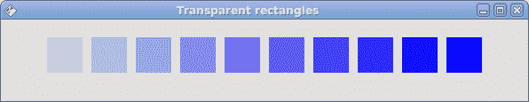
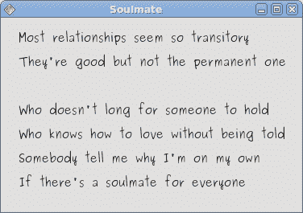

# QtJambi 中的绘图

> 原文： [http://zetcode.com/gui/qtjambi/painting/](http://zetcode.com/gui/qtjambi/painting/)

在 QtJambi 编程教程的这一部分中，我们将进行绘图。

我们什么时候需要油漆？ 在某些情况下，当我们需要从头开始创建小部件时。 在这种情况下，我们需要绘图。 或者我们想创建图表，特殊装饰，效果或小部件增强。

当我们在 QtJambi 库中进行绘图时，`QPainter`类将发挥作用。 绘图事件通过`paintEvent()`方法接收。 若要进行自定义绘图，我们必须重新实现此方法。

## 图案

在 QtJambi 中，我们可以使用各种图案来填充形状的内部。

```java
package com.zetcode;

import com.trolltech.qt.core.Qt;
import com.trolltech.qt.gui.QApplication;
import com.trolltech.qt.gui.QPaintEvent;
import com.trolltech.qt.gui.QPainter;
import com.trolltech.qt.gui.QPen;
import com.trolltech.qt.gui.QWidget;

/**
 * ZetCode QtJambi tutorial
 *
 * This program draws nine rectangles.
 * The interiors are filled with
 * different built-in patterns.
 *
 * @author jan bodnar
 * website zetcode.com
 * last modified March 2009
 */

public class JambiApp extends QWidget {

    public JambiApp() {

        setWindowTitle("Patterns");

        resize(350, 280);
        move(400, 300);
        show();
    }

    @Override
    protected void paintEvent(QPaintEvent event) {

        QPainter painter = new QPainter(this);
        drawPatterns(painter);
    }

    private void drawPatterns(QPainter painter) {

          painter.setPen(QPen.NoPen);

          painter.setBrush(Qt.BrushStyle.HorPattern);
          painter.drawRect(10, 15, 90, 60);

          painter.setBrush(Qt.BrushStyle.VerPattern);
          painter.drawRect(130, 15, 90, 60);

          painter.setBrush(Qt.BrushStyle.CrossPattern);
          painter.drawRect(250, 15, 90, 60);

          painter.setBrush(Qt.BrushStyle.Dense7Pattern);
          painter.drawRect(10, 105, 90, 60);

          painter.setBrush(Qt.BrushStyle.Dense6Pattern);
          painter.drawRect(130, 105, 90, 60);

          painter.setBrush(Qt.BrushStyle.Dense5Pattern);
          painter.drawRect(250, 105, 90, 60);

          painter.setBrush(Qt.BrushStyle.BDiagPattern);
          painter.drawRect(10, 195, 90, 60);

          painter.setBrush(Qt.BrushStyle.FDiagPattern);
          painter.drawRect(130, 195, 90, 60);

          painter.setBrush(Qt.BrushStyle.DiagCrossPattern);
          painter.drawRect(250, 195, 90, 60);

          painter.end();
    }

    public static void main(String[] args) {
        QApplication.initialize(args);
        new JambiApp();
        QApplication.exec();
    }
}

```

在代码示例中，我们将绘制九个矩形，并用不同的画笔图案填充它们。

```java
@Override
protected void paintEvent(QPaintEvent event) {

    QPainter painter = new QPainter(this);
    drawPatterns(painter);
}

```

当需要重绘窗口区域时，将调用`paintEvent()`方法。 当我们调整窗口大小，最大化或最小化窗口时，就会发生这种情况。在此方法中，我们创建了`QPainter`对象。 此对象用于完成 QtJambi 中的所有绘图。 绘图本身被委托给`drawPatterns()`方法。

```java
painter.setPen(QPen.NoPen);

```

笔对象用于绘制形状的轮廓。 在我们的示例中，我们将不使用笔。

```java
painter.setBrush(Qt.BrushStyle.HorPattern);

```

我们将水平图案设置为画笔。

```java
painter.drawRect(10, 15, 90, 60);

```

我们使用当前的笔和画笔绘制一个矩形。 该方法的前两个参数是 x，y 坐标。 最后两个参数是矩形的宽度和高度。

```java
painter.end();

```

结束绘图。 释放绘图时使用的所有资源。 根据文档，在 QtJambi 中不需要此调用。 资源由析构器释放。


图：图案

## 形状

QtJambi 绘图 API 可以绘制各种形状。 以下编程代码示例将显示其中的一些。

```java
package com.zetcode;

import com.trolltech.qt.core.QPoint;
import com.trolltech.qt.core.QPointF;
import com.trolltech.qt.gui.QApplication;
import com.trolltech.qt.gui.QBrush;
import com.trolltech.qt.gui.QColor;
import com.trolltech.qt.gui.QFont;
import com.trolltech.qt.gui.QPaintEvent;
import com.trolltech.qt.gui.QPainter;
import com.trolltech.qt.gui.QPainterPath;
import com.trolltech.qt.gui.QPen;
import com.trolltech.qt.gui.QPolygon;
import com.trolltech.qt.gui.QWidget;
import java.util.ArrayList;
import java.util.List;

/**
 * ZetCode QtJambi tutorial
 *
 * This program draws basic shapes
 * available in QtJambi
 *
 * @author jan bodnar
 * website zetcode.com
 * last modified March 2009
 */

public class JambiApp extends QWidget {

    public JambiApp() {

        setWindowTitle("Shapes");

        resize(350, 280);
        move(400, 300);
        show();
    }

    @Override
    protected void paintEvent(QPaintEvent event) {

        QPainter painter = new QPainter(this);
        drawShapes(painter);
    }

    private void drawShapes(QPainter painter) {

        painter.setRenderHint(QPainter.RenderHint.Antialiasing);
        painter.setPen(new QPen(new QBrush(QColor.darkGray), 1));
        painter.setBrush(QColor.darkGray);

        QPainterPath path1 = new QPainterPath();

        path1.moveTo(5, 5);
        path1.cubicTo(40, 5,  50, 50,  99, 99);
        path1.cubicTo(5, 99,  50, 50,  5, 5);
        painter.drawPath(path1);

        painter.drawPie(130, 20, 90, 60, 30*16, 120*16);
        painter.drawChord(240, 30, 90, 60, 0, 16*180);
        painter.drawRoundRect(20, 120, 80, 50);

        List<QPoint> points = new ArrayList<QPoint>();
        points.add(new QPoint(130, 140));
        points.add(new QPoint(180, 170));
        points.add(new QPoint(180, 140));
        points.add(new QPoint(220, 110));
        points.add(new QPoint(140, 100));

        QPolygon polygon = new QPolygon(points);

        painter.drawPolygon(polygon);
        painter.drawRect(250, 110, 60, 60);

        QPointF baseline = new QPointF(20, 250);
        QFont font = new QFont("Georgia", 55);
        QPainterPath path2 = new QPainterPath();
        path2.addText(baseline, font, "Q");
        painter.drawPath(path2);

        painter.drawEllipse(140, 200, 60, 60);
        painter.drawEllipse(240, 200, 90, 60);
    }

    public static void main(String[] args) {
        QApplication.initialize(args);
        new JambiApp();
        QApplication.exec();
    }
}

```

在此代码示例中，我们在窗口上绘制了九种不同的形状。 复杂路径，饼图，和弦，圆角矩形，多边形，矩形，基于字符的形状，圆形和椭圆形。

```java
painter.setRenderHint(QPainter.RenderHint.Antialiasing);

```

我们在示例中使用抗锯齿。 抗锯齿形状看起来更好，但是绘制它们需要更多时间。

```java
painter.setPen(new QPen(new QBrush(QColor.darkGray), 1));
painter.setBrush(QColor.darkGray);

```

我们使用深灰色的笔和画笔绘制形状。

```java
QPainterPath path1 = new QPainterPath();

path1.moveTo(5, 5);
path1.cubicTo(40, 5,  50, 50,  99, 99);
path1.cubicTo(5, 99,  50, 50,  5, 5);
painter.drawPath(path1);

```

使用`QPainterPath`对象创建第一个复杂形状。 `QPainterPath`类为绘图操作提供了一个容器。 画家路径是由许多图形构造块（例如矩形，椭圆形，直线和曲线）组成的对象。

```java
painter.drawPie(130, 20, 90, 60, 30*16, 120*16);
painter.drawChord(240, 30, 90, 60, 0, 16*180);
painter.drawRoundRect(20, 120, 80, 50);

```

这三行画出一个饼图，一个和弦和一个圆角矩形。

```java
List<QPoint> points = new ArrayList<QPoint>();
points.add(new QPoint(130, 140));
points.add(new QPoint(180, 170));
points.add(new QPoint(180, 140));
points.add(new QPoint(220, 110));
points.add(new QPoint(140, 100));

QPolygon polygon = new QPolygon(points);

painter.drawPolygon(polygon);

```

我们使用五个点的列表来创建多边形。

```java
QPointF baseline = new QPointF(20, 250);
QFont font = new QFont("Georgia", 55);
QPainterPath path2 = new QPainterPath();
path2.addText(baseline, font, "Q");
painter.drawPath(path2);

```

这些线创建基于字符的形状。

```java
painter.drawEllipse(140, 200, 60, 60);
painter.drawEllipse(240, 200, 90, 60);

```

这两条线分别创建一个圆和一个椭圆。


图：形状

## 透明矩形

透明性是指能够透视材料的质量。 了解透明度的最简单方法是想象一块玻璃或水。 从技术上讲，光线可以穿过玻璃，这样我们就可以看到玻璃后面的物体。

在计算机图形学中，我们可以使用 alpha 合成来实现透明效果。 Alpha 合成是将图像与背景组合以创建部分透明外观的过程。 合成过程使用 Alpha 通道。 （wikipedia.org，answers.com）

```java
package com.zetcode;

import com.trolltech.qt.gui.QApplication;
import com.trolltech.qt.gui.QColor;
import com.trolltech.qt.gui.QPaintEvent;
import com.trolltech.qt.gui.QPainter;
import com.trolltech.qt.gui.QPen;
import com.trolltech.qt.gui.QWidget;

/**
 * ZetCode QtJambi tutorial
 *
 * This program draws ten
 * rectangles with different
 * levels of transparency
 * 
 * @author jan bodnar
 * website zetcode.com
 * last modified March 2009
 */

public class JambiApp extends QWidget {

    public JambiApp() {

        setWindowTitle("Transparent rectangles");

        resize(590, 90);
        move(400, 300);
        show();
    }

    @Override
    protected void paintEvent(QPaintEvent event) {

        QPainter painter = new QPainter(this);
        drawRectangles(painter);

    }

    private void drawRectangles(QPainter painter) {

        painter.setPen(QPen.NoPen);

        for (int i=1; i<11; i++) {
            painter.setBrush(new QColor(0, 0, 255, i*25));
            painter.drawRect(50*i, 20, 40, 40);
        }
    }

    public static void main(String[] args) {
        QApplication.initialize(args);
        new JambiApp();
        QApplication.exec();
    }
}

```

在示例中，我们将绘制十个具有不同透明度级别的矩形。

```java
painter.setPen(QPen.NoPen);

```

我们不用笔。

```java
for (int i=1; i<11; i++) {
    painter.setBrush(new QColor(0, 0, 255, i*25));
    painter.drawRect(50*i, 20, 40, 40);
}

```

QColor 对象的最后一个参数是 alpha 透明度值。



图：透明矩形

## 甜甜圈形状

在下面的示例中，我们通过旋转一堆椭圆来创建复杂的形状。

```java
package com.zetcode;

import com.trolltech.qt.core.QPoint;
import com.trolltech.qt.gui.QApplication;
import com.trolltech.qt.gui.QColor;
import com.trolltech.qt.gui.QPaintEvent;
import com.trolltech.qt.gui.QPainter;
import com.trolltech.qt.gui.QPen;
import com.trolltech.qt.gui.QWidget;

/**
 * ZetCode QtJambi tutorial
 *
 * This program draws a donut
 * shape
 *
 * @author jan bodnar
 * website zetcode.com
 * last modified March 2009
 */

public class JambiApp extends QWidget {

    public JambiApp() {

        setWindowTitle("Donut");

        resize(350, 280);
        move(400, 300);
        show();
    }

    @Override
    protected void paintEvent(QPaintEvent event) {

        QPainter painter = new QPainter(this);
        drawDonut(painter);

    }

    private void drawDonut(QPainter painter) {

        QColor color = new QColor();
        color.setNamedColor("#333333");

        painter.setPen(new QPen(color, 0.5));

        painter.setRenderHint(QPainter.RenderHint.Antialiasing);

        int w = width();
        int h = height();

        painter.translate(new QPoint(w/2, h/2));

         for (double rot=0; rot < 360.0; rot+=5.0 ) {
             painter.drawEllipse(-125, -40, 250, 80);
             painter.rotate(5.0);
         }
    }

    public static void main(String[] args) {
        QApplication.initialize(args);
        new JambiApp();
        QApplication.exec();
    }
}

```

在此示例中，我们创建一个甜甜圈。 形状类似于曲奇，因此得名“甜甜圈”。

```java
QColor color = new QColor();
color.setNamedColor("#333333");

```

我们可以使用十六进制表示法来创建颜色对象。

```java
int w = width();
int h = height();

```

在这里，我们确定窗口的宽度和高度。

```java
painter.translate(new QPoint(w/2, h/2));

```

我们将坐标系移到窗口的中间。 这样，我们使绘图在数学上更容易。

```java
for (double rot=0; rot < 360.0; rot+=5.0 ) {
    painter.drawEllipse(-125, -40, 250, 80);
    painter.rotate(5.0);
}

```

我们绘制一个椭圆对象 72 次。 每次，我们将椭圆旋转 5 度。 这将创建我们的甜甜圈形状。


图：多纳圈

## 绘制文字

在最后一个示例中，我们将在窗口上绘制文本。

```java
package com.zetcode;

import com.trolltech.qt.core.QPoint;
import com.trolltech.qt.gui.QApplication;
import com.trolltech.qt.gui.QColor;
import com.trolltech.qt.gui.QFont;
import com.trolltech.qt.gui.QPaintEvent;
import com.trolltech.qt.gui.QPainter;
import com.trolltech.qt.gui.QWidget;

/**
 * ZetCode QtJambi tutorial
 *
 * This program draws text
 * on the window
 *
 * @author jan bodnar
 * website zetcode.com
 * last modified March 2009
 */

public class JambiApp extends QWidget {

    public JambiApp() {

        setWindowTitle("Soulmate");

        resize(370, 240);
        move(400, 300);
        show();
    }

    @Override
    protected void paintEvent(QPaintEvent event) {

        QPainter painter = new QPainter(this);
        drawLyrics(painter);

    }

    private void drawLyrics(QPainter painter) {

        painter.setBrush(new QColor(25, 25, 25));
        painter.setFont(new QFont("Purisa", 10));

        painter.drawText(new QPoint(20, 30),
                "Most relationships seem so transitory");
        painter.drawText(new QPoint(20, 60),
                "They're good but not the permanent one");
        painter.drawText(new QPoint(20, 120),
                "Who doesn't long for someone to hold");
        painter.drawText(new QPoint(20, 150),
                "Who knows how to love without being told");
        painter.drawText(new QPoint(20, 180),
                "Somebody tell me why I'm on my own");
        painter.drawText(new QPoint(20, 210),
                "If there's a soulmate for everyone");
    }

    public static void main(String[] args) {
        QApplication.initialize(args);
        new JambiApp();
        QApplication.exec();
    }
}

```

我们在窗口上画一首歌歌词。

```java
painter.setFont(new QFont("Purisa", 10));

```

我们为文本设置了 Purisa 字体。

```java
painter.drawText(new QPoint(20, 30),
        "Most relationships seem so transitory");

```

`drawText()`方法用于绘制文本。



图：绘制文本

在 QtJambi 编程教程的这一部分中，我们做了一些绘图。