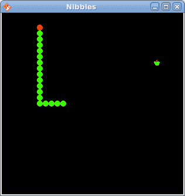

# Nibbles

> 原文： [http://zetcode.com/gui/qtjambi/nibbles/](http://zetcode.com/gui/qtjambi/nibbles/)

在 QtJambi 编程教程的这一部分中，我们将创建一个 Nibbles 游戏克隆。

Nibbles 是较旧的经典视频游戏。 它最初是在 70 年代后期创建的。 后来它被带到 PC 上。 在这个游戏中，玩家控制蛇。 目的是尽可能多地吃苹果。 蛇每次吃一个苹果，它的身体就会长大。 蛇必须避开墙壁和自己的身体。

## 开发

蛇的每个关节的大小为 10px。 蛇由光标键控制。 最初，蛇具有三个关节。 游戏立即开始。 游戏结束后，我们在窗口中心显示“ Game Over”消息。

`Board.java`

```
package com.zetcode;

import com.trolltech.qt.core.QBasicTimer;
import com.trolltech.qt.core.QPoint;
import com.trolltech.qt.core.QTimerEvent;
import com.trolltech.qt.core.Qt;
import com.trolltech.qt.gui.QColor;
import com.trolltech.qt.gui.QFont;
import com.trolltech.qt.gui.QFontMetrics;
import com.trolltech.qt.gui.QFrame;
import com.trolltech.qt.gui.QImage;
import com.trolltech.qt.gui.QKeyEvent;
import com.trolltech.qt.gui.QPaintEvent;
import com.trolltech.qt.gui.QPainter;

public class Board extends QFrame {

    private final int WIDTH = 300;
    private final int HEIGHT = 300;
    private final int DOT_SIZE = 10;
    private final int ALL_DOTS = 900;
    private final int RAND_POS = 29;
    private final int DELAY = 140;

    private int x[] = new int[ALL_DOTS];
    private int y[] = new int[ALL_DOTS];

    private int dots;
    private int apple_x;
    private int apple_y;

    private boolean left = false;
    private boolean right = true;

    private boolean up = false;
    private boolean down = false;
    private boolean inGame = true;

    private QBasicTimer timer;
    private QImage ball;
    private QImage apple;
    private QImage head;

    public Board() {

        setStyleSheet("QWidget { background-color: black }");

        setFocusPolicy(Qt.FocusPolicy.StrongFocus);

        ball = new QImage("dot.png");
        apple = new QImage("apple.png");
        head = new QImage("head.png");

        initGame();
    }

    private void initGame() {

        dots = 3;

        for (int z = 0; z < dots; z++) {
            x[z] = 50 - z*10;
            y[z] = 50;
        }

        locateApple();

        timer = new QBasicTimer();
        timer.start(DELAY, this);
    }

    @Override
    public void paintEvent(QPaintEvent event) {
        super.paintEvent(event);

        QPainter painter = new QPainter();
        painter.begin(this);

        if (inGame) {
            drawObjects(painter);
        } else {
            gameOver(painter);
        }

        painter.end();
    }

    private void drawObjects(QPainter painter) {

        painter.drawImage(apple_x, apple_y, apple);

        for (int z = 0; z < dots; z++) {
            if (z == 0)
                painter.drawImage(x[z], y[z], head);
            else painter.drawImage(x[z], y[z], ball);
        }
    }

    private void gameOver(QPainter painter) {
        String msg = "Game Over";
        QFont small = new QFont("Helvetica", 12,
            QFont.Weight.Bold.value());
        QFontMetrics metr = new QFontMetrics(small);

        int textWidth = metr.width(msg);
        int h = height();
        int w = width();

        painter.setPen(QColor.white);
        painter.setFont(small);
        painter.translate(new QPoint(w/2, h/2));
        painter.drawText(-textWidth/2, 0, msg);
    }

    private void checkApple() {

        if ((x[0] == apple_x) && (y[0] == apple_y)) {
            dots++;
            locateApple();
        }
    }

    private void move() {

        for (int z = dots; z > 0; z--) {
            x[z] = x[(z - 1)];
            y[z] = y[(z - 1)];
        }

        if (left) {
            x[0] -= DOT_SIZE;
        }

        if (right) {
            x[0] += DOT_SIZE;
        }

        if (up) {
            y[0] -= DOT_SIZE;
        }

        if (down) {
            y[0] += DOT_SIZE;
        }
    }

    private void checkCollision() {

        for (int z = dots; z > 0; z--) {

            if ((z > 4) && (x[0] == x[z]) && (y[0] == y[z])) {
                inGame = false;
            }
        }

        if (y[0] > HEIGHT) {
            inGame = false;
        }

        if (y[0] < 0) {
            inGame = false;
        }

        if (x[0] > WIDTH) {
            inGame = false;
        }

        if (x[0] < 0) {
            inGame = false;
        }
    }

    private void locateApple() {
        int r = (int) (Math.random() * RAND_POS);
        apple_x = ((r * DOT_SIZE));
        r = (int) (Math.random() * RAND_POS);
        apple_y = ((r * DOT_SIZE));
    }

    @Override
    protected void timerEvent(QTimerEvent event) {

        if (inGame) {
            checkApple();
            checkCollision();
            move();
        } else {
            timer.stop();
        }

        repaint();
    }

    @Override
    public void keyPressEvent(QKeyEvent event)
    {

        int key = event.key();

        if (key == Qt.Key.Key_Left.value() && !right) {
            left = true;
            up = false;
            down = false;
        }

        if ((key == Qt.Key.Key_Right.value()) && !left) {
            right = true;
            up = false;
            down = false;            
        }

        if ((key == Qt.Key.Key_Up.value()) && !down) {
            up = true;
            right = false;
            left = false;            
        }

        if ((key == Qt.Key.Key_Down.value()) && !up) {
            down = true;
            right = false;
            left = false;       
        }
    }
}

```

首先，我们将定义一些在游戏中使用的全局变量。

`WIDTH`和`HEIGHT`常数确定电路板的大小。 `DOT_SIZE`是苹果的大小和蛇的点。 `ALL_DOTS`常数定义了板上可能的最大点数。 `RAND_POS`常数用于计算苹果的随机位置。 `DELAY`常数确定游戏的速度。

```
private int x[] = new int[ALL_DOTS];
private int y[] = new int[ALL_DOTS];

```

这两个数组存储蛇的所有可能关节的 x，y 坐标。

`initGame()`方法初始化变量，加载图像并启动超时功能。

```
if (inGame) {
    drawObjects(painter);
} else {
    gameOver(painter);
}

```

在`paintEvent()`方法内部，我们检查`inGame`变量。 如果为真，则绘制对象。 苹果和蛇的关节。 否则，我们显示“游戏结束”文本。

```
private void drawObjects(QPainter painter) {

    painter.drawImage(apple_x, apple_y, apple);

    for (int z = 0; z < dots; z++) {
        if (z == 0)
            painter.drawImage(x[z], y[z], head);
        else painter.drawImage(x[z], y[z], ball);
    }
}

```

`drawObjects()`方法绘制苹果和蛇的关节。 蛇的第一个关节是其头部，用红色圆圈表示。

```
private void checkApple() {

    if ((x[0] == apple_x) && (y[0] == apple_y)) {
        dots++;
        locateApple();
    }
}

```

`checkApple()`方法检查蛇是否击中了苹果对象。 如果是这样，我们添加另一个蛇形关节并调用`locateApple()`方法，该方法将随机放置一个新的 Apple 对象。

在`move()`方法中，我们有游戏的密钥算法。 要了解它，请看一下蛇是如何运动的。 您控制蛇的头。 您可以使用光标键更改其方向。 其余关节在链上向上移动一个位置。 第二关节移动到第一个关节的位置，第三关节移动到第二个关节的位置，依此类推。

```
for (int z = dots; z > 0; z--) {
    x[z] = x[(z - 1)];
    y[z] = y[(z - 1)];
}

```

该代码将关节向上移动。

```
if (left) {
    x[0] -= DOT_SIZE;
}

```

将头向左移动。

在`checkCollision()`方法中，我们确定蛇是否击中了自己或撞墙之一。

```
for (int z = dots; z > 0; z--) {

    if ((z > 4) && (x[0] == x[z]) && (y[0] == y[z])) {
        inGame = false;
    }
}

```

如果蛇用头撞到关节之一，我们就结束游戏。

```
if (y[0] > HEIGHT) {
    inGame = false;
}

```

如果蛇击中了棋盘的底部，则游戏结束。

`locateApple()`方法在板上随机放置一个苹果。

```
int r = (int) (Math.random() * RAND_POS);

```

我们得到一个从 0 到 RAND_POS-1 的随机数。

```
apple_x = ((r * DOT_SIZE));
...
apple_y = ((r * DOT_SIZE));

```

这些行设置了 apple 对象的 x，y 坐标。

```
if (inGame) {
    checkApple();
    checkCollision();
    move();
} else {
    timer.stop();
}

```

每 140 毫秒，将调用`timerEvent()`方法。 如果我们参与了游戏，我们将调用三种构建游戏逻辑的方法。 否则，我们将停止计时器。

在 Board 类的`onKeyPressEvent()`方法中，我们确定按下的键。

```
if (key == Qt.Key.Key_Left.value() && !right) {
    left = true;
    up = false;
    down = false;
}

```

如果单击左光标键，则将`left`变量设置为 true。 在`move()`方法中使用此变量来更改蛇对象的坐标。 还要注意，当蛇向右行驶时，我们不能立即向左转。

`Nibbles.java`

```
package com.zetcode;

import com.trolltech.qt.gui.QApplication;
import com.trolltech.qt.gui.QMainWindow;

/**
 * ZetCode QtJambi tutorial
 *
 * In this program, we create
 * a Nibbles game clone.
 *
 * @author jan bodnar
 * website zetcode.com
 * last modified April 2009
 */

public class Nibbles extends QMainWindow {

    public Nibbles() {

        setWindowTitle("Nibbles");

        resize(310, 310);

        setCentralWidget(new Board());

        move(300, 300);
        show();
    }

    public static void main(String[] args) {
        QApplication.initialize(args);
        new Nibbles();
        QApplication.exec();
    }
}

```

在本课程中，我们设置了半字节游戏。



Figure: Nibbles

这是使用 QtJambi 库编程的 Nibbles 电脑游戏。