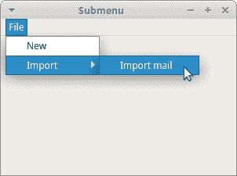
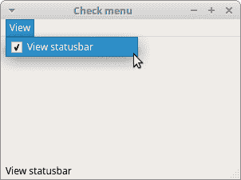
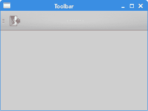
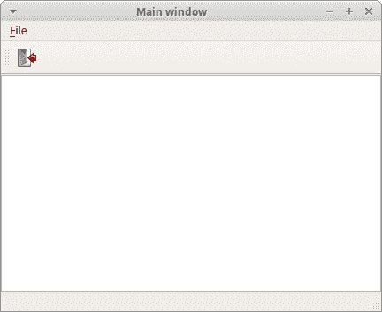

# PyQt5 中的菜单和工具栏

> 原文： [http://zetcode.com/gui/pyqt5/menustoolbars/](http://zetcode.com/gui/pyqt5/menustoolbars/)

在 PyQt5 教程的这一部分中，我们创建一个状态栏，菜单栏和工具栏。 菜单是位于菜单栏中的一组命令。 工具栏上的按钮带有应用中的一些常用命令。 状态栏通常在应用窗口的底部显示状态信息。

## `QMainWindow`

`QMainWindow`类提供一个主应用窗口。 这样可以创建带有状态栏，工具栏和菜单栏的经典应用框架。

## 状态栏

状态栏是用于显示状态信息的小部件。

`statusbar.py`

```py
#!/usr/bin/python3
# -*- coding: utf-8 -*-

"""
ZetCode PyQt5 tutorial 

This program creates a statusbar.

Author: Jan Bodnar
Website: zetcode.com 
Last edited: August 2017
"""

import sys
from PyQt5.QtWidgets import QMainWindow, QApplication

class Example(QMainWindow):

    def __init__(self):
        super().__init__()

        self.initUI()

    def initUI(self):               

        self.statusBar().showMessage('Ready')

        self.setGeometry(300, 300, 250, 150)
        self.setWindowTitle('Statusbar')    
        self.show()

if __name__ == '__main__':

    app = QApplication(sys.argv)
    ex = Example()
    sys.exit(app.exec_())

```

状态栏是在`QMainWindow`小部件的帮助下创建的。

```py
self.statusBar().showMessage('Ready')

```

要获取状态栏，我们调用`QtGui.QMainWindow`类的`statusBar()`方法。 该方法的第一次调用将创建一个状态栏。 后续调用返回状态栏对象。 `showMessage()`在状态栏上显示一条消息。

## 简单菜单

菜单栏是 GUI 应用的常见部分。 它是位于各个菜单中的一组命令。 （Mac OS 对菜单栏的处理不同。要获得相似的结果，我们可以添加以下行：`menubar.setNativeMenuBar(False)`。）

`simplemenu.py`

```py
#!/usr/bin/python3
# -*- coding: utf-8 -*-

"""
ZetCode PyQt5 tutorial 

This program creates a menubar. The
menubar has one menu with an exit action.

Author: Jan Bodnar
Website: zetcode.com 
Last edited: January 2017
"""

import sys
from PyQt5.QtWidgets import QMainWindow, QAction, qApp, QApplication
from PyQt5.QtGui import QIcon

class Example(QMainWindow):

    def __init__(self):
        super().__init__()

        self.initUI()

    def initUI(self):               

        exitAct = QAction(QIcon('exit.png'), '&Exit', self)        
        exitAct.setShortcut('Ctrl+Q')
        exitAct.setStatusTip('Exit application')
        exitAct.triggered.connect(qApp.quit)

        self.statusBar()

        menubar = self.menuBar()
        fileMenu = menubar.addMenu('&File')
        fileMenu.addAction(exitAct)

        self.setGeometry(300, 300, 300, 200)
        self.setWindowTitle('Simple menu')    
        self.show()

if __name__ == '__main__':

    app = QApplication(sys.argv)
    ex = Example()
    sys.exit(app.exec_())

```

在上面的示例中，我们创建一个带有一个菜单的菜单栏。 该菜单将包含一个动作，如果选中该动作，它将终止应用。 也会创建一个状态栏。 可通过 `Ctrl + Q` 快捷方式访问该操作。

```py
exitAct = QAction(QIcon('exit.png'), '&Exit', self)        
exitAct.setShortcut('Ctrl+Q')
exitAct.setStatusTip('Exit application')

```

`QAction`是使用菜单栏，工具栏或自定义键盘快捷键执行的操作的抽象。 在以上三行中，我们创建一个带有特定图标和“退出”标签的动作。 此外，为此操作定义了快捷方式。 第三行创建一个状态提示，当我们将鼠标指针悬停在菜单项上时，状态提示将显示在状态栏中。

```py
exitAct.triggered.connect(qApp.quit)

```

当我们选择此特定动作时，将触发信号。 信号连接到`QApplication`小部件的`quit()`方法。 这将终止应用。

```py
menubar = self.menuBar()
fileMenu = menubar.addMenu('&File')
fileMenu.addAction(exitAction)

```

`menuBar()`方法创建一个菜单栏。 我们使用`addMenu()`创建文件菜单，并使用`addAction()`添加操作。

## 子菜单

子菜单是位于另一个菜单内的菜单。

`submenu.py`

```py
#!/usr/bin/python3
# -*- coding: utf-8 -*-

"""
ZetCode PyQt5 tutorial 

This program creates a submenu.

Author: Jan Bodnar
Website: zetcode.com 
Last edited: August 2017
"""

import sys
from PyQt5.QtWidgets import QMainWindow, QAction, QMenu, QApplication

class Example(QMainWindow):

    def __init__(self):
        super().__init__()

        self.initUI()

    def initUI(self):         

        menubar = self.menuBar()
        fileMenu = menubar.addMenu('File')

        impMenu = QMenu('Import', self)
        impAct = QAction('Import mail', self) 
        impMenu.addAction(impAct)

        newAct = QAction('New', self)        

        fileMenu.addAction(newAct)
        fileMenu.addMenu(impMenu)

        self.setGeometry(300, 300, 300, 200)
        self.setWindowTitle('Submenu')    
        self.show()

if __name__ == '__main__':

    app = QApplication(sys.argv)
    ex = Example()
    sys.exit(app.exec_())

```

在示例中，我们有两个菜单项； 一个位于“文件”菜单中，另一个位于“文件的导入”子菜单中。

```py
impMenu = QMenu('Import', self)

```

使用`QMenu`创建新菜单。

```py
impAct = QAction('Import mail', self) 
impMenu.addAction(impAct)

```

使用`addAction()`将操作添加到子菜单。



图：子菜单

## 复选菜单

在以下示例中，我们创建一个可以选中和取消选中的菜单。

`checkmenu.py`

```py
#!/usr/bin/python3
# -*- coding: utf-8 -*-

"""
ZetCode PyQt5 tutorial 

This program creates a checkable menu.

Author: Jan Bodnar
Website: zetcode.com 
Last edited: August 2017
"""

import sys
from PyQt5.QtWidgets import QMainWindow, QAction, QApplication

class Example(QMainWindow):

    def __init__(self):
        super().__init__()

        self.initUI()

    def initUI(self):         

        self.statusbar = self.statusBar()
        self.statusbar.showMessage('Ready')

        menubar = self.menuBar()
        viewMenu = menubar.addMenu('View')

        viewStatAct = QAction('View statusbar', self, checkable=True)
        viewStatAct.setStatusTip('View statusbar')
        viewStatAct.setChecked(True)
        viewStatAct.triggered.connect(self.toggleMenu)

        viewMenu.addAction(viewStatAct)

        self.setGeometry(300, 300, 300, 200)
        self.setWindowTitle('Check menu')    
        self.show()

    def toggleMenu(self, state):

        if state:
            self.statusbar.show()
        else:
            self.statusbar.hide()

if __name__ == '__main__':

    app = QApplication(sys.argv)
    ex = Example()
    sys.exit(app.exec_())

```

该代码示例使用一个动作创建一个视图菜单。 该操作显示或隐藏状态栏。 当状态栏可见时，将选中菜单项。

```py
viewStatAct = QAction('View statusbar', self, checkable=True)

```

使用`checkable`选项，我们创建一个复选菜单。

```py
viewStatAct.setChecked(True)

```

由于状态栏从一开始就可见，因此我们使用`setChecked()`方法检查操作。

```py
def toggleMenu(self, state):

    if state:
        self.statusbar.show()
    else:
        self.statusbar.hide()

```

根据操作的状态，我们显示或隐藏状态栏。



Figure: Check menu

## 上下文菜单

上下文菜单，也称为弹出菜单，是在某些上下文下显示的命令列表。 例如，在 Opera Web 浏览器中，当我们右键单击某个网页时，将获得一个上下文菜单。 在这里，我们可以重新加载页面，返回页面或查看页面源。 如果右键单击工具栏，则将获得另一个用于管理工具栏的上下文菜单。

`contextmenu.py`

```py
#!/usr/bin/python3
# -*- coding: utf-8 -*-

"""
ZetCode PyQt5 tutorial 

This program creates a context menu.

Author: Jan Bodnar
Website: zetcode.com 
Last edited: August 2017
"""

import sys
from PyQt5.QtWidgets import QMainWindow, qApp, QMenu, QApplication

class Example(QMainWindow):

    def __init__(self):
        super().__init__()

        self.initUI()

    def initUI(self):         

        self.setGeometry(300, 300, 300, 200)
        self.setWindowTitle('Context menu')    
        self.show()

    def contextMenuEvent(self, event):

           cmenu = QMenu(self)

           newAct = cmenu.addAction("New")
           opnAct = cmenu.addAction("Open")
           quitAct = cmenu.addAction("Quit")
           action = cmenu.exec_(self.mapToGlobal(event.pos()))

           if action == quitAct:
               qApp.quit()

if __name__ == '__main__':

    app = QApplication(sys.argv)
    ex = Example()
    sys.exit(app.exec_())

```

要使用上下文菜单，我们必须重新实现`contextMenuEvent()`方法。

```py
action = cmenu.exec_(self.mapToGlobal(event.pos()))

```

使用`exec_()`方法显示上下文菜单。 从事件对象获取鼠标指针的坐标。 `mapToGlobal()`方法将微件坐标转换为全局屏幕坐标。

```py
if action == quitAct:
    qApp.quit()

```

如果从上下文菜单返回的操作等于退出操作，则我们终止该应用。

## 工具栏

菜单将我们可以在应用中使用的所有命令分组。 使用工具栏可以快速访问最常用的命令。

`toolbar.py`

```py
#!/usr/bin/python3
# -*- coding: utf-8 -*-

"""
ZetCode PyQt5 tutorial 

This program creates a toolbar.
The toolbar has one action, which
terminates the application, if triggered.

Author: Jan Bodnar
Website: zetcode.com 
Last edited: August 2017
"""

import sys
from PyQt5.QtWidgets import QMainWindow, QAction, qApp, QApplication
from PyQt5.QtGui import QIcon

class Example(QMainWindow):

    def __init__(self):
        super().__init__()

        self.initUI()

    def initUI(self):               

        exitAct = QAction(QIcon('exit24.png'), 'Exit', self)
        exitAct.setShortcut('Ctrl+Q')
        exitAct.triggered.connect(qApp.quit)

        self.toolbar = self.addToolBar('Exit')
        self.toolbar.addAction(exitAct)

        self.setGeometry(300, 300, 300, 200)
        self.setWindowTitle('Toolbar')    
        self.show()

if __name__ == '__main__':

    app = QApplication(sys.argv)
    ex = Example()
    sys.exit(app.exec_())

```

在上面的示例中，我们创建了一个简单的工具栏。 工具栏上有一个工具动作，一个退出动作，在触发时会终止应用。

```py
exitAct = QAction(QIcon('exit24.png'), 'Exit', self)
exitAct.setShortcut('Ctrl+Q')
exitAct.triggered.connect(qApp.quit)

```

与上面的菜单栏示例类似，我们创建一个动作对象。 该对象具有标签，图标和快捷方式。 `QtGui.QMainWindow`的`quit()`方法连接到触发信号。

```py
self.toolbar = self.addToolBar('Exit')
self.toolbar.addAction(exitAction)

```

工具栏是使用`addToolBar()`方法创建的。 我们使用`addAction()`将动作对象添加到工具栏。



图：工具栏

## 把它放在一起

在本节的最后一个示例中，我们将创建一个菜单栏，工具栏和一个状态栏。 我们还将创建一个中央小部件。

`mainwindow.py`

```py
#!/usr/bin/python3
# -*- coding: utf-8 -*-

"""
ZetCode PyQt5 tutorial 

This program creates a skeleton of
a classic GUI application with a menubar,
toolbar, statusbar, and a central widget. 

Author: Jan Bodnar
Website: zetcode.com 
Last edited: August 2017
"""

import sys
from PyQt5.QtWidgets import QMainWindow, QTextEdit, QAction, QApplication
from PyQt5.QtGui import QIcon

class Example(QMainWindow):

    def __init__(self):
        super().__init__()

        self.initUI()

    def initUI(self):               

        textEdit = QTextEdit()
        self.setCentralWidget(textEdit)

        exitAct = QAction(QIcon('exit24.png'), 'Exit', self)
        exitAct.setShortcut('Ctrl+Q')
        exitAct.setStatusTip('Exit application')
        exitAct.triggered.connect(self.close)

        self.statusBar()

        menubar = self.menuBar()
        fileMenu = menubar.addMenu('&File')
        fileMenu.addAction(exitAct)

        toolbar = self.addToolBar('Exit')
        toolbar.addAction(exitAct)

        self.setGeometry(300, 300, 350, 250)
        self.setWindowTitle('Main window')    
        self.show()

if __name__ == '__main__':

    app = QApplication(sys.argv)
    ex = Example()
    sys.exit(app.exec_())

```

此代码示例使用菜单栏，工具栏和状态栏创建经典 GUI 应用的框架。

```py
textEdit = QTextEdit()
self.setCentralWidget(textEdit)

```

在这里，我们创建一个文本编辑小部件。 我们将其设置为`QMainWindow`的中央小部件。 中央窗口小部件将占据剩余的所有空间。



Figure: Main window

在 PyQt5 教程的这一部分中，我们使用了菜单，工具栏，状态栏和主应用窗口。