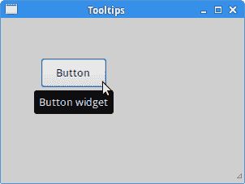
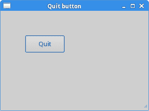

# Ruby GTK 简介

> 原文： [http://zetcode.com/gui/rubygtk/introduction/](http://zetcode.com/gui/rubygtk/introduction/)

在 Ruby GTK 编程教程的这一部分中，我们将介绍 GTK 库并使用 Ruby 编程语言创建第一个程序。

本教程的目的是帮助您开始使用 GTK 和 Ruby。 可以在此处下载[来下载贪食蛇游戏的图像](/img/gui/rubygimg.zip)。

## 关于

GTK 是用于创建图形用户界面的工具包。 Ruby 是一种流行的脚本语言。

## 简单的例子

在第一个示例中，我们创建一个简单的窗口。 窗口在屏幕上居中。

```rb
#!/usr/bin/ruby

'''
ZetCode Ruby GTK tutorial

This program centers a window on 
the screen.

Author: Jan Bodnar
Website: www.zetcode.com
Last modified: May 2014
'''

require 'gtk3'

class RubyApp < Gtk::Window

    def initialize
        super

        set_title "Center"
        signal_connect "destroy" do 
            Gtk.main_quit 
        end

        set_default_size 300, 200

        set_window_position Gtk::Window::Position::CENTER

        show
    end
end

Gtk.init
    window = RubyApp.new
Gtk.main

```

本示例在屏幕中央显示一个`300x200px`的窗口。

```rb
require 'gtk3'

```

`require`关键字导入我们将在应用中使用的必要类型。

```rb
class RubyApp < Gtk::Window

```

该示例继承自`Gtk::Window`-顶级容器。

```rb
set_title "Center"

```

我们为窗口设置标题。

```rb
signal_connect "destroy" do 
    Gtk.main_quit 
end

```

当单击标题栏中的关闭按钮或按 `Alt + F4` 时，会触发`destroy`信号。 `Gtk.main_quit`方法退出该应用。

```rb
set_default_size 300, 200

```

我们为应用窗口设置默认大小。

```rb
set_window_position Gtk::Window::Position::CENTER

```

这条线使窗口在屏幕上居中。 也可以使用`:center`符号。

```rb
show

```

一切准备就绪后，我们在屏幕上显示窗口。

```rb
Gtk.init
    window = RubyApp.new
Gtk.main

```

这三行设置了应用。

## 工具提示

第二个示例将显示一个工具提示。 工具提示是一个小的矩形窗口，它提供有关对象的简短信息。 它通常是一个 GUI 组件。 它是应用帮助系统的一部分。

```rb
#!/usr/bin/ruby

'''
ZetCode Ruby GTK tutorial

This program shows a tooltip on 
a window and a button.

Author: Jan Bodnar
Website: www.zetcode.com
Last modified: May 2014
'''

require 'gtk3'

class RubyApp < Gtk::Window

    def initialize
        super

        init_ui
    end

    def init_ui

        set_title  "Tooltips"
        signal_connect "destroy" do 
            Gtk.main_quit 
        end

        fixed = Gtk::Fixed.new
        add fixed

        button = Gtk::Button.new :label =>'Button'
        button.set_size_request 80, 35      
        button.set_tooltip_text "Button widget"

        fixed.put button, 50, 50       

        set_tooltip_text "Window widget"
        set_default_size 300, 200
        set_window_position :center

        show_all
    end
end

Gtk.init
    window = RubyApp.new
Gtk.main

```

如果将鼠标指针悬停在窗口和按钮小部件的上方，则会弹出工具提示。

```rb
def initialize
    super

    init_ui
end

```

用户界面的创建委托给`init_ui`方法。

```rb
fixed = Gtk::Fixed.new
add fixed

```

`Gtk::Fixed`是一个允许将小部件定位在固定坐标的容器。 对于更复杂的应用，必须使用布局管理器。

```rb
button = Gtk::Button.new :label =>'Button'

```

`Gtk::Button`小部件已创建。

```rb
button.set_size_request 80, 35  

```

`set_size_request`方法为按钮小部件提供大小：宽度：80，高度：35。

```rb
button.set_tooltip_text "Button widget"

```

我们使用`set_tooltip_text`方法设置工具提示。

```rb
fixed.put button, 50, 50

```

按钮窗口小部件以 x：50，y：50 坐标放置在`Gtk::Fixed`容器中。 坐标系从窗口的左上方开始。

```rb
set_tooltip_text "Window widget"

```

我们为`Gtk::Window`小部件设置了一个工具提示。



Figure: Tooltips

## 退出按钮

在本章的最后一个示例中，我们将创建一个退出按钮。 当我们按下此按钮时，应用终止。

```rb
#!/usr/bin/ruby

'''
ZetCode Ruby GTK tutorial

This program creates a quit
button. When we press the button,
the application terminates. 

Author: Jan Bodnar
Website: www.zetcode.com
Last modified: May 2014
'''

require 'gtk3'

class RubyApp < Gtk::Window

    def initialize
        super

        init_ui
    end

    def init_ui

        fixed = Gtk::Fixed.new
        add fixed

        button = Gtk::Button.new :label => "Quit"
        button.set_size_request 80, 35      
        button.signal_connect "clicked" do 
            Gtk.main_quit 
        end

        fixed.put button, 50, 50       

        set_title  "Quit button"
        signal_connect "destroy" do 
            Gtk.main_quit 
        end        

        set_default_size 300, 200
        set_window_position(:center)
        show_all
    end
end

Gtk.init
    window = RubyApp.new
Gtk.main

```

在示例中，我们将`Gtk::Button`小部件放置在窗口上。 我们将处理程序附加到`clicked`信号。

```rb
button = Gtk::Button.new :label => "Quit"

```

创建带有标签“`Quit`”的`Gtk::Button`。

```rb
button.signal_connect "clicked" do 
    Gtk.main_quit 
end

```

我们将`main_quit`方法插入按钮`clicked`信号。

```rb
show_all

```

我们有两个选择。 在所有小部件上调用`show`，或调用`show_all`（显示容器及其所有子代）。



Figure: Quit button

本章介绍了使用 Ruby 语言的 GTK 库。