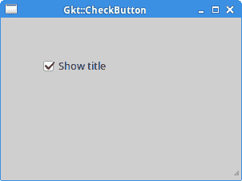
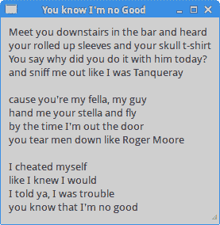
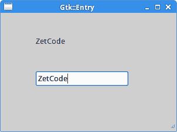
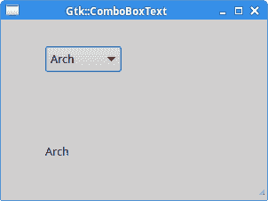

# Ruby GTK 中的小部件

> 原文： [http://zetcode.com/gui/rubygtk/widgets/](http://zetcode.com/gui/rubygtk/widgets/)

在 Ruby GTK 编程教程的这一部分中，我们将介绍一些小部件。

小部件是 GUI 应用程序的基本构建块。 多年来，一些小部件已成为所有 OS 平台上所有工具包中的标准，例如按钮，复选框或滚动条。 GTK 工具箱的理念是将小部件的数量保持在最低水平。 将创建更多专门的窗口小部件作为自定义 GTK 窗口小部件。

## Gtk :: CheckButton

`Gtk::CheckButton`是具有两种状态的窗口小部件：开和关。 接通状态通过复选标记显示。 它用来表示一些布尔属性。

```
#!/usr/bin/ruby

'''
ZetCode Ruby GTK tutorial

This program toggles the title of the
window with the Gtk::CheckButton widget.

Author: Jan Bodnar
Website: www.zetcode.com
Last modified: May 2014
'''

require 'gtk3'

class RubyApp < Gtk::Window
    def initialize
        super

        init_ui
    end

    def init_ui

        fixed = Gtk::Fixed.new
        add fixed

        cb = Gtk::CheckButton.new "Show title"
        cb.set_active true
        cb.set_can_focus false
        cb.signal_connect("clicked") do |w|
            on_clicked w
        end

        fixed.put cb, 50, 50    

        set_title "Gkt::CheckButton"
        signal_connect "destroy" do 
            Gtk.main_quit 
        end        

        set_default_size 300, 200
        set_window_position :center
        show_all        

    end

    def on_clicked sender

        if sender.active?
            self.set_title "Gtk::CheckButton"
        else
           self.set_title ""
        end
    end
end

Gtk.init
    window = RubyApp.new
Gtk.main

```

根据`Gtk::CheckButton`的状态，我们将在窗口的标题栏中显示标题。

```
cb = Gtk::CheckButton.new "Show title"

```

`Gtk::CheckButton`小部件已创建。

```
cb.set_active true

```

默认情况下标题是可见的，因此我们首先激活复选按钮。

```
if sender.active?
    self.set_title "Gtk::CheckButton"
else
    self.set_title ""
end

```

如果选中该按钮，我们将显示标题。 按钮的状态由`active?`方法确定。



Figure: Gtk::CheckButton widget

## Gtk :: Label

`Gtk::Label`小部件显示文本。

```
#!/usr/bin/ruby

'''
ZetCode Ruby GTK tutorial

This example demonstrates the Gtk::Label widget.

Author: Jan Bodnar
Website: www.zetcode.com
Last modified: May 2014
'''

require 'gtk3'

$lyrics = %{Meet you downstairs in the bar and heard
your rolled up sleeves and your skull t-shirt
You say why did you do it with him today?
and sniff me out like I was Tanqueray

cause you're my fella, my guy
hand me your stella and fly
by the time I'm out the door
you tear men down like Roger Moore

I cheated myself
like I knew I would
I told ya, I was trouble
you know that I'm no good}

class RubyApp < Gtk::Window

    def initialize
        super

        init_ui
    end

    def init_ui

        set_title  "You know I'm no Good"
        signal_connect "destroy" do 
            Gtk.main_quit 
        end

        set_border_width 10
        label = Gtk::Label.new $lyrics
        add label    

        set_default_size 250, 200
        set_window_position :center

        show_all        

    end
end

Gtk.init
    window = RubyApp.new
Gtk.main

```

该代码示例在窗口上显示了一些歌词。

```
$lyrics = %{Meet you downstairs in the bar and heard
your rolled up sleeves and your skull t-shirt
...

```

我们创建多行文本。

```
set_border_width 10

```

`Gtk::Label`小部件被一些空白包围。

```
label = Gtk::Label.new $lyrics
add label 

```

`Gtk::Label`小部件已创建并添加到窗口。



Figure: Gtk::Label widget

## 条目

`Gtk::Entry`是单行文本输入字段。 该小部件用于输入文本数据。

```
#!/usr/bin/ruby

'''
ZetCode Ruby GTK tutorial

This example demonstrates the Gtk::Entry widget.

Author: Jan Bodnar
Website: www.zetcode.com
Last modified: May 2014
'''
require 'gtk3'

class RubyApp < Gtk::Window

    def initialize
        super

        init_ui

    end

    def init_ui

        fixed = Gtk::Fixed.new

        label = Gtk::Label.new "..."
        fixed.put label, 60, 40

        entry = Gtk::Entry.new
        fixed.put entry, 60, 100

        entry.signal_connect "key-release-event" do |w, e|
            on_key_release w, e, label
        end

        add fixed

        set_title "Gtk::Entry"
        signal_connect "destroy" do 
            Gtk.main_quit 
        end        

        set_default_size 250, 200
        set_window_position :center

        show_all        
    end  

    def on_key_release sender, event, label
        label.set_text sender.text
    end
end

Gtk.init
    window = RubyApp.new
Gtk.main

```

此示例显示了条目小部件和标签。 我们输入的文本将立即显示在标签小部件中。

```
entry = Gtk::Entry.new

```

`Gtk::Entry`小部件已创建。

```
entry.signal_connect "key-release-event" do |w, e|
    on_key_release(w, e, label)
end

```

我们将`on_key_release`方法插入`Entry`小部件的`key-release-event`。

```
def on_key_release sender, event, label
    label.set_text sender.text
end

```

我们从`Gtk::Entry`小部件获取文本并将其设置为标签。



Figure: Entry Widget

## Gtk :: Image

`Gtk::Image`小部件显示图像。

```
#!/usr/bin/ruby

'''
ZetCode Ruby GTK tutorial

This example demonstrates the Gtk::Image widget.

Author: Jan Bodnar
Website: www.zetcode.com
Last modified: May 2014
'''

require 'gtk3'

class RubyApp < Gtk::Window

    def initialize
        super

        init_ui
    end

    def init_ui

        set_border_width 2

        image = Gtk::Image.new :file => "redrock.png"
        add image

        set_title "Red Rock"
        signal_connect "destroy" do 
            Gtk.main_quit
        end

        set_window_position :center

        show_all            
    end

end

Gtk.init
    window = RubyApp.new
Gtk.main

```

在我们的示例中，我们在窗口上显示图像。

```
set_border_width 2

```

我们在图像周围放置了一些空边框。

```
image = Gtk::Image.new :file => "redrock.png"

```

`Gtk::Image`小部件已创建。 如果未成功加载文件，则该图像将包含“残破图像”图标。 因此，我们不添加错误检查代码。

```
add image

```

窗口小部件已添加到容器中。

## Gtk :: ComboBoxText

`Gtk::ComboBoxText`是一个小部件，允许用户从文本选项列表中进行选择。

```
#!/usr/bin/ruby

'''
ZetCode Ruby GTK tutorial

This example demonstrates the Gtk::ComboBoxText widget.

Author: Jan Bodnar
Website: www.zetcode.com
Last modified: May 2014
'''

require 'gtk3'

class RubyApp < Gtk::Window

    def initialize
        super

        init_ui
    end

    def init_ui

        fixed = Gtk::Fixed.new
        label = Gtk::Label.new '-'
        fixed.put label, 50, 140

        cb = Gtk::ComboBoxText.new
        cb.signal_connect "changed" do |w, e|
            on_changed w, e, label
        end

        cb.append_text 'Xubuntu'
        cb.append_text 'Mandriva'
        cb.append_text 'Redhat'
        cb.append_text 'Gentoo'
        cb.append_text 'Arch' 

        fixed.put cb, 50, 30

        add fixed

        set_title "Gtk::ComboBoxText"
        signal_connect "destroy" do 
            Gtk.main_quit 
        end        

        set_default_size 300, 200
        set_window_position :center

        show_all        
    end

    def on_changed sender, event, label
        label.set_label sender.active_text
    end
end

Gtk.init
    window = RubyApp.new
Gtk.main

```

该示例显示了一个组合框和一个标签。 组合框具有五个选项的列表。 这些是 Linux Distros 的名称。 标签窗口小部件显示了从组合框中选择的选项。

```
cb = Gtk::ComboBoxText.new

```

`Gtk::ComboBoxText`小部件已创建。

```
cb.signal_connect "changed" do |w, e|
    on_changed w, e, label
end

```

自定义`on_changed`方法插入到组合框的`changed`信号中。 每当更改组合框的活动项目时，都会发出该信号。 我们将三个参数传递给`on_changed`方法：发件人小部件（组合框），事件对象和标签小部件。

```
cb.append_text 'Xubuntu'
cb.append_text 'Mandriva'
cb.append_text 'Redhat'
cb.append_text 'Gentoo'
cb.append_text 'Arch' 

```

组合框充满数据。

```
def on_changed sender, event, label
    label.set_label sender.active_text
end

```

在`on_changed`方法内部，我们从组合框中获取选定的文本并将其设置为标签。



Figure: GtkComboBoxText widget

在 Ruby GTK 教程的这一章中，我们展示了一些基本的小部件。