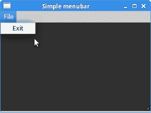
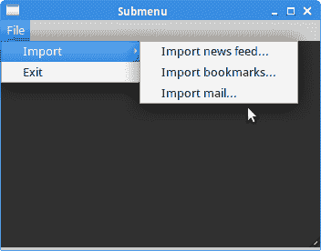
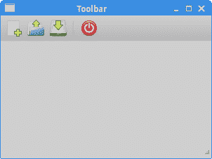
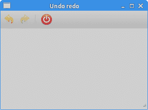

# Ruby GTK 中的菜单和工具栏

> 原文： [http://zetcode.com/gui/rubygtk/menustoolbars/](http://zetcode.com/gui/rubygtk/menustoolbars/)

在 Ruby GTK 编程教程的这一部分中，我们将使用菜单和工具栏。

GUI 应用程序中的常见部分是菜单栏。 菜单栏由称为菜单的对象组成。 顶层菜单在菜单栏上带有其标签。 菜单具有菜单项-在应用程序内部执行特定操作的命令。 菜单也可以具有子菜单，这些子菜单具有自己的菜单项。

## 简单的菜单栏

在第一个示例中，我们将创建一个带有一个文件菜单的菜单栏。 该菜单将只有一个菜单项。 通过选择项目，应用程序退出。

```
#!/usr/bin/ruby

'''
ZetCode Ruby GTK tutorial

This example creates a simple menubar.

Author: Jan Bodnar
Website: www.zetcode.com
Last modified: May 2014
'''

require 'gtk3'

class RubyApp < Gtk::Window

    def initialize
        super

        init_ui
    end

    def init_ui

        override_background_color :normal, 
            Gdk::RGBA.new(0.2, 0.2, 0.2, 1)

        mb = Gtk::MenuBar.new

        filemenu = Gtk::Menu.new
        filem = Gtk::MenuItem.new "File"
        filem.set_submenu filemenu

        exit = Gtk::MenuItem.new "Exit"
        exit.signal_connect "activate" do
            Gtk.main_quit
        end

        filemenu.append exit

        mb.append filem

        vbox = Gtk::Box.new :vertical, 2

        vbox.pack_start mb, :expand => false, 
            :fill => false, :padding => 0

        add vbox

        set_title "Simple menubar"
        signal_connect "destroy" do 
            Gtk.main_quit 
        end        

        set_default_size 300, 200
        set_window_position :center

        show_all        
    end
end

Gtk.init
    window = RubyApp.new
Gtk.main    

```

这是一个最小的菜单栏功能示例。

```
mb = Gtk::MenuBar.new

```

`Gtk::MenuBar`小部件已创建。 这是菜单的容器。

```
filemenu = Gtk::Menu.new
filem = Gtk::MenuItem.new "File"
filem.set_submenu filemenu

```

创建包含一个`Gtk::Menu`的顶层`Gtk::MenuItem`。

```
exit = Gtk::MenuItem.new "Exit"
exit.signal_connect "activate" do
    Gtk.main_quit
end

filemenu.append exit

```

创建出口`Gtk::MenuItem`并将其附加到文件`Gtk::MenuItem`中。

```
mb.append filem

```

顶级`Gtk::MenuItem`被附加到`Gtk::MenuBar`小部件。

```
vbox = Gtk::VBox.new false, 2
vbox.pack_start mb, false, false, 0

```

我们将菜单栏放入垂直框中。



Figure: Simple menu

## 子菜单

下面的示例演示如何创建子菜单。

```
#!/usr/bin/ruby

'''
ZetCode Ruby GTK tutorial

This example shows a submenu.

Author: Jan Bodnar
Website: www.zetcode.com
Last modified: May 2014
'''

require 'gtk3'

class RubyApp < Gtk::Window

    def initialize
        super

        init_ui
    end

    def init_ui

        override_background_color :normal, 
            Gdk::RGBA.new(0.2, 0.2, 0.2, 1)
        mb = Gtk::MenuBar.new

        filemenu = Gtk::Menu.new
        filem = Gtk::MenuItem.new "File"
        filem.set_submenu filemenu

        mb.append filem

        imenu = Gtk::Menu.new

        importm = Gtk::MenuItem.new "Import"
        importm.set_submenu imenu

        inews = Gtk::MenuItem.new "Import news feed..."
        ibookmarks = Gtk::MenuItem.new "Import bookmarks..."
        imail = Gtk::MenuItem.new "Import mail..."

        imenu.append inews
        imenu.append ibookmarks
        imenu.append imail

        filemenu.append importm

        exit = Gtk::MenuItem.new "Exit"
        exit.signal_connect "activate" do
            Gtk.main_quit
        end

        filemenu.append exit

        vbox = Gtk::Box.new :vertical, 2

        vbox.pack_start mb, :expand => false, 
            :fill => false, :padding => 0

        add vbox

        set_title "Submenu"
        signal_connect "destroy" do 
            Gtk.main_quit 
        end        

        set_default_size 350, 250
        set_window_position :center
        show_all        
    end
end

Gtk.init
    window = RubyApp.new
Gtk.main

```

子菜单是另一个菜单中的菜单。

```
imenu = Gtk::Menu.new

```

子菜单是`Gtk::Menu`。

```
importm = Gtk::MenuItem.new "Import"
importm.set_submenu imenu
...
filemenu.append importm

```

它是菜单项的子菜单，该菜单项会登录到顶级文件菜单。

```
inews = Gtk::MenuItem.new "Import news feed..."
ibookmarks = Gtk::MenuItem.new "Import bookmarks..."
imail = Gtk::MenuItem.new "Import mail..."

imenu.append inews
imenu.append ibookmarks
imenu.append imail

```

子菜单有其自己的菜单项。



Figure: Submenu

## 图像菜单

在下一个示例中，我们将进一步探索菜单。 我们将图像和加速器添加到我们的菜单项中。 加速器是用于激活菜单项的键盘快捷键。

```
#!/usr/bin/ruby

'''
ZetCode Ruby GTK tutorial

This example shows a menu with
images, accelerators and a separator.

Author: Jan Bodnar
Website: www.zetcode.com
Last modified: May 2014
'''

require 'gtk3'

class RubyApp < Gtk::Window

    def initialize
        super

        init_ui
    end

    def init_ui

        override_background_color :normal, 
            Gdk::RGBA.new(0.2, 0.2, 0.2, 1)
        mb = Gtk::MenuBar.new

        filemenu = Gtk::Menu.new
        filem = Gtk::MenuItem.new "File"
        filem.set_submenu filemenu

        agr = Gtk::AccelGroup.new
        add_accel_group agr

        newi = Gtk::ImageMenuItem.new :stock_id => Gtk::Stock::NEW, 
            :accel_group => agr
        key, mod = Gtk::Accelerator.parse "N"

        newi.add_accelerator "activate", agr, key,
           mod, Gtk::AccelFlags::VISIBLE
        filemenu.append newi

        openm = Gtk::ImageMenuItem.new :stock_id => Gtk::Stock::OPEN, 
            :accel_group => agr
        key, mod = Gtk::Accelerator.parse "O"
        openm.add_accelerator "activate", agr, key, 
            mod, Gtk::AccelFlags::VISIBLE
        filemenu.append openm

        sep = Gtk::SeparatorMenuItem.new
        filemenu.append sep

        exit = Gtk::ImageMenuItem.new :stock_id => Gtk::Stock::QUIT, 
            :accel_group => agr
        key, mod = Gtk::Accelerator.parse "Q"

        exit.add_accelerator "activate", agr, key, 
            mod, :visible

        exit.signal_connect "activate" do
            Gtk.main_quit
        end
        filemenu.append exit

        mb.append filem

        vbox = Gtk::Box.new :vertical, 2
        vbox.pack_start mb, :expand => false, :fill => false, 
            :padding => 0

        add vbox

        set_title "Image menu"
        signal_connect "destroy" do 
            Gtk.main_quit 
        end        

        set_default_size 300, 200
        set_window_position :center
        show_all        
    end
end

Gtk.init
    window = RubyApp.new
Gtk.main

```

我们的示例显示了具有三个菜单项的顶级菜单项。 每个菜单项都有一个图像和一个加速器。 退出菜单项的加速器处于活动状态。

```
agr = Gtk::AccelGroup.new
add_accel_group agr

```

要使用加速器，我们创建一个全局`Gtk::AccelGroup`对象。 稍后将使用。

```
newi = Gtk::ImageMenuItem.new :stock_id => Gtk::Stock::NEW, 
    :accel_group => agr
key, mod = Gtk::Accelerator.parse "N"

newi.add_accelerator "activate", agr, key,
    mod, Gtk::AccelFlags::VISIBLE
filemenu.append newi

```

创建了`Gtk::ImageMenuItem`。 图片来自图片库。 我们还创建了 `Ctrl` + `N` 加速器。

```
sep = Gtk::SeparatorMenuItem.new
filemenu.append sep

```

这些行创建一个分隔符，该分隔符用于将菜单项放入逻辑组中。


Figure: Image menu

## 简单的工具栏

菜单将我们可以在应用程序中使用的命令分组。 使用工具栏可以快速访问最常用的命令。 接下来，我们创建一个简单的工具栏。

```
#!/usr/bin/ruby

'''
ZetCode Ruby GTK tutorial

This example creates a simple toolbar.

Author: Jan Bodnar
Website: www.zetcode.com
Last modified: May 2014
'''

require 'gtk3'

class RubyApp < Gtk::Window

    def initialize
        super

        init_ui
    end

    def init_ui

        toolbar = Gtk::Toolbar.new
        toolbar.set_toolbar_style Gtk::Toolbar::Style::ICONS

        newtb = Gtk::ToolButton.new :stock_id => Gtk::Stock::NEW
        opentb = Gtk::ToolButton.new :stock_id => Gtk::Stock::OPEN
        savetb = Gtk::ToolButton.new :stock_id => Gtk::Stock::SAVE
        sep = Gtk::SeparatorToolItem.new
        quittb = Gtk::ToolButton.new :stock_id => Gtk::Stock::QUIT

        toolbar.insert newtb, 0
        toolbar.insert opentb, 1
        toolbar.insert savetb, 2
        toolbar.insert sep, 3
        toolbar.insert quittb, 4

        quittb.signal_connect "clicked" do
            Gtk.main_quit
        end

        vbox = Gtk::Box.new :vertical, 2
        vbox.pack_start toolbar, :expand => false, 
            :fill => false, :padding => 0

        add vbox

        set_title "Toolbar"
        signal_connect "destroy" do 
            Gtk.main_quit 
        end        

        set_default_size 300, 200
        set_window_position :center

        show_all        
    end
end

Gtk.init
    window = RubyApp.new
Gtk.main

```

该示例显示了一个工具栏和四个工具按钮。

```
toolbar = Gtk::Toolbar.new

```

`Gtk::Toolbar`小部件已创建。

```
toolbar.set_toolbar_style Gtk::Toolbar::Style::ICONS

```

在工具栏上，我们仅显示图标。

```
newtb = Gtk::ToolButton.new :stock_id => Gtk::Stock::NEW

```

创建带有库存图像的`Gtk::ToolButton`。 该图像来自图像的内置库存。

```
sep = Gtk::SeparatorToolItem.new

```

这是一个分隔符。 它可用于将工具栏按钮放入逻辑组。

```
toolbar.insert newtb, 0
toolbar.insert opentb, 1
...

```

工具栏按钮插入到工具栏小部件中。



Figure: Toolbar

## 撤销重做

以下示例演示了如何停用工具栏上的工具栏按钮。 这是 GUI 编程中的常见做法，例如保存按钮。 如果我们将文档的所有更改都保存到磁盘上，则在大多数文本编辑器中，“保存”按钮将被停用。 这样，应用程序会向用户指示所有更改都已保存。

```
#!/usr/bin/ruby

'''
ZetCode Ruby GTK tutorial

This example shows how to 
activate/deactivate a Gtk::ToolButton.

Author: Jan Bodnar
Website: www.zetcode.com
Last modified: May 2014
'''

require 'gtk3'

class RubyApp < Gtk::Window

    def initialize
        super

        @count = 2

        init_ui
    end

    def init_ui

        toolbar = Gtk::Toolbar.new
        toolbar.set_toolbar_style Gtk::Toolbar::Style::ICONS

        @undo = Gtk::ToolButton.new :stock_id => Gtk::Stock::UNDO
        @redo = Gtk::ToolButton.new :stock_id => Gtk::Stock::REDO
        sep = Gtk::SeparatorToolItem.new
        quit = Gtk::ToolButton.new :stock_id => Gtk::Stock::QUIT

        toolbar.insert @undo, 0
        toolbar.insert @redo, 1
        toolbar.insert sep, 2
        toolbar.insert quit, 3

        @undo.signal_connect "clicked" do
            on_undo
        end

        @redo.signal_connect "clicked" do
            on_redo
        end

        quit.signal_connect "clicked" do
            Gtk.main_quit
        end

        vbox = Gtk::Box.new :vertical, 2
        vbox.pack_start toolbar, :expand => false, 
            :fill => false, :padding => 0

        self.add vbox

        set_default_size 300, 200
        set_window_position :center

        show_all        

        set_title "Undo redo"
        signal_connect "destroy" do 
            Gtk.main_quit 
        end
    end

    def on_undo

        @count = @count - 1

        if @count <= 0
            @undo.set_sensitive false
            @redo.set_sensitive true
        end
    end

    def on_redo
        @count = @count + 1

        if @count >= 5
            @redo.set_sensitive false
            @undo.set_sensitive true
        end
    end
end

Gtk.init
    window = RubyApp.new
Gtk.main

```

我们的示例从 GTK 库存资源创建撤消和重做按钮。 单击几下后，每个按钮均被停用。 按钮显示为灰色。

```
@count = 2

```

`@count`变量决定激活或停用哪个按钮。

```
@undo = Gtk::ToolButton.new :stock_id => Gtk::Stock::UNDO
@redo = Gtk::ToolButton.new :stock_id => Gtk::Stock::REDO

```

我们有两个工具按钮：撤消和重做工具按钮。 图像来自库存资源。

```
@undo.signal_connect "clicked" do
    on_undo
end         

```

单击撤消按钮，我们触发`on_undo`方法。

```
if @count <= 0
    @undo.set_sensitive false
    @redo.set_sensitive true
end

```

要激活或停用小部件，我们使用`set_sensitive`方法



Figure: Undo redo

在 Ruby GTK 教程的这一章中，我们展示了如何使用菜单和工具栏。