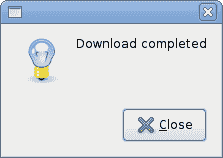
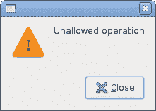
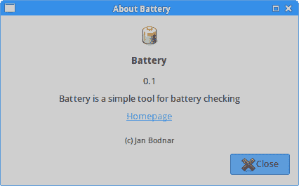
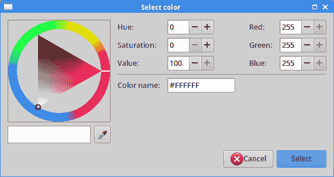

# Ruby GTK 中的对话框

> 原文： [http://zetcode.com/gui/rubygtk/dialogs/](http://zetcode.com/gui/rubygtk/dialogs/)

在 Ruby GTK 编程教程的这一部分中，我们将介绍对话框。

对话框窗口或对话框是大多数现代 GUI 应用程序必不可少的部分。 对话被定义为两个或更多人之间的对话。 在计算机应用程序中，对话框是一个窗口，用于与应用程序“对话”。 对话框用于输入数据，修改数据，更改应用程序设置等。对话框是用户与计算机程序之间进行通信的重要手段。

## 消息框

消息对话框是方便的对话框，可向应用程序的用户提供消息。 该消息包含文本和图像数据。

```
#!/usr/bin/ruby

'''
ZetCode Ruby GTK tutorial

This example shows message dialogs.

Author: Jan Bodnar
Website: www.zetcode.com
Last modified: May 2014
'''

require 'gtk3'

class RubyApp < Gtk::Window

    def initialize
        super

        init_ui
    end

    def init_ui

        table = Gtk::Table.new 2, 2, true

        info = Gtk::Button.new :label => "Information"
        warn = Gtk::Button.new :label => "Warning"
        ques = Gtk::Button.new :label => "Question"
        erro = Gtk::Button.new :label => "Error"

        info.signal_connect "clicked" do
            on_info
        end    

        warn.signal_connect "clicked" do
            on_warn
        end

        ques.signal_connect "clicked" do
            on_ques
        end

        erro.signal_connect "clicked" do
            on_erro
        end

        table.attach info, 0, 1, 0, 1
        table.attach warn, 1, 2, 0, 1
        table.attach ques, 0, 1, 1, 2
        table.attach erro, 1, 2, 1, 2

        add table

        set_title "Messages"
        signal_connect "destroy" do 
            Gtk.main_quit 
        end

        set_default_size 300, 100
        set_window_position :center

        show_all        

    end

    def on_info

        md = Gtk::MessageDialog.new :parent => self, 
            :flags => :destroy_with_parent, :type => :info, 
            :buttons_type => :close, :message => "Download completed"
        md.run
        md.destroy
    end

    def on_erro

        md = Gtk::MessageDialog.new :parent => self, 
            :flags => :modal, :type => :error, 
            :buttons_type => :close, :message => "Error loading file"
        md.run
        md.destroy
    end

    def on_ques

        md = Gtk::MessageDialog.new :parent => self, 
            :flags => :destroy_with_parent, :type => :question, 
            :buttons_type => :close, :message => "Are you sure to quit?"
        md.run
        md.destroy
    end

    def on_warn

        md = Gtk::MessageDialog.new :parent => self, 
            :flags => :destroy_with_parent, :type =>  :warning, 
            :buttons_type => :close, :message => "Unallowed operation"
        md.run
        md.destroy
    end
end

Gtk.init
    window = RubyApp.new
Gtk.main

```

在我们的示例中，我们将显示四种消息对话框：信息，警告，问题和错误消息对话框。

```
info = Gtk::Button.new :label => "Information"
warn = Gtk::Button.new :label => "Warning"
ques = Gtk::Button.new :label => "Question"
erro = Gtk::Button.new :label => "Error"

```

我们有四个按钮。 这些按钮中的每个按钮都会显示不同类型的消息对话框。

```
def on_info

    md = Gtk::MessageDialog.new :parent => self, 
        :flags => :destroy_with_parent, :type => :info, 
        :buttons_type => :close, :message => "Download completed"
    md.run
    md.destroy
end

```

如果单击信息按钮，则会显示信息对话框。 `Gtk::MessageDialog::INFO`指定对话框的类型。 `Gtk::MessageDialog::BUTTONS_CLOSE`指定要在对话框中显示的按钮的类型。 最后一个参数是显示的消息。 该对话框使用`run`方法显示。 程序员还必须调用`destroy`或`hide`方法。






## 关于对话

`AboutDialog`显示有关应用程序的信息。 它可以显示徽标，应用程序名称，版本，版权，网站或许可证信息。 也有可能对作者，文档撰写者，翻译者和艺术家予以赞扬。

```
#!/usr/bin/ruby

'''
ZetCode Ruby GTK tutorial

This example demonstrates the
Gtk::AboutDialog dialog.

Author: Jan Bodnar
Website: www.zetcode.com
Last modified: May 2014
'''

require 'gtk3'

class RubyApp < Gtk::Window

    def initialize
        super

        set_title "About dialog"
        signal_connect "destroy" do 
            Gtk.main_quit 
        end

        init_ui

        set_default_size 300, 150
        set_window_position :center

        show_all
    end

    def init_ui

        button = Gtk::Button.new :label => "About"
        button.set_size_request 80, 30

        button.signal_connect "clicked" do
            on_clicked
        end

        fix = Gtk::Fixed.new
        fix.put button, 20, 20

        add fix
    end

    def on_clicked

        about = Gtk::AboutDialog.new
        about.set_program_name "Battery"
        about.set_version "0.1"
        about.set_copyright "(c) Jan Bodnar"
        about.set_comments "Battery is a simple tool for battery checking"
        about.set_website "http://www.zetcode.com"        

        begin       
            logo = Gdk::Pixbuf.new :file => "batter.png"
            about.set_logo logo
        rescue IOError => e
            puts e
            puts "cannot load image"
            exit            
        end

        about.run
        about.destroy
    end
end

Gtk.init
    window = RubyApp.new
Gtk.main

```

该代码示例使用具有某些功能的`Gtk::AboutDialog`。

```
about = Gtk::AboutDialog.new

```

我们创建`Gkt::AboutDialog`小部件。

```
about.set_program_name "Battery"
about.set_version "0.1"
about.set_copyright "(c) Jan Bodnar"

```

在这里，我们指定名称，版本和版权。

```
begin       
    logo = Gdk::Pixbuf.new :file => "batter.png"
    about.set_logo logo
rescue IOError => e
    puts e
    puts "cannot load image"
    exit            
end

```

此行为对话框创建徽标。 执行一些错误检查。



Figure: Gtk::AboutDialog

## `Gtk::FontSelectionDialog`

`Gtk::FontSelectionDialog`是用于选择字体的对话框。 它通常用于进行一些文本编辑或格式化的应用程序中。

```
#!/usr/bin/ruby

'''
ZetCode Ruby GTK tutorial

This example presents the Gtk::FontSelectionDialog.

Author: Jan Bodnar
Website: www.zetcode.com
Last modified: May 2014
'''

require 'gtk3'

class RubyApp < Gtk::Window

    def initialize
        super

        init_ui
    end

    def init_ui

        set_border_width 10
        @label = Gtk::Label.new "The only victory over love is flight."
        button = Gtk::Button.new :label => "Select font"

        button.signal_connect "clicked" do
            on_clicked
        end

        fix = Gtk::Fixed.new
        fix.put button, 100, 30
        fix.put @label, 30, 90
        add fix

        set_title "Gtk::FontSelectionDialog"
        signal_connect "destroy" do 
            Gtk.main_quit 
        end        

        set_default_size 300, 150
        set_window_position :center

        show_all        
    end

    def on_clicked

        fdia = Gtk::FontChooserDialog.new :title => "Select font name", 
            :parent => nil
        response = fdia.run

        if response == Gtk::ResponseType::OK

            font_desc = Pango::FontDescription.new fdia.font_desc
            if font_desc

                @label.override_font font_desc
            end
        end

        fdia.destroy
    end     
end

Gtk.init
    window = RubyApp.new
Gtk.main

```

在代码示例中，我们有一个按钮和一个标签。 单击按钮显示`Gtk::FontSelectionDialog`。

```
fdia = Gtk::FontSelectionDialog.new "Select font name"

```

我们创建`GtkFontSelectionDialog`。

```
if response == Gtk::ResponseType::OK

    font_desc = Pango::FontDescription.new fdia.font_desc
    if font_desc

        @label.override_font font_desc
    end
end

```

如果单击“确定”按钮，则标签小部件的字体将更改为我们在对话框中选择的字体。

## `Gtk::ColorSelectionDialog`

`Gtk::ColorSelectionDialog`是用于选择颜色的对话框。

```
#!/usr/bin/ruby

'''
ZetCode Ruby GTK tutorial

This example presents the Gtk::ColorSelectionDialog.

Author: Jan Bodnar
Website: www.zetcode.com
Last modified: May 2014
'''

require 'gtk3'

class RubyApp < Gtk::Window

    def initialize
        super

        init_ui
    end

    def init_ui

        set_border_width 10
        @label = Gtk::Label.new "The only victory over love is flight."
        button = Gtk::Button.new :label => "Select colour"

        button.signal_connect "clicked" do
            on_clicked
        end

        fix = Gtk::Fixed.new
        fix.put button, 100, 30
        fix.put @label, 30, 90
        add fix

        set_title "Gtk::ColorSelectionDialog"
        signal_connect "destroy" do 
            Gtk.main_quit 
        end        

        set_default_size 350, 150
        set_window_position :center

        show_all        
    end

    def on_clicked

        cdia = Gtk::ColorSelectionDialog.new :title => "Select colour"
        response = cdia.run

        if response == Gtk::ResponseType::OK

            colorsel = cdia.color_selection
            col = colorsel.current_rgba
            @label.override_color :normal, col
        end

        cdia.destroy
    end
end

Gtk.init
    window = RubyApp.new
Gtk.main

```

该示例与上一个示例非常相似。 这次我们更改标签的颜色。

```
cdia = Gtk::ColorSelectionDialog.new :title => "Select colour"

```

我们创建`Gtk::ColorSelectionDialog`。

```
if response == Gtk::ResponseType::OK

    colorsel = cdia.color_selection
    col = colorsel.current_rgba
    @label.override_color :normal, col
end

```

如果按“确定”按钮，我们将获得颜色值并修改标签的颜色。



Figure: Gtk::ColorSelectionDialog

在 Ruby GTK 教程的这一部分中，我们介绍了对话框。