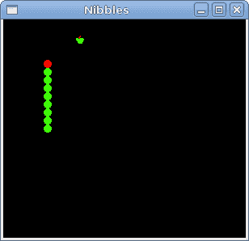

# Ruby GTK 中的贪食蛇

> 原文： [http://zetcode.com/gui/rubygtk/nibbles/](http://zetcode.com/gui/rubygtk/nibbles/)

在 Ruby GTK 编程教程的这一部分中，我们将创建一个贪食蛇游戏克隆。

贪食蛇是较旧的经典视频游戏。 它最初是在 70 年代后期创建的。 后来它被带到 PC 上。 在这个游戏中，玩家控制蛇。 目的是尽可能多地吃苹果。 蛇每次吃一个苹果，它的身体就会长大。 蛇必须避开墙壁和自己的身体。

## 开发

蛇的每个关节的大小为 10px。 蛇由光标键控制。 最初，蛇具有三个关节。 游戏立即开始。 游戏结束后，我们在窗口中心显示“`Game Over`”消息。

`board.rb`

```rb
WIDTH = 300
HEIGHT = 270
DOT_SIZE = 10
ALL_DOTS = WIDTH * HEIGHT / (DOT_SIZE * DOT_SIZE)
RAND_POS = 26
DELAY = 100

$x = [0] * ALL_DOTS
$y = [0] * ALL_DOTS

class Board < Gtk::DrawingArea

    def initialize
        super

        override_background_color :normal, Gdk::RGBA.new(0, 0, 0, 1)

        signal_connect "draw" do  
            on_draw
        end

        init_game
    end

    def on_timer

        if @inGame
            check_apple
            check_collision
            move
            queue_draw
            return true
        else
            return false
        end
    end

    def init_game

        @left = false
        @right = true
        @up = false
        @down = false
        @inGame = true
        @dots = 3

        for i in 0..@dots
            $x[i] = 50 - i * 10
            $y[i] = 50
        end

        begin
            @dot = Cairo::ImageSurface.from_png "dot.png"
            @head = Cairo::ImageSurface.from_png "head.png"
            @apple = Cairo::ImageSurface.from_png "apple.png"
        rescue Exception => e
            puts "cannot load images"
            exit
        end

        locate_apple
        GLib::Timeout.add(DELAY) { on_timer }
     end   

    def on_draw 

        cr = window.create_cairo_context

        if @inGame
            draw_objects cr
        else
            game_over cr
        end      
    end

    def draw_objects cr

        cr.set_source_rgb 0, 0, 0
        cr.paint

        cr.set_source @apple, @apple_x, @apple_y
        cr.paint

        for z in 0..@dots
            if z == 0 
                cr.set_source @head, $x[z], $y[z]
                cr.paint
            else
                cr.set_source @dot, $x[z], $y[z]
                cr.paint
            end    
        end
    end

    def game_over cr

        w = allocation.width / 2
        h = allocation.height / 2

        cr.set_font_size 15
        te = cr.text_extents "Game Over"

        cr.set_source_rgb 65535, 65535, 65535

        cr.move_to w - te.width/2, h
        cr.show_text "Game Over"
    end

    def check_apple

        if $x[0] == @apple_x and $y[0] == @apple_y 
            @dots = @dots + 1
            locate_apple
        end
    end

    def move

        z = @dots

        while z > 0
            $x[z] = $x[(z - 1)]
            $y[z] = $y[(z - 1)]
            z = z - 1
        end

        if @left
            $x[0] -= DOT_SIZE
        end

        if @right 
            $x[0] += DOT_SIZE
        end

        if @up
            $y[0] -= DOT_SIZE
        end

        if @down
            $y[0] += DOT_SIZE
        end
     end

    def check_collision

        z = @dots

        while z > 0
            if z > 4 and $x[0] == $x[z] and $y[0] == $y[z]
                @inGame = false
            end
            z = z - 1
        end

        if $y[0] > HEIGHT - DOT_SIZE
            @inGame = false
        end

        if $y[0] < 0
            @inGame = false
        end

        if $x[0] > WIDTH - DOT_SIZE
            @inGame = false
        end

        if $x[0] < 0
            @inGame = false
        end    
    end

    def locate_apple

        r = rand RAND_POS
        @apple_x = r * DOT_SIZE
        r = rand RAND_POS
        @apple_y = r * DOT_SIZE
    end

    def on_key_down event

        key = event.keyval

        if key == Gdk::Keyval::GDK_KEY_Left and not @right
            @left = true
            @up = false
            @down = false
        end

        if key == Gdk::Keyval::GDK_KEY_Right and not @left
            @right = true
            @up = false
            @down = false
        end

        if key == Gdk::Keyval::GDK_KEY_Up and not @down
            @up = true
            @right = false
            @left = false
        end

        if key == Gdk::Keyval::GDK_KEY_Down and not @up
            @down = true
            @right = false
            @left = false
        end
    end   
end

```

首先，我们将定义一些在游戏中使用的全局变量。 `WIDTH`和`HEIGHT`常数确定`Board`的大小。 `DOT_SIZE`是苹果的大小和蛇的点。 `ALL_DOTS`常数定义`Board`上可能的最大点数。 `RAND_POS`常数用于计算苹果的随机位置。 `DELAY`常数确定游戏的速度。

```rb
$x = [0] * ALL_DOTS
$y = [0] * ALL_DOTS

```

这两个数组存储蛇的所有可能关节的 x，y 坐标。

`init_game`方法初始化游戏。

```rb
@left = false
@right = true
@up = false
@down = false
@inGame = true
@dots = 3

```

我们初始化我们在游戏中使用的变量。

```rb
for i in 0..@dots
    $x[i] = 50 - i * 10
    $y[i] = 50
end

```

我们给蛇关节初始坐标。 它总是从同一位置开始。

```rb
begin
    @dot = Cairo::ImageSurface.from_png "dot.png"
    @head = Cairo::ImageSurface.from_png "head.png"
    @apple = Cairo::ImageSurface.from_png "apple.png"
rescue Exception => e
    puts "cannot load images"
    exit
end

```

加载了必要的图像。

```rb
locate_apple

```

苹果进入初始随机位置。

```rb
GLib::Timeout.add(DELAY) { on_timer }

```

`GLib::Timeout.add`方法将`on_timer`方法设置为每`DELAY`毫秒调用一次。

```rb
if @inGame
    draw_objects cr
else
    game_over cr
end      

```

在`on_draw`方法内部，我们检查`@inGame`变量。 如果是真的，我们绘制对象：苹果和蛇关节。 否则，我们显示“游戏结束”文本。

```rb
def draw_objects cr

    cr.set_source_rgb 0, 0, 0
    cr.paint

    cr.set_source @apple, @apple_x, @apple_y
    cr.paint

    for z in 0..@dots
        if z == 0 
            cr.set_source @head, $x[z], $y[z]
            cr.paint
        else
            cr.set_source @dot, $x[z], $y[z]
            cr.paint
        end    
    end
end

```

`draw_objects`方法绘制苹果和蛇的关节。 蛇的第一个关节是其头部，用红色圆圈表示。

```rb
def check_apple

    if $x[0] == @apple_x and $y[0] == @apple_y 
        @dots = @dots + 1
        locate_apple
    end
end

```

`check_apple`方法检查蛇是否击中了苹果对象。 如果是这样，我们添加另一个蛇形关节并调用`locate_apple`方法，该方法随机放置一个新的`Apple`对象。

在`move`方法中，我们有游戏的密钥算法。 要了解它，我们需要看看蛇是如何运动的。 我们控制蛇的头。 我们可以使用光标键更改其方向。 其余关节在链上向上移动一个位置。 第二关节移动到第一个关节的位置，第三关节移动到第二个关节的位置，依此类推。

```rb
while z > 0
    $x[z] = $x[(z - 1)]
    $y[z] = $y[(z - 1)]
    z = z - 1
end

```

该代码将关节向上移动。

```rb
if @left
    $x[0] -= DOT_SIZE
end

```

如果向左移动，则磁头向左移动。

在`check_collision`方法中，我们确定蛇是否击中了自己或撞墙之一。

```rb
while z > 0
    if z > 4 and $x[0] == $x[z] and $y[0] == $y[z]
        @inGame = false
    end
    z = z - 1
end 

```

如果蛇用头撞到关节之一，我们就结束游戏。

```rb
if $y[0] > HEIGHT - DOT_SIZE
    @inGame = false
end

```

如果蛇击中了棋盘的底部，则游戏结束。

`locate_apple`方法在板上随机放置一个苹果。

```rb
r = rand RAND_POS

```

我们得到一个从 0 到`RAND_POS-1`的随机数。

```rb
@apple_x = r * DOT_SIZE
...
@apple_y = r * DOT_SIZE

```

这些行设置了`apple`对象的 x，y 坐标。

```rb
if @inGame
    check_apple
    check_collision
    move
    queue_draw
    return true
else
    return false
end

```

每`DELAY` ms 会调用一次`on_timer`方法。 如果我们参与了游戏，我们将调用三种构建游戏逻辑的方法。 否则，我们返回`false`，它将停止计时器事件。

在`Board`类的`on_key_down`方法中，我们确定按下的键。

```rb
if key == Gdk::Keyval::GDK_KEY_Left and not @right
    @left = true
    @up = false
    @down = false
end

```

如果单击左光标键，则将`left`变量设置为`true`。 在`move`方法中使用此变量来更改蛇对象的坐标。 还要注意，当蛇向右行驶时，我们不能立即向左转。

`nibbles.rb`

```rb
#!/usr/bin/ruby

'''
ZetCode Ruby GTK tutorial

This is a simple Nibbles game
clone.

Author: Jan Bodnar
Website: www.zetcode.com
Last modified: May 2014
'''

require 'gtk3'
require './board'

class RubyApp < Gtk::Window

    def initialize
        super

        set_title "Nibbles"
        signal_connect "destroy" do 
            Gtk.main_quit 
        end

        @board = Board.new
        signal_connect "key-press-event" do |w, e|
            on_key_down w, e
        end

        add @board

        set_default_size WIDTH, HEIGHT
        set_window_position :center
        show_all
    end

    def on_key_down widget, event 

        key = event.keyval
        @board.on_key_down event
    end
end

Gtk.init
    window = RubyApp.new
Gtk.main

```

在本课程中，我们设置了半字节游戏。

```rb
def on_key_down widget, event 

    key = event.keyval
    @board.on_key_down event
end

```

我们捕获按键事件，并将处理委托给电路板类的`on_key_down`方法。



Figure: Nibbles

这是使用 GTK 库和 Ruby 编程语言编程的贪食蛇电脑游戏。