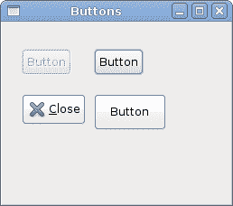

# GTK 的第一步

> 原文： [http://zetcode.com/gui/gtksharp/firststeps/](http://zetcode.com/gui/gtksharp/firststeps/)

在 GTK# 编程教程的这一部分中，我们将进行编程的第一步。 我们将创建简单的程序。

## 简单的例子

第一个代码示例是一个简单的示例，它显示了居中的窗口。

`center.cs`

```cs
using Gtk;

class SharpApp : Window {

    public SharpApp() : base("Center")
    {
        SetDefaultSize(250, 200);
        SetPosition(WindowPosition.Center);

        DeleteEvent += delegate { Application.Quit(); };

        Show();    
    }

    public static void Main()
    {
        Application.Init();
        new SharpApp();        
        Application.Run();
    }
}

```

该代码示例在屏幕中央显示一个小窗口。

```cs
$ gmcs -pkg:gtk-sharp-2.0 center.cs

```

这是我们编译代码示例的方式。

```cs
using Gtk;

```

现在，我们可以直接使用`Gtk`名称空间中的对象。 我们可以写`Window`而不是`Gtk.Window`。

```cs
class SharpApp : Window {

```

我们的应用基于`SharpApp`类。 该类继承自`Window`类。

```cs
public SharpApp() : base("Center")
{
    ...   
}

```

这是构造函数。 它构建了我们的应用。 它还通过`base()`关键字调用其父构造函数。

```cs
SetDefaultSize(250, 200);

```

这行为我们的窗口设置默认大小。

```cs
SetPosition(WindowPosition.Center);

```

这条线使窗口在屏幕上居中。

```cs
DeleteEvent += delegate { Application.Quit(); };

```

我们将一个代理插入`DeleteEvent`。 当我们单击标题栏中的关闭按钮时，将触发此事件。 或按 `Alt + F4` 。 我们的代表永久退出了申请。

```cs
Show();

```

现在我们显示窗口。 在调用`Show()`方法之前，该窗口不可见。

```cs
public static void Main()
{
    Application.Init();
    new SharpApp();        
    Application.Run();
}

```

`Main()`方法是应用的入口点。 它启动并运行程序。

## 图标

在下一个示例中，我们显示应用图标。 大多数窗口管理器在标题栏的左上角以及任务栏上都显示图标。

`icon.cs`

```cs

using Gtk;
using System;

class SharpApp : Window {

    public SharpApp() : base("Icon")
    {
        SetDefaultSize(250, 160);
        SetPosition(WindowPosition.Center);
        SetIconFromFile("web.png");

        DeleteEvent += new DeleteEventHandler(OnDelete);

        Show();      
    }

    public static void Main()
    {
        Application.Init();
        new SharpApp();
        Application.Run();
    }

    void OnDelete(object obj, DeleteEventArgs args)
    {
        Application.Quit();
    }
}

```

该代码示例显示了应用图标。

```cs
SetIconFromFile("web.png");

```

`SetIconFromFile()`方法为窗口设置图标。 从当前工作目录中的磁盘加载映像。

```cs
DeleteEvent += new DeleteEventHandler(OnDelete);

```

这是另一种方式，我们如何将事件处理程序插入事件。 只是有点冗长。

```cs
void OnDelete(object obj, DeleteEventArgs args)
{
    Application.Quit();
}

```

这是删除事件的事件处理程序。


Figure: Icon

## 按钮

在下一个示例中，我们将使用 GTK# 库进一步增强我们的编程技能。

`buttons.cs`

```cs
using Gtk;

class SharpApp : Window
{

    public SharpApp() : base("Buttons")
    {
        SetDefaultSize(250, 200);
        SetPosition(WindowPosition.Center);

        DeleteEvent += delegate { Application.Quit(); };

        Fixed fix = new Fixed();

        Button btn1 = new Button("Button");
        btn1.Sensitive = false;
        Button btn2 = new Button("Button");
        Button btn3 = new Button(Stock.Close);
        Button btn4 = new Button("Button");
        btn4.SetSizeRequest(80, 40);

        fix.Put(btn1, 20, 30);
        fix.Put(btn2, 100, 30);
        fix.Put(btn3, 20, 80);
        fix.Put(btn4, 100, 80);

        Add(fix);
        ShowAll();
    }

    public static void Main() 
    {
        Application.Init();
        new SharpApp();
        Application.Run();
    }
}

```

我们在窗口上显示四个不同的按钮。 我们将看到容器窗口小部件和子窗口小部件之间的区别，并将更改子窗口小部件的某些属性。

```cs
Fixed fix = new Fixed();

```

`Fixed`小部件是不可见的容器小部件。 其目的是包含其他子窗口小部件。

```cs
Button btn1 = new Button("Button");

```

`Button`是子窗口小部件。 子窗口小部件放置在容器内。

```cs
btn1.Sensitive = false;

```

我们使此按钮不敏感。 这意味着我们无法单击它。 图形化的小部件为灰色。

```cs
Button btn3 = new Button(Stock.Close);

```

第三个按钮在其区域内显示图像。 GTK# 库具有我们可以使用的内置图像库。

```cs
btn4.SetSizeRequest(80, 40);

```

在这里，我们更改按钮的大小。

```cs
fix.Put(btn1, 20, 30);
fix.Put(btn2, 100, 30);
...

```

在这里，我们将按钮小部件放置在固定容器小部件内。

```cs
Add(fix);

```

我们将`Fixed`容器设置为`Window`小部件的主要容器。

```cs
ShowAll();

```

我们可以调用`ShowAll()`方法，也可以在每个小部件上调用`Show()`方法。 包括容器。



Figure: Buttons

在本章中，我们在 GTK# 编程库中创建了第一个程序。