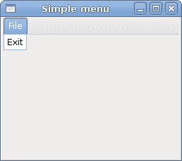
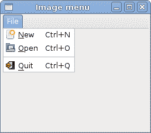
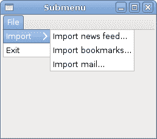

# GTK 中的菜单

> 原文： [http://zetcode.com/gui/gtksharp/menus/](http://zetcode.com/gui/gtksharp/menus/)

在 GTK＃编程教程的这一部分中，我们将使用菜单。

菜单栏是 GUI 应用程序中最常见的部分之一。 它是位于各个菜单中的一组命令。 在控制台应用程序中，我们必须记住各种奥术命令，而在这里，我们将大多数命令分组为逻辑部分。 这些公认的标准可进一步减少学习新应用程序的时间。

## 简单菜单

在第一个示例中，我们将创建一个带有一个文件菜单的菜单栏。 该菜单将只有一个菜单项。 通过选择项目，应用程序退出。

`simplemenu.cs`

```
using Gtk;
using System;

class SharpApp : Window {

    public SharpApp() : base("Simple menu")
    {
        SetDefaultSize(250, 200);
        SetPosition(WindowPosition.Center);
        DeleteEvent += delegate { Application.Quit(); };

        MenuBar mb = new MenuBar();

        Menu filemenu = new Menu();
        MenuItem file = new MenuItem("File");
        file.Submenu = filemenu;

        MenuItem exit = new MenuItem("Exit");
        exit.Activated += OnActivated;
        filemenu.Append(exit);

        mb.Append(file);

        VBox vbox = new VBox(false, 2);
        vbox.PackStart(mb, false, false, 0);

        Add(vbox);

        ShowAll();
    }

    void OnActivated(object sender, EventArgs args)
    {
        Application.Quit();
    }

    public static void Main()
    {
        Application.Init();
        new SharpApp();
        Application.Run();
    }
}

```

这是一个最小的菜单栏功能示例。

```
MenuBar mb = new MenuBar();

```

`MenuBar`小部件已创建。

```
Menu filemenu = new Menu();
MenuItem file = new MenuItem("File");
file.Submenu = filemenu;

```

创建顶层`MenuItem`。

```
MenuItem exit = new MenuItem("Exit");
exit.Activated += OnActivated;
filemenu.Append(exit);

```

将创建出口`MenuItem`，并将其附加到文件`MenuItem`中。

```
mb.Append(file);

```

顶级`MenuItem`被附加到`MenuBar`小部件。

```
VBox vbox = new VBox(false, 2);
vbox.PackStart(mb, false, false, 0);

```

与其他工具包不同，我们必须自己照顾布局管理。 我们将菜单栏放入垂直框中。



Figure: Simple menu

## 图像菜单

在下一个示例中，我们将进一步探索菜单。 我们将图像和加速器添加到我们的菜单项中。 加速器是用于激活菜单项的键盘快捷键。

`imagemenu.cs`

```
using Gtk;
using System;

class SharpApp : Window {

    public SharpApp() : base("Image menu")
    {
        SetDefaultSize(250, 200);
        SetPosition(WindowPosition.Center);
        DeleteEvent += delegate { Application.Quit(); };

        MenuBar mb = new MenuBar();

        Menu filemenu = new Menu();
        MenuItem file = new MenuItem("File");
        file.Submenu = filemenu;

        AccelGroup agr = new AccelGroup();
        AddAccelGroup(agr);

        ImageMenuItem newi = new ImageMenuItem(Stock.New, agr);
        newi.AddAccelerator("activate", agr, new AccelKey(
            Gdk.Key.n, Gdk.ModifierType.ControlMask, AccelFlags.Visible));
        filemenu.Append(newi);

        ImageMenuItem open = new ImageMenuItem(Stock.Open, agr);
        open.AddAccelerator("activate", agr, new AccelKey(
            Gdk.Key.n, Gdk.ModifierType.ControlMask, AccelFlags.Visible));
        filemenu.Append(open);

        SeparatorMenuItem sep = new SeparatorMenuItem();
        filemenu.Append(sep);

        ImageMenuItem exit = new ImageMenuItem(Stock.Quit, agr);
        exit.AddAccelerator("activate", agr, new AccelKey(
            Gdk.Key.q, Gdk.ModifierType.ControlMask, AccelFlags.Visible));

        exit.Activated += OnActivated;
        filemenu.Append(exit);

        mb.Append(file);

        VBox vbox = new VBox(false, 2);
        vbox.PackStart(mb, false, false, 0);
        vbox.PackStart(new Label(), false, false, 0);

        Add(vbox);

        ShowAll();
    }

    void OnActivated(object sender, EventArgs args)
    {
        Application.Quit();
    }

    public static void Main()
    {
        Application.Init();
        new SharpApp();
        Application.Run();
    }
}

```

我们的示例显示了具有三个子菜单项的顶级菜单项。 每个菜单项都有一个图像和一个加速器。 退出菜单项的加速器处于活动状态。

```
AccelGroup agr = new AccelGroup();
AddAccelGroup(agr);

```

要使用加速器，我们创建一个全局`AccelGroup`对象。 稍后将使用。

```
ImageMenuItem newi = new ImageMenuItem(Stock.New, agr);

```

`ImageMenuItem`已创建。 图片来自图片库。

```
exit.AddAccelerator("activate", agr, new AccelKey(
    Gdk.Key.q, Gdk.ModifierType.ControlMask, AccelFlags.Visible));

```

这将为退出菜单项创建 `Ctrl` + `Q` 加速器。

```
SeparatorMenuItem sep = new SeparatorMenuItem();
filemenu.Append(sep);

```

这些行创建一个分隔符。 它用于将菜单项分组为逻辑组。



Figure: Image menu

## CheckMenuItem

`CheckMenuItem`是带有复选框的菜单项。 它可以用于布尔属性。

`checkmenuitem.cs`

```
using Gtk;
using System;

class SharpApp : Window {

    private Statusbar statusbar;

    public SharpApp() : base("Check menu item")
    {
        SetDefaultSize(250, 200);
        SetPosition(WindowPosition.Center);
        DeleteEvent += delegate { Application.Quit(); };

        MenuBar mb = new MenuBar();

        Menu filemenu = new Menu();
        MenuItem file = new MenuItem("File");
        file.Submenu = filemenu;

        Menu viewmenu = new Menu();
        MenuItem view = new MenuItem("View");
        view.Submenu = viewmenu;

        CheckMenuItem stat = new CheckMenuItem("View Statusbar");
        stat.Toggle();
        stat.Toggled += OnStatusView;
        viewmenu.Append(stat);

        MenuItem exit = new MenuItem("Exit");
        exit.Activated += OnActivated;
        filemenu.Append(exit);

        mb.Append(file);
        mb.Append(view);

        statusbar = new Statusbar();
        statusbar.Push(1, "Ready");

        VBox vbox = new VBox(false, 2);
        vbox.PackStart(mb, false, false, 0);
        vbox.PackStart(new Label(), true, false, 0);
        vbox.PackStart(statusbar, false, false, 0);

        Add(vbox);

        ShowAll();
    }

    void OnStatusView(object sender, EventArgs args)
    {
        CheckMenuItem item = (CheckMenuItem) sender;

        if (item.Active) {
            statusbar.Show();
        } else {
            statusbar.Hide();
        }
    }

    void OnActivated(object sender, EventArgs args)
    {
        Application.Quit();
    }

    public static void Main()
    {
        Application.Init();
        new SharpApp();
        Application.Run();
    }
}

```

在我们的代码示例中，我们显示一个检查菜单项。 如果该复选框已激活，则显示状态栏小部件。 如果不是，状态栏将被隐藏。

```
CheckMenuItem stat = new CheckMenuItem("View Statusbar");

```

`CheckMenuItem`小部件已创建。

```
stat.Toggle();

```

`Toggle()`方法选中/取消选中检查菜单项。

```
if (item.Active) {
    statusbar.Show();
} else {
    statusbar.Hide();
}

```

根据`CheckMenuItem`的状态，我们显示或隐藏状态栏小部件。


Figure: CheckMenuItem

## 子菜单

我们的最后一个示例演示了如何在 GTK＃中创建一个子菜单。

`submenu.cs`

```
using Gtk;
using System;

class SharpApp : Window {

    public SharpApp() : base("Submenu")
    {
        SetDefaultSize(250, 200);
        SetPosition(WindowPosition.Center);
        DeleteEvent += delegate { Application.Quit(); };

        MenuBar mb = new MenuBar();

        Menu filemenu = new Menu();
        MenuItem file = new MenuItem("File");
        file.Submenu = filemenu;

        // submenu creation
        Menu imenu = new Menu();

        MenuItem import = new MenuItem("Import");
        import.Submenu = imenu;

        MenuItem inews = new MenuItem("Import news feed...");
        MenuItem ibookmarks = new MenuItem("Import bookmarks...");
        MenuItem imail = new MenuItem("Import mail...");

        imenu.Append(inews);
        imenu.Append(ibookmarks);
        imenu.Append(imail);

        // exit menu item
        MenuItem exit = new MenuItem("Exit");
        exit.Activated += OnActivated;

        filemenu.Append(import);
        filemenu.Append(exit);
        mb.Append(file);

        VBox vbox = new VBox(false, 2);
        vbox.PackStart(mb, false, false, 0);
        vbox.PackStart(new Label(), false, false, 0);

        Add(vbox);

        ShowAll();
    }

    void OnActivated(object sender, EventArgs args)
    {
        Application.Quit();
    }

    public static void Main()
    {
        Application.Init();
        new SharpApp();
        Application.Run();
    }
}

```

子菜单创建。

```
Menu imenu = new Menu();

```

子菜单是`Menu`。

```
MenuItem import = new MenuItem("Import");
import.Submenu = imenu;

```

它是菜单项的子菜单，它会登录到顶级文件菜单。

```
MenuItem inews = new MenuItem("Import news feed...");
MenuItem ibookmarks = new MenuItem("Import bookmarks...");
MenuItem imail = new MenuItem("Import mail...");

imenu.Append(inews);
imenu.Append(ibookmarks);
imenu.Append(imail);

```

子菜单有其自己的菜单项。



Figure: Submenu

在 GTK＃编程库的这一章中，我们展示了如何使用菜单。