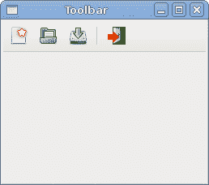

# GTK＃中的工具栏

> 原文： [http://zetcode.com/gui/gtksharp/toolbars/](http://zetcode.com/gui/gtksharp/toolbars/)

在 GTK＃编程教程的这一部分中，我们将使用工具栏。

菜单将我们可以在应用程序中使用的命令分组。 使用工具栏可以快速访问最常用的命令。 工具栏是带有按钮的水平或垂直面板。 这些按钮包含图像或图像和文本。 通过单击工具栏按钮，我们执行一个动作。

## 简单的工具栏

接下来，我们创建一个简单的工具栏。

`toolbar.cs`

```
using Gtk;
using System;

class SharpApp : Window {

    public SharpApp() : base("Toolbar")
    {
        SetDefaultSize(250, 200);
        SetPosition(WindowPosition.Center);
        DeleteEvent += delegate { Application.Quit(); };

        Toolbar toolbar = new Toolbar();
        toolbar.ToolbarStyle = ToolbarStyle.Icons;

        ToolButton newtb = new ToolButton(Stock.New);
        ToolButton opentb = new ToolButton(Stock.Open);
        ToolButton savetb = new ToolButton(Stock.Save);
        SeparatorToolItem sep = new SeparatorToolItem();
        ToolButton quittb = new ToolButton(Stock.Quit);

        toolbar.Insert(newtb, 0);
        toolbar.Insert(opentb, 1);
        toolbar.Insert(savetb, 2);
        toolbar.Insert(sep, 3);
        toolbar.Insert(quittb, 4);

        quittb.Clicked += OnClicked;

        VBox vbox = new VBox(false, 2);
        vbox.PackStart(toolbar, false, false, 0);

        Add(vbox);

        ShowAll();
    }

    void OnClicked(object sender, EventArgs args)
    {
        Application.Quit();
    }

    public static void Main()
    {
        Application.Init();
        new SharpApp();
        Application.Run();
    }
}

```

该示例显示了一个工具栏和四个工具按钮。

```
Toolbar toolbar = new Toolbar();

```

`Toolbar`小部件已创建。

```
toolbar.ToolbarStyle = ToolbarStyle.Icons;

```

在工具栏上，我们仅显示图标。 没有文字。

```
ToolButton newtb = new ToolButton(Stock.New);

```

创建带有库存图像的`ToolButton`。

```
SeparatorToolItem sep = new SeparatorToolItem(); 

```

这是一个分隔符。 它可用于将工具栏按钮分组为逻辑组。

```
toolbar.Insert(newtb, 0);
toolbar.Insert(opentb, 1);
...

```

工具栏按钮插入到工具栏小部件中。



Figure: Toolbar

## 工具栏

在第二个示例中，我们显示了两个工具栏。 许多应用程序具有多个工具栏。 我们展示了如何在 GTK＃中做到这一点。

`toolbars.cs`

```
using Gtk;
using System;

class SharpApp : Window {

    public SharpApp() : base("Toolbars")
    {
        SetDefaultSize(250, 200);
        SetPosition(WindowPosition.Center);
        DeleteEvent += delegate { Application.Quit(); };

        Toolbar upper = new Toolbar();
        upper.ToolbarStyle = ToolbarStyle.Icons;

        ToolButton newtb = new ToolButton(Stock.New);
        ToolButton opentb = new ToolButton(Stock.Open);
        ToolButton savetb = new ToolButton(Stock.Save);

        upper.Insert(newtb, 0);
        upper.Insert(opentb, 1);
        upper.Insert(savetb, 2);

        Toolbar lower = new Toolbar();
        lower.ToolbarStyle = ToolbarStyle.Icons;

        ToolButton quittb = new ToolButton(Stock.Quit);
        quittb.Clicked += OnClicked;
        lower.Insert(quittb, 0);

        VBox vbox = new VBox(false, 2);
        vbox.PackStart(upper, false, false, 0);
        vbox.PackStart(lower, false, false, 0);

        Add(vbox);

        ShowAll();
    }

    void OnClicked(object sender, EventArgs args)
    {
        Application.Quit();
    }

    public static void Main()
    {
        Application.Init();
        new SharpApp();
        Application.Run();
    }
}

```

我们的应用程序显示了两个工具栏。

```
Toolbar upper = new Toolbar();
...
Toolbar lower = new Toolbar();

```

我们创建两个`Toolbar`小部件。

```
upper.Insert(newtb, 0);
...
lower.Insert(quittb, 0);

```

它们每个都有自己的工具按钮。

```
VBox vbox = new VBox(false, 2);
vbox.PackStart(upper, false, false, 0);
vbox.PackStart(lower, false, false, 0)

```

工具栏一个接一个地包装在垂直盒中。


Figure: Toolbars

## 撤销重做

以下示例演示了如何停用工具栏上的工具栏按钮。 这是 GUI 编程中的常见做法。 例如，保存按钮。 如果我们将文档的所有更改都保存到磁盘上，则在大多数文本编辑器中，“保存”按钮将被禁用。 这样，应用程序会向用户指示所有更改都已保存。

`undoredo.cs`

```
using Gtk;
using System;

class SharpApp : Window {

    private int count = 2;
    private ToolButton undo;
    private ToolButton redo;

    public SharpApp() : base("Undo redo")
    {
        SetDefaultSize(250, 200);
        SetPosition(WindowPosition.Center);
        DeleteEvent += delegate { Application.Quit(); };

        Toolbar toolbar = new Toolbar();
        toolbar.ToolbarStyle = ToolbarStyle.Icons;

        undo = new ToolButton(Stock.Undo);
        redo = new ToolButton(Stock.Redo);
        SeparatorToolItem sep = new SeparatorToolItem();
        ToolButton quit = new ToolButton(Stock.Quit);

        toolbar.Insert(undo, 0);
        toolbar.Insert(redo, 1);
        toolbar.Insert(sep, 2);
        toolbar.Insert(quit, 3);

        undo.Clicked += OnUndo;
        redo.Clicked += OnRedo;
        quit.Clicked += OnClicked;

        VBox vbox = new VBox(false, 2);
        vbox.PackStart(toolbar, false, false, 0);
        vbox.PackStart(new Label(), false, false, 0);

        Add(vbox);

        ShowAll();
    }

    void OnUndo(object sender, EventArgs args)
    {
        count -= 1;

        if (count <= 0) {
            undo.Sensitive = false;
            redo.Sensitive = true;
        }
    }

    void OnRedo(object sender, EventArgs args)
    {
        count += 1;

        if (count >= 5) {
            redo.Sensitive = false;
            undo.Sensitive = true;
        }
    }

    void OnClicked(object sender, EventArgs args)
    {
        Application.Quit();
    }

    public static void Main()
    {
        Application.Init();
        new SharpApp();
        Application.Run();
    }
}

```

我们的示例从 GTK＃库存资源创建撤消和重做按钮。 单击几下后，每个按钮均被禁用。 按钮显示为灰色。

```
private int count = 2;

```

计数变量决定哪个按钮被激活和禁用。

```
undo = new ToolButton(Stock.Undo);
redo = new ToolButton(Stock.Redo);

```

我们有两个工具按钮。 撤消和重做工具按钮。 图片来自库存资源。

```
undo.Clicked += OnUndo;
redo.Clicked += OnRedo;

```

我们为两个工具按钮都插入了`Clicked`事件的方法。

```
if (count <= 0) {
    undo.Sensitive = false;
    redo.Sensitive = true;
}

```

要激活小部件，我们将其`Sensitive`属性设置为 true。 要使其无效，我们将其设置为 false。


Figure: Undo redo

在 GTK＃编程库的这一章中，我们提到了工具栏。