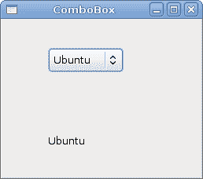
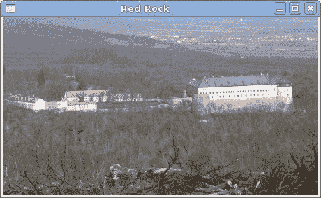

# GTK# 中的小部件 

> 原文： [http://zetcode.com/gui/gtksharp/widgets/](http://zetcode.com/gui/gtksharp/widgets/)

在 GTK# 编程教程的这一部分中，我们将介绍一些 GTK# 小部件。

小部件是 GUI 应用的基本构建块。 多年来，几个小部件已成为所有 OS 平台上所有工具包中的标准。 例如，按钮，复选框或滚动条。 GTK# 工具箱的理念是将小部件的数量保持在最低水平。 将创建更多专门的小部件作为自定义 GTK# 小部件。

## `Label`

`Label`小部件显示文本。

`label.cs`

```cs
using Gtk;

class SharpApp : Window {

   string text = @"Meet you downstairs in the bar and heard
your rolled up sleeves and your skull t-shirt
You say why did you do it with him today?
and sniff me out like I was Tanqueray

cause you're my fella, my guy
hand me your stella and fly
by the time I'm out the door
you tear men down like Roger Moore

I cheated myself
like I knew I would
I told ya, I was trouble
you know that I'm no good";

    public SharpApp() : base("You know I'm No Good")
    {
        BorderWidth = 8;
        SetPosition(WindowPosition.Center);

        DeleteEvent += delegate { Application.Quit(); };

        Label lyrics = new Label(text);
        Add(lyrics);

        ShowAll();
    }

    public static void Main()
    {
        Application.Init();
        new SharpApp();
        Application.Run();
    }
}

```

该代码示例在窗口上显示了一些歌词。

```cs
    string text = @"Meet you downstairs in the bar and heard
your rolled up sleeves and your skull t-shirt
...

```

在 C# 编程语言中，多行字符串以`@`字符开头。

```cs
BorderWidth = 8;

```

`Label`周围有一些空白。

```cs
Label lyrics = new Label(text);
Add(lyrics);

```

`Label`小部件已创建并添加到窗口。


图：`Label`小部件

## `CheckButton`

`CheckButton`是具有两种状态的窗口小部件：打开和关闭。 开状态通过复选标记显示。 它用来表示一些布尔属性。

`checkbutton.cs`

```cs
using Gtk;
using System;

class SharpApp : Window {

    public SharpApp() : base("CheckButton")
    {
        SetDefaultSize(250, 200);
        SetPosition(WindowPosition.Center);

        DeleteEvent += delegate { Application.Quit(); };

        CheckButton cb = new CheckButton("Show title");
        cb.Active = true;
        cb.Toggled += OnToggle;

        Fixed fix = new Fixed();
        fix.Put(cb, 50, 50);

        Add(fix);
        ShowAll();
    }

    void OnToggle(object sender, EventArgs args) 
    {
        CheckButton cb = (CheckButton) sender;

        if (cb.Active) {
            Title = "CheckButton";
        } else {
            Title = " ";
        }
    }

    public static void Main()
    {
        Application.Init();
        new SharpApp();
        Application.Run();
    }
}

```

根据`CheckButton`的状态，我们将在窗口的标题栏中显示标题。

```cs
CheckButton cb = new CheckButton("Show title");

```

`CheckButton`小部件已创建。

```cs
cb.Active = true;

```

默认情况下标题是可见的，因此我们默认情况下选中复选按钮。

```cs
CheckButton cb = (CheckButton) sender;

```

在这里，我们将发送方对象转换为`CheckButton`类。

```cs
if (cb.Active) {
    Title = "CheckButton";
} else {
    Title = " ";
}

```

根据`CheckButton`的`Active`属性，我们显示或隐藏窗口的标题。


图：`CheckButton`

## `ComboBox`

`ComboBox`是一个小部件，允许用户从选项列表中进行选择。

`combobox.cs`

```cs
using Gtk;
using System;

class SharpApp : Window {

    Label label;

    public SharpApp() : base("ComboBox")
    {
       string[] distros = new string[] {"Ubuntu",
            "Mandriva",
            "Red Hat",
            "Fedora",
            "Gentoo" };

        SetDefaultSize(250, 200);
        SetPosition(WindowPosition.Center);
        BorderWidth = 7;
        DeleteEvent += delegate { Application.Quit(); };

        Fixed fix = new Fixed();

        ComboBox cb = new ComboBox(distros);
        cb.Changed += OnChanged;
        label = new Label("-");

        fix.Put(cb, 50, 30);
        fix.Put(label, 50, 140);
        Add(fix);

        ShowAll();
    }

    void OnChanged(object sender, EventArgs args)
    {
        ComboBox cb = (ComboBox) sender;
        label.Text = cb.ActiveText;
    }

    public static void Main()
    {
        Application.Init();
        new SharpApp();
        Application.Run();
    }
}

```

该示例显示了一个组合框和一个标签。 组合框具有六个选项的列表。 这些是 Linux 发行版的名称。 标签窗口小部件显示了从组合框中选择的选项。

```cs
string[] distros = new string[] {"Ubuntu",
    "Mandriva",
    "Red Hat",
    "Fedora",
    "Gentoo" };

```

这是一个字符串数组，将显示在`ComboBox`小部件中。

```cs
ComboBox cb = new ComboBox(distros);

```

`ComboBox`小部件已创建。 构造函数将字符串数组作为参数。

```cs
void OnChanged(object sender, EventArgs args)
{
    ComboBox cb = (ComboBox) sender;
    label.Text = cb.ActiveText;
}

```

在`OnChanged()`方法内部，我们从组合框中获取选定的文本并将其设置为标签。



图：`ComboBox`

## `Image`

下一个示例介绍`Image`小部件。 此小部件显示图片。

`image.cs`

```cs
using Gtk;
using System;

class SharpApp : Window {

    Gdk.Pixbuf castle;

    public SharpApp() : base("Red Rock")
    {
        BorderWidth = 1;
        SetPosition(WindowPosition.Center);
        DeleteEvent += delegate { Application.Quit(); };

        try {
            castle = new Gdk.Pixbuf("redrock.png");
        } catch {
            Console.WriteLine("Image not found");
            Environment.Exit(1);
        }

        Image image = new Image(castle);
        Add(image);

        ShowAll();
    }

    public static void Main()
    {
        Application.Init();
        new SharpApp();
        Application.Run();
    }
}

```

我们在窗口中显示红色岩石城堡。

```cs
try {
    castle = new Gdk.Pixbuf("redrock.png");
} catch {
    Console.WriteLine("Image not found");
    Environment.Exit(1);
}

```

我们创建`Gdk.Pixbuf`小部件。 我们将构造函数放在`try`和`catch`关键字之间，以处理可能的错误。

```cs
Image image = new Image(castle);
Add(image);

```

`Image`小部件已创建并添加到窗口。



图：图像

在本章中，我们展示了 GTK# 编程库的第一组基本小部件。