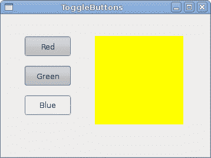
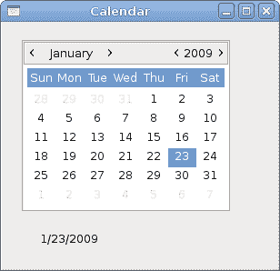

# GTK 中的小部件 II

> 原文： [http://zetcode.com/gui/gtksharp/widgetsII/](http://zetcode.com/gui/gtksharp/widgetsII/)

在 GTK# 编程教程的这一部分中，我们继续介绍 GTK# 小部件。

我们将介绍`Entry`小部件，`Scale`小部件，`ToggleButton`和`Calendar`小部件。

## `Entry`

`Entry`是单行文本输入字段。 该小部件用于输入文本数据。

`entry.cs`

```
using Gtk;
using System;

class SharpApp : Window {

    Label label;

    public SharpApp() : base("Entry")
    {
        SetDefaultSize(250, 200);
        SetPosition(WindowPosition.Center);
        BorderWidth = 7;
        DeleteEvent += delegate { Application.Quit(); };

        label = new Label("...");

        Entry entry = new Entry();
        entry.Changed += OnChanged;

        Fixed fix = new Fixed();
        fix.Put(entry, 60, 100);
        fix.Put(label, 60, 40);

        Add(fix);

        ShowAll();
    }

    void OnChanged(object sender, EventArgs args)
    {
        Entry entry = (Entry) sender;
        label.Text = entry.Text;
    }

    public static void Main()
    {
        Application.Init();
        new SharpApp();
        Application.Run();
    }
}

```

此示例显示了条目小部件和标签。 我们输入的文本将立即显示在标签控件中。

```
Entry entry = new Entry();

```

`Entry`小部件已创建。

```
entry.Changed += OnChanged;

```

如果`Entry`小部件中的文本被更改，我们将调用`OnChanged()`方法。

```
void OnChanged(object sender, EventArgs args)
{
    Entry entry = (Entry) sender;
    label.Text = entry.Text;
}

```

我们从`Entry`小部件获取文本并将其设置为标签。


Figure: Entry Widget

## `HScale`

`Scale`是一个小部件，可让用户通过在有限间隔内滑动旋钮以图形方式选择一个值。 我们的示例将显示音量控制。

`hscale.cs`

```
using Gtk;
using System;

class SharpApp : Window {

    Gdk.Pixbuf mute, min, med, max;
    Image image;

    public SharpApp() : base("Scale")
    {
        SetDefaultSize(260, 150);
        SetPosition(WindowPosition.Center);
        DeleteEvent += delegate { Application.Quit(); };

        HScale scale = new HScale(0, 100, 1);
        scale.SetSizeRequest(160, 35);
        scale.ValueChanged += OnChanged;

        LoadPixbufs();

        image = new Image(mute);

        Fixed fix = new Fixed();
        fix.Put(scale, 20, 40);
        fix.Put(image, 219, 50);

        Add(fix);

        ShowAll();
    }

    void LoadPixbufs() 
    {
        try {
            mute = new Gdk.Pixbuf("mute.png");
            min = new Gdk.Pixbuf("min.png");
            med = new Gdk.Pixbuf("med.png");
            max = new Gdk.Pixbuf("max.png");
        } catch {
            Console.WriteLine("Error reading Pixbufs");
            Environment.Exit(1);
        }
    }

    void OnChanged(object obj, EventArgs args)
    {
        HScale scale = (HScale) obj;
        double val = scale.Value;

        if (val == 0) {
            image.Pixbuf = mute;
        } else if (val > 0 && val < 30) {
            image.Pixbuf = min;
        } else if (val > 30 && val < 80) {
            image.Pixbuf = med;
        } else {
            image.Pixbuf = max;
        }
    }

    public static void Main()
    {
        Application.Init();
        new SharpApp();
        Application.Run();
    }
}

```

在上面的示例中，我们有`HScale`和`Image`小部件。 通过拖动比例尺，我们可以在`Image`小部件上更改图像。

```
HScale scale = new HScale(0, 100, 1);

```

`HScale`小部件已创建。 参数是下边界，上边界和阶跃。

```
HScale scale = (HScale) obj;
double val = scale.Value;

```

在`OnChange()`方法中，我们获得了比例小部件的值。

```
if (val == 0) {
    image.Pixbuf = mute;
} else if (val > 0 && val <= 30) {
    image.Pixbuf = min;
} else if (val > 30 && val < 80) {
    image.Pixbuf = med;
} else {
image.Pixbuf = max;
}

```

根据获得的值，我们在图像小部件中更改图片。


Figure: HScale Widget

## `ToggleButton`

`ToggleButton`是具有两种状态的按钮：已按下和未按下。 通过单击可以在这两种状态之间切换。 在某些情况下此功能非常合适。

`togglebuttons.cs`

```
using Gtk;
using System;

class SharpApp : Window {

    DrawingArea darea;
    Gdk.Color col;

    public SharpApp() : base("ToggleButtons")
    {
        col = new Gdk.Color(0, 0, 0);

        SetDefaultSize(350, 240);
        SetPosition(WindowPosition.Center);
        BorderWidth = 7;
        DeleteEvent += delegate { Application.Quit(); };

        ToggleButton red = new ToggleButton("Red");
        red.SetSizeRequest(80, 35);
        red.Clicked += OnRed;

        ToggleButton green = new ToggleButton("Green");
        green.SetSizeRequest(80, 35);
        green.Clicked += OnGreen;

        ToggleButton blue = new ToggleButton("Blue");
        blue.SetSizeRequest(80, 35);
        blue.Clicked += OnBlue;

        darea = new DrawingArea();
        darea.SetSizeRequest(150, 150);
        darea.ModifyBg(StateType.Normal, col);

        Fixed fix = new Fixed();
        fix.Put(red, 30, 30);
        fix.Put(green, 30, 80);
        fix.Put(blue, 30, 130);
        fix.Put(darea, 150, 30);

        Add(fix);

        ShowAll();
    }

    void OnRed(object sender, EventArgs args) 
    {
        ToggleButton tb = (ToggleButton) sender;

        if (tb.Active) {
            col.Red = 65535; 
        } else {
            col.Red = 0;
        }

        darea.ModifyBg(StateType.Normal, col);         
    }

    void OnGreen(object sender, EventArgs args) 
    {
        ToggleButton tb = (ToggleButton) sender;

        if (tb.Active) {
            col.Green = 65535; 
        } else {
            col.Green = 0;
        }

        darea.ModifyBg(StateType.Normal, col);
    }

    void OnBlue(object sender, EventArgs args) 
    {
        ToggleButton tb = (ToggleButton) sender;

        if (tb.Active) {
            col.Blue = 65535; 
        } else {
            col.Blue = 0;
        }

        darea.ModifyBg(StateType.Normal, col);
    }

    public static void Main()
    {
        Application.Init();
        new SharpApp();
        Application.Run();
    }
}

```

在我们的示例中，我们显示了三个切换按钮和一个`DrawingArea`。 我们将区域的背景色设置为黑色。 切换按钮将切换颜色值的红色，绿色和蓝色部分。 背景颜色取决于我们按下的切换按钮。

```
col = new Gdk.Color(0, 0, 0);

```

这是将使用切换按钮更新的颜色值。

```
ToggleButton red = new ToggleButton("Red");
red.SetSizeRequest(80, 35);
red.Clicked += OnRed;

```

`ToggleButton`小部件已创建。 我们将其尺寸设置为 80x35 像素。 每个切换按钮都有其自己的处理程序方法。

```
darea = new DrawingArea();
darea.SetSizeRequest(150, 150);
darea.ModifyBg(StateType.Normal, col);

```

`DrawingArea`小部件是显示颜色的小部件，由切换按钮混合。 开始时，它显示为黑色。

```
if (tb.Active) {
    col.Red = 65535; 
} else {
    col.Red = 0;
}

```

我们根据`Active`属性的值更新颜色的红色部分。

```
darea.ModifyBg(StateType.Normal, col);

```

我们更新`DrawingArea`小部件的颜色。



Figure: ToggleButton widget

## `Calendar`

我们最终的窗口小部件是`Calendar`小部件。 它用于处理日期。

`calendar.cs`

```
using Gtk;
using System;

class SharpApp : Window {

    private Label label;

    public SharpApp() : base("Calendar")
    {
        SetDefaultSize(300, 270);
        SetPosition(WindowPosition.Center);
        DeleteEvent += delegate { Application.Quit(); };

        label = new Label("...");

        Calendar calendar = new Calendar();
        calendar.DaySelected += OnDaySelected;

        Fixed fix = new Fixed();
        fix.Put(calendar, 20, 20);
        fix.Put(label, 40, 230);

        Add(fix);

        ShowAll();
    }

    void OnDaySelected(object sender, EventArgs args)
    {
        Calendar cal = (Calendar) sender;
        label.Text = cal.Month + 1 + "/" + cal.Day + "/" + cal.Year;
    }

    public static void Main()
    {
        Application.Init();
        new SharpApp();
        Application.Run();
    }
}

```

我们有`Calendar`小部件和`Label`。 从日历中选择的日期显示在标签中。

```
Calendar calendar = new Calendar();

```

`Calendar`小部件已创建。

```
Calendar cal = (Calendar) sender;
label.Text = cal.Month + 1 + "/" + cal.Day + "/" + cal.Year;

```

在`OnDaySelected()`方法中，我们将引荐给`Calendar`小部件，并将标签更新为当前选择的日期。



Figure: Calendar

在本章中，我们结束了有关 GTK# 小部件的讨论。