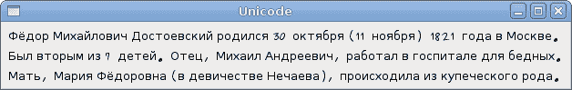
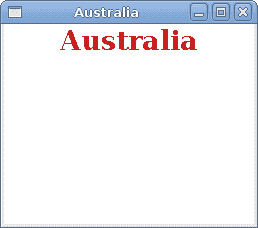

# Pango

> 原文： [http://zetcode.com/gui/gtksharp/pango/](http://zetcode.com/gui/gtksharp/pango/)

在 GTK# 编程教程的这一部分中，我们将探索 Pango 库。

Pango 是一个免费的开源计算库，可高质量呈现国际化文本。 可以使用不同的字体后端，从而允许跨平台支持。 （维基百科）

Pango 提供了用于 Gdk 和 Gtk 的高级字体和文本处理。

## 简单的例子

在第一个示例中，我们展示了如何更改标签小部件的字体。

`quotes.cs`

```cs
using Gtk;
using System;

class SharpApp : Window {

    private Label label;

    public SharpApp() : base("Pango")
    {
        SetPosition(WindowPosition.Center);
        DeleteEvent += delegate { Application.Quit(); };

        string text = @"Excess of joy is harder to bear than any amount of sorrow.
The more one judges, the less one loves.
There is no such thing as a great talent without great will power. ";

        label = new Label(text);

        Pango.FontDescription fontdesc = Pango.FontDescription.FromString("Purisa 10");
        label.ModifyFont(fontdesc);

        Fixed fix = new Fixed();

        fix.Put(label, 5, 5);
        Add(fix);
        ShowAll();
    }

    public static void Main()
    {
        Application.Init();
        new SharpApp();
        Application.Run();
    }
}

```

在上面的代码示例中，我们有一个带有三个引号的标签小部件。 我们将其字体更改为 Purisa 10。

```cs
string text = @"Excess of joy is harder to bear than any amount of sorrow.
...

```

这是要在标签中显示的文本。

```cs
Pango.FontDescription fontdesc = Pango.FontDescription.FromString("Purisa 10");

```

`FontDescription`用于指定要加载的字体的特征。 `FromString()`方法从字符串表示形式创建新的字体描述。

```cs
label.ModifyFont(fontdesc);

```

我们将标签小部件的字体更改为 Purisa 10。


图：`Quotations`

## 系统字体

下一个代码示例显示`TreeView`小部件中的所有可用字体。

`systemfonts.cs`

```cs
using System;
using Pango;
using Gtk;

public class SharpApp : Window
{
    ListStore store;
    FontFamily[] fam;

    public SharpApp() : base("System fonts")
    {
        BorderWidth = 8;

        SetDefaultSize(350, 250);
        SetPosition(WindowPosition.Center);
        DeleteEvent += delegate { Application.Quit(); };

        ScrolledWindow sw = new ScrolledWindow();
        sw.ShadowType = ShadowType.EtchedIn;
        sw.SetPolicy(PolicyType.Automatic, PolicyType.Automatic);

        Context context = this.CreatePangoContext();
        fam = context.Families;

        store = CreateModel();

        TreeView treeView = new TreeView(store);
        treeView.RulesHint = true;
        sw.Add(treeView);

        CreateColumn(treeView);

        Add(sw);
        ShowAll();
    }

    void CreateColumn(TreeView treeView)
    {
        CellRendererText rendererText = new CellRendererText();
        TreeViewColumn column = new TreeViewColumn("FontName",
            rendererText, "text", Column.FontName);
        column.SortColumnId = (int) Column.FontName;
        treeView.AppendColumn(column);
    }

    ListStore CreateModel()
    {
        ListStore store = new ListStore( typeof(string) );

        foreach (FontFamily ff in fam) {
            store.AppendValues(ff.Name);
        }

        return store;
    }

    enum Column
    {
        FontName
    }

    public static void Main()
    {
        Application.Init();
        new SharpApp();
        Application.Run();
    }
}

```

该代码示例显示了系统上所有可用的字体。

```cs
Context context = this.CreatePangoContext();

```

此代码行创建一个`Pango.Context`对象。 它包含有关文本渲染过程的全局信息。

```cs
fam = context.Families;

```

从上下文对象中，我们检索所有可用的字体系列。

```cs
foreach (FontFamily ff in fam) {
    store.AppendValues(ff.Name);
}

```

在`TreeView`小部件的模型创建期间，我们从字体家族数组中获取所有字体名称，并将它们放入列表存储中。


图：系统字体

## Unicode

Pango 用于处理国际化文本。

`unicode.cs`

```cs
using Gtk;
using System;

class SharpApp : Window {

    public SharpApp() : base("Unicode")
    {
        SetPosition(WindowPosition.Center);
        DeleteEvent += delegate { Application.Quit(); };

        string text = @"Фёдор Михайлович Достоевский родился 30 октября (11 ноября)
1821 года в Москве.Был вторым из 7 детей. Отец, Михаил Андреевич, работал в 
госпитале для бедных. Мать, Мария Фёдоровна (в девичестве Нечаева),
происходила из купеческого рода.";

        Label label = new Label(text);

        Pango.FontDescription fontdesc = Pango.FontDescription.FromString("Purisa 10");
        label.ModifyFont(fontdesc);

        Fixed fix = new Fixed();

        fix.Put(label, 5, 5);
        Add(fix);
        ShowAll();
    }

    public static void Main()
    {
        Application.Init();
        new SharpApp();
        Application.Run();
    }
}

```

我们在西里尔字母中显示一些文本。

```cs
string text = @"Фёдор Михайлович Достоевский родился 30 октября ...

```

我们可以直接使用 unicode 文本。

```cs
Label label = new Label(text);

```

我们通常在标签小部件中使用它。



图：Unicode

## 彩色文字

在最后一个示例中，我们将进一步探索 Pango 功能。 我们将在`DrawingArea`小部件上绘制居中的彩色文本。

`coloured.cs`

```cs
using System;
using Gtk;
using Pango;

public class SharpApp : Window
{

    public SharpApp () : base ("Australia")
    {
        SetDefaultSize(250, 200);
        SetPosition(WindowPosition.Center);
        DeleteEvent += delegate { Application.Quit(); };

        Gdk.Color white = new Gdk.Color(255, 255, 255);

        DrawingArea drawingArea = new DrawingArea();
        drawingArea.ModifyBg(StateType.Normal, white);
        drawingArea.ExposeEvent += OnExposeEvent;

        Add(drawingArea);

        ShowAll();
    }

    void OnExposeEvent (object sender, ExposeEventArgs a)
    {
        DrawingArea drawingArea = sender as DrawingArea;

        int width = drawingArea.Allocation.Width;

        Gdk.PangoRenderer renderer = Gdk.PangoRenderer.GetDefault(drawingArea.Screen);
        renderer.Drawable = drawingArea.GdkWindow;
        renderer.Gc = drawingArea.Style.BlackGC;

        Context context = drawingArea.CreatePangoContext();
        Pango.Layout layout = new Pango.Layout(context);

        layout.Width = Pango.Units.FromPixels(width);
        layout.SetText("Australia");

        FontDescription desc = FontDescription.FromString("Serif Bold 20");
        layout.FontDescription = desc;

        renderer.SetOverrideColor(RenderPart.Foreground, new Gdk.Color(200, 30, 30));
        layout.Alignment = Pango.Alignment.Center;
        renderer.DrawLayout(layout, 0, 0);

        renderer.SetOverrideColor(RenderPart.Foreground, Gdk.Color.Zero);
        renderer.Drawable = null;
        renderer.Gc = null;
    }

    public static void Main()
    {
        Application.Init();
        new SharpApp();
        Application.Run();
    }
}

```

我们绘制水平居中的`"Australia"`文本，颜色为深红色。

```cs
Gdk.PangoRenderer renderer = Gdk.PangoRenderer.GetDefault(drawingArea.Screen);
renderer.Drawable = drawingArea.GdkWindow;
renderer.Gc = drawingArea.Style.BlackGC;

```

我们获得了屏幕的默认渲染器，并将其设置为绘制。

```cs
Context context = drawingArea.CreatePangoContext();
Pango.Layout layout = new Pango.Layout(context);

```

我们创建一个`Pango.Layout`。 它是用于布置整个文本块的高级驱动程序。

```cs
layout.Width = Pango.Units.FromPixels(width);

```

我们指定布局的宽度。

```cs
layout.SetText("Australia");

```

我们设置文本。

```cs
FontDescription desc = FontDescription.FromString("Serif Bold 20");
layout.FontDescription = desc;

```

我们为布局指定字体。

```cs
renderer.SetOverrideColor(RenderPart.Foreground, new Gdk.Color(200, 30, 30));
layout.Alignment = Pango.Alignment.Center;

```

我们设置颜色和对齐方式。

```cs
renderer.DrawLayout(layout, 0, 0);

```

我们绘制 Pango 布局。

```cs
renderer.SetOverrideColor(RenderPart.Foreground, Gdk.Color.Zero);
renderer.Drawable = null;
renderer.Gc = null;

```

我们清理资源。



图：澳大利亚

在 GTK# 编程库的这一章中，我们使用了 Pango 库。