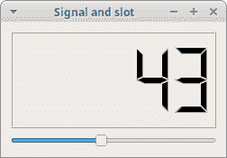
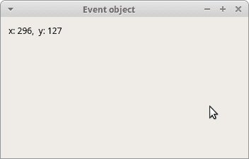
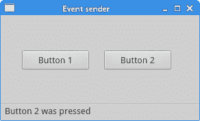

# PyQt5 中的事件和信号

> 原文： [http://zetcode.com/gui/pyqt5/eventssignals/](http://zetcode.com/gui/pyqt5/eventssignals/)

在 PyQt5 编程教程的这一部分中，我们将探讨应用中发生的事件和信号。

## 事件

GUI 应用是事件驱动的。 事件主要由应用的用户生成。 但是它们也可以通过其他方式生成。 例如 Internet 连接，窗口管理器或计时器。 当我们调用应用的`exec_()`方法时，应用进入主循环。 主循环获取事件并将其发送到对象。

在事件模型中，有三个参与者：

*   事件来源
*   事件对象
*   事件目标

事件源是状态更改的对象。 它生成事件。事件对象（事件）将状态更改封装在事件源中。事件目标是要通知的对象。 事件源对象将处理事件的任务委托给事件目标。

PyQt5 具有独特的信号和槽机制来处理事件。 信号和槽用于对象之间的通信。 当发生特定事件时，会发出信号。槽可以是任何 Python 可调用的。 发出连接信号时，将调用槽。

## 信号和槽

这是一个简单的示例，展示了 PyQt5 中的信号和槽。

`sigslot.py`

```py
#!/usr/bin/python3
# -*- coding: utf-8 -*-

"""
ZetCode PyQt5 tutorial 

In this example, we connect a signal
of a QSlider to a slot of a QLCDNumber. 

Author: Jan Bodnar
Website: zetcode.com 
Last edited: January 2017
"""

import sys
from PyQt5.QtCore import Qt
from PyQt5.QtWidgets import (QWidget, QLCDNumber, QSlider, 
    QVBoxLayout, QApplication)

class Example(QWidget):

    def __init__(self):
        super().__init__()

        self.initUI()

    def initUI(self):

        lcd = QLCDNumber(self)
        sld = QSlider(Qt.Horizontal, self)

        vbox = QVBoxLayout()
        vbox.addWidget(lcd)
        vbox.addWidget(sld)

        self.setLayout(vbox)
        sld.valueChanged.connect(lcd.display)

        self.setGeometry(300, 300, 250, 150)
        self.setWindowTitle('Signal and slot')
        self.show()

if __name__ == '__main__':

    app = QApplication(sys.argv)
    ex = Example()
    sys.exit(app.exec_())

```

在我们的示例中，我们显示`QtGui.QLCDNumber`和`QtGui.QSlider`。 我们通过拖动滑块来更改`lcd`编号。

```py
sld.valueChanged.connect(lcd.display)

```

在这里，我们将滑块的`valueChanged`信号连接到`lcd`号的`display`槽。

发送器是发送信号的对象。接收器是接收信号的对象。槽是对信号做出反应的方法。



Figure: Signal & slot

## 重新实现事件处理程序

PyQt5 中的事件通常通过重新实现事件处理程序来处理。

`escape.py`

```py
#!/usr/bin/python3
# -*- coding: utf-8 -*-

"""
ZetCode PyQt5 tutorial 

In this example, we reimplement an 
event handler. 

Author: Jan Bodnar
Website: zetcode.com 
Last edited: August 2017
"""

import sys
from PyQt5.QtCore import Qt
from PyQt5.QtWidgets import QWidget, QApplication

class Example(QWidget):

    def __init__(self):
        super().__init__()

        self.initUI()

    def initUI(self):      

        self.setGeometry(300, 300, 250, 150)
        self.setWindowTitle('Event handler')
        self.show()

    def keyPressEvent(self, e):

        if e.key() == Qt.Key_Escape:
            self.close()

if __name__ == '__main__':

    app = QApplication(sys.argv)
    ex = Example()
    sys.exit(app.exec_())

```

在我们的示例中，我们重新实现了`keyPressEvent()`事件处理程序。

```py
def keyPressEvent(self, e):

    if e.key() == Qt.Key_Escape:
        self.close()

```

如果单击“退出”按钮，则应用终止。

## 事件对象

事件对象是一个 Python 对象，其中包含许多描述事件的属性。 事件对象特定于生成的事件类型。

`eventobject.py`

```py
#!/usr/bin/python3
# -*- coding: utf-8 -*-

"""
ZetCode PyQt5 tutorial 

In this example, we display the x and y 
coordinates of a mouse pointer in a label widget.

Author: Jan Bodnar
Website: zetcode.com 
Last edited: August 2017
"""

import sys
from PyQt5.QtCore import Qt
from PyQt5.QtWidgets import QWidget, QApplication, QGridLayout, QLabel

class Example(QWidget):

    def __init__(self):
        super().__init__()

        self.initUI()

    def initUI(self):      

        grid = QGridLayout()

        x = 0
        y = 0

        self.text = "x: {0},  y: {1}".format(x, y)

        self.label = QLabel(self.text, self)
        grid.addWidget(self.label, 0, 0, Qt.AlignTop)

        self.setMouseTracking(True)

        self.setLayout(grid)

        self.setGeometry(300, 300, 350, 200)
        self.setWindowTitle('Event object')
        self.show()

    def mouseMoveEvent(self, e):

        x = e.x()
        y = e.y()

        text = "x: {0},  y: {1}".format(x, y)
        self.label.setText(text)

if __name__ == '__main__':

    app = QApplication(sys.argv)
    ex = Example()
    sys.exit(app.exec_())

```

在此示例中，我们在标签小部件中显示了鼠标指针的 x 和 y 坐标。

```py
self.text = "x: {0},  y: {1}".format(x, y)

self.label = QLabel(self.text, self)

```

x 和 y 坐标显示在`QLabel`小部件中。

```py
self.setMouseTracking(True)

```

默认情况下，鼠标跟踪是禁用的，因此，仅在移动鼠标时按下至少一个鼠标按钮时，窗口小部件才会接收鼠标移动事件。 如果启用了鼠标跟踪，则即使未按任何按钮，窗口小部件也会接收鼠标移动事件。

```py
def mouseMoveEvent(self, e):

    x = e.x()
    y = e.y()

    text = "x: {0},  y: {1}".format(x, y)
    self.label.setText(text)

```

`e`是事件对象； 它包含有关已触发事件的数据； 在我们的例子中，是一个鼠标移动事件。 使用`x()`和`y()`方法，我们可以确定鼠标指针的 x 和 y 坐标。 我们构建字符串并将其设置为标签小部件。



Figure: Event object

## 事件发送者

有时很方便地知道哪个窗口小部件是信号的发送者。 为此，PyQt5 具有`sender()`方法。

`eventsource.py`

```py
#!/usr/bin/python3
# -*- coding: utf-8 -*-

"""
ZetCode PyQt5 tutorial 

In this example, we determine the event sender
object.

Author: Jan Bodnar
Website: zetcode.com 
Last edited: August 2017
"""

import sys
from PyQt5.QtWidgets import QMainWindow, QPushButton, QApplication

class Example(QMainWindow):

    def __init__(self):
        super().__init__()

        self.initUI()

    def initUI(self):      

        btn1 = QPushButton("Button 1", self)
        btn1.move(30, 50)

        btn2 = QPushButton("Button 2", self)
        btn2.move(150, 50)

        btn1.clicked.connect(self.buttonClicked)            
        btn2.clicked.connect(self.buttonClicked)

        self.statusBar()

        self.setGeometry(300, 300, 290, 150)
        self.setWindowTitle('Event sender')
        self.show()

    def buttonClicked(self):

        sender = self.sender()
        self.statusBar().showMessage(sender.text() + ' was pressed')

if __name__ == '__main__':

    app = QApplication(sys.argv)
    ex = Example()
    sys.exit(app.exec_())

```

我们的示例中有两个按钮。 在`buttonClicked()`方法中，我们通过调用`sender()`方法来确定单击了哪个按钮。

```py
btn1.clicked.connect(self.buttonClicked)            
btn2.clicked.connect(self.buttonClicked)

```

两个按钮都连接到同一槽。

```py
def buttonClicked(self):

    sender = self.sender()
    self.statusBar().showMessage(sender.text() + ' was pressed')

```

我们通过调用`sender()`方法来确定信号源。 在应用的状态栏中，我们显示了被按下的按钮的标签。



Figure: Event sender

## 发射信号

从`QObject`创建的对象可以发出信号。 以下示例说明了如何发出自定义信号。

`customsignal.py`

```py
#!/usr/bin/python3
# -*- coding: utf-8 -*-

"""
ZetCode PyQt5 tutorial 

In this example, we show how to 
emit a custom signal. 

Author: Jan Bodnar
Website: zetcode.com 
Last edited: August 2017
"""

import sys
from PyQt5.QtCore import pyqtSignal, QObject
from PyQt5.QtWidgets import QMainWindow, QApplication

class Communicate(QObject):

    closeApp = pyqtSignal() 

class Example(QMainWindow):

    def __init__(self):
        super().__init__()

        self.initUI()

    def initUI(self):      

        self.c = Communicate()
        self.c.closeApp.connect(self.close)       

        self.setGeometry(300, 300, 290, 150)
        self.setWindowTitle('Emit signal')
        self.show()

    def mousePressEvent(self, event):

        self.c.closeApp.emit()

if __name__ == '__main__':

    app = QApplication(sys.argv)
    ex = Example()
    sys.exit(app.exec_())

```

我们创建一个名为`closeApp`的新信号。 在鼠标按下事件期间发出此信号。 信号连接到`QMainWindow`的`close()`槽。

```py
class Communicate(QObject):

    closeApp = pyqtSignal()     

```

使用`pyqtSignal()`作为外部`Communicate`类的类属性创建信号。

```py
self.c = Communicate()
self.c.closeApp.connect(self.close) 

```

定制的`closeApp`信号连接到`QMainWindow`的`close()`槽。

```py
def mousePressEvent(self, event):

    self.c.closeApp.emit()

```

当我们用鼠标指针单击窗口时，会发出`closeApp`信号。 该应用终止。

在 PyQt5 教程的这一部分中，我们介绍了信号和槽。