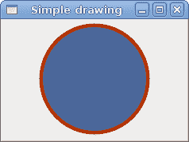
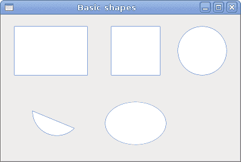
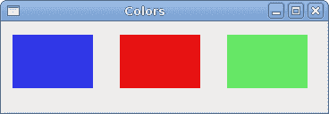
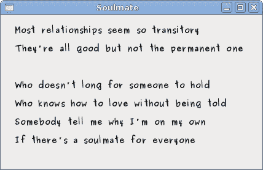

# 在 GTK 中与开罗绘图＃

> 原文： [http://zetcode.com/gui/gtksharp/drawing/](http://zetcode.com/gui/gtksharp/drawing/)

在 GTK＃编程教程的这一部分中，我们将使用 Cairo 库进行一些绘制。

Cairo 是用于创建 2D 矢量图形的库。 我们可以使用它来绘制自己的小部件，图表或各种效果或动画。

## 简单绘图

笔划操作绘制形状的轮廓，填充操作填充形状的内部。 接下来，我们将演示这两个操作。

`simpledrawing.cs`

```
using Gtk;
using Cairo;
using System;

class SharpApp : Window {

    public SharpApp() : base("Simple drawing")
    {
        SetDefaultSize(230, 150);
        SetPosition(WindowPosition.Center);
        DeleteEvent += delegate { Application.Quit(); };;

        DrawingArea darea = new DrawingArea();
        darea.ExposeEvent += OnExpose;

        Add(darea);

        ShowAll();
    }

    void OnExpose(object sender, ExposeEventArgs args)
    {
        DrawingArea area = (DrawingArea) sender;
        Cairo.Context cr =  Gdk.CairoHelper.Create(area.GdkWindow);

        cr.LineWidth = 9;
        cr.SetSourceRGB(0.7, 0.2, 0.0);

        int width, height;
        width = Allocation.Width;
        height = Allocation.Height;

        cr.Translate(width/2, height/2);
        cr.Arc(0, 0, (width < height ? width : height) / 2 - 10, 0, 2*Math.PI);
        cr.StrokePreserve();

        cr.SetSourceRGB(0.3, 0.4, 0.6);
        cr.Fill();

        ((IDisposable) cr.Target).Dispose();                                      
        ((IDisposable) cr).Dispose();
    }

    public static void Main()
    {
        Application.Init();
        new SharpApp();
        Application.Run();
    }
}

```

在我们的示例中，我们将绘制一个圆并将其用纯色绘制。

```
gmcs -pkg:gtk-sharp-2.0 -r:/usr/lib/mono/2.0/Mono.Cairo.dll  simple.cs

```

这是我们编译示例的方式。

```
DrawingArea darea = new DrawingArea();

```

我们将在`DrawingArea`小部件上进行绘制操作。

```
darea.ExposeEvent += OnExpose;

```

所有绘图都是通过我们插入`ExposeEvent`的方法完成的。

```
DrawingArea area = (DrawingArea) sender;
Cairo.Context cr =  Gdk.CairoHelper.Create(area.GdkWindow);

```

我们从绘图区域的`GdkWindow`创建`Cairo.Context`对象。 上下文是用于在所有 Drawable 对象上绘制的对象。

```
cr.LineWidth = 9;

```

我们将线条的宽度设置为 9 像素。

```
cr.SetSourceRGB(0.7, 0.2, 0.0);

```

我们将颜色设置为深红色。

```
int width, height;
width = Allocation.Width;
height = Allocation.Height;

cr.Translate(width/2, height/2);

```

我们得到绘图区域的宽度和高度。 我们将原点移动到窗口的中间。

```
cr.Arc(0, 0, (width < height ? width : height) / 2 - 10, 0, 2*Math.PI);
cr.StrokePreserve();

```

我们绘制一个圆形的外部形状。 `StrokePreserve()`根据当前的线宽，线连接，线帽和破折号设置描边当前路径。 与`Stroke()`不同，它在 cairo 上下文中保留路径。

```
cr.SetSourceRGB(0.3, 0.4, 0.6);
cr.Fill();

```

这会用一些蓝色填充圆圈的内部。



Figure: Simple drawing

## 基本形状

下一个示例将一些基本形状绘制到窗口上。

`basicshapes.cs`

```
using Gtk;
using Cairo;
using System;

class SharpApp : Window {

    public SharpApp() : base("Basic shapes")
    {
        SetDefaultSize(390, 240);
        SetPosition(WindowPosition.Center);
        DeleteEvent += delegate { Application.Quit(); };

        DrawingArea darea = new DrawingArea();
        darea.ExposeEvent += OnExpose;

        Add(darea);
        ShowAll();
    }

    void OnExpose(object sender, ExposeEventArgs args)
    {
        DrawingArea area = (DrawingArea) sender;
        Cairo.Context cc =  Gdk.CairoHelper.Create(area.GdkWindow);

        cc.SetSourceRGB(0.2, 0.23, 0.9);
        cc.LineWidth = 1;

        cc.Rectangle(20, 20, 120, 80);
        cc.Rectangle(180, 20, 80, 80);
        cc.StrokePreserve();
        cc.SetSourceRGB(1, 1, 1);
        cc.Fill();

        cc.SetSourceRGB(0.2, 0.23, 0.9);
        cc.Arc(330, 60, 40, 0, 2*Math.PI);
        cc.StrokePreserve();
        cc.SetSourceRGB(1, 1, 1);
        cc.Fill();

        cc.SetSourceRGB(0.2, 0.23, 0.9);
        cc.Arc(90, 160, 40, Math.PI/4, Math.PI);
        cc.ClosePath();
        cc.StrokePreserve();
        cc.SetSourceRGB(1, 1, 1);
        cc.Fill();

        cc.SetSourceRGB(0.2, 0.23, 0.9);
        cc.Translate(220, 180);
        cc.Scale(1, 0.7);        
        cc.Arc(0, 0, 50, 0, 2*Math.PI);
        cc.StrokePreserve();
        cc.SetSourceRGB(1, 1, 1);
        cc.Fill();          

        ((IDisposable) cc.Target).Dispose ();                                      
        ((IDisposable) cc).Dispose ();
    }

    public static void Main()
    {
        Application.Init();
        new SharpApp();
        Application.Run();
    }
}

```

在此示例中，我们将创建一个矩形，一个正方形，一个圆形，一个弧形和一个椭圆形。 我们用蓝色绘制轮廓，内部用白色绘制。

```
cc.Rectangle(20, 20, 120, 80);
cc.Rectangle(180, 20, 80, 80);
cc.StrokePreserve();
cc.SetSourceRGB(1, 1, 1);
cc.Fill();

```

这些线绘制一个矩形和一个正方形。

```
cc.Arc(330, 60, 40, 0, 2*Math.PI);

```

此处`Arc()`方法绘制一个完整的圆。

```
cc.Scale(1, 0.7);        
cc.Arc(0, 0, 50, 0, 2*Math.PI);

```

如果要绘制椭圆形，请先进行一些缩放。 在这里`Scale()`方法缩小 y 轴。



Figure: Basic shapes

## 色彩

颜色是代表红色，绿色和蓝色（RGB）强度值的组合的对象。 开罗有效 RGB 值在 0 到 1 的范围内。

`colors.cs`

```
using Gtk;
using Cairo;
using System;

class SharpApp : Window {

    public SharpApp() : base("Colors")
    {
        SetDefaultSize(360, 100);
        SetPosition(WindowPosition.Center);
        DeleteEvent += delegate { Application.Quit(); };

        DrawingArea darea = new DrawingArea();
        darea.ExposeEvent += OnExpose;

        Add(darea);

        ShowAll();
    }

    void OnExpose(object sender, ExposeEventArgs args)
    {
        DrawingArea area = (DrawingArea) sender;
        Cairo.Context cr =  Gdk.CairoHelper.Create(area.GdkWindow);

        cr.SetSourceRGB(0.2, 0.23, 0.9);
        cr.Rectangle(10, 15, 90, 60);
        cr.Fill();

        cr.SetSourceRGB(0.9, 0.1, 0.1);
        cr.Rectangle(130, 15, 90, 60);
        cr.Fill();

        cr.SetSourceRGB(0.4, 0.9, 0.4);
        cr.Rectangle(250, 15, 90, 60);
        cr.Fill();

        ((IDisposable) cr.Target).Dispose();                                      
        ((IDisposable) cr).Dispose();
    }

    public static void Main()
    {
        Application.Init();
        new SharpApp();
        Application.Run();
    }
}

```

我们用三种不同的颜色绘制三个矩形。

```
cr.SetSourceRGB(0.2, 0.23, 0.9);

```

`SetSourceRGB()`方法为开罗上下文设置颜色。 该方法的三个参数是颜色强度值。

```
cr.Rectangle(10, 15, 90, 60);
cr.Fill();

```

我们创建一个矩形形状，并用先前指定的颜色填充它。



Figure: Colours

## 透明矩形

透明性是指能够透视材料的质量。 了解透明度的最简单方法是想象一块玻璃或水。 从技术上讲，光线可以穿过玻璃，这样我们就可以看到玻璃后面的物体。

在计算机图形学中，我们可以使用 alpha 合成来实现透明效果。 Alpha 合成是将图像与背景组合以创建部分透明外观的过程。 合成过程使用 Alpha 通道。 （wikipedia.org，answers.com）

`transparentrectangles.cs`

```
using Gtk;
using Cairo;
using System;

class SharpApp : Window {

    public SharpApp() : base("Transparent rectangles")
    {
        SetDefaultSize(590, 90);
        SetPosition(WindowPosition.Center);
        DeleteEvent += delegate { Application.Quit(); } ;

        DrawingArea darea = new DrawingArea();
        darea.ExposeEvent += OnExpose;

        Add(darea);

        ShowAll();
    }

    void OnExpose(object sender, ExposeEventArgs args)
    {
        DrawingArea area = (DrawingArea) sender;
        Cairo.Context cr =  Gdk.CairoHelper.Create(area.GdkWindow);

        for ( int i = 1; i <= 10; i++) {
            cr.SetSourceRGBA(0, 0, 1, i*0.1);
            cr.Rectangle(50*i, 20, 40, 40);
            cr.Fill();  
        }

        ((IDisposable) cr.Target).Dispose();                                      
        ((IDisposable) cr).Dispose();
    }

    public static void Main()
    {
        Application.Init();
        new SharpApp();
        Application.Run();
    }
}

```

在示例中，我们将绘制十个具有不同透明度级别的矩形。

```
cr.SetSourceRGBA(0, 0, 1, i*0.1);

```

`SetSourceRGBA()`方法的最后一个参数是 alpha 透明度。


Figure: Transparent rectangles

## 灵魂伴侣

在下一个示例中，我们在窗口上绘制一些文本。

`soulmate.cs`

```
using Gtk;
using Cairo;
using System;

class SharpApp : Window {

    public SharpApp() : base("Soulmate")
    {
        SetDefaultSize(420, 250);
        SetPosition(WindowPosition.Center);
        DeleteEvent += delegate { Application.Quit(); };

        DrawingArea darea = new DrawingArea();
        darea.ExposeEvent += OnExpose;

        Add(darea);

        ShowAll();
    }

    void OnExpose(object sender, ExposeEventArgs args)
    {
        DrawingArea area = (DrawingArea) sender;
        Cairo.Context cr =  Gdk.CairoHelper.Create(area.GdkWindow);

        cr.SetSourceRGB(0.1, 0.1, 0.1);

        cr.SelectFontFace("Purisa", FontSlant.Normal, FontWeight.Bold);
        cr.SetFontSize(13);

        cr.MoveTo(20, 30);
        cr.ShowText("Most relationships seem so transitory");
        cr.MoveTo(20, 60);
        cr.ShowText("They're all good but not the permanent one");
        cr.MoveTo(20, 120);
        cr.ShowText("Who doesn't long for someone to hold");
        cr.MoveTo(20, 150);
        cr.ShowText("Who knows how to love without being told");
        cr.MoveTo(20, 180);
        cr.ShowText("Somebody tell me why I'm on my own");
        cr.MoveTo(20, 210);
        cr.ShowText("If there's a soulmate for everyone");

        ((IDisposable) cr.Target).Dispose();                                      
        ((IDisposable) cr).Dispose();
    }

    public static void Main()
    {
        Application.Init();
        new SharpApp();
        Application.Run();
    }
}

```

我们显示 Natasha Bedingfields Soulmate 歌曲的部分歌词。

```
cr.SelectFontFace("Purisa", FontSlant.Normal, FontWeight.Bold);

```

在这里，我们指定使用的字体-粗体的 Purisa。

```
cr.SetFontSize(13);

```

我们指定字体的大小。

```
cr.MoveTo(20, 30);

```

我们移动到要绘制文本的位置。

```
cr.ShowText("Most relationships seem so transitory");

```

`ShowText()`方法将文本绘制到窗口上。



Figure: Soulmate

在 GTK＃编程库的这一章中，我们使用开罗库进行绘制。