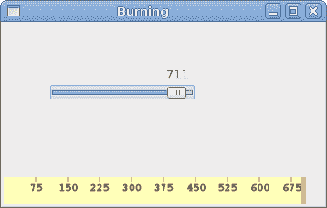

# GTK# 中的自定义小部件 

> 原文： [http://zetcode.com/gui/gtksharp/customwidget/](http://zetcode.com/gui/gtksharp/customwidget/)

工具箱通常仅提供最常见的窗口小部件，例如按钮，文本窗口小部件，滑块等。没有工具箱可以提供所有可能的窗口小部件。

客户端程序员可以创建更多专门的小部件。 他们使用工具箱提供的绘图工具来完成此任务。 有两种可能：程序员可以修改或增强现有的小部件，或者可以从头开始创建自定义小部件。

## 刻录小部件

这是我们从头开始创建的小部件的示例。 可以在各种媒体刻录应用（例如 Nero 烧录 ROM）中找到此小部件。

`burning.cs`

```
using Gtk;
using Cairo;
using System;

class Burning : DrawingArea
{

    string[] num = new string[] { "75", "150", "225", "300", 
        "375", "450", "525", "600", "675" };

    public Burning() : base()
    {
        SetSizeRequest(-1, 30);
    }

    protected override bool OnExposeEvent(Gdk.EventExpose args)
    {

        Cairo.Context cr = Gdk.CairoHelper.Create(args.Window);
        cr.LineWidth = 0.8;

        cr.SelectFontFace("Courier 10 Pitch", 
            FontSlant.Normal, FontWeight.Normal);
        cr.SetFontSize(11);

        int width = Allocation.Width;

        SharpApp parent = (SharpApp) GetAncestor (Gtk.Window.GType);        
        int cur_width = parent.CurValue;

        int step = (int) Math.Round(width / 10.0);

        int till = (int) ((width / 750.0) * cur_width);
        int full = (int) ((width / 750.0) * 700);

        if (cur_width >= 700) {

            cr.SetSourceRGB(1.0, 1.0, 0.72);
            cr.Rectangle(0, 0, full, 30);
            cr.Clip();
            cr.Paint();
            cr.ResetClip();

            cr.SetSourceRGB(1.0, 0.68, 0.68);
            cr.Rectangle(full, 0, till-full, 30);    
            cr.Clip();
            cr.Paint();
            cr.ResetClip();

        } else { 

            cr.SetSourceRGB(1.0, 1.0, 0.72);
            cr.Rectangle(0, 0, till, 30);
            cr.Clip();
            cr.Paint();
            cr.ResetClip();
       }  

       cr.SetSourceRGB(0.35, 0.31, 0.24);

       for (int i=1; i<=num.Length; i++) {

           cr.MoveTo(i*step, 0);
           cr.LineTo(i*step, 5);    
           cr.Stroke();

           TextExtents extents = cr.TextExtents(num[i-1]);
           cr.MoveTo(i*step-extents.Width/2, 15);
           cr.TextPath(num[i-1]);
           cr.Stroke();
       }

        ((IDisposable) cr.Target).Dispose();                                      
        ((IDisposable) cr).Dispose();

        return true;
    }
}

class SharpApp : Window {

    int cur_value = 0;
    Burning burning;

    public SharpApp() : base("Burning")
    {
        SetDefaultSize(350, 200);
        SetPosition(WindowPosition.Center);
        DeleteEvent += delegate { Application.Quit(); };

        VBox vbox = new VBox(false, 2);

        HScale scale = new HScale(0, 750, 1);
        scale.SetSizeRequest(160, 35);
        scale.ValueChanged += OnChanged;

        Fixed fix = new Fixed();
        fix.Put(scale, 50, 50);

        vbox.PackStart(fix);

        burning = new Burning();
        vbox.PackStart(burning, false, false, 0);

        Add(vbox);

        ShowAll();
    }

    void OnChanged(object sender, EventArgs args)
    {
        Scale scale = (Scale) sender;
        cur_value = (int) scale.Value;
        burning.QueueDraw();
    }

    public int CurValue {
        get { return cur_value; }
    }

    public static void Main()
    {
        Application.Init();
        new SharpApp();
        Application.Run();
    }
}

```

我们在窗口底部放置一个`DrawingArea`并手动绘制整个窗口小部件。 所有重要的代码都位于`Burning`类的`OnExposeEvent()`方法中。 此小部件以图形方式显示了介质的总容量和可供我们使用的可用空间。 该小部件由比例小部件控制。 自定义窗口小部件的最小值为 0，最大值为 750。如果值达到 700，则开始绘制红色。 这通常表示过度燃烧。

```
string[] num = new string[] { "75", "150", "225", "300", 
    "375", "450", "525", "600", "675" };

```

这些数字显示在刻录小部件上。 它们显示了介质的容量。

```
SharpApp parent = (SharpApp) GetAncestor (Gtk.Window.GType);        
int cur_width = parent.CurValue;

```

这两行从刻度小部件获取当前数字。 我们获得父窗口小部件，并从父窗口小部件中获得当前值。

```
int till = (int) ((width / 750.0) * cur_width);
int full = (int) ((width / 750.0) * 700);

```

`till`参数确定要绘制的总大小。 该值来自滑块小部件。 它占整个面积的一部分。 `full`参数确定我们开始用红色绘制的点。

```
cr.SetSourceRGB(1.0, 1.0, 0.72);
cr.Rectangle(0, 0, full, 30);
cr.Clip();
cr.Paint();
cr.ResetClip();

```

此代码在此处绘制了一个黄色矩形，直到介质充满为止。

```
TextExtents extents = cr.TextExtents(num[i-1]);
cr.MoveTo(i*step-extents.Width/2, 15);
cr.TextPath(num[i-1]);
cr.Stroke();

```

这里的代码在刻录小部件上绘制数字。 我们计算`TextExtents`来正确定位文本。

```
void OnChanged(object sender, EventArgs args)
{
    Scale scale = (Scale) sender;
    cur_value = (int) scale.Value;
    burning.QueueDraw();
}

```

我们从小部件中获取值，并将其存储在`cur_value`变量中以备后用。 我们重新绘制刻录的小部件。



Figure: Burning widget

在本章中，我们在 GTK# 中创建了一个自定义窗口小部件。