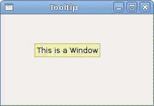
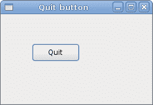

# Visual Basic GTK 简介＃

> 原文： [http://zetcode.com/gui/vbgtk/introduction/](http://zetcode.com/gui/vbgtk/introduction/)

在 Visual Basic GTK＃编程教程的这一部分中，我们将介绍 GTK＃库，并使用 Visual Basic 编程语言创建第一个程序。

本教程的目的是使您开始使用 GTK＃和 Visual Basic。 可以在此处下载本教程中使用的图像。 我使用了 Gnome 项目的探戈图标包中的一些图标。

## 关于

GTK＃是一个库，提供 GTK+ 与 Mono .NET 语言（如 C＃或 Visual Basic）的绑定。 GTK+ 是用于创建图形用户界面的领先工具包之一。 GTK＃和 Visual Basic 都是 Mono 开发平台的一部分。

```
vbnc -r:/usr/lib/mono/gtk-sharp-2.0/gtk-sharp.dll quitbutton.vb

```

上面的命令显示了如何编译 quitbutton 示例。 mono VB 编译器的-r 参数加载 GTK＃程序集。 这是一个动态库。 该命令显示了 Ubuntu 系统上 dll 库的路径。

## 简单的例子

在第一个示例中，我们创建一个简单的窗口。 窗口在屏幕上居中。

```
' ZetCode Mono Visual Basic GTK# tutorial
'
' This program centers a window on 
' the screen
'
' author jan bodnar
' last modified May 2009
' website www.zetcode.com

Imports Gtk

Public Class GtkVBApp
    Inherits Window

    Public Sub New

        MyBase.New("Center")
        Me.SetDefaultSize(250, 150)
        Me.SetPosition(WindowPosition.Center)
        AddHandler Me.DeleteEvent, AddressOf Me.OnDeleteEvent

        Me.Show

    End Sub

    Sub OnDeleteEvent(ByVal sender as Object, _
            ByVal args as DeleteEventArgs)
        Application.Quit
    End Sub

    Public Shared Sub Main

        Application.Init
        Dim app As New GtkVBApp
        Application.Run

    End Sub

End Class

```

本示例在屏幕中央显示一个 250x150 像素的窗口。

```
Imports Gtk

```

`Imports`关键字导入我们将在应用程序中使用的必需品类型。

```
Public Class GtkVBApp
    Inherits Window

```

该示例继承自`Window`。 窗口是顶级容器。

```
MyBase.New("Center")

```

在这里，我们称为父级的构造函数。

```
Me.SetDefaultSize(250, 150)

```

我们为应用程序窗口设置默认大小。

```
Me.SetPosition(WindowPosition.Center)

```

这条线使窗口在屏幕上居中。

```
AddHandler Me.DeleteEvent, AddressOf Me.OnDeleteEvent

```

我们将处理程序插入`DeleteEvent`。

```
Me.Show

```

一切准备就绪后，我们在屏幕上显示窗口。

```
Sub OnDeleteEvent(ByVal sender as Object, _
        ByVal args as DeleteEventArgs)
    Application.Quit
End Sub

```

当我们单击标题栏中的关闭按钮或按 `Alt` + `F4` 时，事件被触发。 该方法永久退出该应用程序。

```
Application.Init
Dim app As New GtkVBApp
Application.Run

```

这三行设置了应用程序。

## 创建工具提示

第二个示例将显示一个工具提示。 工具提示是一个小的矩形窗口，它提供有关对象的简短信息。 它通常是一个 GUI 组件。 它是应用程序帮助系统的一部分。

```
' ZetCode Mono Visual Basic GTK# tutorial
'
' This program shows a tooltip
'
' author jan bodnar
' last modified May 2009
' website www.zetcode.com

Imports Gtk

Public Class GtkVBApp
    Inherits Window

    Public Sub New

        MyBase.New("Tooltip")
        Me.SetDefaultSize(250, 150)
        Me.SetPosition(WindowPosition.Center)

        AddHandler Me.DeleteEvent, AddressOf Me.OnDeleteEvent
        Me.TooltipText = "This is a Window"

        Me.Show

    End Sub

    Sub OnDeleteEvent(ByVal sender as Object, _
            ByVal args as DeleteEventArgs)
        Application.Quit
    End Sub

    Public Shared Sub Main

        Application.Init
        Dim app As New GtkVBApp
        Application.Run

    End Sub

End Class

```

该示例创建一个窗口。 如果将鼠标指针悬停在窗口区域上方，则会弹出一个工具提示。

```
Me.TooltipText = "This is a Window"

```

我们通过`TooltipText`属性设置工具提示。



Figure: Tooltip

## 退出按钮

在本节的最后一个示例中，我们将创建一个退出按钮。 当我们按下此按钮时，应用程序终止。

```
' ZetCode Mono Visual Basic GTK# tutorial
'
' This program creates a quit
' button. When we press the button,
' the application terminates. 
'
' author jan bodnar
' last modified May 2009
' website www.zetcode.com

Imports Gtk

Public Class GtkVBApp
    Inherits Window

    Public Sub New

        MyBase.New("Quit button")

        Me.InitUI

        Me.SetDefaultSize(250, 150)
        Me.SetPosition(WindowPosition.Center)
        AddHandler Me.DeleteEvent, AddressOf Me.OnDelete

        Me.ShowAll 

    End Sub

    Private Sub InitUI

        Dim quitButton As New Button("Quit")
        quitButton.SetSizeRequest(80, 30)

        AddHandler quitButton.Clicked, AddressOf Me.OnQuit

        Dim fix As New Fixed
        fix.Put(quitButton, 50, 50)

        Me.Add(fix)

    End Sub

    Sub OnQuit(ByVal sender As Object, _
            ByVal args As EventArgs)
        Application.Quit
    End Sub

    Sub OnDelete(ByVal sender As Object, _
            ByVal args As DeleteEventArgs)
        Application.Quit
    End Sub

    Public Shared Sub Main

        Application.Init
        Dim app As New GtkVBApp
        Application.Run

    End Sub

End Class

```

我们使用`Button`小部件。 这是一个非常常见的小部件。 它显示文本标签，图像或两者。

```
Me.InitUI

```

我们将用户界面的创建委托给`InitUI`方法。

```
Me.ShowAll 

```

我们有两个选择。 在所有小部件上调用`Show`，或调用`ShowAll`（显示容器及其所有子代）。

```
Dim quitButton As New Button("Quit")

```

在这里，我们创建一个按钮小部件。

```
quitButton.SetSizeRequest(80, 30)

```

我们为按钮设置大小。

```
AddHandler quitButton.Clicked, AddressOf Me.OnQuit

```

我们将`OnQuit`方法插入按钮`Clicked`事件。

```
Dim fix As New Fixed
fix.Put(quitButton, 50, 50)

```

我们将退出按钮放入 x = 50，y = 50 的固定容器中。

```
Sub OnQuit(ByVal sender As Object, _
        ByVal args As EventArgs)
    Application.Quit
End Sub

```

在`OnQuit`方法内部，我们终止了该应用程序。



Figure: Quit button

本节介绍了使用 Visual Basic 语言的 GTK＃库。